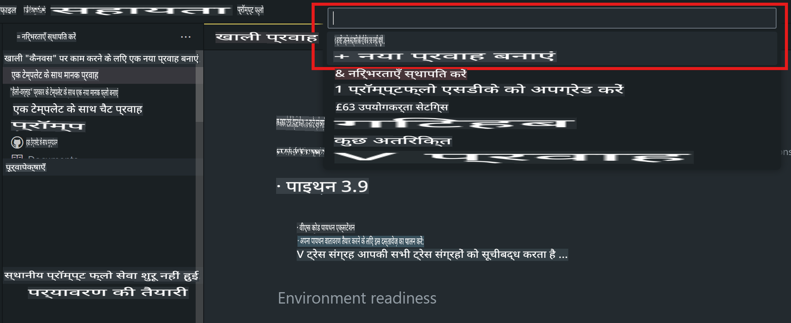

# **लैब 2 - AIPC में Phi-3-mini के साथ Prompt Flow चलाएं**

## **Prompt Flow क्या है**

Prompt flow एक डेवलपमेंट टूल्स का सेट है जो LLM-आधारित AI एप्लिकेशन्स के एंड-टू-एंड डेवलपमेंट साइकिल को आसान बनाता है। इसमें विचार, प्रोटोटाइप, टेस्टिंग, मूल्यांकन से लेकर प्रोडक्शन डिप्लॉयमेंट और मॉनिटरिंग शामिल है। यह प्रॉम्प्ट इंजीनियरिंग को सरल बनाता है और आपको प्रोडक्शन क्वालिटी के साथ LLM ऐप्स बनाने में सक्षम बनाता है।

Prompt flow के साथ, आप निम्न कार्य कर सकते हैं:

- ऐसे फ्लो क्रिएट करें जो LLMs, प्रॉम्प्ट्स, Python कोड और अन्य टूल्स को एक निष्पादन योग्य वर्कफ़्लो में जोड़ते हैं।

- अपने फ्लो को डिबग और संशोधित करें, विशेष रूप से LLMs के साथ इंटरैक्शन को आसानी से।

- अपने फ्लो का मूल्यांकन करें और बड़े डेटा सेट्स के साथ गुणवत्ता और प्रदर्शन मेट्रिक्स की गणना करें।

- अपने फ्लो के परीक्षण और मूल्यांकन को CI/CD सिस्टम में इंटीग्रेट करें ताकि गुणवत्ता सुनिश्चित हो सके।

- अपने फ्लो को चुने गए सर्विंग प्लेटफ़ॉर्म पर डिप्लॉय करें या अपने ऐप के कोड बेस में आसानी से इंटीग्रेट करें।

- (वैकल्पिक लेकिन अत्यधिक अनुशंसित) Azure AI में Prompt flow के क्लाउड संस्करण का उपयोग करके अपनी टीम के साथ सहयोग करें।

## **AIPC क्या है**

AI PC में एक CPU, एक GPU और एक NPU होता है, जिनमें से प्रत्येक की विशिष्ट AI एक्सेलेरेशन क्षमताएँ होती हैं। NPU, या न्यूरल प्रोसेसिंग यूनिट, एक विशेष एक्सेलेरेटर है जो कृत्रिम बुद्धिमत्ता (AI) और मशीन लर्निंग (ML) कार्यों को आपके PC पर ही संभालता है, डेटा को क्लाउड में प्रोसेस करने के लिए भेजने की बजाय। GPU और CPU भी इन कार्यों को प्रोसेस कर सकते हैं, लेकिन NPU विशेष रूप से कम-शक्ति वाले AI गणनाओं में बेहतर है। AI PC हमारे कंप्यूटरों के संचालन में एक मौलिक बदलाव का प्रतिनिधित्व करता है। यह किसी ऐसी समस्या का समाधान नहीं है जो पहले मौजूद नहीं थी, बल्कि यह रोजमर्रा के PC उपयोगों में एक बड़ा सुधार होने का वादा करता है।

तो यह कैसे काम करता है? बड़े सार्वजनिक डेटा पर प्रशिक्षित जनरेटिव AI और विशाल LLMs की तुलना में, आपके PC पर होने वाला AI लगभग हर स्तर पर अधिक सुलभ है। यह अवधारणा समझने में आसान है, और क्योंकि यह आपके डेटा पर प्रशिक्षित है और क्लाउड तक पहुंचने की आवश्यकता नहीं है, इसके लाभ व्यापक आबादी के लिए अधिक आकर्षक हैं।

निकट भविष्य में, AI PC की दुनिया में व्यक्तिगत सहायक और छोटे AI मॉडल शामिल होंगे जो सीधे आपके PC पर चलेंगे। यह आपके डेटा का उपयोग करके व्यक्तिगत, निजी और अधिक सुरक्षित AI एन्हांसमेंट प्रदान करेगा, जो आप पहले से रोज़ करते हैं – जैसे मीटिंग मिनट्स लेना, फैंटेसी फुटबॉल लीग को व्यवस्थित करना, फोटो और वीडियो एडिटिंग के लिए स्वचालित सुधार करना, या परिवार के पुनर्मिलन के लिए सभी के आगमन और प्रस्थान समय के आधार पर एक आदर्श यात्रा कार्यक्रम बनाना।

## **AIPC पर जनरेशन कोड फ्लो बनाना**

***नोट***: यदि आपने अभी तक पर्यावरण स्थापना पूरी नहीं की है, तो कृपया [लैब 0 - इंस्टॉलेशन](./01.Installations.md) पर जाएं।

1. Visual Studio Code में Prompt flow एक्सटेंशन खोलें और एक खाली फ्लो प्रोजेक्ट बनाएं।



2. इनपुट्स और आउटपुट्स पैरामीटर्स जोड़ें और Python कोड को एक नए फ्लो के रूप में जोड़ें।


आप इस संरचना (flow.dag.yaml) का संदर्भ लेकर अपना फ्लो बना सकते हैं:

```yaml

inputs:
  question:
    type: string
    default: how to write Bubble Algorithm
outputs:
  answer:
    type: string
    reference: ${Chat_With_Phi3.output}
nodes:
- name: Chat_With_Phi3
  type: python
  source:
    type: code
    path: Chat_With_Phi3.py
  inputs:
    question: ${inputs.question}


```

3. ***Chat_With_Phi3.py*** में कोड जोड़ें:

```python


from promptflow.core import tool

# import torch
from transformers import AutoTokenizer, pipeline,TextStreamer
import intel_npu_acceleration_library as npu_lib

import warnings

import asyncio
import platform

class Phi3CodeAgent:
    
    model = None
    tokenizer = None
    text_streamer = None
    
    model_id = "microsoft/Phi-3-mini-4k-instruct"

    @staticmethod
    def init_phi3():
        
        if Phi3CodeAgent.model is None or Phi3CodeAgent.tokenizer is None or Phi3CodeAgent.text_streamer is None:
            Phi3CodeAgent.model = npu_lib.NPUModelForCausalLM.from_pretrained(
                                    Phi3CodeAgent.model_id,
                                    torch_dtype="auto",
                                    dtype=npu_lib.int4,
                                    trust_remote_code=True
                                )
            Phi3CodeAgent.tokenizer = AutoTokenizer.from_pretrained(Phi3CodeAgent.model_id)
            Phi3CodeAgent.text_streamer = TextStreamer(Phi3CodeAgent.tokenizer, skip_prompt=True)

    

    @staticmethod
    def chat_with_phi3(prompt):
        
        Phi3CodeAgent.init_phi3()

        messages = "<|system|>You are a AI Python coding assistant. Please help me to generate code in Python.The answer only genertated Python code, but any comments and instructions do not need to be generated<|end|><|user|>" + prompt +"<|end|><|assistant|>"


        generation_args = {
            "max_new_tokens": 1024,
            "return_full_text": False,
            "temperature": 0.3,
            "do_sample": False,
            "streamer": Phi3CodeAgent.text_streamer,
        }

        pipe = pipeline(
            "text-generation",
            model=Phi3CodeAgent.model,
            tokenizer=Phi3CodeAgent.tokenizer,
            # **generation_args
        )

        result = ''

        with warnings.catch_warnings():
            warnings.simplefilter("ignore")
            response = pipe(messages, **generation_args)
            result =response[0]['generated_text']
            return result


@tool
def my_python_tool(question: str) -> str:
    if platform.system() == 'Windows':
        asyncio.set_event_loop_policy(asyncio.WindowsSelectorEventLoopPolicy())
    return Phi3CodeAgent.chat_with_phi3(question)


```

4. डिबग या रन से फ्लो का परीक्षण करें ताकि यह सुनिश्चित हो सके कि जनरेशन कोड सही है या नहीं।


5. टर्मिनल में फ्लो को डेवलपमेंट API के रूप में चलाएं।

```

pf flow serve --source ./ --port 8080 --host localhost   

```

आप इसे Postman / Thunder Client में परीक्षण कर सकते हैं।

### **नोट**

1. पहली बार चलाने में अधिक समय लगता है। Hugging Face CLI से phi-3 मॉडल डाउनलोड करने की अनुशंसा की जाती है।

2. Intel NPU की सीमित कंप्यूटिंग शक्ति को ध्यान में रखते हुए, Phi-3-mini-4k-instruct का उपयोग करने की सिफारिश की जाती है।

3. हम INT4 कन्वर्जन को क्वांटाइज़ करने के लिए Intel NPU एक्सेलेरेशन का उपयोग करते हैं, लेकिन यदि आप सेवा को फिर से चलाते हैं, तो आपको कैश और nc_workshop फ़ोल्डर्स को हटाना होगा।

## **संसाधन**

1. Promptflow सीखें [https://microsoft.github.io/promptflow/](https://microsoft.github.io/promptflow/)

2. Intel NPU Acceleration सीखें [https://github.com/intel/intel-npu-acceleration-library](https://github.com/intel/intel-npu-acceleration-library)

3. सैंपल कोड डाउनलोड करें [लोकल NPU एजेंट सैंपल कोड](../../../../../../../../../code/07.Lab/01/AIPC)

**अस्वीकरण**:  
यह दस्तावेज़ मशीन-आधारित एआई अनुवाद सेवाओं का उपयोग करके अनुवादित किया गया है। जबकि हम सटीकता सुनिश्चित करने का प्रयास करते हैं, कृपया ध्यान दें कि स्वचालित अनुवादों में त्रुटियां या अशुद्धियां हो सकती हैं। मूल दस्तावेज़, जो इसकी मूल भाषा में है, को प्रामाणिक स्रोत माना जाना चाहिए। महत्वपूर्ण जानकारी के लिए, पेशेवर मानव अनुवाद की सिफारिश की जाती है। इस अनुवाद के उपयोग से उत्पन्न किसी भी गलतफहमी या गलत व्याख्या के लिए हम उत्तरदायी नहीं हैं।