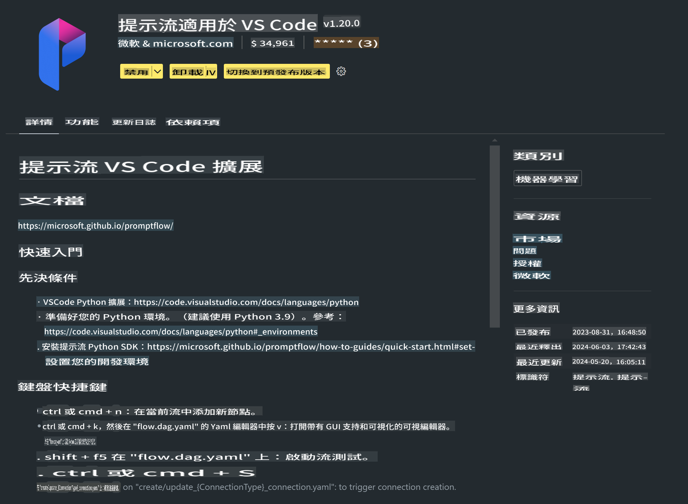

# **Lab 0 - 安裝**

當我們進入實驗室時，需要配置相關環境：

### **1. Python 3.11+**

建議使用 miniforge 來配置你的 Python 環境。

要配置 miniforge，請參考 [https://github.com/conda-forge/miniforge](https://github.com/conda-forge/miniforge)

配置好 miniforge 後，在 Power Shell 中運行以下指令：

```bash

conda create -n pyenv python==3.11.8 -y

conda activate pyenv

```

### **2. 安裝 Prompt flow SDK**

在 Lab 1 中，我們會使用 Prompt flow，因此需要配置 Prompt flow SDK。

```bash

pip install promptflow --upgrade

```

你可以用以下指令檢查 promptflow sdk 是否安裝成功：

```bash

pf --version

```

### **3. 安裝 Visual Studio Code 的 Prompt flow 擴展**



### **4. Intel NPU 加速庫**

Intel 的新一代處理器支持 NPU。如果你想使用 NPU 在本地運行 LLMs / SLMs，可以使用 ***Intel NPU 加速庫***。如果想了解更多，可以參考 [https://github.com/microsoft/PhiCookBook/blob/main/md/01.Introduction/03/AIPC_Inference.md](https://github.com/microsoft/PhiCookBook/blob/main/md/01.Introduction/03/AIPC_Inference.md)。

在 bash 中安裝 Intel NPU 加速庫：

```bash

pip install intel-npu-acceleration-library

```

***注意***：請注意此庫支持 transformers ***4.40.2***，請確認版本。

### **5. 其他 Python 庫**

創建一個 requirements.txt 並添加以下內容：

```txt

notebook
numpy 
scipy 
scikit-learn 
matplotlib 
pandas 
pillow 
graphviz

```

### **6. 安裝 NVM**

在 Powershell 中安裝 nvm：

```bash

winget install -e --id CoreyButler.NVMforWindows

```

安裝 nodejs 18.20：

```bash

nvm install 18.20.0

nvm use 18.20.0

```

### **7. 安裝 Visual Studio Code 開發支持**

```bash

npm install --global yo generator-code

```

恭喜你！你已成功配置好 SDK。接下來可以進入實操步驟。

**免責聲明**:  
本文件經由機器人工智能翻譯服務進行翻譯。我們致力於追求準確性，但請注意，自動翻譯可能包含錯誤或不準確之處。應以原文檔的母語版本作為權威來源。對於關鍵資訊，建議使用專業人工翻譯。我們對因使用此翻譯而引起的任何誤解或誤讀概不負責。