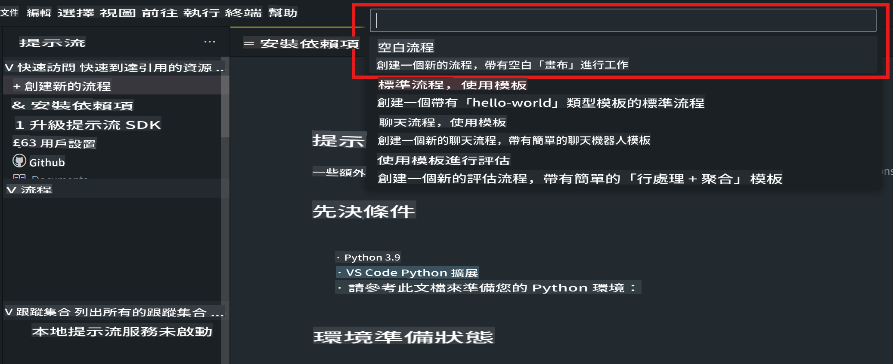

# **Lab 2 - 使用 Phi-3-mini 在 AIPC 上運行 Prompt flow**

## **什麼是 Prompt flow**

Prompt flow 是一套開發工具，旨在簡化基於 LLM 的 AI 應用程序從構思、原型設計、測試、評估到生產部署和監控的全過程開發週期。它讓 prompt 工程變得更加簡單，並幫助你構建具備生產品質的 LLM 應用。

通過使用 Prompt flow，你可以：

- 創建將 LLM、prompt、Python 代碼和其他工具連接在一起的可執行工作流程。

- 輕鬆調試和迭代你的工作流程，特別是與 LLM 的交互。

- 使用更大的數據集評估你的工作流程，計算質量和性能指標。

- 將測試和評估集成到你的 CI/CD 系統中，確保工作流程的質量。

- 將你的工作流程部署到你選擇的服務平台，或者輕鬆集成到應用的代碼基礎中。

- （可選但強烈建議）通過在 Azure AI 上使用 Prompt flow 的雲版本與你的團隊進行協作。

## **什麼是 AIPC**

AI PC 包含 CPU、GPU 和 NPU，每個部件都有特定的 AI 加速能力。NPU，即神經處理單元，是一種專門的加速器，能在你的電腦上處理人工智能（AI）和機器學習（ML）任務，而不需要將數據傳輸到雲端處理。雖然 GPU 和 CPU 也可以處理這些工作負載，但 NPU 特別擅長低功耗的 AI 計算。AI PC 代表了我們電腦運行方式的根本性轉變。它不是為了解決一個以前不存在的問題，而是為日常 PC 使用帶來巨大改進。

那麼它是如何運作的呢？與生成式 AI 和基於大量公共數據訓練的大型語言模型（LLM）相比，在你的電腦上運行的 AI 更加貼近用戶。概念更容易理解，並且因為它基於你的數據訓練，不需要訪問雲端，所以它的優勢對更廣泛的用戶群來說更具吸引力。

在短期內，AI PC 的應用包括個人助理和小型 AI 模型直接在你的電腦上運行，使用你的數據提供個人化、私密且更安全的 AI 增強功能，用於你每天已在做的事情——例如記錄會議紀要、組織幻想足球聯盟、為照片和視頻編輯自動提供增強功能，或者根據每個人的到達和離開時間安排完美的家庭聚會行程。

## **在 AIPC 上構建生成代碼的工作流程**

***注意***：如果你還未完成環境安裝，請訪問 [Lab 0 - 安裝](./01.Installations.md)

1. 在 Visual Studio Code 中打開 Prompt flow 擴展，創建一個空的工作流程項目



2. 添加輸入和輸出參數，並添加 Python 代碼作為新的工作流程


你可以參考這個結構（flow.dag.yaml）來構建你的工作流程

```yaml

inputs:
  question:
    type: string
    default: how to write Bubble Algorithm
outputs:
  answer:
    type: string
    reference: ${Chat_With_Phi3.output}
nodes:
- name: Chat_With_Phi3
  type: python
  source:
    type: code
    path: Chat_With_Phi3.py
  inputs:
    question: ${inputs.question}


```

3. 在 ***Chat_With_Phi3.py*** 中添加代碼

```python


from promptflow.core import tool

# import torch
from transformers import AutoTokenizer, pipeline,TextStreamer
import intel_npu_acceleration_library as npu_lib

import warnings

import asyncio
import platform

class Phi3CodeAgent:
    
    model = None
    tokenizer = None
    text_streamer = None
    
    model_id = "microsoft/Phi-3-mini-4k-instruct"

    @staticmethod
    def init_phi3():
        
        if Phi3CodeAgent.model is None or Phi3CodeAgent.tokenizer is None or Phi3CodeAgent.text_streamer is None:
            Phi3CodeAgent.model = npu_lib.NPUModelForCausalLM.from_pretrained(
                                    Phi3CodeAgent.model_id,
                                    torch_dtype="auto",
                                    dtype=npu_lib.int4,
                                    trust_remote_code=True
                                )
            Phi3CodeAgent.tokenizer = AutoTokenizer.from_pretrained(Phi3CodeAgent.model_id)
            Phi3CodeAgent.text_streamer = TextStreamer(Phi3CodeAgent.tokenizer, skip_prompt=True)

    

    @staticmethod
    def chat_with_phi3(prompt):
        
        Phi3CodeAgent.init_phi3()

        messages = "<|system|>You are a AI Python coding assistant. Please help me to generate code in Python.The answer only genertated Python code, but any comments and instructions do not need to be generated<|end|><|user|>" + prompt +"<|end|><|assistant|>"


        generation_args = {
            "max_new_tokens": 1024,
            "return_full_text": False,
            "temperature": 0.3,
            "do_sample": False,
            "streamer": Phi3CodeAgent.text_streamer,
        }

        pipe = pipeline(
            "text-generation",
            model=Phi3CodeAgent.model,
            tokenizer=Phi3CodeAgent.tokenizer,
            # **generation_args
        )

        result = ''

        with warnings.catch_warnings():
            warnings.simplefilter("ignore")
            response = pipe(messages, **generation_args)
            result =response[0]['generated_text']
            return result


@tool
def my_python_tool(question: str) -> str:
    if platform.system() == 'Windows':
        asyncio.set_event_loop_policy(asyncio.WindowsSelectorEventLoopPolicy())
    return Phi3CodeAgent.chat_with_phi3(question)


```

4. 你可以通過 Debug 或 Run 測試工作流程，檢查生成的代碼是否正常


5. 在終端中作為開發 API 運行工作流程

```

pf flow serve --source ./ --port 8080 --host localhost   

```

你可以在 Postman / Thunder Client 中測試它。

### **注意事項**

1. 第一次運行會花費較長時間。建議使用 Hugging Face CLI 下載 phi-3 模型。

2. 考慮到 Intel NPU 的計算能力有限，建議使用 Phi-3-mini-4k-instruct。

3. 我們使用 Intel NPU 加速進行 INT4 量化轉換，但如果重新運行服務，你需要刪除緩存和 nc_workshop 文件夾。

## **資源**

1. 學習 Prompt flow [https://microsoft.github.io/promptflow/](https://microsoft.github.io/promptflow/)

2. 學習 Intel NPU 加速 [https://github.com/intel/intel-npu-acceleration-library](https://github.com/intel/intel-npu-acceleration-library)

3. 示例代碼，下載 [本地 NPU 代理示例代碼](../../../../../../../../../code/07.Lab/01/AIPC)

**免責聲明**:  
本文件已使用機器翻譯服務進行翻譯。雖然我們努力確保準確性，但請注意，自動翻譯可能包含錯誤或不準確之處。應以原文文件為權威來源。如涉及關鍵資訊，建議使用專業人工翻譯。我們對因使用此翻譯而引起的任何誤解或誤譯概不負責。