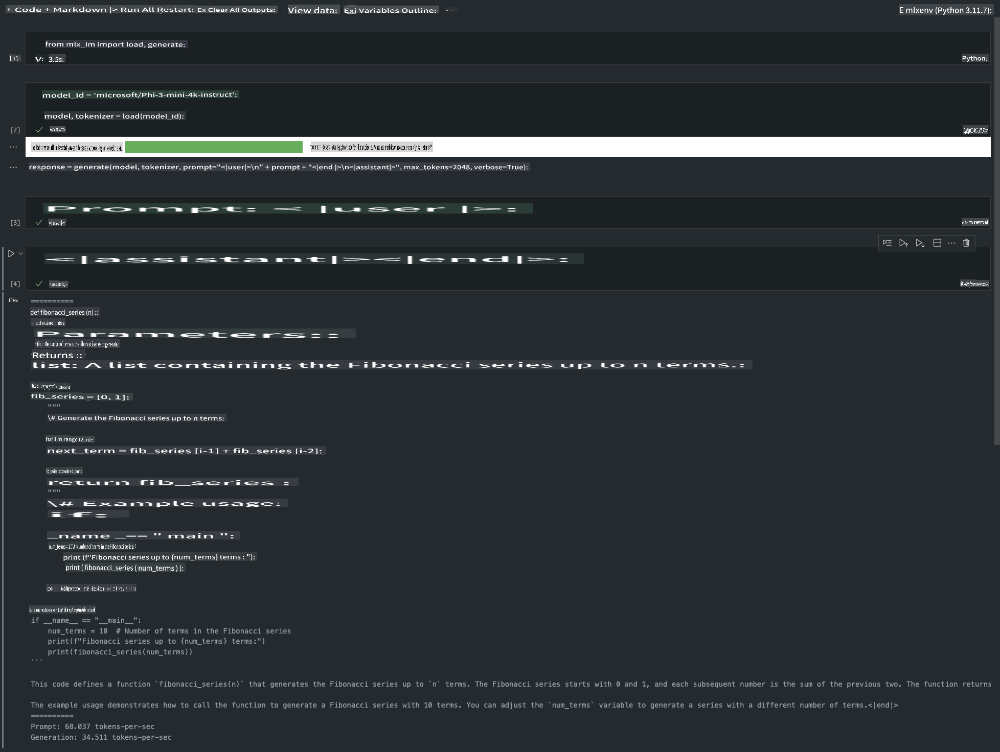

# **使用 Apple MLX 框架推理 Phi-3**

## **什麼是 MLX 框架**

MLX 是一個專為蘋果 Silicon 設計的機器學習研究框架，由 Apple 的機器學習研究團隊開發。

MLX 是專門為機器學習研究人員設計的框架，旨在提供一個既方便使用又高效訓練和部署模型的工具。這個框架的設計概念非常簡單，目的是讓研究人員能輕鬆擴展和改進 MLX，快速探索新的想法。

在 Apple Silicon 設備上，LLMs 可以通過 MLX 加速，並且可以非常方便地在本地運行模型。

## **使用 MLX 推理 Phi-3-mini**

### **1. 設置 MLX 環境**

1. Python 3.11.x  
2. 安裝 MLX Library  

```bash

pip install mlx-lm

```

### **2. 在終端中使用 MLX 運行 Phi-3-mini**

```bash

python -m mlx_lm.generate --model microsoft/Phi-3-mini-4k-instruct --max-token 2048 --prompt  "<|user|>\nCan you introduce yourself<|end|>\n<|assistant|>"

```

結果如下（我的環境是 Apple M1 Max，64GB）：  


### **3. 在終端中使用 MLX 量化 Phi-3-mini**

```bash

python -m mlx_lm.convert --hf-path microsoft/Phi-3-mini-4k-instruct

```

***注意：*** 可以通過 mlx_lm.convert 來量化模型，默認的量化方式是 INT4。本例將 Phi-3-mini 量化為 INT4。

模型可以通過 mlx_lm.convert 進行量化，默認的量化方式為 INT4。本例中將 Phi-3-mini 量化為 INT4。量化完成後，模型將存儲在默認目錄 ./mlx_model 中。

我們可以在終端中測試通過 MLX 量化的模型：

```bash

python -m mlx_lm.generate --model ./mlx_model/ --max-token 2048 --prompt  "<|user|>\nCan you introduce yourself<|end|>\n<|assistant|>"

```

結果如下：  


### **4. 在 Jupyter Notebook 中使用 MLX 運行 Phi-3-mini**



***注意：*** 請閱讀此範例 [點擊此鏈接](../../../../../code/03.Inference/MLX/MLX_DEMO.ipynb)

## **資源**

1. 瞭解 Apple MLX 框架 [https://ml-explore.github.io](https://ml-explore.github.io/mlx/build/html/index.html)

2. Apple MLX GitHub Repo [https://github.com/ml-explore](https://github.com/ml-explore)

**免責聲明**：  
本文件是使用機器人工智能翻譯服務進行翻譯的。儘管我們努力確保準確性，但請注意，自動翻譯可能會包含錯誤或不準確之處。應以原文的母語版本作為權威來源。如涉及關鍵資訊，建議尋求專業人工翻譯。我們對因使用本翻譯而引起的任何誤解或誤釋不承擔責任。