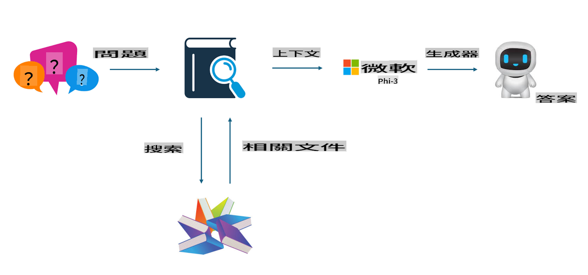

## 微調 vs RAG

## 檢索增強生成

RAG 就係數據檢索加文本生成。企業嘅結構化數據同非結構化數據會儲喺向量數據庫度。喺搜索相關內容嘅時候，會搵到相關嘅摘要同內容嚟形成一個上下文，然後結合 LLM/SLM 嘅文本補全能力嚟生成內容。

## RAG 流程

## 微調
微調係基於改進某個模型，唔需要由模型算法開始，但需要持續積累數據。如果你喺行業應用中需要更加精確嘅術語同語言表達，微調會係你更好嘅選擇。但如果你嘅數據經常改變，微調可能會變得複雜。

## 點樣揀
如果我哋嘅答案需要引入外部數據，RAG 係最佳選擇。

如果需要輸出穩定同精確嘅行業知識，微調會係一個好嘅選擇。RAG 會優先提取相關內容，但可能未必可以完全掌握專業嘅細微差別。

微調需要高質量嘅數據集，如果只係一個小範圍嘅數據，其實分別唔會太大。RAG 會更加靈活。

微調係一個黑盒，一種玄學，內部機制比較難理解。但 RAG 可以更容易搵到數據來源，從而有效調整幻覺或者內容錯誤，提供更好嘅透明度。

**免責聲明**:  
本文件使用基於機器的人工智能翻譯服務進行翻譯。儘管我們努力確保準確性，但請注意，自動翻譯可能包含錯誤或不準確之處。應以原文作為權威來源。對於關鍵資訊，建議尋求專業人工翻譯。我們對因使用本翻譯而引起的任何誤解或誤讀概不負責。