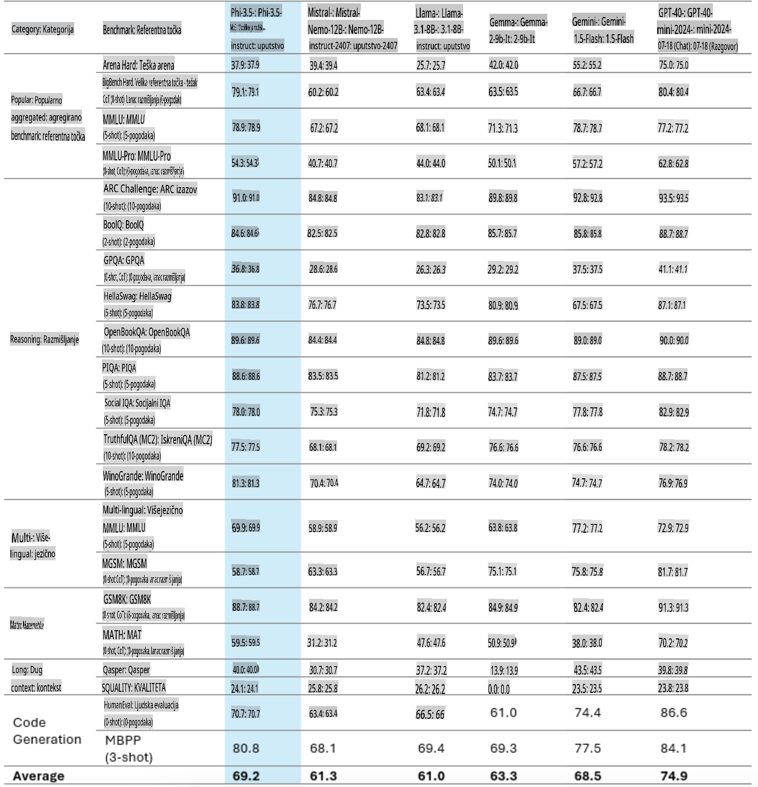
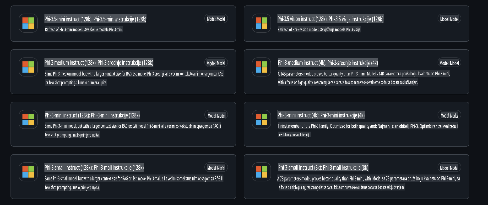
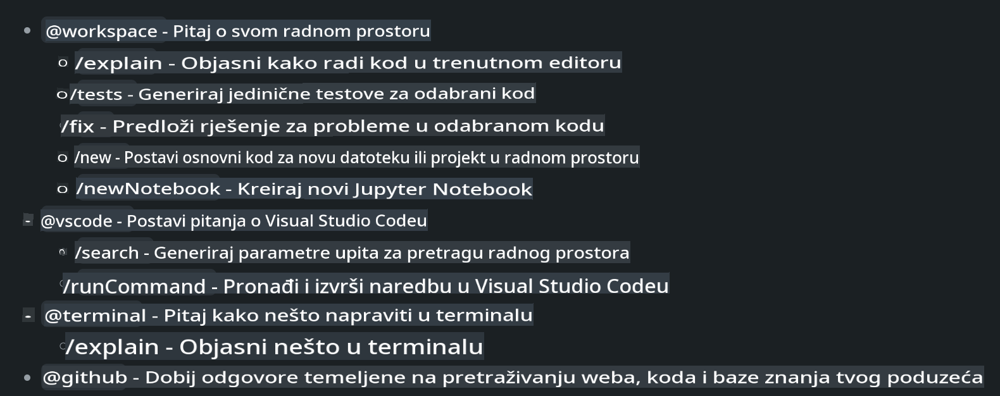
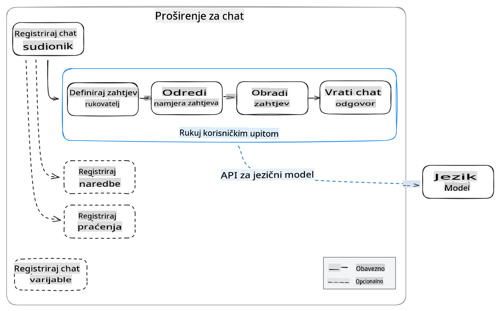
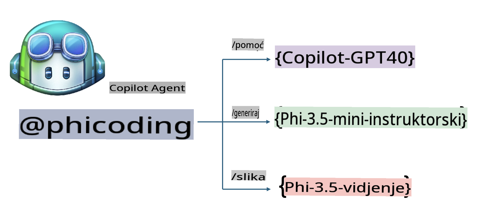
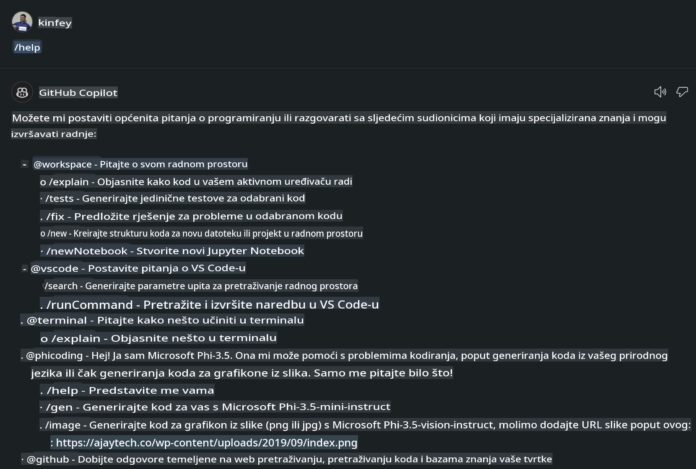
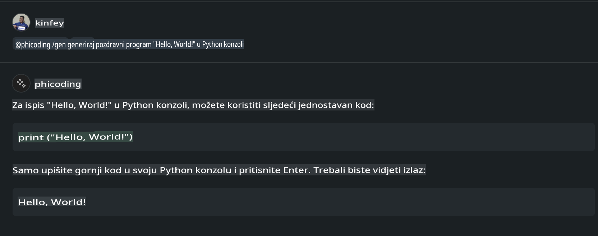

# **Kreirajte vlastitog Visual Studio Code Chat Copilot agenta s Phi-3.5 pomoću GitHub Modela**

Koristite li Visual Studio Code Copilot? Posebno u Chatu, možete koristiti različite agente kako biste poboljšali mogućnost kreiranja, pisanja i održavanja projekata u Visual Studio Codeu. Visual Studio Code nudi API koji omogućuje tvrtkama i pojedincima kreiranje različitih agenata temeljenih na njihovim poslovnim potrebama kako bi proširili svoje mogućnosti u specifičnim područjima. U ovom članku usredotočit ćemo se na **Phi-3.5-mini-instruct (128k)** i **Phi-3.5-vision-instruct (128k)** iz GitHub Modela kako bismo kreirali vlastitog Visual Studio Code agenta.

## **O Phi-3.5 na GitHub Modelima**

Znamo da Phi-3/3.5-mini-instruct u Phi-3/3.5 obitelji ima snažne mogućnosti razumijevanja i generiranja koda te prednosti u odnosu na Gemma-2-9b i Mistral-Nemo-12B-instruct-2407.



Najnoviji GitHub modeli već omogućuju pristup modelima Phi-3.5-mini-instruct (128k) i Phi-3.5-vision-instruct (128k). Programeri im mogu pristupiti putem OpenAI SDK-a, Azure AI Inference SDK-a i REST API-ja.



***Napomena:*** Preporučuje se korištenje Azure AI Inference SDK-a jer omogućuje bolje prebacivanje s Azure Model Catalogom u produkcijskom okruženju.

Slijede rezultati **Phi-3.5-mini-instruct (128k)** i **Phi-3.5-vision-instruct (128k)** u scenarijima generiranja koda nakon integracije s GitHub Modelima, što također priprema teren za sljedeće primjere.

**Demo: GitHub Modeli Phi-3.5-mini-instruct (128k) generiraju kod iz Prompt-a** ([kliknite na ovaj link](../../../../../../code/09.UpdateSamples/Aug/ghmodel_phi35_instruct_demo.ipynb))

**Demo: GitHub Modeli Phi-3.5-vision-instruct (128k) generiraju kod iz slike** ([kliknite na ovaj link](../../../../../../code/09.UpdateSamples/Aug/ghmodel_phi35_vision_demo.ipynb))

## **O GitHub Copilot Chat Agentu**

GitHub Copilot Chat Agent može obavljati različite zadatke u različitim projektima temeljenim na kodu. Sustav ima četiri agenta: workspace, github, terminal, vscode.



Dodavanjem imena agenta s ‘@’, možete brzo obaviti odgovarajući posao. Za poduzeća, ako dodate vlastite poslovne sadržaje poput zahtjeva, kodiranja, specifikacija testiranja i izdavanja, možete imati moćnije privatne funkcije temeljene na GitHub Copilotu.

Visual Studio Code Chat Agent sada je službeno objavio svoj API, omogućujući poduzećima ili njihovim programerima razvoj agenata temeljenih na različitim softverskim poslovnim ekosustavima. Temeljem metode razvoja proširenja za Visual Studio Code, lako možete pristupiti sučelju Visual Studio Code Chat Agent API-ja. Razvoj se može provesti prema sljedećem procesu.



Scenarij razvoja može podržavati pristup API-ju modela treće strane (kao što su GitHub Modeli, Azure Model Catalog i vlastite usluge temeljene na open source modelima), a može koristiti i modele gpt-35-turbo, gpt-4 i gpt-4o koje nudi GitHub Copilot.

## **Dodavanje agenta @phicoding temeljenog na Phi-3.5**

Pokušavamo integrirati programerske mogućnosti Phi-3.5 kako bismo dovršili zadatke poput pisanja koda, generiranja koda iz slika i drugih zadataka. Kreirajmo agenta temeljenog na Phi-3.5 - @PHI. Slijede neke od njegovih funkcija:

1. Generirajte uvod koristeći GPT-4o koji pruža GitHub Copilot putem naredbe **@phicoding /help**.

2. Generirajte kod za različite programske jezike koristeći **Phi-3.5-mini-instruct (128k)** putem naredbe **@phicoding /gen**.

3. Generirajte kod temeljen na **Phi-3.5-vision-instruct (128k)** i dovršavanje slika putem naredbe **@phicoding /image**.



## **Povezani koraci**

1. Instalirajte podršku za razvoj Visual Studio Code proširenja koristeći npm.

```bash

npm install --global yo generator-code 

```
2. Kreirajte Visual Studio Code proširenje (koristeći Typescript način razvoja, nazvano phiext).

```bash

yo code 

```

3. Otvorite kreirani projekt i izmijenite package.json. Ovdje su povezane upute i konfiguracije, kao i konfiguracija GitHub Modela. Napomena: ovdje trebate dodati svoj GitHub Models token.

```json

{
  "name": "phiext",
  "displayName": "phiext",
  "description": "",
  "version": "0.0.1",
  "engines": {
    "vscode": "^1.93.0"
  },
  "categories": [
    "AI",
    "Chat"
  ],
  "activationEvents": [],
  "enabledApiProposals": [
      "chatVariableResolver"
  ],
  "main": "./dist/extension.js",
  "contributes": {
    "chatParticipants": [
        {
            "id": "chat.phicoding",
            "name": "phicoding",
            "description": "Hey! I am Microsoft Phi-3.5, She can help me with coding problems, such as generation code with your natural language, or even generation code about chart from images. Just ask me anything!",
            "isSticky": true,
            "commands": [
                {
                    "name": "help",
                    "description": "Introduce myself to you"
                },
                {
                    "name": "gen",
                    "description": "Generate code for you with Microsoft Phi-3.5-mini-instruct"
                },
                {
                    "name": "image",
                    "description": "Generate code for chart from image(png or jpg) with Microsoft Phi-3.5-vision-instruct, please add image url like this : https://ajaytech.co/wp-content/uploads/2019/09/index.png"
                }
            ]
        }
    ],
    "commands": [
        {
            "command": "phicoding.namesInEditor",
            "title": "Use Microsoft Phi 3.5 in Editor"
        }
    ],
    "configuration": {
      "type": "object",
      "title": "githubmodels",
      "properties": {
        "githubmodels.endpoint": {
          "type": "string",
          "default": "https://models.inference.ai.azure.com",
          "description": "Your GitHub Models Endpoint",
          "order": 0
        },
        "githubmodels.api_key": {
          "type": "string",
          "default": "Your GitHub Models Token",
          "description": "Your GitHub Models Token",
          "order": 1
        },
        "githubmodels.phi35instruct": {
          "type": "string",
          "default": "Phi-3.5-mini-instruct",
          "description": "Your Phi-35-Instruct Model",
          "order": 2
        },
        "githubmodels.phi35vision": {
          "type": "string",
          "default": "Phi-3.5-vision-instruct",
          "description": "Your Phi-35-Vision Model",
          "order": 3
        }
      }
    }
  },
  "scripts": {
    "vscode:prepublish": "npm run package",
    "compile": "webpack",
    "watch": "webpack --watch",
    "package": "webpack --mode production --devtool hidden-source-map",
    "compile-tests": "tsc -p . --outDir out",
    "watch-tests": "tsc -p . -w --outDir out",
    "pretest": "npm run compile-tests && npm run compile && npm run lint",
    "lint": "eslint src",
    "test": "vscode-test"
  },
  "devDependencies": {
    "@types/vscode": "^1.93.0",
    "@types/mocha": "^10.0.7",
    "@types/node": "20.x",
    "@typescript-eslint/eslint-plugin": "^8.3.0",
    "@typescript-eslint/parser": "^8.3.0",
    "eslint": "^9.9.1",
    "typescript": "^5.5.4",
    "ts-loader": "^9.5.1",
    "webpack": "^5.94.0",
    "webpack-cli": "^5.1.4",
    "@vscode/test-cli": "^0.0.10",
    "@vscode/test-electron": "^2.4.1"
  },
  "dependencies": {
    "@types/node-fetch": "^2.6.11",
    "node-fetch": "^3.3.2",
    "@azure-rest/ai-inference": "latest",
    "@azure/core-auth": "latest",
    "@azure/core-sse": "latest"
  }
}


```

4. Izmijenite src/extension.ts.

```typescript

// The module 'vscode' contains the VS Code extensibility API
// Import the module and reference it with the alias vscode in your code below
import * as vscode from 'vscode';
import ModelClient from "@azure-rest/ai-inference";
import { AzureKeyCredential } from "@azure/core-auth";


interface IPhiChatResult extends vscode.ChatResult {
    metadata: {
        command: string;
    };
}


const MODEL_SELECTOR: vscode.LanguageModelChatSelector = { vendor: 'copilot', family: 'gpt-4o' };

function isValidImageUrl(url: string): boolean {
    const regex = /^(https?:\/\/.*\.(?:png|jpg))$/i;
    return regex.test(url);
}
  

// This method is called when your extension is activated
// Your extension is activated the very first time the command is executed
export function activate(context: vscode.ExtensionContext) {

    const codinghandler: vscode.ChatRequestHandler = async (request: vscode.ChatRequest, context: vscode.ChatContext, stream: vscode.ChatResponseStream, token: vscode.CancellationToken): Promise<IPhiChatResult> => {


        const config : any = vscode.workspace.getConfiguration('githubmodels');
        const endPoint: string = config.get('endpoint');
        const apiKey: string = config.get('api_key');
        const phi35instruct: string = config.get('phi35instruct');
        const phi35vision: string = config.get('phi35vision');
        
        if (request.command === 'help') {

            const content = "Welcome to Coding assistant with Microsoft Phi-3.5"; 
            stream.progress(content);


            try {
                const [model] = await vscode.lm.selectChatModels(MODEL_SELECTOR);
                if (model) {
                    const messages = [
                        vscode.LanguageModelChatMessage.User("Please help me express this content in a humorous way: I am a programming assistant who can help you convert natural language into code and generate code based on the charts in the images. output format like this : Hey I am Phi ......")
                    ];
                    const chatResponse = await model.sendRequest(messages, {}, token);
                    for await (const fragment of chatResponse.text) {
                        stream.markdown(fragment);
                    }
                }
            } catch(err) {
                console.log(err);
            }


            return { metadata: { command: 'help' } };

        }

        
        if (request.command === 'gen') {

            const content = "Welcome to use phi-3.5 to generate code";

            stream.progress(content);

            const client = new ModelClient(endPoint, new AzureKeyCredential(apiKey));

            const response = await client.path("/chat/completions").post({
              body: {
                messages: [
                  { role:"system", content: "You are a coding assistant.Help answer all code generation questions." },
                  { role:"user", content: request.prompt }
                ],
                model: phi35instruct,
                temperature: 0.4,
                max_tokens: 1000,
                top_p: 1.
              }
            });

            stream.markdown(response.body.choices[0].message.content);

            return { metadata: { command: 'gen' } };

        }


        
        if (request.command === 'image') {


            const content = "Welcome to use phi-3.5 to generate code from image(png or jpg),image url like this:https://ajaytech.co/wp-content/uploads/2019/09/index.png";

            stream.progress(content);

            if (!isValidImageUrl(request.prompt)) {
                stream.markdown('Please provide a valid image URL');
                return { metadata: { command: 'image' } };
            }
            else
            {

                const client = new ModelClient(endPoint, new AzureKeyCredential(apiKey));
    
                const response = await client.path("/chat/completions").post({
                    body: {
                      messages: [
                        { role: "system", content: "You are a helpful assistant that describes images in details." },
                        { role: "user", content: [
                            { type: "text", text: "Please generate code according to the chart in the picture according to the following requirements\n1. Keep all information in the chart, including data and text\n2. Do not generate additional information that is not included in the chart\n3. Please extract data from the picture, do not generate it from csv\n4. Please save the regenerated chart as a chart and save it to ./output/demo.png"},
                            { type: "image_url", image_url: {url: request.prompt}
                            }
                          ]
                        }
                      ],
                      model: phi35vision,
                      temperature: 0.4,
                      max_tokens: 2048,
                      top_p: 1.
                    }
                  });
    
                
                stream.markdown(response.body.choices[0].message.content);
    
                return { metadata: { command: 'image' } };
            }


        }


        return { metadata: { command: '' } };
    };


    const phi_ext = vscode.chat.createChatParticipant("chat.phicoding", codinghandler);

    phi_ext.iconPath = new vscode.ThemeIcon('sparkle');


    phi_ext.followupProvider = {
        provideFollowups(result: IPhiChatResult, context: vscode.ChatContext, token: vscode.CancellationToken) {
            return [{
                prompt: 'Let us coding with Phi-3.5 😋😋😋😋',
                label: vscode.l10n.t('Enjoy coding with Phi-3.5'),
                command: 'help'
            } satisfies vscode.ChatFollowup];
        }
    };

    context.subscriptions.push(phi_ext);
}

// This method is called when your extension is deactivated
export function deactivate() {}


```

6. Pokretanje.

***/help***



***@phicoding /help***


***@phicoding /gen***



***@phicoding /image***


Možete preuzeti uzorak koda: [kliknite](../../../../../../code/09.UpdateSamples/Aug/vscode)

## **Resursi**

1. Registrirajte se za GitHub Modeli [https://gh.io/models](https://gh.io/models)

2. Naučite razvoj Visual Studio Code proširenja [https://code.visualstudio.com/api/get-started/your-first-extension](https://code.visualstudio.com/api/get-started/your-first-extension)

3. Saznajte više o Visual Studio Code Copilot Chat API-ju [https://code.visualstudio.com/api/extension-guides/chat](https://code.visualstudio.com/api/extension-guides/chat)

**Odricanje od odgovornosti**:  
Ovaj dokument je preveden korištenjem usluga strojnog prevođenja temeljenih na umjetnoj inteligenciji. Iako težimo točnosti, imajte na umu da automatizirani prijevodi mogu sadržavati pogreške ili netočnosti. Izvorni dokument na izvornom jeziku treba smatrati mjerodavnim izvorom. Za ključne informacije preporučuje se profesionalni prijevod od strane čovjeka. Ne snosimo odgovornost za nesporazume ili pogrešne interpretacije proizašle iz korištenja ovog prijevoda.