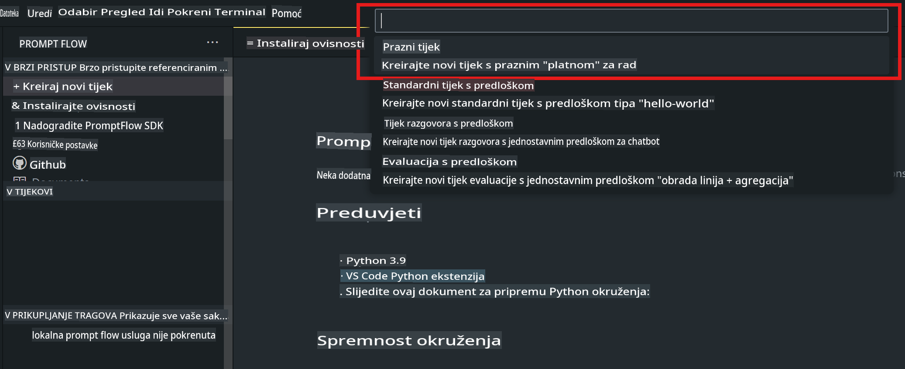

# **Lab 2 - Pokretanje Prompt flow s Phi-3-mini na AIPC-u**

## **Što je Prompt flow**

Prompt flow je skup razvojnih alata osmišljenih za pojednostavljenje cjelokupnog ciklusa razvoja AI aplikacija temeljenih na velikim jezičnim modelima (LLM), od ideje, prototipiranja, testiranja, evaluacije do implementacije u produkciju i praćenja. Olakšava prompt inženjering i omogućuje izgradnju LLM aplikacija proizvodne kvalitete.

Uz Prompt flow možete:

- Stvarati tokove koji povezuju LLM-ove, promptove, Python kod i druge alate u izvršiv radni proces.

- Jednostavno otklanjati pogreške i iterirati tokove, posebno u interakciji s LLM-ovima.

- Evaluirati svoje tokove, izračunavati metrike kvalitete i performansi na većim skupovima podataka.

- Integrirati testiranje i evaluaciju u vaš CI/CD sustav kako biste osigurali kvalitetu svog toka.

- Implementirati tokove na odabranu platformu za posluživanje ili ih lako integrirati u bazu koda vaše aplikacije.

- (Opcionalno, ali visoko preporučeno) Suraditi sa svojim timom koristeći verziju Prompt flow u oblaku na Azure AI platformi.

## **Što je AIPC**

AI PC ima CPU, GPU i NPU, svaki s određenim mogućnostima ubrzanja za AI. NPU, odnosno jedinica za obradu neuronskih mreža, specijalizirani je akcelerator koji obrađuje zadatke umjetne inteligencije (AI) i strojnog učenja (ML) izravno na vašem računalu, umjesto da šalje podatke na obradu u oblak. Iako GPU i CPU također mogu obraditi te zadatke, NPU je posebno učinkovit za AI izračune s niskom potrošnjom energije. AI PC predstavlja temeljnu promjenu u načinu rada naših računala. To nije rješenje za problem koji prije nije postojao, već značajno poboljšanje za svakodnevnu upotrebu računala.

Kako to funkcionira? U usporedbi s generativnom umjetnom inteligencijom i velikim jezičnim modelima (LLM) treniranim na ogromnim količinama javnih podataka, AI koji se izvodi na vašem računalu pristupačniji je na gotovo svim razinama. Koncept je lakše razumjeti, a budući da je treniran na vašim podacima bez potrebe za pristupom oblaku, prednosti su odmah privlačnije širem krugu korisnika.

U bliskoj budućnosti, AI PC svijet uključuje osobne asistente i manje AI modele koji se pokreću izravno na vašem računalu, koristeći vaše podatke kako bi ponudili osobne, privatne i sigurnije AI nadogradnje za stvari koje već svakodnevno radite – vođenje bilješki sa sastanaka, organizaciju fantasy nogometne lige, automatizaciju poboljšanja za uređivanje fotografija i videa ili planiranje savršenog itinerara za obiteljsko okupljanje na temelju vremena dolaska i odlaska svih sudionika.

## **Izgradnja tokova za generiranje koda na AIPC-u**

***Napomena***: Ako još niste završili instalaciju okruženja, posjetite [Lab 0 - Instalacije](./01.Installations.md)

1. Otvorite Prompt flow ekstenziju u Visual Studio Code-u i kreirajte prazan projekt toka.



2. Dodajte ulazne i izlazne parametre te dodajte Python kod kao novi tok.


Možete se referirati na ovu strukturu (flow.dag.yaml) za izgradnju svog toka:

```yaml

inputs:
  question:
    type: string
    default: how to write Bubble Algorithm
outputs:
  answer:
    type: string
    reference: ${Chat_With_Phi3.output}
nodes:
- name: Chat_With_Phi3
  type: python
  source:
    type: code
    path: Chat_With_Phi3.py
  inputs:
    question: ${inputs.question}


```

3. Dodajte kod u ***Chat_With_Phi3.py***.

```python


from promptflow.core import tool

# import torch
from transformers import AutoTokenizer, pipeline,TextStreamer
import intel_npu_acceleration_library as npu_lib

import warnings

import asyncio
import platform

class Phi3CodeAgent:
    
    model = None
    tokenizer = None
    text_streamer = None
    
    model_id = "microsoft/Phi-3-mini-4k-instruct"

    @staticmethod
    def init_phi3():
        
        if Phi3CodeAgent.model is None or Phi3CodeAgent.tokenizer is None or Phi3CodeAgent.text_streamer is None:
            Phi3CodeAgent.model = npu_lib.NPUModelForCausalLM.from_pretrained(
                                    Phi3CodeAgent.model_id,
                                    torch_dtype="auto",
                                    dtype=npu_lib.int4,
                                    trust_remote_code=True
                                )
            Phi3CodeAgent.tokenizer = AutoTokenizer.from_pretrained(Phi3CodeAgent.model_id)
            Phi3CodeAgent.text_streamer = TextStreamer(Phi3CodeAgent.tokenizer, skip_prompt=True)

    

    @staticmethod
    def chat_with_phi3(prompt):
        
        Phi3CodeAgent.init_phi3()

        messages = "<|system|>You are a AI Python coding assistant. Please help me to generate code in Python.The answer only genertated Python code, but any comments and instructions do not need to be generated<|end|><|user|>" + prompt +"<|end|><|assistant|>"


        generation_args = {
            "max_new_tokens": 1024,
            "return_full_text": False,
            "temperature": 0.3,
            "do_sample": False,
            "streamer": Phi3CodeAgent.text_streamer,
        }

        pipe = pipeline(
            "text-generation",
            model=Phi3CodeAgent.model,
            tokenizer=Phi3CodeAgent.tokenizer,
            # **generation_args
        )

        result = ''

        with warnings.catch_warnings():
            warnings.simplefilter("ignore")
            response = pipe(messages, **generation_args)
            result =response[0]['generated_text']
            return result


@tool
def my_python_tool(question: str) -> str:
    if platform.system() == 'Windows':
        asyncio.set_event_loop_policy(asyncio.WindowsSelectorEventLoopPolicy())
    return Phi3CodeAgent.chat_with_phi3(question)


```

4. Možete testirati tok pomoću Debug ili Run opcije kako biste provjerili generira li kod ispravno.


5. Pokrenite tok kao razvojni API u terminalu.

```

pf flow serve --source ./ --port 8080 --host localhost   

```

Možete ga testirati u Postmanu ili Thunder Clientu.

### **Napomena**

1. Prvo pokretanje traje dugo. Preporučuje se preuzimanje Phi-3 modela putem Hugging Face CLI-ja.

2. S obzirom na ograničenu računalnu snagu Intel NPU-a, preporučuje se korištenje Phi-3-mini-4k-instruct.

3. Koristimo Intel NPU ubrzanje za kvantizaciju INT4 konverzije, no ako ponovno pokrenete uslugu, trebate obrisati cache i mape nc_workshop.

## **Resursi**

1. Naučite Promptflow [https://microsoft.github.io/promptflow/](https://microsoft.github.io/promptflow/)

2. Naučite Intel NPU ubrzanje [https://github.com/intel/intel-npu-acceleration-library](https://github.com/intel/intel-npu-acceleration-library)

3. Primjeri koda, preuzmite [Lokalni NPU Agent Primjer Koda](../../../../../../../../../code/07.Lab/01/AIPC)

**Odricanje od odgovornosti**:  
Ovaj dokument je preveden korištenjem usluga strojnog prevođenja temeljenih na umjetnoj inteligenciji. Iako nastojimo osigurati točnost, imajte na umu da automatizirani prijevodi mogu sadržavati pogreške ili netočnosti. Izvorni dokument na izvornom jeziku treba smatrati mjerodavnim izvorom. Za kritične informacije preporučuje se profesionalni prijevod od strane čovjeka. Ne preuzimamo odgovornost za bilo kakve nesporazume ili pogrešne interpretacije proizašle iz korištenja ovog prijevoda.