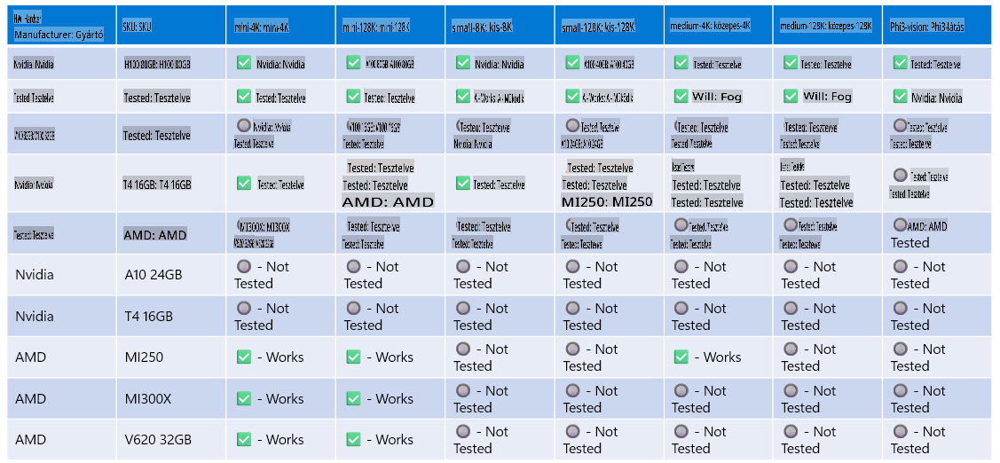

# Phi Hardvertámogatás

A Microsoft Phi optimalizálva lett az ONNX Runtime-hoz, és támogatja a Windows DirectML-t. Kiválóan működik különféle hardvertípusokon, beleértve a GPU-kat, CPU-kat és akár mobil eszközöket is.

## Eszközhardver
Különösen az alábbi hardverek támogatottak:

- GPU SKU: RTX 4090 (DirectML)
- GPU SKU: 1 A100 80GB (CUDA)
- CPU SKU: Standard F64s v2 (64 vCPU, 128 GiB memória)

## Mobil SKU

- Android - Samsung Galaxy S21
- Apple iPhone 14 vagy újabb A16/A17 processzorral

## Phi Hardverspecifikáció

- Minimálisan szükséges konfiguráció:
- Windows: DirectX 12-kompatibilis GPU és legalább 4 GB együttes RAM

CUDA: NVIDIA GPU Compute Capability >= 7.02



## ONNX Runtime futtatása több GPU-n

Jelenleg az elérhető Phi ONNX modellek csak 1 GPU-ra készültek. Lehetséges a több GPU támogatása a Phi modellekhez, de az ORT 2 GPU-val nem garantálja, hogy nagyobb átviteli sebességet biztosít, mint 2 ORT példány. A legfrissebb információkért kérjük, látogasson el az [ONNX Runtime](https://onnxruntime.ai/) oldalra.

A [Build 2024 GenAI ONNX Team](https://youtu.be/WLW4SE8M9i8?si=EtG04UwDvcjunyfC) bejelentette, hogy a Phi modellek esetében a több GPU helyett több példányt (multi-instance) tettek lehetővé.

Jelenleg ez azt teszi lehetővé, hogy egyetlen onnxruntime vagy onnxruntime-genai példányt futtasson a CUDA_VISIBLE_DEVICES környezeti változóval, például így:

```Python
CUDA_VISIBLE_DEVICES=0 python infer.py
CUDA_VISIBLE_DEVICES=1 python infer.py
```

Fedezze fel a Phi további lehetőségeit az [Azure AI Foundry](https://ai.azure.com) oldalon.

**Felelősségkizárás**:  
Ez a dokumentum gépi AI fordítószolgáltatások segítségével került lefordításra. Bár igyekszünk a pontosságra törekedni, kérjük, vegye figyelembe, hogy az automatikus fordítások hibákat vagy pontatlanságokat tartalmazhatnak. Az eredeti dokumentum az eredeti nyelvén tekintendő hiteles forrásnak. Kritikus információk esetén javasolt professzionális, emberi fordítást igénybe venni. Nem vállalunk felelősséget az ebből a fordításból eredő félreértésekért vagy téves értelmezésekért.