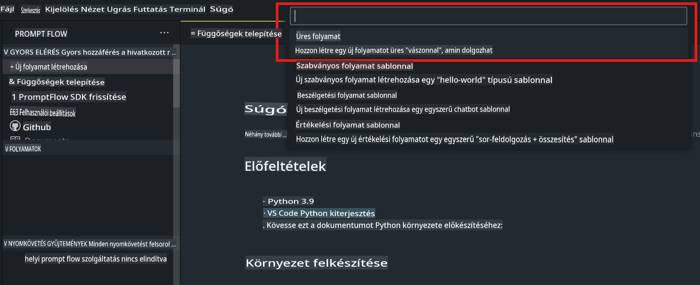

# **2. labor - Prompt flow futtatása Phi-3-mini modellel AIPC-n**

## **Mi az a Prompt flow**

A Prompt flow egy fejlesztői eszközkészlet, amely megkönnyíti az LLM-alapú AI alkalmazások teljes fejlesztési ciklusát az ötleteléstől, prototípus-készítéstől, teszteléstől és értékeléstől egészen a gyártási bevezetésig és monitorozásig. A promptok tervezése egyszerűbbé válik, és lehetővé teszi, hogy gyártási minőségű LLM alkalmazásokat hozz létre.

A Prompt flow segítségével képes leszel:

- Olyan folyamatokat létrehozni, amelyek összekapcsolják az LLM-eket, promptokat, Python kódokat és más eszközöket egy végrehajtható munkafolyamatban.

- Könnyedén hibakeresni és iterálni a folyamataidon, különösen az LLM-ekkel való interakciók során.

- Értékelni a folyamataidat, nagyobb adathalmazokon minőségi és teljesítménymutatókat számolni.

- A tesztelést és értékelést integrálni a CI/CD rendszeredbe, hogy biztosítsd a folyamat minőségét.

- A folyamataidat a választott kiszolgálási platformra telepíteni, vagy könnyedén integrálni az alkalmazásod kódbázisába.

- (Nem kötelező, de erősen ajánlott) Együttműködni a csapatoddal az Azure AI felhőalapú Prompt flow verzióját kihasználva.

## **Mi az az AIPC**

Egy AI PC-ben található CPU, GPU és NPU, mindegyik saját AI gyorsítási képességekkel. Az NPU, vagyis a neurális feldolgozóegység egy speciális gyorsító, amely mesterséges intelligencia (AI) és gépi tanulási (ML) feladatokat kezel közvetlenül a számítógépeden, ahelyett hogy az adatokat a felhőbe küldené feldolgozásra. Bár a GPU és a CPU is képes ezeket a feladatokat ellátni, az NPU különösen jó az alacsony energiaigényű AI számításokban. Az AI PC alapvető változást jelent abban, ahogyan a számítógépeink működnek. Ez nem egy olyan probléma megoldása, amely korábban nem létezett, hanem inkább hatalmas előrelépést jelent a mindennapi PC-használatban.

Hogyan működik? Az óriási nyelvi modellekhez (LLM-ek) és generatív AI-hoz képest, amelyeket rengeteg nyilvános adat alapján képeztek, az AI, amely a számítógépeden fut, sokkal elérhetőbb szinte minden szempontból. A koncepció könnyebben érthető, és mivel a saját adataid alapján működik, felhőhozzáférés nélkül, az előnyei azonnal vonzóbbak egy szélesebb közönség számára.

Rövid távon az AI PC világában személyi asszisztensek és kisebb AI modellek futnak közvetlenül a számítógépeden, a saját adataidat használva, hogy személyre szabott, privát és biztonságos AI fejlesztéseket nyújtsanak a mindennapi tevékenységeidhez – például értekezleti jegyzetek készítése, egy fantasy futball liga megszervezése, fotó- és videószerkesztési automatizációk, vagy egy családi találkozó tökéletes útitervének elkészítése az érkezési és indulási idők alapján.

## **Kódgenerálási folyamatok építése AIPC-n**

***Megjegyzés***: Ha még nem végezted el a környezet telepítését, látogasd meg a [0. labor - Telepítések](./01.Installations.md) részt.

1. Nyisd meg a Prompt flow bővítményt a Visual Studio Code-ban, és hozz létre egy üres folyamatprojektet.



2. Adj hozzá Bemeneti és Kimeneti paramétereket, valamint adj hozzá Python kódot új folyamatként.


Ezt a struktúrát (flow.dag.yaml) használhatod a folyamatod felépítéséhez:

```yaml

inputs:
  question:
    type: string
    default: how to write Bubble Algorithm
outputs:
  answer:
    type: string
    reference: ${Chat_With_Phi3.output}
nodes:
- name: Chat_With_Phi3
  type: python
  source:
    type: code
    path: Chat_With_Phi3.py
  inputs:
    question: ${inputs.question}


```

3. Adj hozzá kódot a ***Chat_With_Phi3.py*** fájlhoz.

```python


from promptflow.core import tool

# import torch
from transformers import AutoTokenizer, pipeline,TextStreamer
import intel_npu_acceleration_library as npu_lib

import warnings

import asyncio
import platform

class Phi3CodeAgent:
    
    model = None
    tokenizer = None
    text_streamer = None
    
    model_id = "microsoft/Phi-3-mini-4k-instruct"

    @staticmethod
    def init_phi3():
        
        if Phi3CodeAgent.model is None or Phi3CodeAgent.tokenizer is None or Phi3CodeAgent.text_streamer is None:
            Phi3CodeAgent.model = npu_lib.NPUModelForCausalLM.from_pretrained(
                                    Phi3CodeAgent.model_id,
                                    torch_dtype="auto",
                                    dtype=npu_lib.int4,
                                    trust_remote_code=True
                                )
            Phi3CodeAgent.tokenizer = AutoTokenizer.from_pretrained(Phi3CodeAgent.model_id)
            Phi3CodeAgent.text_streamer = TextStreamer(Phi3CodeAgent.tokenizer, skip_prompt=True)

    

    @staticmethod
    def chat_with_phi3(prompt):
        
        Phi3CodeAgent.init_phi3()

        messages = "<|system|>You are a AI Python coding assistant. Please help me to generate code in Python.The answer only genertated Python code, but any comments and instructions do not need to be generated<|end|><|user|>" + prompt +"<|end|><|assistant|>"


        generation_args = {
            "max_new_tokens": 1024,
            "return_full_text": False,
            "temperature": 0.3,
            "do_sample": False,
            "streamer": Phi3CodeAgent.text_streamer,
        }

        pipe = pipeline(
            "text-generation",
            model=Phi3CodeAgent.model,
            tokenizer=Phi3CodeAgent.tokenizer,
            # **generation_args
        )

        result = ''

        with warnings.catch_warnings():
            warnings.simplefilter("ignore")
            response = pipe(messages, **generation_args)
            result =response[0]['generated_text']
            return result


@tool
def my_python_tool(question: str) -> str:
    if platform.system() == 'Windows':
        asyncio.set_event_loop_policy(asyncio.WindowsSelectorEventLoopPolicy())
    return Phi3CodeAgent.chat_with_phi3(question)


```

4. Teszteld a folyamatot Debug vagy Run módban, hogy ellenőrizd, helyesen működik-e a kódgenerálás.


5. Futtasd a folyamatot fejlesztői API-ként a terminálban.

```

pf flow serve --source ./ --port 8080 --host localhost   

```

Tesztelheted Postman / Thunder Client segítségével.

### **Megjegyzés**

1. Az első futtatás hosszabb időt vesz igénybe. Javasolt a phi-3 modell letöltése a Hugging Face CLI segítségével.

2. Figyelembe véve az Intel NPU korlátozott számítási kapacitását, ajánlott a Phi-3-mini-4k-instruct használata.

3. Az Intel NPU gyorsítását INT4 kvantálásra használjuk, de ha újraindítod a szolgáltatást, törölnöd kell a cache és nc_workshop mappákat.

## **Források**

1. Ismerd meg a Promptflow-t: [https://microsoft.github.io/promptflow/](https://microsoft.github.io/promptflow/)

2. Ismerd meg az Intel NPU gyorsítást: [https://github.com/intel/intel-npu-acceleration-library](https://github.com/intel/intel-npu-acceleration-library)

3. Példakód letöltése: [Helyi NPU ügynök példakód](../../../../../../../../../code/07.Lab/01/AIPC)

**Felelősségkizárás**:  
Ez a dokumentum gépi AI fordítási szolgáltatások segítségével készült. Bár törekszünk a pontosságra, kérjük, vegye figyelembe, hogy az automatikus fordítások hibákat vagy pontatlanságokat tartalmazhatnak. Az eredeti dokumentum az eredeti nyelvén tekintendő hiteles forrásnak. Kritikus információk esetén javasolt professzionális, emberi fordítást igénybe venni. Nem vállalunk felelősséget a fordítás használatából eredő félreértésekért vagy téves értelmezésekért.