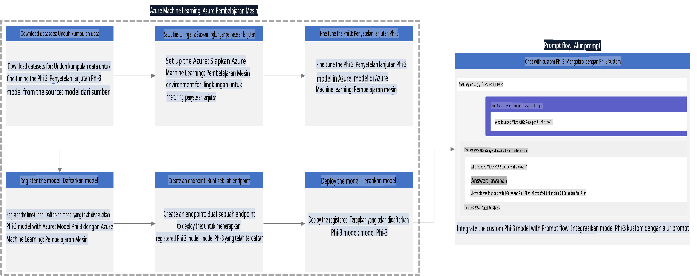
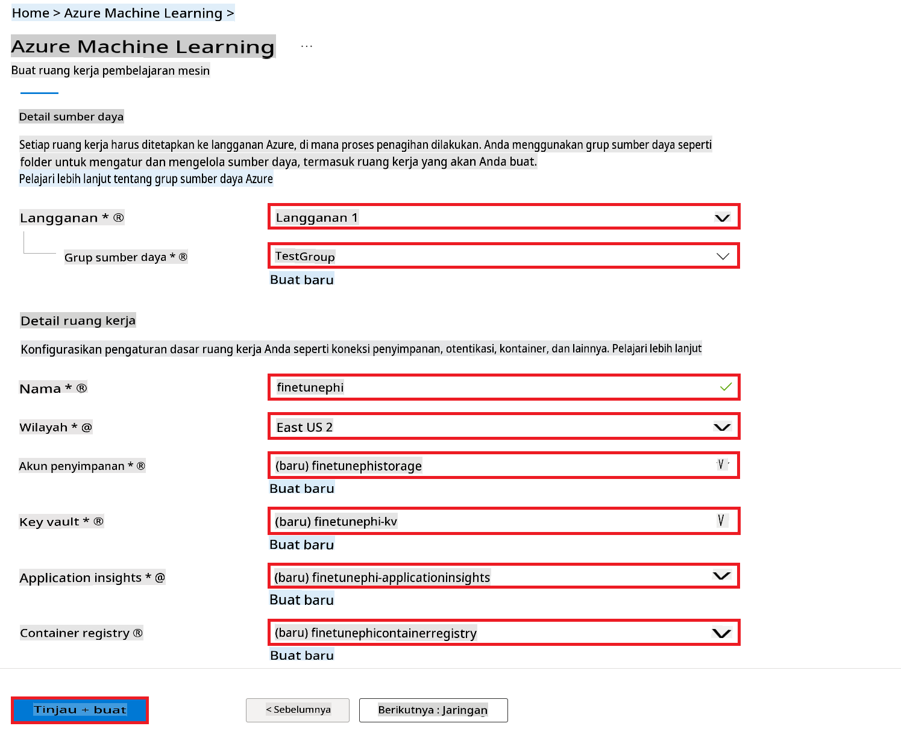
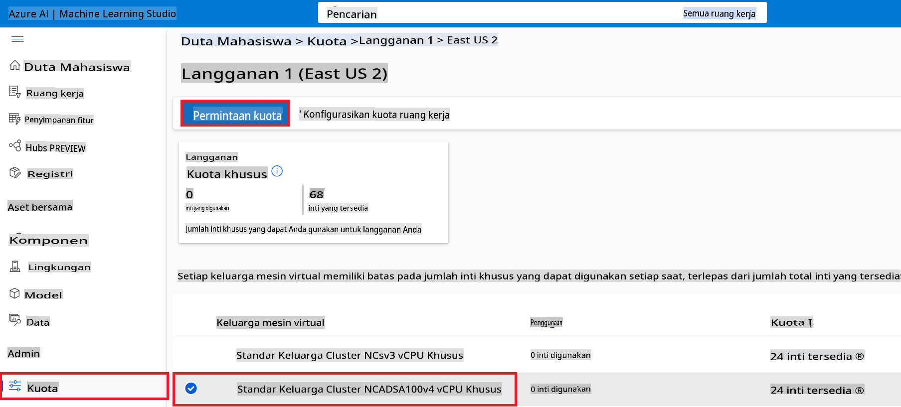
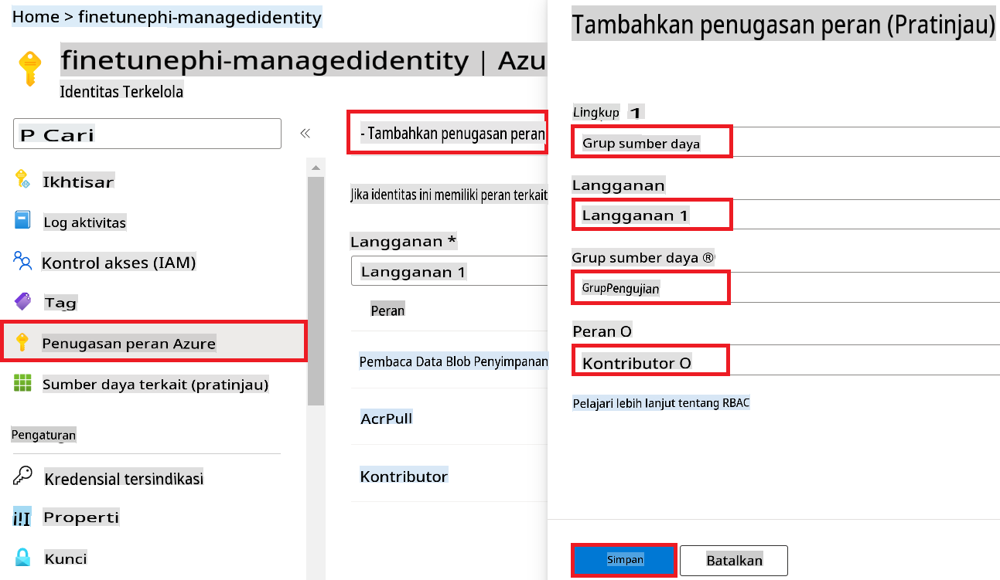
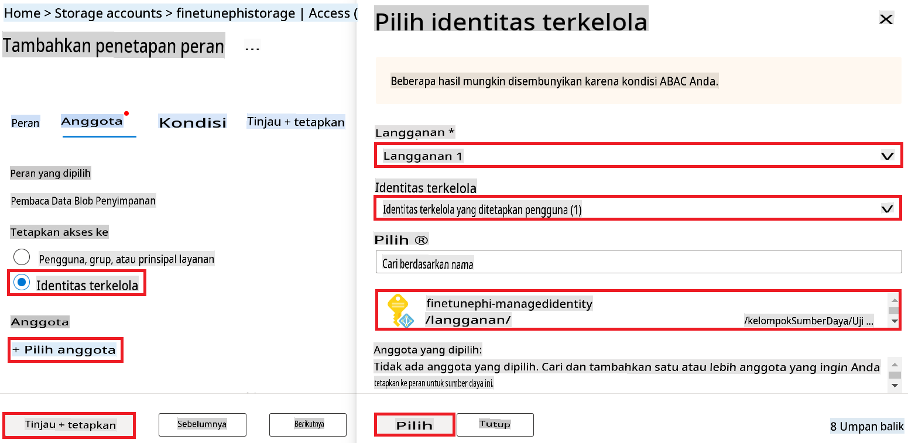
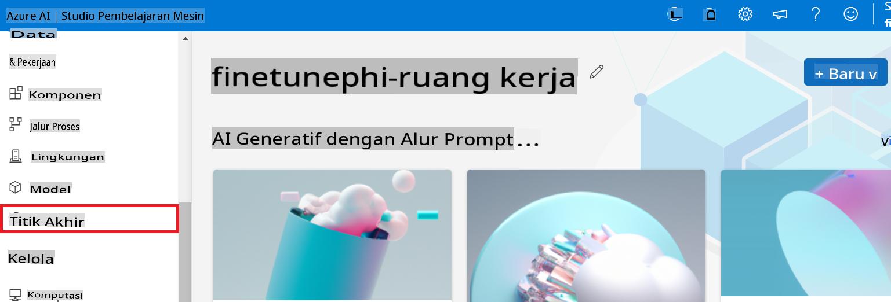
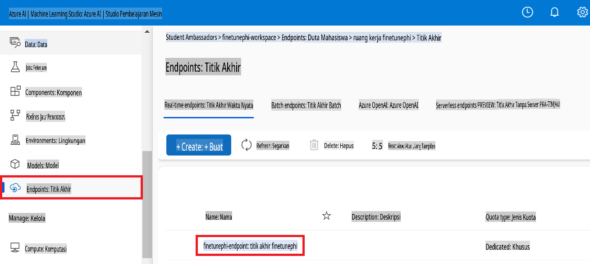
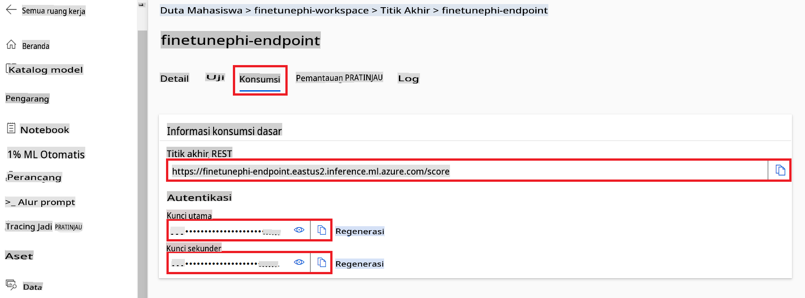
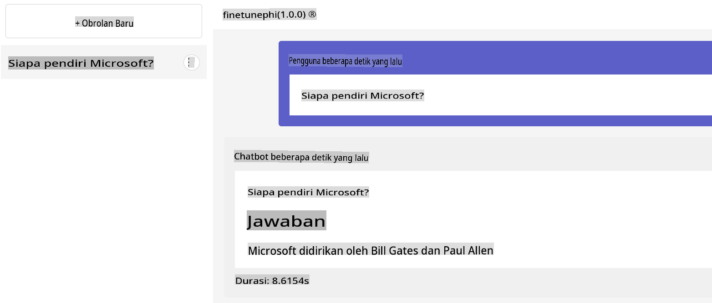

# Fine-tune dan Integrasi Model Phi-3 Kustom dengan Prompt flow

Contoh end-to-end (E2E) ini didasarkan pada panduan "[Fine-Tune and Integrate Custom Phi-3 Models with Prompt Flow: Step-by-Step Guide](https://techcommunity.microsoft.com/t5/educator-developer-blog/fine-tune-and-integrate-custom-phi-3-models-with-prompt-flow/ba-p/4178612?WT.mc_id=aiml-137032-kinfeylo)" dari Microsoft Tech Community. Panduan ini memperkenalkan proses penyempurnaan, penyebaran, dan integrasi model Phi-3 kustom dengan Prompt flow.

## Gambaran Umum

Dalam contoh E2E ini, Anda akan mempelajari cara menyempurnakan model Phi-3 dan mengintegrasikannya dengan Prompt flow. Dengan memanfaatkan Azure Machine Learning dan Prompt flow, Anda akan membangun alur kerja untuk menyebarkan dan menggunakan model AI kustom. Contoh E2E ini dibagi menjadi tiga skenario:

**Skenario 1: Menyiapkan sumber daya Azure dan Mempersiapkan penyempurnaan**

**Skenario 2: Menyempurnakan model Phi-3 dan Menyebarkan di Azure Machine Learning Studio**

**Skenario 3: Mengintegrasikan dengan Prompt flow dan Berinteraksi dengan model kustom Anda**

Berikut adalah gambaran umum dari contoh E2E ini.



### Daftar Isi

1. **[Skenario 1: Menyiapkan sumber daya Azure dan Mempersiapkan penyempurnaan](../../../../../../md/02.Application/01.TextAndChat/Phi3)**
    - [Membuat Azure Machine Learning Workspace](../../../../../../md/02.Application/01.TextAndChat/Phi3)
    - [Meminta kuota GPU dalam Langganan Azure](../../../../../../md/02.Application/01.TextAndChat/Phi3)
    - [Menambahkan penugasan peran](../../../../../../md/02.Application/01.TextAndChat/Phi3)
    - [Menyiapkan proyek](../../../../../../md/02.Application/01.TextAndChat/Phi3)
    - [Mempersiapkan dataset untuk penyempurnaan](../../../../../../md/02.Application/01.TextAndChat/Phi3)

1. **[Skenario 2: Menyempurnakan model Phi-3 dan Menyebarkan di Azure Machine Learning Studio](../../../../../../md/02.Application/01.TextAndChat/Phi3)**
    - [Menyiapkan Azure CLI](../../../../../../md/02.Application/01.TextAndChat/Phi3)
    - [Menyempurnakan model Phi-3](../../../../../../md/02.Application/01.TextAndChat/Phi3)
    - [Menyebarkan model yang telah disempurnakan](../../../../../../md/02.Application/01.TextAndChat/Phi3)

1. **[Skenario 3: Mengintegrasikan dengan Prompt flow dan Berinteraksi dengan model kustom Anda](../../../../../../md/02.Application/01.TextAndChat/Phi3)**
    - [Mengintegrasikan model Phi-3 kustom dengan Prompt flow](../../../../../../md/02.Application/01.TextAndChat/Phi3)
    - [Berinteraksi dengan model kustom Anda](../../../../../../md/02.Application/01.TextAndChat/Phi3)

## Skenario 1: Menyiapkan sumber daya Azure dan Mempersiapkan penyempurnaan

### Membuat Azure Machine Learning Workspace

1. Ketik *azure machine learning* di **bilah pencarian** di bagian atas halaman portal dan pilih **Azure Machine Learning** dari opsi yang muncul.

    

1. Pilih **+ Create** dari menu navigasi.

1. Pilih **New workspace** dari menu navigasi.

    

1. Lakukan tugas berikut:

    - Pilih **Subscription** Azure Anda.
    - Pilih **Resource group** yang akan digunakan (buat yang baru jika diperlukan).
    - Masukkan **Workspace Name**. Harus berupa nilai unik.
    - Pilih **Region** yang ingin Anda gunakan.
    - Pilih **Storage account** yang akan digunakan (buat yang baru jika diperlukan).
    - Pilih **Key vault** yang akan digunakan (buat yang baru jika diperlukan).
    - Pilih **Application insights** yang akan digunakan (buat yang baru jika diperlukan).
    - Pilih **Container registry** yang akan digunakan (buat yang baru jika diperlukan).

    

1. Pilih **Review + Create**.

1. Pilih **Create**.

### Meminta kuota GPU dalam Langganan Azure

Dalam contoh E2E ini, Anda akan menggunakan *Standard_NC24ads_A100_v4 GPU* untuk penyempurnaan, yang memerlukan permintaan kuota, dan *Standard_E4s_v3* CPU untuk penyebaran, yang tidak memerlukan permintaan kuota.

> [!NOTE]
>
> Hanya langganan Pay-As-You-Go (jenis langganan standar) yang memenuhi syarat untuk alokasi GPU; langganan manfaat saat ini tidak didukung.
>
> Bagi yang menggunakan langganan manfaat (seperti Visual Studio Enterprise Subscription) atau yang ingin menguji proses penyempurnaan dan penyebaran dengan cepat, tutorial ini juga memberikan panduan untuk menyempurnakan dengan dataset minimal menggunakan CPU. Namun, penting untuk dicatat bahwa hasil penyempurnaan jauh lebih baik saat menggunakan GPU dengan dataset yang lebih besar.

1. Kunjungi [Azure ML Studio](https://ml.azure.com/home?wt.mc_id=studentamb_279723).

1. Lakukan tugas berikut untuk meminta kuota *Standard NCADSA100v4 Family*:

    - Pilih **Quota** dari tab sisi kiri.
    - Pilih **Virtual machine family** yang akan digunakan. Misalnya, pilih **Standard NCADSA100v4 Family Cluster Dedicated vCPUs**, yang mencakup *Standard_NC24ads_A100_v4* GPU.
    - Pilih **Request quota** dari menu navigasi.

        

    - Di halaman Request quota, masukkan **New cores limit** yang ingin Anda gunakan. Misalnya, 24.
    - Di halaman Request quota, pilih **Submit** untuk meminta kuota GPU.

> [!NOTE]
> Anda dapat memilih GPU atau CPU yang sesuai dengan kebutuhan Anda dengan merujuk pada dokumen [Ukuran untuk Mesin Virtual di Azure](https://learn.microsoft.com/azure/virtual-machines/sizes/overview?tabs=breakdownseries%2Cgeneralsizelist%2Ccomputesizelist%2Cmemorysizelist%2Cstoragesizelist%2Cgpusizelist%2Cfpgasizelist%2Chpcsizelist).

### Menambahkan penugasan peran

Untuk menyempurnakan dan menyebarkan model Anda, Anda harus terlebih dahulu membuat User Assigned Managed Identity (UAI) dan memberinya izin yang sesuai. UAI ini akan digunakan untuk autentikasi selama penyebaran.

#### Membuat User Assigned Managed Identity (UAI)

1. Ketik *managed identities* di **bilah pencarian** di bagian atas halaman portal dan pilih **Managed Identities** dari opsi yang muncul.

    

1. Pilih **+ Create**.

    

1. Lakukan tugas berikut:

    - Pilih **Subscription** Azure Anda.
    - Pilih **Resource group** yang akan digunakan (buat yang baru jika diperlukan).
    - Pilih **Region** yang ingin Anda gunakan.
    - Masukkan **Name**. Harus berupa nilai unik.

1. Pilih **Review + create**.

1. Pilih **+ Create**.

#### Menambahkan penugasan peran Contributor ke Managed Identity

1. Arahkan ke sumber daya Managed Identity yang telah Anda buat.

1. Pilih **Azure role assignments** dari tab sisi kiri.

1. Pilih **+Add role assignment** dari menu navigasi.

1. Di halaman Add role assignment, lakukan tugas berikut:
    - Pilih **Scope** ke **Resource group**.
    - Pilih **Subscription** Azure Anda.
    - Pilih **Resource group** yang akan digunakan.
    - Pilih **Role** ke **Contributor**.

    

1. Pilih **Save**.

#### Menambahkan penugasan peran Storage Blob Data Reader ke Managed Identity

1. Ketik *storage accounts* di **bilah pencarian** di bagian atas halaman portal dan pilih **Storage accounts** dari opsi yang muncul.

    

1. Pilih akun penyimpanan yang terkait dengan Azure Machine Learning workspace yang telah Anda buat. Misalnya, *finetunephistorage*.

1. Lakukan tugas berikut untuk menuju halaman Add role assignment:

    - Navigasikan ke akun Azure Storage yang telah Anda buat.
    - Pilih **Access Control (IAM)** dari tab sisi kiri.
    - Pilih **+ Add** dari menu navigasi.
    - Pilih **Add role assignment** dari menu navigasi.

    

1. Di halaman Add role assignment, lakukan tugas berikut:

    - Di halaman Role, ketik *Storage Blob Data Reader* di **bilah pencarian** dan pilih **Storage Blob Data Reader** dari opsi yang muncul.
    - Di halaman Role, pilih **Next**.
    - Di halaman Members, pilih **Assign access to** **Managed identity**.
    - Di halaman Members, pilih **+ Select members**.
    - Di halaman Select managed identities, pilih **Subscription** Azure Anda.
    - Di halaman Select managed identities, pilih **Managed identity** ke **Manage Identity**.
    - Di halaman Select managed identities, pilih Managed Identity yang telah Anda buat. Misalnya, *finetunephi-managedidentity*.
    - Di halaman Select managed identities, pilih **Select**.

    

1. Pilih **Review + assign**.

#### Menambahkan penugasan peran AcrPull ke Managed Identity

1. Ketik *container registries* di **bilah pencarian** di bagian atas halaman portal dan pilih **Container registries** dari opsi yang muncul.

    

1. Pilih container registry yang terkait dengan Azure Machine Learning workspace. Misalnya, *finetunephicontainerregistries*.

1. Lakukan tugas berikut untuk menuju halaman Add role assignment:

    - Pilih **Access Control (IAM)** dari tab sisi kiri.
    - Pilih **+ Add** dari menu navigasi.
    - Pilih **Add role assignment** dari menu navigasi.

1. Di halaman Add role assignment, lakukan tugas berikut:

    - Di halaman Role, ketik *AcrPull* di **bilah pencarian** dan pilih **AcrPull** dari opsi yang muncul.
    - Di halaman Role, pilih **Next**.
    - Di halaman Members, pilih **Assign access to** **Managed identity**.
    - Di halaman Members, pilih **+ Select members**.
    - Di halaman Select managed identities, pilih **Subscription** Azure Anda.
    - Di halaman Select managed identities, pilih **Managed identity** ke **Manage Identity**.
    - Di halaman Select managed identities, pilih Managed Identity yang telah Anda buat. Misalnya, *finetunephi-managedidentity*.
    - Di halaman Select managed identities, pilih **Select**.
    - Pilih **Review + assign**.

### Menyiapkan proyek

Sekarang, Anda akan membuat folder untuk bekerja di dalamnya dan menyiapkan lingkungan virtual untuk mengembangkan program yang berinteraksi dengan pengguna dan menggunakan riwayat obrolan yang tersimpan dari Azure Cosmos DB untuk memberikan respons.

#### Membuat folder untuk bekerja di dalamnya

1. Buka jendela terminal dan ketik perintah berikut untuk membuat folder bernama *finetune-phi* di jalur default.

    ```console
    mkdir finetune-phi
    ```

1. Ketik perintah berikut di terminal Anda untuk masuk ke folder *finetune-phi* yang telah Anda buat.

    ```console
    cd finetune-phi
    ```

#### Membuat lingkungan virtual

1. Ketik perintah berikut di terminal Anda untuk membuat lingkungan virtual bernama *.venv*.

    ```console
    python -m venv .venv
    ```

1. Ketik perintah berikut di terminal Anda untuk mengaktifkan lingkungan virtual.

    ```console
    .venv\Scripts\activate.bat
    ```

> [!NOTE]
>
> Jika berhasil, Anda akan melihat *(.venv)* sebelum prompt perintah.

#### Menginstal paket yang diperlukan

1. Ketik perintah berikut di terminal Anda untuk menginstal paket yang diperlukan.

    ```console
    pip install datasets==2.19.1
    pip install transformers==4.41.1
    pip install azure-ai-ml==1.16.0
    pip install torch==2.3.1
    pip install trl==0.9.4
    pip install promptflow==1.12.0
    ```

#### Membuat file proyek

Dalam latihan ini, Anda akan membuat file-file penting untuk proyek kita. File-file ini mencakup skrip untuk mengunduh dataset, menyiapkan lingkungan Azure Machine Learning, menyempurnakan model Phi-3, dan menyebarkan model yang telah disempurnakan. Anda juga akan membuat file *conda.yml* untuk menyiapkan lingkungan penyempurnaan.

Dalam latihan ini, Anda akan:

- Membuat file *download_dataset.py* untuk mengunduh dataset.
- Membuat file *setup_ml.py* untuk menyiapkan lingkungan Azure Machine Learning.
- Membuat file *fine_tune.py* di folder *finetuning_dir* untuk menyempurnakan model Phi-3 menggunakan dataset.
- Membuat file *conda.yml* untuk menyiapkan lingkungan penyempurnaan.
- Membuat file *deploy_model.py* untuk menyebarkan model yang telah disempurnakan.
- Membuat file *integrate_with_promptflow.py* untuk mengintegrasikan model yang telah disempurnakan dan menjalankan model menggunakan Prompt flow.
- Membuat file *flow.dag.yml* untuk mengatur struktur alur kerja untuk Prompt flow.
- Membuat file *config.py* untuk memasukkan informasi Azure.

> [!NOTE]
>
> Struktur folder lengkap:
>
> ```text
> └── YourUserName
> .    └── finetune-phi
> .        ├── finetuning_dir
> .        │      └── fine_tune.py
> .        ├── conda.yml
> .        ├── config.py
> .        ├── deploy_model.py
> .        ├── download_dataset.py
> .        ├── flow.dag.yml
> .        ├── integrate_with_promptflow.py
> .        └── setup_ml.py
> ```

1. Buka **Visual Studio Code**.

1. Pilih **File** dari bilah menu.

1. Pilih **Open Folder**.

1. Pilih folder *finetune-phi* yang telah Anda buat, yang terletak di *C:\Users\yourUserName\finetune-phi*.

    

1. Di panel kiri Visual Studio Code, klik kanan dan pilih **New File** untuk membuat file baru bernama *download_dataset.py*.

1. Di panel kiri Visual Studio Code, klik kanan dan pilih **New File** untuk membuat file baru bernama *setup_ml.py*.

1. Di panel kiri Visual Studio Code, klik kanan dan pilih **New File** untuk membuat file baru bernama *deploy_model.py*.

    

1. Di panel kiri Visual Studio Code, klik kanan dan pilih **New Folder** untuk membuat folder baru bernama *finetuning_dir*.

1. Di folder *finetuning_dir*, buat file baru bernama *fine_tune.py*.

#### Membuat dan Mengonfigurasi file *conda.yml*

1. Di panel kiri Visual Studio Code, klik kanan dan pilih **New File** untuk membuat file baru bernama *conda.yml*.

1. Tambahkan kode berikut ke file *conda.yml* untuk menyiapkan lingkungan penyempurnaan untuk model Phi-3.

    ```yml
    name: phi-3-training-env
    channels:
      - defaults
      - conda-forge
    dependencies:
      - python=3.10
      - pip
      - numpy<2.0
      - pip:
          - torch==2.4.0
          - torchvision==0.19.0
          - trl==0.8.6
          - transformers==4.41
          - datasets==2.21.0
          - azureml-core==1.57.0
          - azure-storage-blob==12.19.0
          - azure-ai-ml==1.16
          - azure-identity==1.17.1
          - accelerate==0.33.0
          - mlflow==2.15.1
          - azureml-mlflow==1.57.0
    ```

#### Membuat dan Mengonfigurasi file *config.py*

1. Di panel kiri Visual Studio Code, klik kanan dan pilih **New File** untuk membuat file baru bernama *config.py*.

1. Tambahkan kode berikut ke file *config.py* untuk memasukkan informasi Azure Anda.

    ```python
    # Azure settings
    AZURE_SUBSCRIPTION_ID = "your_subscription_id"
    AZURE_RESOURCE_GROUP_NAME = "your_resource_group_name" # "TestGroup"

    # Azure Machine Learning settings
    AZURE_ML_WORKSPACE_NAME = "your_workspace_name" # "finetunephi-workspace"

    # Azure Managed Identity settings
    AZURE_MANAGED_IDENTITY_CLIENT_ID = "your_azure_managed_identity_client_id"
    AZURE_MANAGED_IDENTITY_NAME = "your_azure_managed_identity_name" # "finetunephi-mangedidentity"
    AZURE_MANAGED_IDENTITY_RESOURCE_ID = f"/subscriptions/{AZURE_SUBSCRIPTION_ID}/resourceGroups/{AZURE_RESOURCE_GROUP_NAME}/providers/Microsoft.ManagedIdentity/userAssignedIdentities/{AZURE_MANAGED_IDENTITY_NAME}"

    # Dataset file paths
    TRAIN_DATA_PATH = "data/train_data.jsonl"
    TEST_DATA_PATH = "data/test_data.jsonl"

    # Fine-tuned model settings
    AZURE_MODEL_NAME = "your_fine_tuned_model_name" # "finetune-phi-model"
    AZURE_ENDPOINT_NAME = "your_fine_tuned_model_endpoint_name" # "finetune-phi-endpoint"
    AZURE_DEPLOYMENT_NAME = "your_fine_tuned_model_deployment_name" # "finetune-phi-deployment"

    AZURE_ML_API_KEY = "your_fine_tuned_model_api_key"
    AZURE_ML_ENDPOINT = "your_fine_tuned_model_endpoint_uri" # "https://{your-endpoint-name}.{your-region}.inference.ml.azure.com/score"
    ```

#### Menambahkan variabel lingkungan Azure

1. Lakukan tugas berikut untuk menambahkan Subscription ID Azure:

    - Ketik *subscriptions* di **bilah pencarian** di bagian atas halaman portal dan pilih **Subscriptions** dari opsi yang muncul.
    - Pilih Subscription Azure yang sedang Anda gunakan.
    - Salin dan tempel Subscription ID Anda ke file *config.py*.


1. Lakukan langkah-langkah berikut untuk menambahkan Nama Azure Workspace:

    - Akses sumber daya Azure Machine Learning yang telah Anda buat.
    - Salin dan tempel nama akun Anda ke dalam file *config.py*.

    

1. Lakukan langkah-langkah berikut untuk menambahkan Nama Azure Resource Group:

    - Akses sumber daya Azure Machine Learning yang telah Anda buat.
    - Salin dan tempel Nama Azure Resource Group Anda ke dalam file *config.py*.

    

2. Lakukan langkah-langkah berikut untuk menambahkan nama Azure Managed Identity:

    - Akses sumber daya Managed Identities yang telah Anda buat.
    - Salin dan tempel nama Azure Managed Identity Anda ke dalam file *config.py*.

    

### Siapkan dataset untuk fine-tuning

Dalam latihan ini, Anda akan menjalankan file *download_dataset.py* untuk mengunduh dataset *ULTRACHAT_200k* ke lingkungan lokal Anda. Anda kemudian akan menggunakan dataset ini untuk melakukan fine-tuning pada model Phi-3 di Azure Machine Learning.

#### Unduh dataset Anda menggunakan *download_dataset.py*

1. Buka file *download_dataset.py* di Visual Studio Code.

1. Tambahkan kode berikut ke dalam *download_dataset.py*.

    ```python
    import json
    import os
    from datasets import load_dataset
    from config import (
        TRAIN_DATA_PATH,
        TEST_DATA_PATH)

    def load_and_split_dataset(dataset_name, config_name, split_ratio):
        """
        Load and split a dataset.
        """
        # Load the dataset with the specified name, configuration, and split ratio
        dataset = load_dataset(dataset_name, config_name, split=split_ratio)
        print(f"Original dataset size: {len(dataset)}")
        
        # Split the dataset into train and test sets (80% train, 20% test)
        split_dataset = dataset.train_test_split(test_size=0.2)
        print(f"Train dataset size: {len(split_dataset['train'])}")
        print(f"Test dataset size: {len(split_dataset['test'])}")
        
        return split_dataset

    def save_dataset_to_jsonl(dataset, filepath):
        """
        Save a dataset to a JSONL file.
        """
        # Create the directory if it does not exist
        os.makedirs(os.path.dirname(filepath), exist_ok=True)
        
        # Open the file in write mode
        with open(filepath, 'w', encoding='utf-8') as f:
            # Iterate over each record in the dataset
            for record in dataset:
                # Dump the record as a JSON object and write it to the file
                json.dump(record, f)
                # Write a newline character to separate records
                f.write('\n')
        
        print(f"Dataset saved to {filepath}")

    def main():
        """
        Main function to load, split, and save the dataset.
        """
        # Load and split the ULTRACHAT_200k dataset with a specific configuration and split ratio
        dataset = load_and_split_dataset("HuggingFaceH4/ultrachat_200k", 'default', 'train_sft[:1%]')
        
        # Extract the train and test datasets from the split
        train_dataset = dataset['train']
        test_dataset = dataset['test']

        # Save the train dataset to a JSONL file
        save_dataset_to_jsonl(train_dataset, TRAIN_DATA_PATH)
        
        # Save the test dataset to a separate JSONL file
        save_dataset_to_jsonl(test_dataset, TEST_DATA_PATH)

    if __name__ == "__main__":
        main()

    ```

> [!TIP]
>
> **Panduan untuk fine-tuning dengan dataset minimal menggunakan CPU**
>
> Jika Anda ingin menggunakan CPU untuk fine-tuning, pendekatan ini ideal bagi mereka dengan langganan manfaat (seperti Visual Studio Enterprise Subscription) atau untuk menguji proses fine-tuning dan deployment dengan cepat.
>
> Ganti `dataset = load_and_split_dataset("HuggingFaceH4/ultrachat_200k", 'default', 'train_sft[:1%]')` with `dataset = load_and_split_dataset("HuggingFaceH4/ultrachat_200k", 'default', 'train_sft[:10]')`
>

1. Ketik perintah berikut di terminal Anda untuk menjalankan skrip dan mengunduh dataset ke lingkungan lokal Anda.

    ```console
    python download_data.py
    ```

1. Verifikasi bahwa dataset telah berhasil disimpan di direktori lokal *finetune-phi/data* Anda.

> [!NOTE]
>
> **Ukuran dataset dan waktu fine-tuning**
>
> Dalam contoh E2E ini, Anda hanya menggunakan 1% dari dataset (`train_sft[:1%]`). Ini secara signifikan mengurangi jumlah data, mempercepat proses upload dan fine-tuning. Anda dapat menyesuaikan persentase untuk menemukan keseimbangan yang tepat antara waktu pelatihan dan performa model. Menggunakan subset dataset yang lebih kecil mengurangi waktu yang diperlukan untuk fine-tuning, sehingga proses lebih mudah dikelola untuk contoh E2E.

## Skenario 2: Fine-tune model Phi-3 dan Deploy di Azure Machine Learning Studio

### Siapkan Azure CLI

Anda perlu menyiapkan Azure CLI untuk mengautentikasi lingkungan Anda. Azure CLI memungkinkan Anda mengelola sumber daya Azure langsung dari command line dan menyediakan kredensial yang diperlukan untuk Azure Machine Learning mengakses sumber daya ini. Untuk memulai, instal [Azure CLI](https://learn.microsoft.com/cli/azure/install-azure-cli).

1. Buka jendela terminal dan ketik perintah berikut untuk masuk ke akun Azure Anda.

    ```console
    az login
    ```

1. Pilih akun Azure yang ingin Anda gunakan.

1. Pilih langganan Azure yang ingin Anda gunakan.

    

> [!TIP]
>
> Jika Anda mengalami kesulitan masuk ke Azure, coba gunakan kode perangkat. Buka jendela terminal dan ketik perintah berikut untuk masuk ke akun Azure Anda:
>
> ```console
> az login --use-device-code
> ```
>

### Fine-tune model Phi-3

Dalam latihan ini, Anda akan melakukan fine-tuning pada model Phi-3 menggunakan dataset yang disediakan. Pertama, Anda akan mendefinisikan proses fine-tuning di file *fine_tune.py*. Kemudian, Anda akan mengonfigurasi lingkungan Azure Machine Learning dan memulai proses fine-tuning dengan menjalankan file *setup_ml.py*. Skrip ini memastikan bahwa fine-tuning dilakukan di lingkungan Azure Machine Learning.

Dengan menjalankan *setup_ml.py*, Anda akan menjalankan proses fine-tuning di lingkungan Azure Machine Learning.

#### Tambahkan kode ke file *fine_tune.py*

1. Masuk ke folder *finetuning_dir* dan buka file *fine_tune.py* di Visual Studio Code.

1. Tambahkan kode berikut ke dalam *fine_tune.py*.

    ```python
    import argparse
    import sys
    import logging
    import os
    from datasets import load_dataset
    import torch
    import mlflow
    from transformers import AutoModelForCausalLM, AutoTokenizer, TrainingArguments
    from trl import SFTTrainer

    # To avoid the INVALID_PARAMETER_VALUE error in MLflow, disable MLflow integration
    os.environ["DISABLE_MLFLOW_INTEGRATION"] = "True"

    # Logging setup
    logging.basicConfig(
        format="%(asctime)s - %(levelname)s - %(name)s - %(message)s",
        datefmt="%Y-%m-%d %H:%M:%S",
        handlers=[logging.StreamHandler(sys.stdout)],
        level=logging.WARNING
    )
    logger = logging.getLogger(__name__)

    def initialize_model_and_tokenizer(model_name, model_kwargs):
        """
        Initialize the model and tokenizer with the given pretrained model name and arguments.
        """
        model = AutoModelForCausalLM.from_pretrained(model_name, **model_kwargs)
        tokenizer = AutoTokenizer.from_pretrained(model_name)
        tokenizer.model_max_length = 2048
        tokenizer.pad_token = tokenizer.unk_token
        tokenizer.pad_token_id = tokenizer.convert_tokens_to_ids(tokenizer.pad_token)
        tokenizer.padding_side = 'right'
        return model, tokenizer

    def apply_chat_template(example, tokenizer):
        """
        Apply a chat template to tokenize messages in the example.
        """
        messages = example["messages"]
        if messages[0]["role"] != "system":
            messages.insert(0, {"role": "system", "content": ""})
        example["text"] = tokenizer.apply_chat_template(
            messages, tokenize=False, add_generation_prompt=False
        )
        return example

    def load_and_preprocess_data(train_filepath, test_filepath, tokenizer):
        """
        Load and preprocess the dataset.
        """
        train_dataset = load_dataset('json', data_files=train_filepath, split='train')
        test_dataset = load_dataset('json', data_files=test_filepath, split='train')
        column_names = list(train_dataset.features)

        train_dataset = train_dataset.map(
            apply_chat_template,
            fn_kwargs={"tokenizer": tokenizer},
            num_proc=10,
            remove_columns=column_names,
            desc="Applying chat template to train dataset",
        )

        test_dataset = test_dataset.map(
            apply_chat_template,
            fn_kwargs={"tokenizer": tokenizer},
            num_proc=10,
            remove_columns=column_names,
            desc="Applying chat template to test dataset",
        )

        return train_dataset, test_dataset

    def train_and_evaluate_model(train_dataset, test_dataset, model, tokenizer, output_dir):
        """
        Train and evaluate the model.
        """
        training_args = TrainingArguments(
            bf16=True,
            do_eval=True,
            output_dir=output_dir,
            eval_strategy="epoch",
            learning_rate=5.0e-06,
            logging_steps=20,
            lr_scheduler_type="cosine",
            num_train_epochs=3,
            overwrite_output_dir=True,
            per_device_eval_batch_size=4,
            per_device_train_batch_size=4,
            remove_unused_columns=True,
            save_steps=500,
            seed=0,
            gradient_checkpointing=True,
            gradient_accumulation_steps=1,
            warmup_ratio=0.2,
        )

        trainer = SFTTrainer(
            model=model,
            args=training_args,
            train_dataset=train_dataset,
            eval_dataset=test_dataset,
            max_seq_length=2048,
            dataset_text_field="text",
            tokenizer=tokenizer,
            packing=True
        )

        train_result = trainer.train()
        trainer.log_metrics("train", train_result.metrics)

        mlflow.transformers.log_model(
            transformers_model={"model": trainer.model, "tokenizer": tokenizer},
            artifact_path=output_dir,
        )

        tokenizer.padding_side = 'left'
        eval_metrics = trainer.evaluate()
        eval_metrics["eval_samples"] = len(test_dataset)
        trainer.log_metrics("eval", eval_metrics)

    def main(train_file, eval_file, model_output_dir):
        """
        Main function to fine-tune the model.
        """
        model_kwargs = {
            "use_cache": False,
            "trust_remote_code": True,
            "torch_dtype": torch.bfloat16,
            "device_map": None,
            "attn_implementation": "eager"
        }

        # pretrained_model_name = "microsoft/Phi-3-mini-4k-instruct"
        pretrained_model_name = "microsoft/Phi-3.5-mini-instruct"

        with mlflow.start_run():
            model, tokenizer = initialize_model_and_tokenizer(pretrained_model_name, model_kwargs)
            train_dataset, test_dataset = load_and_preprocess_data(train_file, eval_file, tokenizer)
            train_and_evaluate_model(train_dataset, test_dataset, model, tokenizer, model_output_dir)

    if __name__ == "__main__":
        parser = argparse.ArgumentParser()
        parser.add_argument("--train-file", type=str, required=True, help="Path to the training data")
        parser.add_argument("--eval-file", type=str, required=True, help="Path to the evaluation data")
        parser.add_argument("--model_output_dir", type=str, required=True, help="Directory to save the fine-tuned model")
        args = parser.parse_args()
        main(args.train_file, args.eval_file, args.model_output_dir)

    ```

1. Simpan dan tutup file *fine_tune.py*.

> [!TIP]
> **Anda dapat melakukan fine-tuning pada model Phi-3.5**
>
> Di file *fine_tune.py*, Anda dapat mengubah field `pretrained_model_name` from `"microsoft/Phi-3-mini-4k-instruct"` to any model you want to fine-tune. For example, if you change it to `"microsoft/Phi-3.5-mini-instruct"`, you'll be using the Phi-3.5-mini-instruct model for fine-tuning. To find and use the model name you prefer, visit [Hugging Face](https://huggingface.co/), search for the model you're interested in, and then copy and paste its name into the `pretrained_model_name` dalam skrip Anda.
>
> :::image type="content" source="../../imgs/03/FineTuning-PromptFlow/finetunephi3.5.png" alt-text="Fine tune Phi-3.5.":::
>

#### Tambahkan kode ke file *setup_ml.py*

1. Buka file *setup_ml.py* di Visual Studio Code.

1. Tambahkan kode berikut ke dalam *setup_ml.py*.

    ```python
    import logging
    from azure.ai.ml import MLClient, command, Input
    from azure.ai.ml.entities import Environment, AmlCompute
    from azure.identity import AzureCliCredential
    from config import (
        AZURE_SUBSCRIPTION_ID,
        AZURE_RESOURCE_GROUP_NAME,
        AZURE_ML_WORKSPACE_NAME,
        TRAIN_DATA_PATH,
        TEST_DATA_PATH
    )

    # Constants

    # Uncomment the following lines to use a CPU instance for training
    # COMPUTE_INSTANCE_TYPE = "Standard_E16s_v3" # cpu
    # COMPUTE_NAME = "cpu-e16s-v3"
    # DOCKER_IMAGE_NAME = "mcr.microsoft.com/azureml/openmpi4.1.0-ubuntu20.04:latest"

    # Uncomment the following lines to use a GPU instance for training
    COMPUTE_INSTANCE_TYPE = "Standard_NC24ads_A100_v4"
    COMPUTE_NAME = "gpu-nc24s-a100-v4"
    DOCKER_IMAGE_NAME = "mcr.microsoft.com/azureml/curated/acft-hf-nlp-gpu:59"

    CONDA_FILE = "conda.yml"
    LOCATION = "eastus2" # Replace with the location of your compute cluster
    FINETUNING_DIR = "./finetuning_dir" # Path to the fine-tuning script
    TRAINING_ENV_NAME = "phi-3-training-environment" # Name of the training environment
    MODEL_OUTPUT_DIR = "./model_output" # Path to the model output directory in azure ml

    # Logging setup to track the process
    logger = logging.getLogger(__name__)
    logging.basicConfig(
        format="%(asctime)s - %(levelname)s - %(name)s - %(message)s",
        datefmt="%Y-%m-%d %H:%M:%S",
        level=logging.WARNING
    )

    def get_ml_client():
        """
        Initialize the ML Client using Azure CLI credentials.
        """
        credential = AzureCliCredential()
        return MLClient(credential, AZURE_SUBSCRIPTION_ID, AZURE_RESOURCE_GROUP_NAME, AZURE_ML_WORKSPACE_NAME)

    def create_or_get_environment(ml_client):
        """
        Create or update the training environment in Azure ML.
        """
        env = Environment(
            image=DOCKER_IMAGE_NAME,  # Docker image for the environment
            conda_file=CONDA_FILE,  # Conda environment file
            name=TRAINING_ENV_NAME,  # Name of the environment
        )
        return ml_client.environments.create_or_update(env)

    def create_or_get_compute_cluster(ml_client, compute_name, COMPUTE_INSTANCE_TYPE, location):
        """
        Create or update the compute cluster in Azure ML.
        """
        try:
            compute_cluster = ml_client.compute.get(compute_name)
            logger.info(f"Compute cluster '{compute_name}' already exists. Reusing it for the current run.")
        except Exception:
            logger.info(f"Compute cluster '{compute_name}' does not exist. Creating a new one with size {COMPUTE_INSTANCE_TYPE}.")
            compute_cluster = AmlCompute(
                name=compute_name,
                size=COMPUTE_INSTANCE_TYPE,
                location=location,
                tier="Dedicated",  # Tier of the compute cluster
                min_instances=0,  # Minimum number of instances
                max_instances=1  # Maximum number of instances
            )
            ml_client.compute.begin_create_or_update(compute_cluster).wait()  # Wait for the cluster to be created
        return compute_cluster

    def create_fine_tuning_job(env, compute_name):
        """
        Set up the fine-tuning job in Azure ML.
        """
        return command(
            code=FINETUNING_DIR,  # Path to fine_tune.py
            command=(
                "python fine_tune.py "
                "--train-file ${{inputs.train_file}} "
                "--eval-file ${{inputs.eval_file}} "
                "--model_output_dir ${{inputs.model_output}}"
            ),
            environment=env,  # Training environment
            compute=compute_name,  # Compute cluster to use
            inputs={
                "train_file": Input(type="uri_file", path=TRAIN_DATA_PATH),  # Path to the training data file
                "eval_file": Input(type="uri_file", path=TEST_DATA_PATH),  # Path to the evaluation data file
                "model_output": MODEL_OUTPUT_DIR
            }
        )

    def main():
        """
        Main function to set up and run the fine-tuning job in Azure ML.
        """
        # Initialize ML Client
        ml_client = get_ml_client()

        # Create Environment
        env = create_or_get_environment(ml_client)
        
        # Create or get existing compute cluster
        create_or_get_compute_cluster(ml_client, COMPUTE_NAME, COMPUTE_INSTANCE_TYPE, LOCATION)

        # Create and Submit Fine-Tuning Job
        job = create_fine_tuning_job(env, COMPUTE_NAME)
        returned_job = ml_client.jobs.create_or_update(job)  # Submit the job
        ml_client.jobs.stream(returned_job.name)  # Stream the job logs
        
        # Capture the job name
        job_name = returned_job.name
        print(f"Job name: {job_name}")

    if __name__ == "__main__":
        main()

    ```

1. Ganti `COMPUTE_INSTANCE_TYPE`, `COMPUTE_NAME`, and `LOCATION` dengan detail spesifik Anda.

    ```python
   # Uncomment the following lines to use a GPU instance for training
    COMPUTE_INSTANCE_TYPE = "Standard_NC24ads_A100_v4"
    COMPUTE_NAME = "gpu-nc24s-a100-v4"
    ...
    LOCATION = "eastus2" # Replace with the location of your compute cluster
    ```

> [!TIP]
>
> **Panduan untuk fine-tuning dengan dataset minimal menggunakan CPU**
>
> Jika Anda ingin menggunakan CPU untuk fine-tuning, pendekatan ini ideal bagi mereka dengan langganan manfaat (seperti Visual Studio Enterprise Subscription) atau untuk menguji proses fine-tuning dan deployment dengan cepat.
>
> 1. Buka file *setup_ml*.
> 1. Ganti `COMPUTE_INSTANCE_TYPE`, `COMPUTE_NAME`, and `DOCKER_IMAGE_NAME` with the following. If you do not have access to *Standard_E16s_v3*, you can use an equivalent CPU instance or request a new quota.
> 1. Replace `LOCATION` dengan detail spesifik Anda.
>
>    ```python
>    # Uncomment the following lines to use a CPU instance for training
>    COMPUTE_INSTANCE_TYPE = "Standard_E16s_v3" # cpu
>    COMPUTE_NAME = "cpu-e16s-v3"
>    DOCKER_IMAGE_NAME = "mcr.microsoft.com/azureml/openmpi4.1.0-ubuntu20.04:latest"
>    LOCATION = "eastus2" # Replace with the location of your compute cluster
>    ```
>

1. Ketik perintah berikut untuk menjalankan skrip *setup_ml.py* dan memulai proses fine-tuning di Azure Machine Learning.

    ```python
    python setup_ml.py
    ```

1. Dalam latihan ini, Anda berhasil melakukan fine-tuning pada model Phi-3 menggunakan Azure Machine Learning. Dengan menjalankan skrip *setup_ml.py*, Anda telah menyiapkan lingkungan Azure Machine Learning dan memulai proses fine-tuning yang didefinisikan di file *fine_tune.py*. Harap diperhatikan bahwa proses fine-tuning dapat memakan waktu yang cukup lama. Setelah menjalankan `python setup_ml.py` command, you need to wait for the process to complete. You can monitor the status of the fine-tuning job by following the link provided in the terminal to the Azure Machine Learning portal.

    

### Deploy the fine-tuned model

To integrate the fine-tuned Phi-3 model with Prompt Flow, you need to deploy the model to make it accessible for real-time inference. This process involves registering the model, creating an online endpoint, and deploying the model.

#### Set the model name, endpoint name, and deployment name for deployment

1. Open *config.py* file.

1. Replace `AZURE_MODEL_NAME = "your_fine_tuned_model_name"` with the desired name for your model.

1. Replace `AZURE_ENDPOINT_NAME = "your_fine_tuned_model_endpoint_name"` with the desired name for your endpoint.

1. Replace `AZURE_DEPLOYMENT_NAME = "your_fine_tuned_model_deployment_name"` dengan nama yang diinginkan untuk deployment Anda.

#### Tambahkan kode ke file *deploy_model.py*

Menjalankan file *deploy_model.py* mengotomatisasi seluruh proses deployment. Skrip ini akan mendaftarkan model, membuat endpoint, dan menjalankan deployment berdasarkan pengaturan yang ditentukan di file config.py, termasuk nama model, nama endpoint, dan nama deployment.

1. Buka file *deploy_model.py* di Visual Studio Code.

1. Tambahkan kode berikut ke dalam *deploy_model.py*.

    ```python
    import logging
    from azure.identity import AzureCliCredential
    from azure.ai.ml import MLClient
    from azure.ai.ml.entities import Model, ProbeSettings, ManagedOnlineEndpoint, ManagedOnlineDeployment, IdentityConfiguration, ManagedIdentityConfiguration, OnlineRequestSettings
    from azure.ai.ml.constants import AssetTypes

    # Configuration imports
    from config import (
        AZURE_SUBSCRIPTION_ID,
        AZURE_RESOURCE_GROUP_NAME,
        AZURE_ML_WORKSPACE_NAME,
        AZURE_MANAGED_IDENTITY_RESOURCE_ID,
        AZURE_MANAGED_IDENTITY_CLIENT_ID,
        AZURE_MODEL_NAME,
        AZURE_ENDPOINT_NAME,
        AZURE_DEPLOYMENT_NAME
    )

    # Constants
    JOB_NAME = "your-job-name"
    COMPUTE_INSTANCE_TYPE = "Standard_E4s_v3"

    deployment_env_vars = {
        "SUBSCRIPTION_ID": AZURE_SUBSCRIPTION_ID,
        "RESOURCE_GROUP_NAME": AZURE_RESOURCE_GROUP_NAME,
        "UAI_CLIENT_ID": AZURE_MANAGED_IDENTITY_CLIENT_ID,
    }

    # Logging setup
    logging.basicConfig(
        format="%(asctime)s - %(levelname)s - %(name)s - %(message)s",
        datefmt="%Y-%m-%d %H:%M:%S",
        level=logging.DEBUG
    )
    logger = logging.getLogger(__name__)

    def get_ml_client():
        """Initialize and return the ML Client."""
        credential = AzureCliCredential()
        return MLClient(credential, AZURE_SUBSCRIPTION_ID, AZURE_RESOURCE_GROUP_NAME, AZURE_ML_WORKSPACE_NAME)

    def register_model(ml_client, model_name, job_name):
        """Register a new model."""
        model_path = f"azureml://jobs/{job_name}/outputs/artifacts/paths/model_output"
        logger.info(f"Registering model {model_name} from job {job_name} at path {model_path}.")
        run_model = Model(
            path=model_path,
            name=model_name,
            description="Model created from run.",
            type=AssetTypes.MLFLOW_MODEL,
        )
        model = ml_client.models.create_or_update(run_model)
        logger.info(f"Registered model ID: {model.id}")
        return model

    def delete_existing_endpoint(ml_client, endpoint_name):
        """Delete existing endpoint if it exists."""
        try:
            endpoint_result = ml_client.online_endpoints.get(name=endpoint_name)
            logger.info(f"Deleting existing endpoint {endpoint_name}.")
            ml_client.online_endpoints.begin_delete(name=endpoint_name).result()
            logger.info(f"Deleted existing endpoint {endpoint_name}.")
        except Exception as e:
            logger.info(f"No existing endpoint {endpoint_name} found to delete: {e}")

    def create_or_update_endpoint(ml_client, endpoint_name, description=""):
        """Create or update an endpoint."""
        delete_existing_endpoint(ml_client, endpoint_name)
        logger.info(f"Creating new endpoint {endpoint_name}.")
        endpoint = ManagedOnlineEndpoint(
            name=endpoint_name,
            description=description,
            identity=IdentityConfiguration(
                type="user_assigned",
                user_assigned_identities=[ManagedIdentityConfiguration(resource_id=AZURE_MANAGED_IDENTITY_RESOURCE_ID)]
            )
        )
        endpoint_result = ml_client.online_endpoints.begin_create_or_update(endpoint).result()
        logger.info(f"Created new endpoint {endpoint_name}.")
        return endpoint_result

    def create_or_update_deployment(ml_client, endpoint_name, deployment_name, model):
        """Create or update a deployment."""

        logger.info(f"Creating deployment {deployment_name} for endpoint {endpoint_name}.")
        deployment = ManagedOnlineDeployment(
            name=deployment_name,
            endpoint_name=endpoint_name,
            model=model.id,
            instance_type=COMPUTE_INSTANCE_TYPE,
            instance_count=1,
            environment_variables=deployment_env_vars,
            request_settings=OnlineRequestSettings(
                max_concurrent_requests_per_instance=3,
                request_timeout_ms=180000,
                max_queue_wait_ms=120000
            ),
            liveness_probe=ProbeSettings(
                failure_threshold=30,
                success_threshold=1,
                period=100,
                initial_delay=500,
            ),
            readiness_probe=ProbeSettings(
                failure_threshold=30,
                success_threshold=1,
                period=100,
                initial_delay=500,
            ),
        )
        deployment_result = ml_client.online_deployments.begin_create_or_update(deployment).result()
        logger.info(f"Created deployment {deployment.name} for endpoint {endpoint_name}.")
        return deployment_result

    def set_traffic_to_deployment(ml_client, endpoint_name, deployment_name):
        """Set traffic to the specified deployment."""
        try:
            # Fetch the current endpoint details
            endpoint = ml_client.online_endpoints.get(name=endpoint_name)
            
            # Log the current traffic allocation for debugging
            logger.info(f"Current traffic allocation: {endpoint.traffic}")
            
            # Set the traffic allocation for the deployment
            endpoint.traffic = {deployment_name: 100}
            
            # Update the endpoint with the new traffic allocation
            endpoint_poller = ml_client.online_endpoints.begin_create_or_update(endpoint)
            updated_endpoint = endpoint_poller.result()
            
            # Log the updated traffic allocation for debugging
            logger.info(f"Updated traffic allocation: {updated_endpoint.traffic}")
            logger.info(f"Set traffic to deployment {deployment_name} at endpoint {endpoint_name}.")
            return updated_endpoint
        except Exception as e:
            # Log any errors that occur during the process
            logger.error(f"Failed to set traffic to deployment: {e}")
            raise


    def main():
        ml_client = get_ml_client()

        registered_model = register_model(ml_client, AZURE_MODEL_NAME, JOB_NAME)
        logger.info(f"Registered model ID: {registered_model.id}")

        endpoint = create_or_update_endpoint(ml_client, AZURE_ENDPOINT_NAME, "Endpoint for finetuned Phi-3 model")
        logger.info(f"Endpoint {AZURE_ENDPOINT_NAME} is ready.")

        try:
            deployment = create_or_update_deployment(ml_client, AZURE_ENDPOINT_NAME, AZURE_DEPLOYMENT_NAME, registered_model)
            logger.info(f"Deployment {AZURE_DEPLOYMENT_NAME} is created for endpoint {AZURE_ENDPOINT_NAME}.")

            set_traffic_to_deployment(ml_client, AZURE_ENDPOINT_NAME, AZURE_DEPLOYMENT_NAME)
            logger.info(f"Traffic is set to deployment {AZURE_DEPLOYMENT_NAME} at endpoint {AZURE_ENDPOINT_NAME}.")
        except Exception as e:
            logger.error(f"Failed to create or update deployment: {e}")

    if __name__ == "__main__":
        main()

    ```

1. Lakukan langkah-langkah berikut untuk mendapatkan `JOB_NAME`:

    - Navigate to Azure Machine Learning resource that you created.
    - Select **Studio web URL** to open the Azure Machine Learning workspace.
    - Select **Jobs** from the left side tab.
    - Select the experiment for fine-tuning. For example, *finetunephi*.
    - Select the job that you created.
    - Copy and paste your job Name into the `JOB_NAME = "your-job-name"` in *deploy_model.py* file.

1. Replace `COMPUTE_INSTANCE_TYPE` dengan detail spesifik Anda.

1. Ketik perintah berikut untuk menjalankan skrip *deploy_model.py* dan memulai proses deployment di Azure Machine Learning.

    ```python
    python deploy_model.py
    ```

> [!WARNING]
> Untuk menghindari biaya tambahan pada akun Anda, pastikan untuk menghapus endpoint yang dibuat di workspace Azure Machine Learning Anda.
>

#### Periksa status deployment di Azure Machine Learning Workspace

1. Kunjungi [Azure ML Studio](https://ml.azure.com/home?wt.mc_id=studentamb_279723).

1. Akses workspace Azure Machine Learning yang telah Anda buat.

1. Pilih **Studio web URL** untuk membuka workspace Azure Machine Learning.

1. Pilih **Endpoints** dari tab sisi kiri.

    

2. Pilih endpoint yang telah Anda buat.

    

3. Di halaman ini, Anda dapat mengelola endpoint yang dibuat selama proses deployment.

## Skenario 3: Integrasi dengan Prompt Flow dan Berinteraksi dengan Model Kustom Anda

### Integrasikan model Phi-3 kustom dengan Prompt Flow

Setelah berhasil mendepoy model fine-tuned Anda, kini Anda dapat mengintegrasikannya dengan Prompt Flow untuk menggunakan model Anda dalam aplikasi real-time, memungkinkan berbagai tugas interaktif dengan model Phi-3 kustom Anda.

#### Atur api key dan endpoint uri dari model Phi-3 yang telah di-fine-tune

1. Akses workspace Azure Machine Learning yang telah Anda buat.
1. Pilih **Endpoints** dari tab sisi kiri.
1. Pilih endpoint yang telah Anda buat.
1. Pilih **Consume** dari menu navigasi.
1. Salin dan tempel **REST endpoint** Anda ke dalam file *config.py*, mengganti `AZURE_ML_ENDPOINT = "your_fine_tuned_model_endpoint_uri"` with your **REST endpoint**.
1. Copy and paste your **Primary key** into the *config.py* file, replacing `AZURE_ML_API_KEY = "your_fine_tuned_model_api_key"` dengan **Primary key** Anda.

    

#### Tambahkan kode ke file *flow.dag.yml*

1. Buka file *flow.dag.yml* di Visual Studio Code.

1. Tambahkan kode berikut ke dalam *flow.dag.yml*.

    ```yml
    inputs:
      input_data:
        type: string
        default: "Who founded Microsoft?"

    outputs:
      answer:
        type: string
        reference: ${integrate_with_promptflow.output}

    nodes:
    - name: integrate_with_promptflow
      type: python
      source:
        type: code
        path: integrate_with_promptflow.py
      inputs:
        input_data: ${inputs.input_data}
    ```

#### Tambahkan kode ke file *integrate_with_promptflow.py*

1. Buka file *integrate_with_promptflow.py* di Visual Studio Code.

1. Tambahkan kode berikut ke dalam *integrate_with_promptflow.py*.

    ```python
    import logging
    import requests
    from promptflow.core import tool
    import asyncio
    import platform
    from config import (
        AZURE_ML_ENDPOINT,
        AZURE_ML_API_KEY
    )

    # Logging setup
    logging.basicConfig(
        format="%(asctime)s - %(levelname)s - %(name)s - %(message)s",
        datefmt="%Y-%m-%d %H:%M:%S",
        level=logging.DEBUG
    )
    logger = logging.getLogger(__name__)

    def query_azml_endpoint(input_data: list, endpoint_url: str, api_key: str) -> str:
        """
        Send a request to the Azure ML endpoint with the given input data.
        """
        headers = {
            "Content-Type": "application/json",
            "Authorization": f"Bearer {api_key}"
        }
        data = {
            "input_data": [input_data],
            "params": {
                "temperature": 0.7,
                "max_new_tokens": 128,
                "do_sample": True,
                "return_full_text": True
            }
        }
        try:
            response = requests.post(endpoint_url, json=data, headers=headers)
            response.raise_for_status()
            result = response.json()[0]
            logger.info("Successfully received response from Azure ML Endpoint.")
            return result
        except requests.exceptions.RequestException as e:
            logger.error(f"Error querying Azure ML Endpoint: {e}")
            raise

    def setup_asyncio_policy():
        """
        Setup asyncio event loop policy for Windows.
        """
        if platform.system() == 'Windows':
            asyncio.set_event_loop_policy(asyncio.WindowsSelectorEventLoopPolicy())
            logger.info("Set Windows asyncio event loop policy.")

    @tool
    def my_python_tool(input_data: str) -> str:
        """
        Tool function to process input data and query the Azure ML endpoint.
        """
        setup_asyncio_policy()
        return query_azml_endpoint(input_data, AZURE_ML_ENDPOINT, AZURE_ML_API_KEY)

    ```

### Berinteraksi dengan model kustom Anda

1. Ketik perintah berikut untuk menjalankan skrip *deploy_model.py* dan memulai proses deployment di Azure Machine Learning.

    ```python
    pf flow serve --source ./ --port 8080 --host localhost
    ```

1. Berikut adalah contoh hasilnya: Sekarang Anda dapat berinteraksi dengan model Phi-3 kustom Anda. Disarankan untuk mengajukan pertanyaan berdasarkan data yang digunakan untuk fine-tuning.

    

**Penafian**:  
Dokumen ini telah diterjemahkan menggunakan layanan terjemahan berbasis AI. Meskipun kami berusaha untuk memberikan terjemahan yang akurat, harap diketahui bahwa terjemahan otomatis dapat mengandung kesalahan atau ketidakakuratan. Dokumen asli dalam bahasa aslinya harus dianggap sebagai sumber yang otoritatif. Untuk informasi yang bersifat kritis, disarankan menggunakan jasa terjemahan manusia profesional. Kami tidak bertanggung jawab atas kesalahpahaman atau interpretasi yang keliru yang timbul dari penggunaan terjemahan ini.