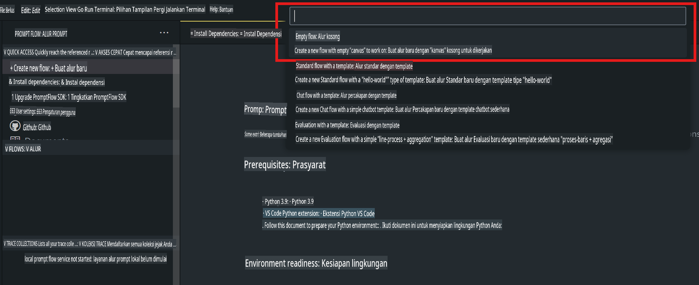
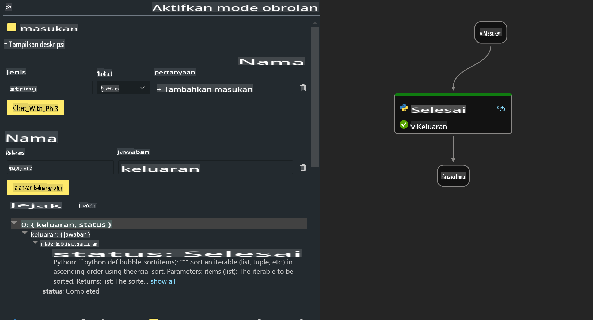

# **Lab 2 - Jalankan Prompt flow dengan Phi-3-mini di AIPC**

## **Apa itu Prompt flow**

Prompt flow adalah rangkaian alat pengembangan yang dirancang untuk menyederhanakan siklus pengembangan aplikasi AI berbasis LLM dari awal hingga akhir, mulai dari ideasi, prototipe, pengujian, evaluasi hingga penerapan produksi dan pemantauan. Alat ini mempermudah rekayasa prompt dan memungkinkan Anda membangun aplikasi LLM dengan kualitas produksi.

Dengan Prompt flow, Anda dapat:

- Membuat alur yang menghubungkan LLM, prompt, kode Python, dan alat lainnya dalam sebuah alur kerja yang dapat dijalankan.

- Melakukan debug dan iterasi pada alur Anda, terutama interaksi dengan LLM dengan lebih mudah.

- Mengevaluasi alur Anda, menghitung metrik kualitas dan performa dengan dataset yang lebih besar.

- Mengintegrasikan pengujian dan evaluasi ke dalam sistem CI/CD Anda untuk memastikan kualitas alur Anda.

- Menerapkan alur Anda ke platform penyajian pilihan Anda atau dengan mudah mengintegrasikannya ke basis kode aplikasi Anda.

- (Opsional tetapi sangat disarankan) Bekerja sama dengan tim Anda dengan memanfaatkan versi cloud Prompt flow di Azure AI.


## **Membangun alur kode generasi di Apple Silicon**

***Catatan*** ：Jika Anda belum menyelesaikan instalasi lingkungan, silakan kunjungi [Lab 0 - Instalasi](./01.Installations.md)

1. Buka Ekstensi Prompt flow di Visual Studio Code dan buat proyek alur kosong



2. Tambahkan parameter Input dan Output, lalu tambahkan Kode Python sebagai alur baru




Anda dapat merujuk pada struktur ini (flow.dag.yaml) untuk membangun alur Anda

```yaml

inputs:
  prompt:
    type: string
    default: Write python code for Fibonacci serie. Please use markdown as output
outputs:
  result:
    type: string
    reference: ${gen_code_by_phi3.output}
nodes:
- name: gen_code_by_phi3
  type: python
  source:
    type: code
    path: gen_code_by_phi3.py
  inputs:
    prompt: ${inputs.prompt}


```

3. Kuantisasi phi-3-mini

Kami ingin menjalankan SLM dengan lebih baik pada perangkat lokal. Umumnya, kami mengkuantisasi model (INT4, FP16, FP32)


```bash

python -m mlx_lm.convert --hf-path microsoft/Phi-3-mini-4k-instruct

```

**Catatan:** folder default adalah mlx_model 

4. Tambahkan kode dalam ***Chat_With_Phi3.py***


```python


from promptflow import tool

from mlx_lm import load, generate


# The inputs section will change based on the arguments of the tool function, after you save the code
# Adding type to arguments and return value will help the system show the types properly
# Please update the function name/signature per need
@tool
def my_python_tool(prompt: str) -> str:

    model_id = './mlx_model_phi3_mini'

    model, tokenizer = load(model_id)

    # <|user|>\nWrite python code for Fibonacci serie. Please use markdown as output<|end|>\n<|assistant|>

    response = generate(model, tokenizer, prompt="<|user|>\n" + prompt  + "<|end|>\n<|assistant|>", max_tokens=2048, verbose=True)

    return response


```

4. Anda dapat menguji alur dari Debug atau Run untuk memeriksa apakah kode generasi berfungsi dengan baik 


5. Jalankan alur sebagai API pengembangan di terminal

```

pf flow serve --source ./ --port 8080 --host localhost   

```

Anda dapat mengujinya di Postman / Thunder Client


### **Catatan**

1. Jalankan pertama kali memerlukan waktu lama. Disarankan untuk mengunduh model phi-3 dari Hugging Face CLI.

2. Mengingat keterbatasan daya komputasi Intel NPU, disarankan untuk menggunakan Phi-3-mini-4k-instruct.

3. Kami menggunakan Akselerasi Intel NPU untuk konversi kuantisasi INT4, tetapi jika Anda menjalankan ulang layanan, Anda perlu menghapus folder cache dan nc_workshop.


## **Sumber Daya**

1. Pelajari Promptflow [https://microsoft.github.io/promptflow/](https://microsoft.github.io/promptflow/)

2. Pelajari Akselerasi Intel NPU [https://github.com/intel/intel-npu-acceleration-library](https://github.com/intel/intel-npu-acceleration-library)

3. Kode Contoh, unduh [Kode Contoh Local NPU Agent](../../../../../../../../../code/07.Lab/01/AIPC/local-npu-agent)

**Penafian**:  
Dokumen ini telah diterjemahkan menggunakan layanan terjemahan berbasis AI. Meskipun kami berupaya untuk memberikan hasil yang akurat, harap diketahui bahwa terjemahan otomatis mungkin mengandung kesalahan atau ketidakakuratan. Dokumen asli dalam bahasa aslinya harus dianggap sebagai sumber yang berwenang. Untuk informasi yang bersifat kritis, disarankan untuk menggunakan jasa terjemahan manusia profesional. Kami tidak bertanggung jawab atas kesalahpahaman atau salah tafsir yang timbul dari penggunaan terjemahan ini.