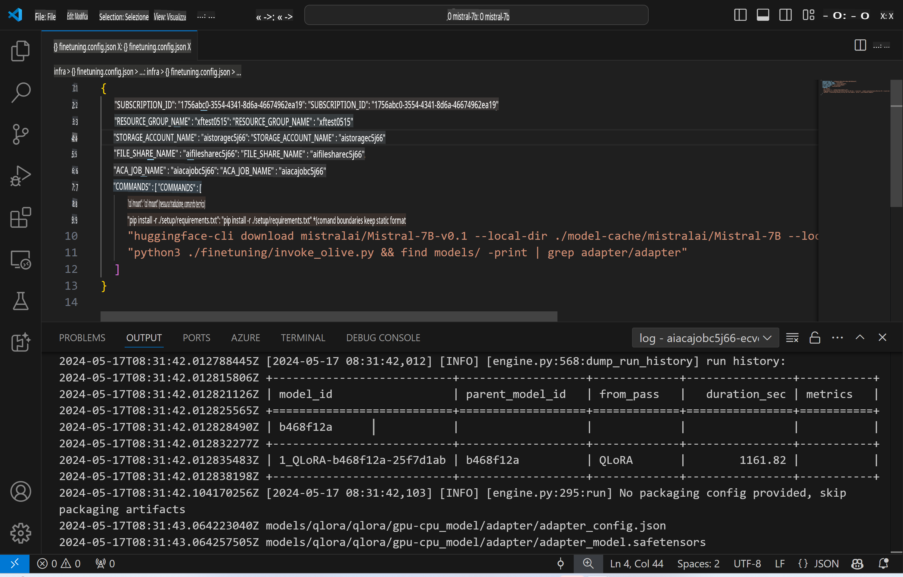
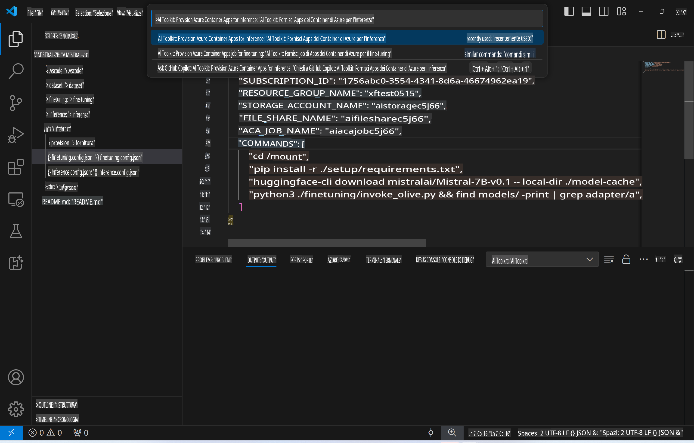
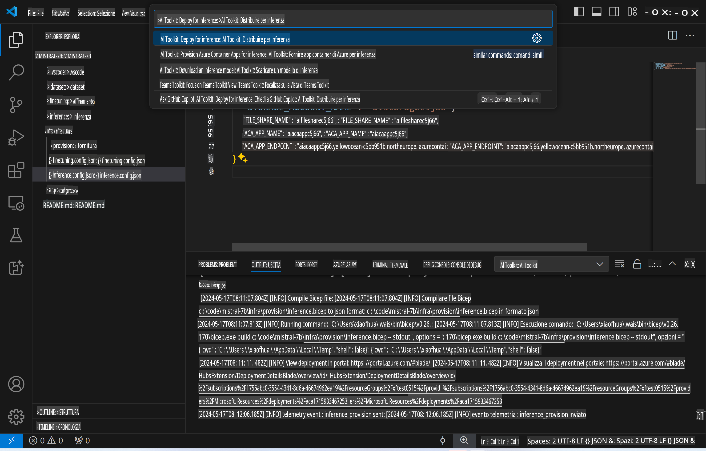
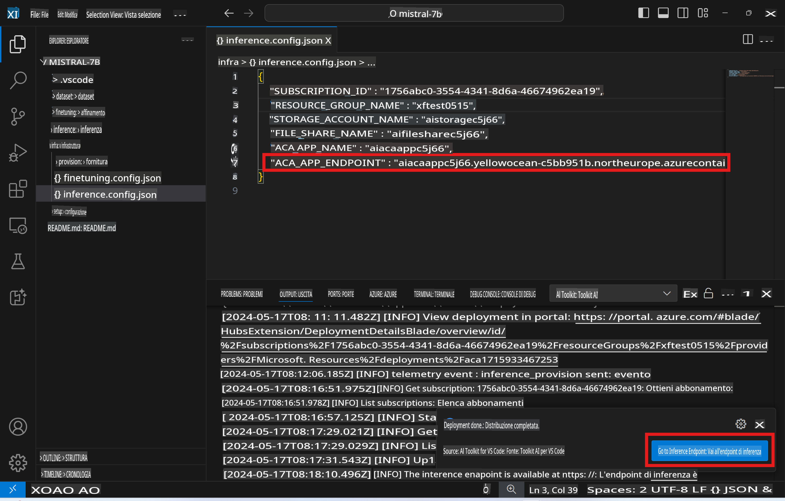

# Inferenza remota con il modello ottimizzato

Dopo che gli adapter sono stati addestrati nell'ambiente remoto, utilizza una semplice applicazione Gradio per interagire con il modello.



### Configurare le risorse Azure
Devi configurare le risorse Azure per l'inferenza remota eseguendo il comando `AI Toolkit: Provision Azure Container Apps for inference` dal command palette. Durante questa configurazione, ti verrà chiesto di selezionare la tua sottoscrizione Azure e il gruppo di risorse.  

   
Per impostazione predefinita, la sottoscrizione e il gruppo di risorse per l'inferenza devono corrispondere a quelli utilizzati per l'ottimizzazione. L'inferenza utilizzerà lo stesso ambiente di Azure Container App e accederà al modello e all'adapter del modello archiviati in Azure Files, generati durante la fase di ottimizzazione.

## Utilizzo di AI Toolkit

### Distribuzione per inferenza  
Se desideri modificare il codice di inferenza o ricaricare il modello di inferenza, esegui il comando `AI Toolkit: Deploy for inference`. Questo sincronizzerà il tuo ultimo codice con ACA e riavvierà la replica.  



Dopo il completamento con successo della distribuzione, il modello è pronto per essere valutato utilizzando questo endpoint.

### Accesso all'API di inferenza

Puoi accedere all'API di inferenza cliccando sul pulsante "*Vai all'endpoint di inferenza*" mostrato nella notifica di VSCode. In alternativa, l'endpoint web API può essere trovato sotto `ACA_APP_ENDPOINT` in `./infra/inference.config.json` e nel pannello di output.



> **Nota:** L'endpoint di inferenza potrebbe richiedere alcuni minuti per diventare completamente operativo.

## Componenti di inferenza inclusi nel template
 
| Cartella | Contenuti |
| -------- |----------- |
| `infra` | Contiene tutte le configurazioni necessarie per le operazioni remote. |
| `infra/provision/inference.parameters.json` | Contiene i parametri per i template Bicep, utilizzati per configurare le risorse Azure per l'inferenza. |
| `infra/provision/inference.bicep` | Contiene i template per configurare le risorse Azure per l'inferenza. |
| `infra/inference.config.json` | Il file di configurazione, generato dal comando `AI Toolkit: Provision Azure Container Apps for inference`. Viene utilizzato come input per altri comandi del command palette remoto. |

### Utilizzo di AI Toolkit per configurare la creazione delle risorse Azure
Configura l'[AI Toolkit](https://marketplace.visualstudio.com/items?itemName=ms-windows-ai-studio.windows-ai-studio)

Configura Azure Container Apps per inferenza` command.

You can find configuration parameters in `./infra/provision/inference.parameters.json` file. Here are the details:
| Parameter | Description |
| --------- |------------ |
| `defaultCommands` | This is the commands to initiate a web API. |
| `maximumInstanceCount` | This parameter sets the maximum capacity of GPU instances. |
| `location` | This is the location where Azure resources are provisioned. The default value is the same as the chosen resource group's location. |
| `storageAccountName`, `fileShareName` `acaEnvironmentName`, `acaEnvironmentStorageName`, `acaAppName`,  `acaLogAnalyticsName` | These parameters are used to name the Azure resources for provision. By default, they will be same to the fine-tuning resource name. You can input a new, unused resource name to create your own custom-named resources, or you can input the name of an already existing Azure resource if you'd prefer to use that. For details, refer to the section [Using existing Azure Resources](../../../../../md/01.Introduction/03). |

### Using Existing Azure Resources

By default, the inference provision use the same Azure Container App Environment, Storage Account, Azure File Share, and Azure Log Analytics that were used for fine-tuning. A separate Azure Container App is created solely for the inference API. 

If you have customized the Azure resources during the fine-tuning step or want to use your own existing Azure resources for inference, specify their names in the `./infra/inference.parameters.json` file. Successivamente, esegui il comando `AI Toolkit: Provision Azure Container Apps for inference` dal command palette. Questo aggiorna le risorse specificate e crea quelle mancanti.

Ad esempio, se hai già un ambiente Azure Container esistente, il tuo file `./infra/finetuning.parameters.json` dovrebbe avere questo aspetto:

```json
{
    "$schema": "https://schema.management.azure.com/schemas/2019-04-01/deploymentParameters.json#",
    "contentVersion": "1.0.0.0",
    "parameters": {
      ...
      "acaEnvironmentName": {
        "value": "<your-aca-env-name>"
      },
      "acaEnvironmentStorageName": {
        "value": null
      },
      ...
    }
  }
```

### Configurazione manuale  
Se preferisci configurare manualmente le risorse Azure, puoi utilizzare i file Bicep forniti nella directory `./infra/provision` folders. If you have already set up and configured all the Azure resources without using the AI Toolkit command palette, you can simply enter the resource names in the `inference.config.json`.

Ad esempio:

```json
{
  "SUBSCRIPTION_ID": "<your-subscription-id>",
  "RESOURCE_GROUP_NAME": "<your-resource-group-name>",
  "STORAGE_ACCOUNT_NAME": "<your-storage-account-name>",
  "FILE_SHARE_NAME": "<your-file-share-name>",
  "ACA_APP_NAME": "<your-aca-name>",
  "ACA_APP_ENDPOINT": "<your-aca-endpoint>"
}
```

**Disclaimer (Avvertenza):**  
Questo documento è stato tradotto utilizzando servizi di traduzione automatica basati su intelligenza artificiale. Sebbene ci impegniamo per garantire l'accuratezza, si prega di notare che le traduzioni automatiche possono contenere errori o imprecisioni. Il documento originale nella sua lingua madre dovrebbe essere considerato la fonte autorevole. Per informazioni critiche, si raccomanda una traduzione professionale eseguita da un traduttore umano. Non siamo responsabili per eventuali incomprensioni o interpretazioni errate derivanti dall'uso di questa traduzione.