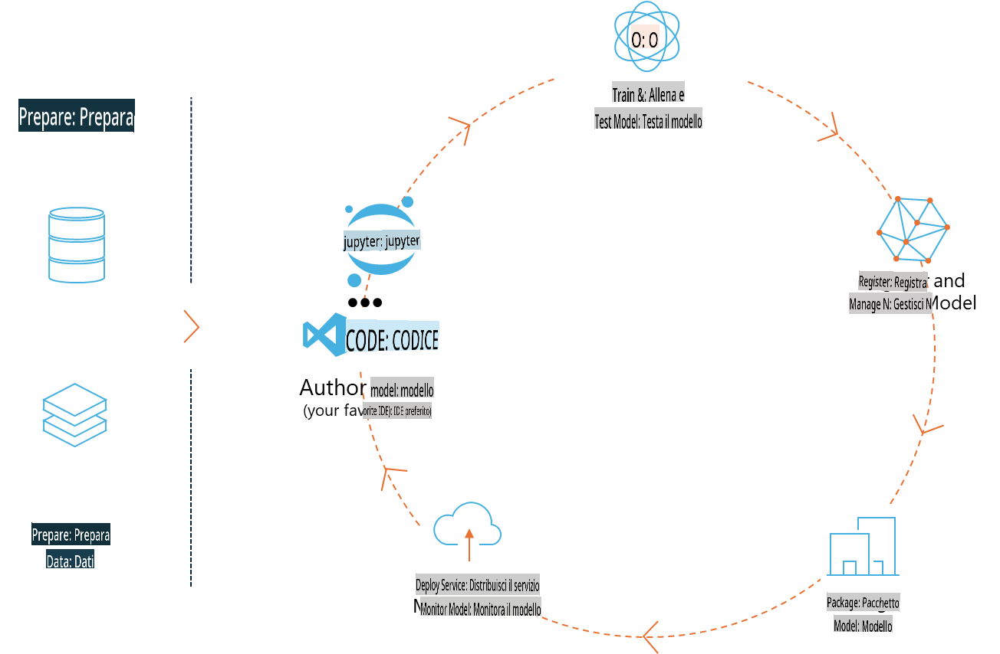
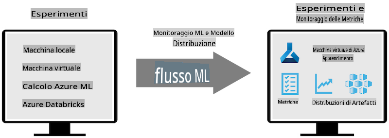
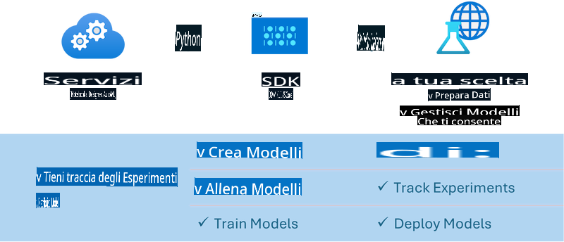

# MLflow

[MLflow](https://mlflow.org/) è una piattaforma open-source progettata per gestire l'intero ciclo di vita del machine learning.



MLFlow viene utilizzato per gestire il ciclo di vita del machine learning, inclusi sperimentazione, riproducibilità, distribuzione e un registro centrale dei modelli. Attualmente MLFlow offre quattro componenti principali:

- **MLflow Tracking:** Registra e interroga esperimenti, codice, configurazioni dei dati e risultati.
- **MLflow Projects:** Confeziona il codice di data science in un formato per riprodurre esecuzioni su qualsiasi piattaforma.
- **MLflow Models:** Distribuisci modelli di machine learning in diversi ambienti di serving.
- **Model Registry:** Archivia, annota e gestisci i modelli in un repository centrale.

Include funzionalità per tracciare esperimenti, confezionare il codice in esecuzioni riproducibili e condividere e distribuire modelli. MLFlow è integrato in Databricks e supporta una varietà di librerie di machine learning, rendendolo indipendente dalla libreria. Può essere utilizzato con qualsiasi libreria di machine learning e in qualsiasi linguaggio di programmazione, grazie alla disponibilità di una REST API e di una CLI per maggiore comodità.



Le caratteristiche principali di MLFlow includono:

- **Tracciamento degli esperimenti:** Registra e confronta parametri e risultati.
- **Gestione dei modelli:** Distribuisci modelli su diverse piattaforme di serving e inferenza.
- **Registro dei modelli:** Gestisci collaborativamente il ciclo di vita dei modelli MLflow, inclusi versionamento e annotazioni.
- **Progetti:** Confeziona il codice di ML per condivisione o utilizzo in produzione.

MLFlow supporta anche il ciclo MLOps, che include la preparazione dei dati, la registrazione e gestione dei modelli, il confezionamento dei modelli per l'esecuzione, la distribuzione dei servizi e il monitoraggio dei modelli. Mira a semplificare il passaggio da un prototipo a un flusso di lavoro in produzione, specialmente in ambienti cloud ed edge.

## Scenario E2E - Creare un wrapper e utilizzare Phi-3 come modello MLFlow

In questo esempio end-to-end, dimostreremo due approcci diversi per costruire un wrapper attorno al piccolo modello linguistico Phi-3 (SLM) e quindi eseguirlo come modello MLFlow, sia localmente che nel cloud, ad esempio in uno spazio di lavoro di Azure Machine Learning.



| Progetto | Descrizione | Posizione |
| ------------ | ----------- | -------- |
| Transformer Pipeline | Transformer Pipeline è l'opzione più semplice per costruire un wrapper se si desidera utilizzare un modello HuggingFace con il flavour sperimentale di MLFlow per i transformer. | [**TransformerPipeline.ipynb**](../../../../../../code/06.E2E/E2E_Phi-3-MLflow_TransformerPipeline.ipynb) |
| Custom Python Wrapper | Al momento della scrittura, il transformer pipeline non supportava la generazione di wrapper MLFlow per i modelli HuggingFace in formato ONNX, nemmeno con il pacchetto Python sperimentale optimum. In casi come questo, è possibile costruire un wrapper Python personalizzato per il modello MLFlow. | [**CustomPythonWrapper.ipynb**](../../../../../../code/06.E2E/E2E_Phi-3-MLflow_CustomPythonWrapper.ipynb) |

## Progetto: Transformer Pipeline

1. Avrai bisogno dei pacchetti Python rilevanti da MLFlow e HuggingFace:

    ``` Python
    import mlflow
    import transformers
    ```

2. Successivamente, devi avviare una pipeline transformer facendo riferimento al modello Phi-3 target nel registro HuggingFace. Come si può vedere dalla scheda modello di _Phi-3-mini-4k-instruct_, il suo compito è di tipo "Generazione di Testo":

    ``` Python
    pipeline = transformers.pipeline(
        task = "text-generation",
        model = "microsoft/Phi-3-mini-4k-instruct"
    )
    ```

3. Ora puoi salvare la pipeline transformer del tuo modello Phi-3 in formato MLFlow e fornire dettagli aggiuntivi come il percorso degli artefatti target, le impostazioni specifiche della configurazione del modello e il tipo di API di inferenza:

    ``` Python
    model_info = mlflow.transformers.log_model(
        transformers_model = pipeline,
        artifact_path = "phi3-mlflow-model",
        model_config = model_config,
        task = "llm/v1/chat"
    )
    ```

## Progetto: Custom Python Wrapper

1. Qui possiamo utilizzare l'[API generate() di ONNX Runtime](https://github.com/microsoft/onnxruntime-genai) di Microsoft per l'inferenza del modello ONNX e la codifica/decodifica dei token. Devi scegliere il pacchetto _onnxruntime_genai_ per il tuo target compute, con l'esempio seguente che si rivolge alla CPU:

    ``` Python
    import mlflow
    from mlflow.models import infer_signature
    import onnxruntime_genai as og
    ```

2. La nostra classe personalizzata implementa due metodi: _load_context()_ per inizializzare il **modello ONNX** di Phi-3 Mini 4K Instruct, i **parametri del generatore** e il **tokenizer**; e _predict()_ per generare token di output per il prompt fornito:

    ``` Python
    class Phi3Model(mlflow.pyfunc.PythonModel):
        def load_context(self, context):
            # Retrieving model from the artifacts
            model_path = context.artifacts["phi3-mini-onnx"]
            model_options = {
                 "max_length": 300,
                 "temperature": 0.2,         
            }
        
            # Defining the model
            self.phi3_model = og.Model(model_path)
            self.params = og.GeneratorParams(self.phi3_model)
            self.params.set_search_options(**model_options)
            
            # Defining the tokenizer
            self.tokenizer = og.Tokenizer(self.phi3_model)
    
        def predict(self, context, model_input):
            # Retrieving prompt from the input
            prompt = model_input["prompt"][0]
            self.params.input_ids = self.tokenizer.encode(prompt)
    
            # Generating the model's response
            response = self.phi3_model.generate(self.params)
    
            return self.tokenizer.decode(response[0][len(self.params.input_ids):])
    ```

3. Ora puoi utilizzare la funzione _mlflow.pyfunc.log_model()_ per generare un wrapper Python personalizzato (in formato pickle) per il modello Phi-3, insieme al modello ONNX originale e alle dipendenze richieste:

    ``` Python
    model_info = mlflow.pyfunc.log_model(
        artifact_path = artifact_path,
        python_model = Phi3Model(),
        artifacts = {
            "phi3-mini-onnx": "cpu_and_mobile/cpu-int4-rtn-block-32-acc-level-4",
        },
        input_example = input_example,
        signature = infer_signature(input_example, ["Run"]),
        extra_pip_requirements = ["torch", "onnxruntime_genai", "numpy"],
    )
    ```

## Signature dei modelli MLFlow generati

1. Nel passaggio 3 del progetto Transformer Pipeline sopra, abbiamo impostato il task del modello MLFlow su "_llm/v1/chat_". Tale istruzione genera un wrapper API del modello, compatibile con l'API Chat di OpenAI come mostrato di seguito:

    ``` Python
    {inputs: 
      ['messages': Array({content: string (required), name: string (optional), role: string (required)}) (required), 'temperature': double (optional), 'max_tokens': long (optional), 'stop': Array(string) (optional), 'n': long (optional), 'stream': boolean (optional)],
    outputs: 
      ['id': string (required), 'object': string (required), 'created': long (required), 'model': string (required), 'choices': Array({finish_reason: string (required), index: long (required), message: {content: string (required), name: string (optional), role: string (required)} (required)}) (required), 'usage': {completion_tokens: long (required), prompt_tokens: long (required), total_tokens: long (required)} (required)],
    params: 
      None}
    ```

2. Di conseguenza, puoi inviare il tuo prompt nel seguente formato:

    ``` Python
    messages = [{"role": "user", "content": "What is the capital of Spain?"}]
    ```

3. Poi, utilizza un post-processing compatibile con l'API di OpenAI, ad esempio _response[0][‘choices’][0][‘message’][‘content’]_, per rendere il tuo output più leggibile, come mostrato qui:

    ``` JSON
    Question: What is the capital of Spain?
    
    Answer: The capital of Spain is Madrid. It is the largest city in Spain and serves as the political, economic, and cultural center of the country. Madrid is located in the center of the Iberian Peninsula and is known for its rich history, art, and architecture, including the Royal Palace, the Prado Museum, and the Plaza Mayor.
    
    Usage: {'prompt_tokens': 11, 'completion_tokens': 73, 'total_tokens': 84}
    ```

4. Nel passaggio 3 del progetto Custom Python Wrapper sopra, permettiamo al pacchetto MLFlow di generare la firma del modello da un esempio di input fornito. La firma del wrapper MLFlow sarà simile a questa:

    ``` Python
    {inputs: 
      ['prompt': string (required)],
    outputs: 
      [string (required)],
    params: 
      None}
    ```

5. Pertanto, il nostro prompt dovrà contenere la chiave del dizionario "prompt", simile a questo:

    ``` Python
    {"prompt": "<|system|>You are a stand-up comedian.<|end|><|user|>Tell me a joke about atom<|end|><|assistant|>",}
    ```

6. L'output del modello sarà quindi fornito in formato stringa:

    ``` JSON
    Alright, here's a little atom-related joke for you!
    
    Why don't electrons ever play hide and seek with protons?
    
    Because good luck finding them when they're always "sharing" their electrons!
    
    Remember, this is all in good fun, and we're just having a little atomic-level humor!
    ```

**Disclaimer (Avvertenza)**:  
Questo documento è stato tradotto utilizzando servizi di traduzione automatica basati sull'intelligenza artificiale. Sebbene ci impegniamo per garantire l'accuratezza, si prega di tenere presente che le traduzioni automatiche possono contenere errori o imprecisioni. Il documento originale nella sua lingua nativa dovrebbe essere considerato la fonte autorevole. Per informazioni critiche, si raccomanda una traduzione professionale umana. Non siamo responsabili per eventuali malintesi o interpretazioni errate derivanti dall'uso di questa traduzione.