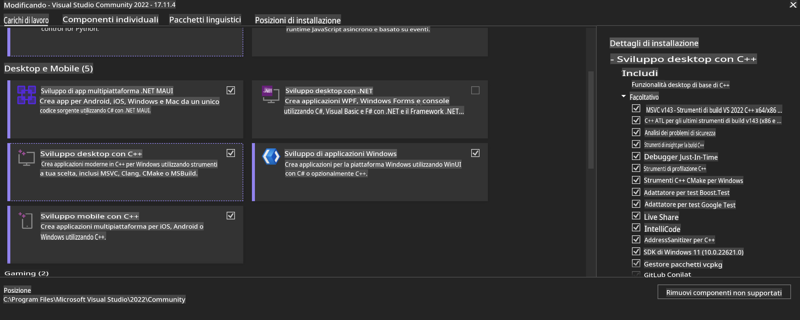
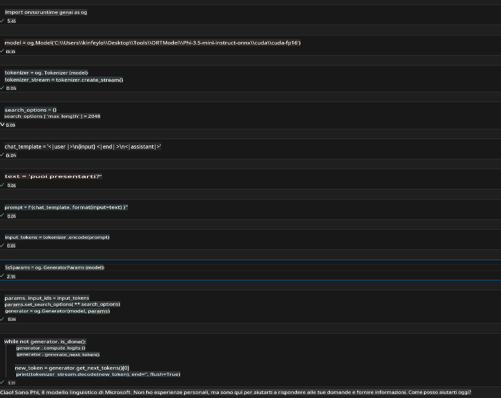
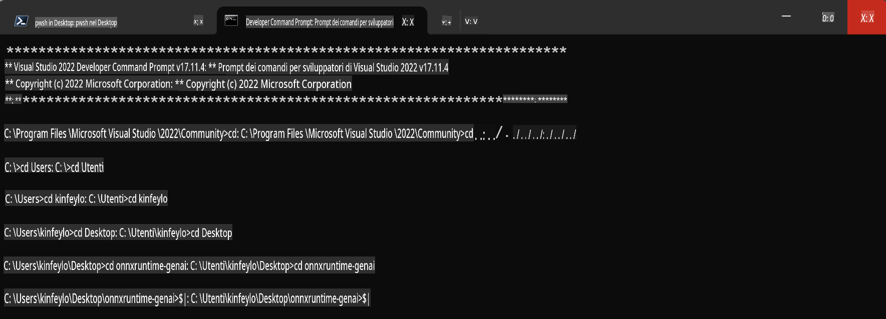

# **Guida per OnnxRuntime GenAI su Windows GPU**

Questa guida fornisce i passaggi per configurare e utilizzare ONNX Runtime (ORT) con GPU su Windows. È progettata per aiutarti a sfruttare l'accelerazione GPU per i tuoi modelli, migliorando le prestazioni e l'efficienza.

Il documento include indicazioni su:

- Configurazione dell'ambiente: Istruzioni per installare le dipendenze necessarie come CUDA, cuDNN e ONNX Runtime.
- Configurazione: Come configurare l'ambiente e ONNX Runtime per utilizzare efficacemente le risorse GPU.
- Suggerimenti per l'ottimizzazione: Consigli su come ottimizzare le impostazioni della GPU per ottenere le migliori prestazioni.

### **1. Python 3.10.x /3.11.8**

   ***Nota*** Si consiglia di utilizzare [miniforge](https://github.com/conda-forge/miniforge/releases/latest/download/Miniforge3-Windows-x86_64.exe) come ambiente Python.

   ```bash

   conda create -n pydev python==3.11.8

   conda activate pydev

   ```

   ***Promemoria*** Se hai installato una qualsiasi libreria Python relativa a ONNX, disinstallala.

### **2. Installa CMake con winget**

   ```bash

   winget install -e --id Kitware.CMake

   ```

### **3. Installa Visual Studio 2022 - Sviluppo Desktop con C++**

   ***Nota*** Se non vuoi compilare, puoi saltare questo passaggio.



### **4. Installa il Driver NVIDIA**

1. **Driver GPU NVIDIA**  [https://www.nvidia.com/en-us/drivers/](https://www.nvidia.com/en-us/drivers/)

2. **NVIDIA CUDA 12.4** [https://developer.nvidia.com/cuda-12-4-0-download-archive](https://developer.nvidia.com/cuda-12-4-0-download-archive)

3. **NVIDIA CUDNN 9.4**  [https://developer.nvidia.com/cudnn-downloads](https://developer.nvidia.com/cudnn-downloads)

***Promemoria*** Utilizza le impostazioni predefinite durante il flusso di installazione.

### **5. Configura l'ambiente NVIDIA**

Copia i file lib, bin, include di NVIDIA CUDNN 9.4 nelle rispettive directory di NVIDIA CUDA 12.4.

- copia i file da *'C:\Program Files\NVIDIA\CUDNN\v9.4\bin\12.6'* a *'C:\Program Files\NVIDIA GPU Computing Toolkit\CUDA\v12.4\bin*

- copia i file da *'C:\Program Files\NVIDIA\CUDNN\v9.4\include\12.6'* a *'C:\Program Files\NVIDIA GPU Computing Toolkit\CUDA\v12.4\include*

- copia i file da *'C:\Program Files\NVIDIA\CUDNN\v9.4\lib\12.6'* a *'C:\Program Files\NVIDIA GPU Computing Toolkit\CUDA\v12.4\lib\x64'*

### **6. Scarica Phi-3.5-mini-instruct-onnx**

   ```bash

   winget install -e --id Git.Git

   winget install -e --id GitHub.GitLFS

   git lfs install

   git clone https://huggingface.co/microsoft/Phi-3.5-mini-instruct-onnx

   ```

### **7. Esegui InferencePhi35Instruct.ipynb**

   Apri [Notebook](../../../../../../code/09.UpdateSamples/Aug/ortgpu-phi35-instruct.ipynb) ed eseguilo.



### **8. Compila ORT GenAI GPU**

   ***Nota*** 
   
   1. Disinstalla prima tutte le librerie relative a onnx, onnxruntime e onnxruntime-genai.

   ```bash

   pip list 
   
   ```

   Poi disinstalla tutte le librerie onnxruntime, ad esempio:

   ```bash

   pip uninstall onnxruntime

   pip uninstall onnxruntime-genai

   pip uninstall onnxruntume-genai-cuda
   
   ```

   2. Verifica il supporto dell'estensione di Visual Studio.

   Controlla in C:\Program Files\NVIDIA GPU Computing Toolkit\CUDA\v12.4\extras per assicurarti che la cartella C:\Program Files\NVIDIA GPU Computing Toolkit\CUDA\v12.4\extras\visual_studio_integration sia presente. 
   
   Se non è presente, controlla altre cartelle del toolkit CUDA e copia la cartella visual_studio_integration e i suoi contenuti in C:\Program Files\NVIDIA GPU Computing Toolkit\CUDA\v12.4\extras\visual_studio_integration.

   - Se non vuoi compilare, puoi saltare questo passaggio.

   ```bash

   git clone https://github.com/microsoft/onnxruntime-genai

   ```

   - Scarica [https://github.com/microsoft/onnxruntime/releases/download/v1.19.2/onnxruntime-win-x64-gpu-1.19.2.zip](https://github.com/microsoft/onnxruntime/releases/download/v1.19.2/onnxruntime-win-x64-gpu-1.19.2.zip).

   - Decomprimi il file onnxruntime-win-x64-gpu-1.19.2.zip, rinominalo in **ort** e copia la cartella ort in onnxruntime-genai.

   - Utilizzando Windows Terminal, apri il Developer Command Prompt per VS 2022 e vai nella directory onnxruntime-genai.



   - Compila utilizzando il tuo ambiente Python.

   ```bash

   cd onnxruntime-genai

   python build.py --use_cuda  --cuda_home "C:\Program Files\NVIDIA GPU Computing Toolkit\CUDA\v12.4" --config Release
 

   cd build/Windows/Release/Wheel

   pip install .whl

   ```

**Disclaimer (Avvertenza):**  
Questo documento è stato tradotto utilizzando servizi di traduzione automatica basati sull'intelligenza artificiale. Sebbene ci impegniamo per garantire l'accuratezza, si prega di notare che le traduzioni automatiche potrebbero contenere errori o imprecisioni. Il documento originale nella sua lingua nativa deve essere considerato la fonte autorevole. Per informazioni critiche, si raccomanda una traduzione professionale effettuata da un traduttore umano. Non siamo responsabili per eventuali malintesi o interpretazioni errate derivanti dall'uso di questa traduzione.