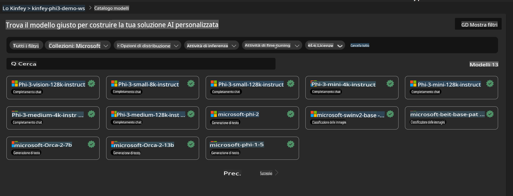
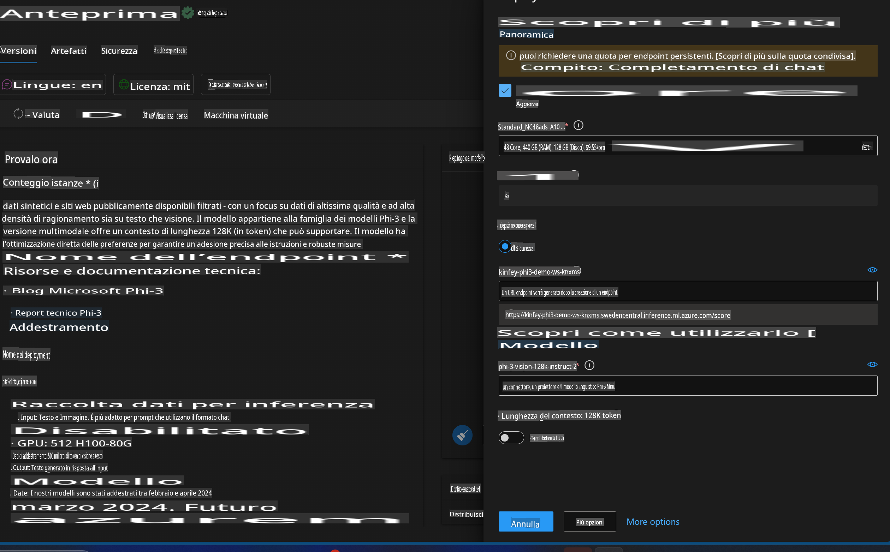
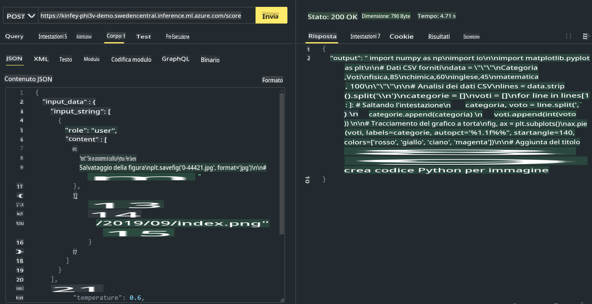

# **Lab 3 - Distribuire Phi-3-Vision su Azure Machine Learning Service**

Utilizziamo NPU per completare il deployment di codice locale in produzione e, successivamente, vogliamo introdurre la capacità di utilizzare PHI-3-VISION per generare codice a partire da immagini.

In questa guida, vedremo come costruire rapidamente un servizio Model As Service Phi-3 Vision su Azure Machine Learning Service.

***Nota***: Phi-3 Vision richiede potenza di calcolo per generare contenuti in modo più rapido. Abbiamo bisogno della potenza di calcolo cloud per raggiungere questo obiettivo.

### **1. Creare Azure Machine Learning Service**

Dobbiamo creare un Azure Machine Learning Service nel portale di Azure. Se vuoi sapere come fare, visita questo link [https://learn.microsoft.com/azure/machine-learning/quickstart-create-resources?view=azureml-api-2](https://learn.microsoft.com/azure/machine-learning/quickstart-create-resources?view=azureml-api-2)

### **2. Scegliere Phi-3 Vision in Azure Machine Learning Service**



### **3. Distribuire Phi-3-Vision su Azure**



### **4. Testare l'Endpoint con Postman**



***Nota***

1. I parametri da trasmettere devono includere Authorization, azureml-model-deployment e Content-Type. È necessario controllare le informazioni di deployment per ottenerli.

2. Per trasmettere i parametri, Phi-3-Vision richiede un link a un'immagine. Consulta il metodo di GPT-4-Vision per trasmettere i parametri, ad esempio:

```json

{
  "input_data":{
    "input_string":[
      {
        "role":"user",
        "content":[ 
          {
            "type": "text",
            "text": "You are a Python coding assistant.Please create Python code for image "
          },
          {
              "type": "image_url",
              "image_url": {
                "url": "https://ajaytech.co/wp-content/uploads/2019/09/index.png"
              }
          }
        ]
      }
    ],
    "parameters":{
          "temperature": 0.6,
          "top_p": 0.9,
          "do_sample": false,
          "max_new_tokens": 2048
    }
  }
}

```

3. Effettua la chiamata **/score** utilizzando il metodo Post.

**Congratulazioni**! Hai completato il rapido deployment di PHI-3-VISION e hai sperimentato come utilizzare immagini per generare codice. Ora possiamo costruire applicazioni combinando NPU e cloud.

**Disclaimer (Avvertenza):**  
Questo documento è stato tradotto utilizzando servizi di traduzione automatica basati sull'intelligenza artificiale. Sebbene ci impegniamo per garantire l'accuratezza, si prega di notare che le traduzioni automatiche possono contenere errori o imprecisioni. Il documento originale nella sua lingua madre deve essere considerato la fonte autorevole. Per informazioni critiche, si raccomanda una traduzione professionale eseguita da un traduttore umano. Non siamo responsabili per eventuali incomprensioni o interpretazioni errate derivanti dall'uso di questa traduzione.