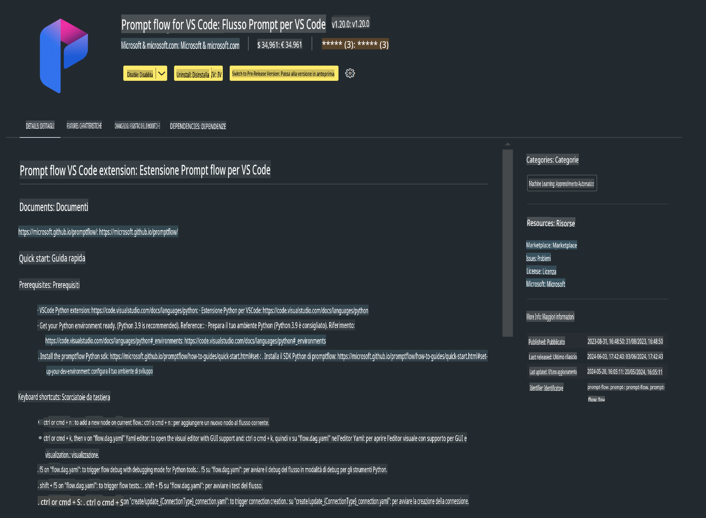

# **Lab 0 - Installazione**

Quando entriamo nel Lab, dobbiamo configurare l'ambiente pertinente:

### **1. Python 3.11+**

Si consiglia di utilizzare miniforge per configurare il tuo ambiente Python.

Per configurare miniforge, fai riferimento a [https://github.com/conda-forge/miniforge](https://github.com/conda-forge/miniforge)

Dopo aver configurato miniforge, esegui il seguente comando in Power Shell:

```bash

conda create -n pyenv python==3.11.8 -y

conda activate pyenv

```

### **2. Installa Prompt flow SDK**

Nel Lab 1 utilizzeremo Prompt flow, quindi è necessario configurare il Prompt flow SDK.

```bash

pip install promptflow --upgrade

```

Puoi verificare il promptflow sdk con questo comando:

```bash

pf --version

```

### **3. Installa l'Estensione Prompt flow per Visual Studio Code**



### **4. Framework MLX di Apple**

MLX è un framework per array destinato alla ricerca nel campo del machine learning su Apple Silicon, sviluppato da Apple Machine Learning Research. Puoi utilizzare il **framework Apple MLX** per accelerare LLM / SLM su Apple Silicon. Se vuoi saperne di più, puoi leggere [https://github.com/microsoft/PhiCookBook/blob/main/md/01.Introduction/03/MLX_Inference.md](https://github.com/microsoft/PhiCookBook/blob/main/md/01.Introduction/03/MLX_Inference.md).

Installa la libreria del framework MLX in bash:

```bash

pip install mlx-lm

```

### **5. Altre Librerie Python**

Crea un file requirements.txt e aggiungi il seguente contenuto:

```txt

notebook
numpy 
scipy 
scikit-learn 
matplotlib 
pandas 
pillow 
graphviz

```

### **6. Installa NVM**

Installa nvm in PowerShell:

```bash

brew install nvm

```

Installa Node.js 18.20:

```bash

nvm install 18.20.0

nvm use 18.20.0

```

### **7. Installa il Supporto per lo Sviluppo in Visual Studio Code**

```bash

npm install --global yo generator-code

```

Congratulazioni! Hai configurato con successo l'SDK. Ora puoi passare ai passaggi pratici.

**Disclaimer**:  
Questo documento è stato tradotto utilizzando servizi di traduzione automatica basati su intelligenza artificiale. Sebbene ci impegniamo per garantire l'accuratezza, si prega di notare che le traduzioni automatiche possono contenere errori o imprecisioni. Il documento originale nella sua lingua nativa deve essere considerato la fonte autorevole. Per informazioni critiche, si raccomanda una traduzione professionale effettuata da un essere umano. Non siamo responsabili per eventuali incomprensioni o interpretazioni errate derivanti dall'uso di questa traduzione.