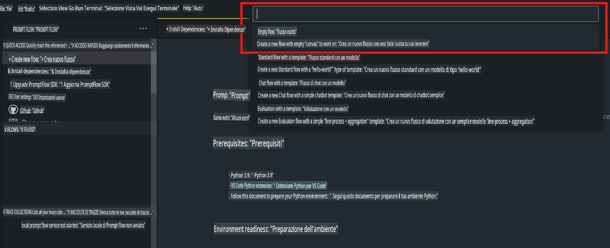

# **Lab 2 - Esegui Prompt flow con Phi-3-mini in AIPC**

## **Cos'è Prompt flow**

Prompt flow è una suite di strumenti di sviluppo progettata per semplificare l'intero ciclo di sviluppo delle applicazioni AI basate su LLM, dalla fase di ideazione, prototipazione, test, valutazione fino al deployment in produzione e al monitoraggio. Rende l'ingegneria dei prompt molto più semplice e ti consente di creare applicazioni LLM di qualità produttiva.

Con Prompt flow, sarai in grado di:

- Creare flussi che collegano LLM, prompt, codice Python e altri strumenti in un workflow eseguibile.

- Effettuare debug e iterare sui tuoi flussi, in particolare sull'interazione con gli LLM, in modo semplice.

- Valutare i tuoi flussi, calcolando metriche di qualità e performance su dataset più ampi.

- Integrare test e valutazioni nel tuo sistema CI/CD per garantire la qualità del flusso.

- Distribuire i tuoi flussi sulla piattaforma di servizio che preferisci o integrarli facilmente nel codice della tua applicazione.

- (Opzionale ma altamente consigliato) Collaborare con il tuo team utilizzando la versione cloud di Prompt flow in Azure AI.


## **Creare flussi di generazione del codice su Apple Silicon**

***Nota***: Se non hai completato l'installazione dell'ambiente, visita [Lab 0 - Installazioni](./01.Installations.md)

1. Apri l'estensione Prompt flow in Visual Studio Code e crea un progetto di flusso vuoto.



2. Aggiungi parametri di Input e Output e inserisci codice Python come nuovo flusso.


Puoi fare riferimento a questa struttura (flow.dag.yaml) per costruire il tuo flusso.

```yaml

inputs:
  prompt:
    type: string
    default: Write python code for Fibonacci serie. Please use markdown as output
outputs:
  result:
    type: string
    reference: ${gen_code_by_phi3.output}
nodes:
- name: gen_code_by_phi3
  type: python
  source:
    type: code
    path: gen_code_by_phi3.py
  inputs:
    prompt: ${inputs.prompt}


```

3. Quantifica phi-3-mini

Vogliamo eseguire meglio SLM sui dispositivi locali. Generalmente, quantifichiamo il modello (INT4, FP16, FP32).

```bash

python -m mlx_lm.convert --hf-path microsoft/Phi-3-mini-4k-instruct

```

**Nota:** la cartella predefinita è mlx_model.

4. Aggiungi il codice in ***Chat_With_Phi3.py***.

```python


from promptflow import tool

from mlx_lm import load, generate


# The inputs section will change based on the arguments of the tool function, after you save the code
# Adding type to arguments and return value will help the system show the types properly
# Please update the function name/signature per need
@tool
def my_python_tool(prompt: str) -> str:

    model_id = './mlx_model_phi3_mini'

    model, tokenizer = load(model_id)

    # <|user|>\nWrite python code for Fibonacci serie. Please use markdown as output<|end|>\n<|assistant|>

    response = generate(model, tokenizer, prompt="<|user|>\n" + prompt  + "<|end|>\n<|assistant|>", max_tokens=2048, verbose=True)

    return response


```

4. Puoi testare il flusso utilizzando Debug o Run per verificare se la generazione del codice funziona correttamente.


5. Esegui il flusso come API di sviluppo nel terminale.

```

pf flow serve --source ./ --port 8080 --host localhost   

```

Puoi testarlo in Postman / Thunder Client.


### **Nota**

1. Il primo avvio richiede molto tempo. Si consiglia di scaricare il modello phi-3 tramite Hugging Face CLI.

2. Considerando la limitata potenza di calcolo di Intel NPU, si consiglia di utilizzare Phi-3-mini-4k-instruct.

3. Usiamo l'accelerazione Intel NPU per la conversione quantizzata INT4, ma se riavvii il servizio, devi eliminare le cartelle cache e nc_workshop.


## **Risorse**

1. Scopri Promptflow [https://microsoft.github.io/promptflow/](https://microsoft.github.io/promptflow/)

2. Scopri Intel NPU Acceleration [https://github.com/intel/intel-npu-acceleration-library](https://github.com/intel/intel-npu-acceleration-library)

3. Codice di esempio, scarica [Local NPU Agent Sample Code](../../../../../../../../../code/07.Lab/01/AIPC/local-npu-agent)

**Disclaimer**:  
Questo documento è stato tradotto utilizzando servizi di traduzione automatica basati sull'intelligenza artificiale. Sebbene ci impegniamo per garantire l'accuratezza, si prega di tenere presente che le traduzioni automatiche possono contenere errori o imprecisioni. Il documento originale nella sua lingua madre deve essere considerato la fonte autorevole. Per informazioni critiche, si raccomanda una traduzione professionale effettuata da un essere umano. Non siamo responsabili per eventuali incomprensioni o interpretazioni errate derivanti dall'uso di questa traduzione.