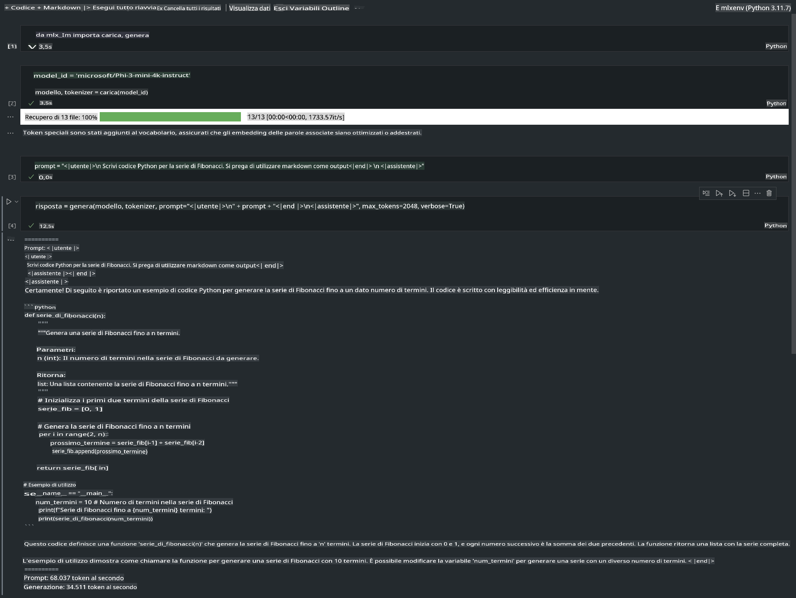

# **Inferenza di Phi-3 con il framework Apple MLX**

## **Cos'è il framework MLX**

MLX è un framework per array dedicato alla ricerca nel campo del machine learning su Apple Silicon, sviluppato dal team di ricerca sul machine learning di Apple.

MLX è progettato da ricercatori di machine learning per altri ricercatori di machine learning. Il framework è pensato per essere intuitivo da usare, ma comunque efficiente sia per l'addestramento che per il deployment dei modelli. Anche il design del framework è concettualmente semplice. Il nostro obiettivo è facilitare l'estensione e il miglioramento di MLX da parte dei ricercatori, consentendo di esplorare rapidamente nuove idee.

Gli LLM possono essere accelerati su dispositivi Apple Silicon tramite MLX, permettendo di eseguire i modelli localmente in modo molto pratico.

## **Utilizzare MLX per inferire Phi-3-mini**

### **1. Configura l'ambiente MLX**

1. Python 3.11.x  
2. Installa la libreria MLX  

```bash

pip install mlx-lm

```

### **2. Eseguire Phi-3-mini nel Terminale con MLX**

```bash

python -m mlx_lm.generate --model microsoft/Phi-3-mini-4k-instruct --max-token 2048 --prompt  "<|user|>\nCan you introduce yourself<|end|>\n<|assistant|>"

```

Il risultato (nel mio ambiente: Apple M1 Max, 64GB) è il seguente:


### **3. Quantizzare Phi-3-mini con MLX nel Terminale**

```bash

python -m mlx_lm.convert --hf-path microsoft/Phi-3-mini-4k-instruct

```

***Nota:*** Il modello può essere quantizzato tramite `mlx_lm.convert`, e la quantizzazione predefinita è INT4. In questo esempio, Phi-3-mini viene quantizzato a INT4.

Il modello può essere quantizzato tramite `mlx_lm.convert`, e la quantizzazione predefinita è INT4. In questo esempio, Phi-3-mini viene quantizzato a INT4. Dopo la quantizzazione, il modello sarà salvato nella directory predefinita `./mlx_model`.

Possiamo testare il modello quantizzato con MLX direttamente dal terminale.

```bash

python -m mlx_lm.generate --model ./mlx_model/ --max-token 2048 --prompt  "<|user|>\nCan you introduce yourself<|end|>\n<|assistant|>"

```

Il risultato è il seguente:


### **4. Eseguire Phi-3-mini con MLX in Jupyter Notebook**



***Nota:*** Consulta questo esempio [cliccando su questo link](../../../../../code/03.Inference/MLX/MLX_DEMO.ipynb)

## **Risorse**

1. Scopri di più sul framework Apple MLX [https://ml-explore.github.io](https://ml-explore.github.io/mlx/build/html/index.html)

2. Repository GitHub di Apple MLX [https://github.com/ml-explore](https://github.com/ml-explore)

**Disclaimer (Avvertenza):**  
Questo documento è stato tradotto utilizzando servizi di traduzione automatica basati su intelligenza artificiale. Sebbene ci impegniamo per garantire l'accuratezza, si prega di notare che le traduzioni automatiche potrebbero contenere errori o imprecisioni. Il documento originale nella sua lingua nativa dovrebbe essere considerato la fonte autorevole. Per informazioni critiche, si raccomanda una traduzione professionale effettuata da un traduttore umano. Non siamo responsabili per eventuali fraintendimenti o interpretazioni errate derivanti dall'uso di questa traduzione.