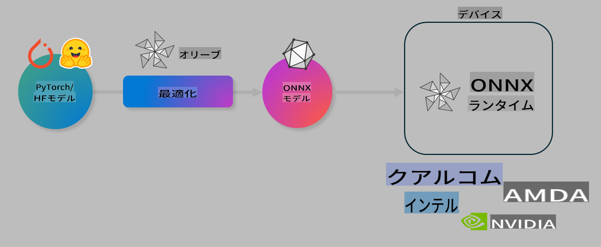

# ラボ: デバイス上での推論向けにAIモデルを最適化

## はじめに

> [!IMPORTANT]
> このラボには、**Nvidia A10またはA100 GPU** と、それに対応するドライバおよびCUDAツールキット（バージョン12以上）が必要です。

> [!NOTE]
> このラボは **35分** で完了する内容で、OLIVEを使用してデバイス上での推論向けにモデルを最適化するための基本的な概念を実践的に学びます。

## 学習目標

このラボを終える頃には、OLIVEを使用して以下を行えるようになります：

- AWQ量子化手法を用いてAIモデルを量子化する。
- 特定のタスク向けにAIモデルをファインチューニングする。
- ONNX Runtimeで効率的なデバイス上推論を実現するためのLoRAアダプター（ファインチューニングされたモデル）を生成する。

### Oliveとは

Olive (*O*NNX *live*) は、ONNX Runtime +++https://onnxruntime.ai+++ 用のモデル最適化ツールキットで、CLIを備え、ONNX Runtime向けのモデルを高品質かつ高パフォーマンスで提供できるようにします。



Oliveの入力は通常、PyTorchまたはHugging Faceモデルであり、出力はONNX Runtimeを実行するデバイス（デプロイメントターゲット）で実行可能な最適化されたONNXモデルです。Oliveは、Qualcomm、AMD、Nvidia、Intelなどのハードウェアベンダーが提供するデプロイメントターゲットのAIアクセラレーター（NPU、GPU、CPU）向けにモデルを最適化します。

Oliveは*ワークフロー*を実行します。これは、*パス*と呼ばれる個々のモデル最適化タスクの順序付けられたシーケンスです。例として、モデル圧縮、グラフキャプチャ、量子化、グラフ最適化などのパスがあります。各パスには、精度やレイテンシなどのベストな指標を達成するために調整可能なパラメーターがあります。Oliveは検索アルゴリズムを使用して、各パスまたは一連のパスを自動的に調整する検索戦略を採用しています。

#### Oliveの利点

- グラフ最適化、圧縮、量子化などのさまざまな手法を試行錯誤する際の**時間とストレスを軽減**します。品質とパフォーマンスの制約を定義するだけで、最適なモデルを自動的に見つけてくれます。
- **40以上の組み込みモデル最適化コンポーネント** があり、量子化、圧縮、グラフ最適化、ファインチューニングの最先端技術を網羅。
- **使いやすいCLI** により、一般的なモデル最適化タスクを簡単に実行可能（例：`olive quantize`、`olive auto-opt`、`olive finetune`）。
- モデルのパッケージングとデプロイメントが組み込み済み。
- **マルチLoRAサービング** 用のモデル生成をサポート。
- YAML/JSONを使用してワークフローを構築し、モデル最適化およびデプロイメントタスクを編成可能。
- **Hugging Face** および **Azure AI** と統合。
- **キャッシュ機能** が組み込まれており、**コスト削減** に貢献。

## ラボ手順
> [!NOTE]
> Azure AI HubおよびプロジェクトのプロビジョニングとA100コンピュートのセットアップを、ラボ1に従って事前に行ってください。

### ステップ0: Azure AI Computeに接続する

**VS Code** のリモート機能を使用してAzure AI Computeに接続します。

1. **VS Code** デスクトップアプリケーションを開きます。
1. **Shift+Ctrl+P** を押して **コマンドパレット** を開きます。
1. コマンドパレットで **AzureML - remote: Connect to compute instance in New Window** を検索します。
1. 画面の指示に従い、Lab 1で設定したAzureサブスクリプション、リソースグループ、プロジェクト、およびコンピュート名を選択して接続します。
1. 接続が成功すると、**VS Codeの左下** に接続先のAzure ML Computeノードが表示されます。`><Azure ML: Compute Name`

### ステップ1: このリポジトリをクローンする

VS Codeで **Ctrl+J** を押して新しいターミナルを開き、このリポジトリをクローンします。

ターミナルでは以下のプロンプトが表示されます：

```
azureuser@computername:~/cloudfiles/code$ 
```
ソリューションをクローンします：

```bash
cd ~/localfiles
git clone https://github.com/microsoft/phi-3cookbook.git
```

### ステップ2: フォルダをVS Codeで開く

ターミナルで以下のコマンドを実行して、関連するフォルダをVS Codeで開きます。これにより新しいウィンドウが開きます：

```bash
code phi-3cookbook/code/04.Finetuning/Olive-lab
```

または、**ファイル** > **フォルダを開く** を選択してフォルダを開くことも可能です。

### ステップ3: 依存関係のインストール

VS CodeのAzure AI Computeインスタンス内でターミナルウィンドウ（**Ctrl+J** のヒント）を開き、以下のコマンドを実行して依存関係をインストールします：

```bash
conda create -n olive-ai python=3.11 -y
conda activate olive-ai
pip install -r requirements.txt
az extension remove -n azure-cli-ml
az extension add -n ml
```

> [!NOTE]
> すべての依存関係のインストールには**約5分** かかります。

このラボでは、Azure AIモデルカタログにモデルをダウンロードおよびアップロードします。モデルカタログにアクセスするには、以下のコマンドでAzureにログインする必要があります：

```bash
az login
```

> [!NOTE]
> ログイン時にサブスクリプションを選択するよう求められます。このラボで提供されたサブスクリプションを選択してください。

### ステップ4: Oliveコマンドを実行する

VS CodeのAzure AI Computeインスタンス内でターミナルウィンドウを開き（ヒント：**Ctrl+J**）、`olive-ai` Conda環境がアクティブになっていることを確認します：

```bash
conda activate olive-ai
```

次に、以下のOliveコマンドをコマンドラインで実行します。

1. **データを確認する:** この例では、Phi-3.5-Miniモデルをファインチューニングして旅行関連の質問に特化させます。以下のコードは、JSONライン形式のデータセットの最初の数レコードを表示します：

    ```bash
    head data/data_sample_travel.jsonl
    ```
1. **モデルを量子化する:** モデルをトレーニングする前に、以下のコマンドを使用してActive Aware Quantization（AWQ） +++https://arxiv.org/abs/2306.00978+++ を用いて量子化を行います。AWQは、推論中に生成されるアクティベーションを考慮してモデルの重みを量子化します。これにより、従来の重み量子化手法と比較して、モデルの精度をより良く保持できます。

    ```bash
    olive quantize \
       --model_name_or_path microsoft/Phi-3.5-mini-instruct \
       --trust_remote_code \
       --algorithm awq \
       --output_path models/phi/awq \
       --log_level 1
    ```
    
    AWQ量子化の完了には**約8分**かかり、**モデルサイズを約7.5GBから約2.5GB** に削減します。
   
   このラボでは、Hugging Faceからモデルをインポートする方法を示しています（例：`microsoft/Phi-3.5-mini-instruct`). However, Olive also allows you to input models from the Azure AI catalog by updating the `model_name_or_path` argument to an Azure AI asset ID (for example:  `azureml://registries/azureml/models/Phi-3.5-mini-instruct/versions/4`). 

1. **Train the model:** Next, the `olive finetune`コマンドで量子化モデルをファインチューニングします。量子化後ではなく*前*にモデルをファインチューニングすることで、量子化による損失を回復し、より良い精度が得られます。

    ```bash
    olive finetune \
        --method lora \
        --model_name_or_path models/phi/awq \
        --data_files "data/data_sample_travel.jsonl" \
        --data_name "json" \
        --text_template "<|user|>\n{prompt}<|end|>\n<|assistant|>\n{response}<|end|>" \
        --max_steps 100 \
        --output_path ./models/phi/ft \
        --log_level 1
    ```
    
    ファインチューニング（100ステップ）の完了には**約6分**かかります。

1. **最適化する:** トレーニング済みモデルを使用して、Oliveの`auto-opt` command, which will capture the ONNX graph and automatically perform a number of optimizations to improve the model performance for CPU by compressing the model and doing fusions. It should be noted, that you can also optimize for other devices such as NPU or GPU by just updating the `--device` and `--provider`引数を用いてモデルを最適化します。ただし、このラボではCPUを使用します。

    ```bash
    olive auto-opt \
       --model_name_or_path models/phi/ft/model \
       --adapter_path models/phi/ft/adapter \
       --device cpu \
       --provider CPUExecutionProvider \
       --use_ort_genai \
       --output_path models/phi/onnx-ao \
       --log_level 1
    ```
    
    最適化の完了には**約5分**かかります。

### ステップ5: モデル推論の簡単なテスト

モデルの推論をテストするには、フォルダ内に**app.py** というPythonファイルを作成し、以下のコードをコピー＆ペーストします：

```python
import onnxruntime_genai as og
import numpy as np

print("loading model and adapters...", end="", flush=True)
model = og.Model("models/phi/onnx-ao/model")
adapters = og.Adapters(model)
adapters.load("models/phi/onnx-ao/model/adapter_weights.onnx_adapter", "travel")
print("DONE!")

tokenizer = og.Tokenizer(model)
tokenizer_stream = tokenizer.create_stream()

params = og.GeneratorParams(model)
params.set_search_options(max_length=100, past_present_share_buffer=False)
user_input = "what is the best thing to see in chicago"
params.input_ids = tokenizer.encode(f"<|user|>\n{user_input}<|end|>\n<|assistant|>\n")

generator = og.Generator(model, params)

generator.set_active_adapter(adapters, "travel")

print(f"{user_input}")

while not generator.is_done():
    generator.compute_logits()
    generator.generate_next_token()

    new_token = generator.get_next_tokens()[0]
    print(tokenizer_stream.decode(new_token), end='', flush=True)

print("\n")
```

以下のコマンドでコードを実行します：

```bash
python app.py
```

### ステップ6: モデルをAzure AIにアップロードする

モデルをAzure AIモデルリポジトリにアップロードすることで、開発チームの他のメンバーとモデルを共有でき、さらにモデルのバージョン管理も可能になります。以下のコマンドを実行してモデルをアップロードします：

> [!NOTE]
> `{}` placeholders with the name of your resource group and Azure AI Project Name. 

To find your resource group `"resourceGroup"とAzure AIプロジェクト名を更新し、以下のコマンドを実行してください。

```
az ml workspace show
```

または、+++ai.azure.com+++ にアクセスし、**管理センター** > **プロジェクト** > **概要** を選択してください。

`{}` プレースホルダーをリソースグループ名とAzure AIプロジェクト名で更新します。

```bash
az ml model create \
    --name ft-for-travel \
    --version 1 \
    --path ./models/phi/onnx-ao \
    --resource-group {RESOURCE_GROUP_NAME} \
    --workspace-name {PROJECT_NAME}
```
その後、アップロードされたモデルを確認し、https://ml.azure.com/model/list でモデルをデプロイできます。

**免責事項**:  
この文書は、機械ベースのAI翻訳サービスを使用して翻訳されています。正確さを追求しておりますが、自動翻訳には誤りや不正確さが含まれる場合があります。元の言語で記載された原文を公式な情報源としてご参照ください。重要な情報については、専門の人間による翻訳を推奨します。本翻訳の利用により生じた誤解や誤解釈について、当方は一切の責任を負いかねます。