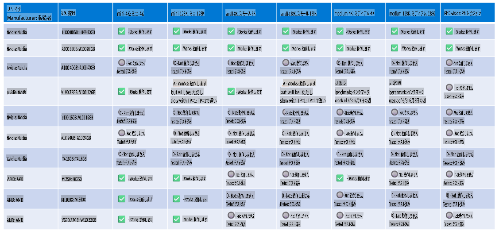

# Phi ハードウェアサポート

Microsoft Phi は ONNX Runtime に最適化されており、Windows DirectML をサポートしています。GPU、CPU、さらにはモバイルデバイスを含むさまざまなハードウェアタイプで良好に動作します。

## デバイスハードウェア
具体的にサポートされるハードウェアは以下の通りです：

- GPU SKU: RTX 4090 (DirectML)
- GPU SKU: 1 A100 80GB (CUDA)
- CPU SKU: Standard F64s v2 (64 vCPUs, 128 GiB メモリ)

## モバイル SKU

- Android - Samsung Galaxy S21
- Apple iPhone 14 以上 A16/A17 プロセッサ

## Phi ハードウェア仕様

- 必要な最小構成
- Windows: DirectX 12 対応 GPU と最小 4GB の統合 RAM

CUDA: Compute Capability >= 7.02 の NVIDIA GPU



## 複数 GPU で onnxruntime を実行する

現在利用可能な Phi ONNX モデルは 1 GPU 用のみです。Phi モデルでマルチ GPU をサポートすることは可能ですが、2 GPU を使用した ORT が 2 インスタンスの ORT と比較してスループットが向上することを保証するものではありません。最新情報については [ONNX Runtime](https://onnxruntime.ai/) を参照してください。

[Build 2024 the GenAI ONNX Team](https://youtu.be/WLW4SE8M9i8?si=EtG04UwDvcjunyfC) では、Phi モデル向けにマルチ GPU の代わりにマルチインスタンスを有効化したことが発表されました。

現在のところ、以下のように CUDA_VISIBLE_DEVICES 環境変数を使用して 1 つの onnnxruntime または onnxruntime-genai インスタンスを実行することが可能です。

```Python
CUDA_VISIBLE_DEVICES=0 python infer.py
CUDA_VISIBLE_DEVICES=1 python infer.py
```

[Azure AI Foundry](https://ai.azure.com) で Phi をさらに探求してみてください。

**免責事項**:  
この文書は、機械翻訳AIサービスを使用して翻訳されています。正確性を追求しておりますが、自動翻訳には誤りや不正確さが含まれる場合があります。元の言語で記載された文書を正式な情報源としてご参照ください。重要な情報については、専門の人間による翻訳を推奨します。本翻訳の使用に起因する誤解や解釈の相違について、当社は一切の責任を負いません。