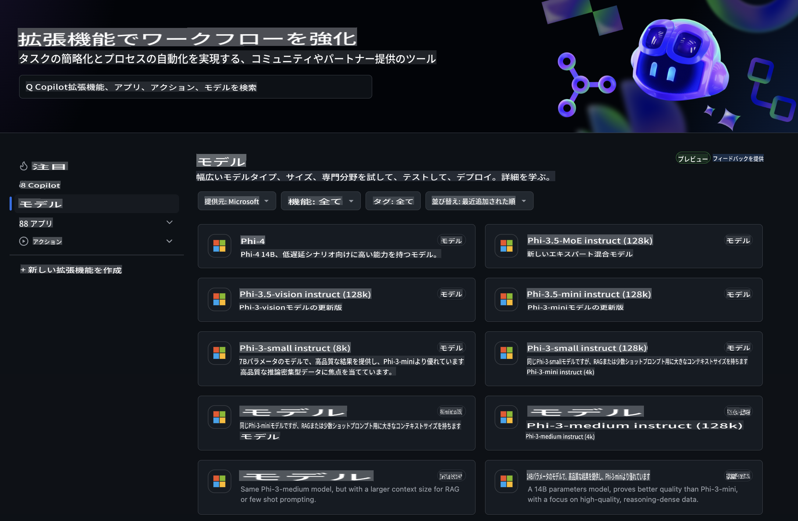
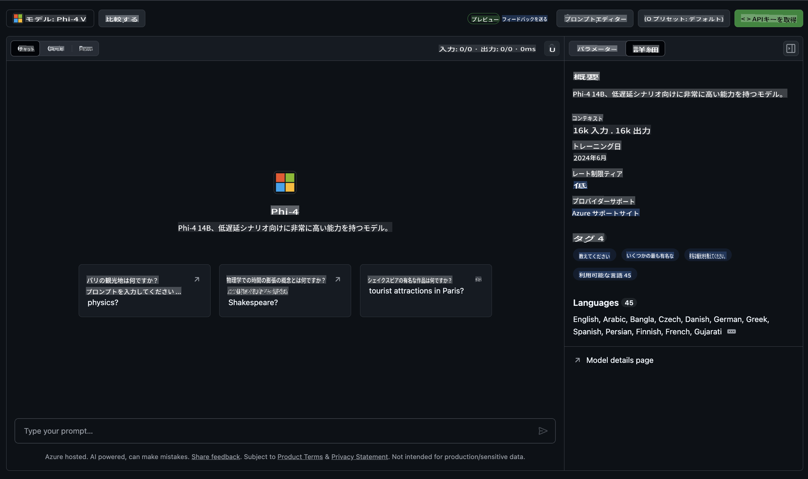
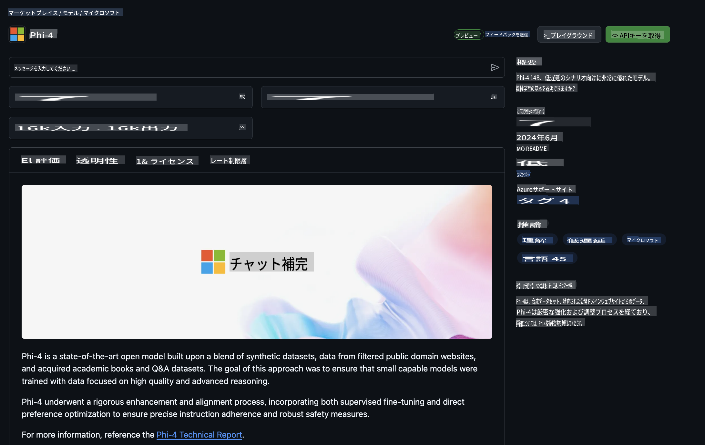

## GitHubモデルのPhiファミリー

[GitHub Models](https://github.com/marketplace/models) へようこそ！Azure AI上でホストされているAIモデルを探索する準備は万端です。



GitHub Modelsで利用可能なモデルについての詳細は、[GitHub Model Marketplace](https://github.com/marketplace/models)をご覧ください。

## 利用可能なモデル

各モデルには専用のプレイグラウンドとサンプルコードが用意されています。



### GitHub Model CatalogのPhiファミリー

- [Phi-4](https://github.com/marketplace/models/azureml/Phi-4)

- [Phi-3.5-MoE instruct (128k)](https://github.com/marketplace/models/azureml/Phi-3-5-MoE-instruct)

- [Phi-3.5-vision instruct (128k)](https://github.com/marketplace/models/azureml/Phi-3-5-vision-instruct)

- [Phi-3.5-mini instruct (128k)](https://github.com/marketplace/models/azureml/Phi-3-5-mini-instruct)

- [Phi-3-Medium-128k-Instruct](https://github.com/marketplace/models/azureml/Phi-3-medium-128k-instruct)

- [Phi-3-medium-4k-instruct](https://github.com/marketplace/models/azureml/Phi-3-medium-4k-instruct)

- [Phi-3-mini-128k-instruct](https://github.com/marketplace/models/azureml/Phi-3-mini-128k-instruct)

- [Phi-3-mini-4k-instruct](https://github.com/marketplace/models/azureml/Phi-3-mini-4k-instruct)

- [Phi-3-small-128k-instruct](https://github.com/marketplace/models/azureml/Phi-3-small-128k-instruct)

- [Phi-3-small-8k-instruct](https://github.com/marketplace/models/azureml/Phi-3-small-8k-instruct)

## はじめに

すぐに実行可能な基本的なサンプルがいくつか用意されています。これらはsamplesディレクトリにあります。特定のプログラミング言語に直接飛びたい場合は、以下の言語別サンプルをご覧ください：

- Python
- JavaScript
- C#
- Java
- cURL

また、サンプルやモデルを実行するための専用のCodespaces環境も用意されています。


## サンプルコード

以下にいくつかのユースケース向けのサンプルコードスニペットを示します。Azure AI Inference SDKの詳細情報については、完全なドキュメントとサンプルをご覧ください。

## セットアップ

1. 個人アクセストークンを作成
トークンに権限を付与する必要はありません。このトークンはMicrosoftのサービスに送信されます。

以下のコードスニペットを使用するには、環境変数を作成し、トークンをクライアントコードのキーとして設定してください。

bashを使用している場合：
```
export GITHUB_TOKEN="<your-github-token-goes-here>"
```
powershellを使用している場合：

```
$Env:GITHUB_TOKEN="<your-github-token-goes-here>"
```

Windowsコマンドプロンプトを使用している場合：

```
set GITHUB_TOKEN=<your-github-token-goes-here>
```

## Pythonサンプル

### 依存関係のインストール
pipを使用してAzure AI Inference SDKをインストールします（必要条件：Python >=3.8）：

```
pip install azure-ai-inference
```
### 基本的なコードサンプルを実行

このサンプルでは、チャット補完APIへの基本的な呼び出しを示します。GitHub AIモデル推論エンドポイントとGitHubトークンを利用しています。この呼び出しは同期型です。

```python
import os
from azure.ai.inference import ChatCompletionsClient
from azure.ai.inference.models import SystemMessage, UserMessage
from azure.core.credentials import AzureKeyCredential

endpoint = "https://models.inference.ai.azure.com"
model_name = "Phi-4"
token = os.environ["GITHUB_TOKEN"]

client = ChatCompletionsClient(
    endpoint=endpoint,
    credential=AzureKeyCredential(token),
)

response = client.complete(
    messages=[
        UserMessage(content="I have $20,000 in my savings account, where I receive a 4% profit per year and payments twice a year. Can you please tell me how long it will take for me to become a millionaire? Also, can you please explain the math step by step as if you were explaining it to an uneducated person?"),
    ],
    temperature=0.4,
    top_p=1.0,
    max_tokens=2048,
    model=model_name
)

print(response.choices[0].message.content)
```

### 複数ターンの会話を実行

このサンプルでは、チャット補完APIを使用した複数ターンの会話を示します。チャットアプリケーションでモデルを使用する場合、会話の履歴を管理し、最新のメッセージをモデルに送信する必要があります。

```
import os
from azure.ai.inference import ChatCompletionsClient
from azure.ai.inference.models import AssistantMessage, SystemMessage, UserMessage
from azure.core.credentials import AzureKeyCredential

token = os.environ["GITHUB_TOKEN"]
endpoint = "https://models.inference.ai.azure.com"
# Replace Model_Name
model_name = "Phi-4"

client = ChatCompletionsClient(
    endpoint=endpoint,
    credential=AzureKeyCredential(token),
)

messages = [
    SystemMessage(content="You are a helpful assistant."),
    UserMessage(content="What is the capital of France?"),
    AssistantMessage(content="The capital of France is Paris."),
    UserMessage(content="What about Spain?"),
]

response = client.complete(messages=messages, model=model_name)

print(response.choices[0].message.content)
```

### 出力をストリーミング

より良いユーザー体験のために、モデルの応答をストリーミングして最初のトークンを早めに表示し、長い応答を待つことを避けることができます。

```
import os
from azure.ai.inference import ChatCompletionsClient
from azure.ai.inference.models import SystemMessage, UserMessage
from azure.core.credentials import AzureKeyCredential

token = os.environ["GITHUB_TOKEN"]
endpoint = "https://models.inference.ai.azure.com"
# Replace Model_Name
model_name = "Phi-4"

client = ChatCompletionsClient(
    endpoint=endpoint,
    credential=AzureKeyCredential(token),
)

response = client.complete(
    stream=True,
    messages=[
        SystemMessage(content="You are a helpful assistant."),
        UserMessage(content="Give me 5 good reasons why I should exercise every day."),
    ],
    model=model_name,
)

for update in response:
    if update.choices:
        print(update.choices[0].delta.content or "", end="")

client.close()
```

## GitHub Modelsの無料利用とレート制限



[プレイグラウンドおよび無料API利用のレート制限](https://docs.github.com/en/github-models/prototyping-with-ai-models#rate-limits)は、モデルの実験やAIアプリケーションのプロトタイピングを支援することを目的としています。これらの制限を超えて利用する場合やアプリケーションをスケールさせる場合は、Azureアカウントからリソースをプロビジョニングし、GitHub個人アクセストークンではなくAzureから認証する必要があります。それ以外のコード変更は不要です。Azure AIで無料枠を超える方法については、こちらのリンクをご覧ください。

### 免責事項

モデルとやり取りする際には、AIを使った実験を行っていることを忘れないでください。そのため、内容に誤りが含まれる可能性があります。

この機能には、リクエスト数（1分あたり、1日あたり）、リクエストごとのトークン数、同時リクエスト数など、さまざまな制限があります。プロダクションユースケースには対応していません。

GitHub ModelsはAzure AI Content Safetyを使用しています。これらのフィルタはGitHub Modelsの体験の一部として無効化することはできません。有料サービスを通じてモデルを利用する場合、必要に応じてコンテンツフィルタを設定してください。

このサービスはGitHubのプレリリース規約に基づいています。

**免責事項**:  
本書類は、AIによる機械翻訳サービスを使用して翻訳されています。正確性を追求しておりますが、自動翻訳にはエラーや不正確な表現が含まれる可能性があります。原文（原言語の書類）が信頼できる正式な情報源とみなされるべきです。重要な情報については、専門の人間による翻訳を推奨します。本翻訳の使用に起因する誤解や誤解釈について、当方は一切の責任を負いません。