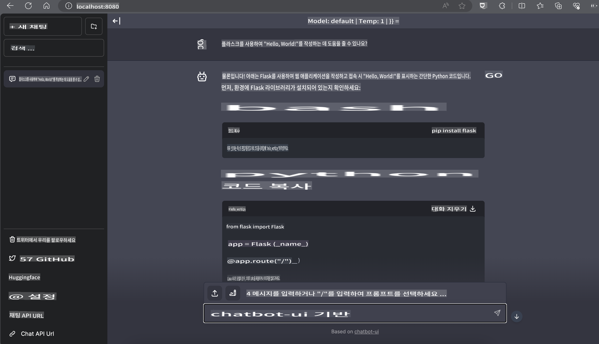

# **Nvidia Jetson에서 Phi-3 추론**

Nvidia Jetson은 Nvidia의 임베디드 컴퓨팅 보드 시리즈입니다. Jetson TK1, TX1, TX2 모델은 모두 Nvidia의 Tegra 프로세서(또는 SoC)를 탑재하고 있으며, ARM 아키텍처의 중앙 처리 장치(CPU)를 통합하고 있습니다. Jetson은 저전력 시스템으로, 머신러닝 애플리케이션을 가속화하도록 설계되었습니다. Nvidia Jetson은 모든 산업 분야에서 혁신적인 AI 제품을 개발하는 전문 개발자들과, 실습을 통해 AI를 배우고 놀라운 프로젝트를 만드는 학생 및 열정적인 사용자들에게 사용되고 있습니다. SLM은 Jetson과 같은 엣지 디바이스에 배포되어, 산업용 생성 AI 애플리케이션 시나리오를 더 효과적으로 구현할 수 있게 합니다.

## NVIDIA Jetson에서의 배포:
자율 로봇 및 임베디드 디바이스를 다루는 개발자는 Phi-3 Mini를 활용할 수 있습니다. Phi-3는 상대적으로 크기가 작아 엣지 배포에 이상적입니다. 훈련 과정에서 매개변수가 세밀하게 조정되어 높은 응답 정확도를 보장합니다.

### TensorRT-LLM 최적화:
NVIDIA의 [TensorRT-LLM 라이브러리](https://github.com/NVIDIA/TensorRT-LLM?WT.mc_id=aiml-138114-kinfeylo)는 대형 언어 모델 추론을 최적화합니다. 이는 Phi-3 Mini의 긴 컨텍스트 윈도우를 지원하며, 처리량과 지연 시간을 모두 개선합니다. 최적화에는 LongRoPE, FP8, 인플라이트 배칭과 같은 기술이 포함됩니다.

### 가용성과 배포:
개발자는 [NVIDIA의 AI](https://www.nvidia.com/en-us/ai-data-science/generative-ai/)에서 128K 컨텍스트 윈도우를 갖춘 Phi-3 Mini를 탐색할 수 있습니다. 이는 표준 API를 가진 마이크로서비스인 NVIDIA NIM으로 패키징되어 어디에서나 배포할 수 있습니다. 또한, [GitHub의 TensorRT-LLM 구현](https://github.com/NVIDIA/TensorRT-LLM)도 참고할 수 있습니다.

## **1. 준비 단계**

a. Jetson Orin NX / Jetson NX

b. JetPack 5.1.2+
   
c. Cuda 11.8
   
d. Python 3.8+

## **2. Jetson에서 Phi-3 실행하기**

[Ollama](https://ollama.com) 또는 [LlamaEdge](https://llamaedge.com)를 선택할 수 있습니다.

클라우드와 엣지 디바이스에서 gguf를 동시에 사용하고자 한다면, LlamaEdge는 WasmEdge로 이해할 수 있습니다. WasmEdge는 클라우드 네이티브, 엣지 및 분산 애플리케이션에 적합한 경량, 고성능, 확장 가능한 WebAssembly 런타임입니다. 이는 서버리스 애플리케이션, 임베디드 함수, 마이크로서비스, 스마트 계약 및 IoT 디바이스를 지원합니다. LlamaEdge를 통해 gguf의 양자화 모델을 엣지 디바이스와 클라우드에 배포할 수 있습니다.


다음은 사용하는 단계입니다:

1. 관련 라이브러리와 파일 설치 및 다운로드

```bash

curl -sSf https://raw.githubusercontent.com/WasmEdge/WasmEdge/master/utils/install.sh | bash -s -- --plugin wasi_nn-ggml

curl -LO https://github.com/LlamaEdge/LlamaEdge/releases/latest/download/llama-api-server.wasm

curl -LO https://github.com/LlamaEdge/chatbot-ui/releases/latest/download/chatbot-ui.tar.gz

tar xzf chatbot-ui.tar.gz

```

**참고**: llama-api-server.wasm과 chatbot-ui는 동일한 디렉토리에 있어야 합니다.

2. 터미널에서 스크립트 실행

```bash

wasmedge --dir .:. --nn-preload default:GGML:AUTO:{Your gguf path} llama-api-server.wasm -p phi-3-chat

```

다음은 실행 결과입니다:



***샘플 코드*** [Phi-3 mini WASM Notebook Sample](https://github.com/Azure-Samples/Phi-3MiniSamples/tree/main/wasm)

요약하자면, Phi-3 Mini는 효율성, 컨텍스트 인식, 그리고 NVIDIA의 최적화 역량을 결합하여 언어 모델링에서 큰 도약을 이뤄냈습니다. 로봇이나 엣지 애플리케이션을 구축하는 경우, Phi-3 Mini는 반드시 알아야 할 강력한 도구입니다.

**면책조항**:  
이 문서는 기계 기반 AI 번역 서비스를 사용하여 번역되었습니다. 정확성을 위해 노력하고 있지만, 자동 번역에는 오류나 부정확성이 포함될 수 있습니다. 원본 문서의 원어 버전이 권위 있는 출처로 간주되어야 합니다. 중요한 정보의 경우, 전문 인간 번역을 권장합니다. 이 번역 사용으로 인해 발생하는 오해나 잘못된 해석에 대해 당사는 책임을 지지 않습니다.