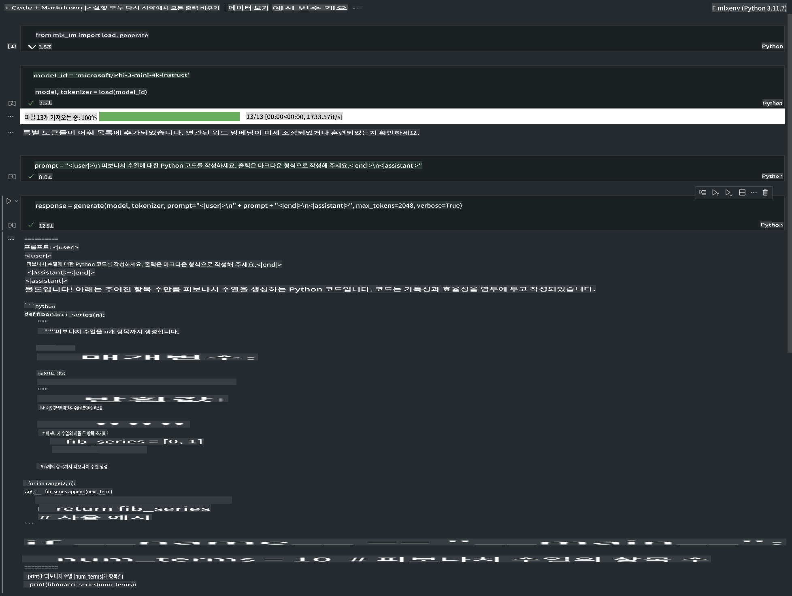

# **Apple MLX 프레임워크로 Phi-3 추론하기**

## **MLX 프레임워크란**

MLX는 Apple 실리콘에서 머신 러닝 연구를 위한 배열 프레임워크로, Apple 머신 러닝 연구팀이 개발했습니다.

MLX는 머신 러닝 연구자들을 위해 설계된 프레임워크로, 사용자 친화적이면서도 모델을 효율적으로 학습하고 배포할 수 있도록 만들어졌습니다. 프레임워크 자체의 설계는 개념적으로도 간단하며, 연구자들이 새로운 아이디어를 빠르게 탐구할 수 있도록 MLX를 확장하고 개선하기 쉽게 만드는 것을 목표로 하고 있습니다.

Apple 실리콘 장치에서 MLX를 통해 LLM을 가속화할 수 있으며, 모델을 로컬에서 매우 편리하게 실행할 수 있습니다.

## **MLX를 사용하여 Phi-3-mini 추론하기**

### **1. MLX 환경 설정하기**

1. Python 3.11.x  
2. MLX 라이브러리 설치  

```bash

pip install mlx-lm

```

### **2. 터미널에서 MLX로 Phi-3-mini 실행하기**

```bash

python -m mlx_lm.generate --model microsoft/Phi-3-mini-4k-instruct --max-token 2048 --prompt  "<|user|>\nCan you introduce yourself<|end|>\n<|assistant|>"

```

결과 (제 환경은 Apple M1 Max, 64GB)는 다음과 같습니다.


### **3. MLX로 Phi-3-mini 양자화하기**

```bash

python -m mlx_lm.convert --hf-path microsoft/Phi-3-mini-4k-instruct

```

***참고：*** 모델은 `mlx_lm.convert`를 통해 양자화할 수 있으며, 기본 양자화는 INT4입니다. 이 예제에서는 Phi-3-mini를 INT4로 양자화합니다.

모델은 `mlx_lm.convert`를 통해 양자화할 수 있으며, 기본 양자화는 INT4입니다. 이 예제는 Phi-3-mini를 INT4로 양자화하는 과정입니다. 양자화된 모델은 기본 디렉토리 `./mlx_model`에 저장됩니다.

터미널에서 MLX를 사용해 양자화된 모델을 테스트할 수 있습니다.

```bash

python -m mlx_lm.generate --model ./mlx_model/ --max-token 2048 --prompt  "<|user|>\nCan you introduce yourself<|end|>\n<|assistant|>"

```

결과는 다음과 같습니다.


### **4. Jupyter Notebook에서 MLX로 Phi-3-mini 실행하기**



***참고:*** 이 샘플을 참고하세요 [이 링크를 클릭하세요](../../../../../code/03.Inference/MLX/MLX_DEMO.ipynb)

## **리소스**

1. Apple MLX 프레임워크에 대해 알아보기 [https://ml-explore.github.io](https://ml-explore.github.io/mlx/build/html/index.html)

2. Apple MLX GitHub 저장소 [https://github.com/ml-explore](https://github.com/ml-explore)

**면책 조항**:  
이 문서는 AI 기반 기계 번역 서비스를 사용하여 번역되었습니다. 정확성을 위해 노력하고 있으나, 자동 번역에는 오류나 부정확성이 포함될 수 있음을 알려드립니다. 원어로 작성된 원본 문서를 신뢰할 수 있는 권위 있는 자료로 간주해야 합니다. 중요한 정보의 경우, 전문적인 인간 번역을 권장합니다. 이 번역 사용으로 인해 발생하는 오해나 잘못된 해석에 대해 당사는 책임을 지지 않습니다.