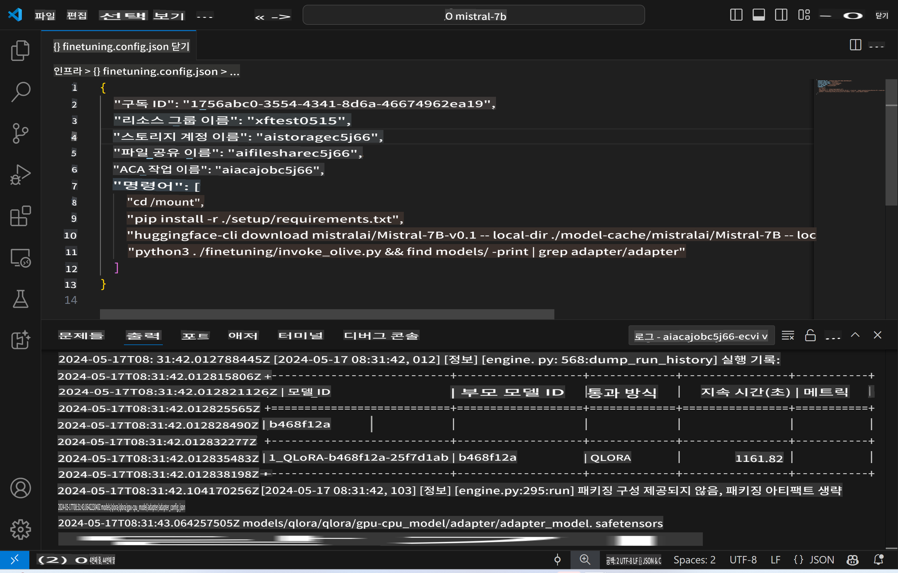
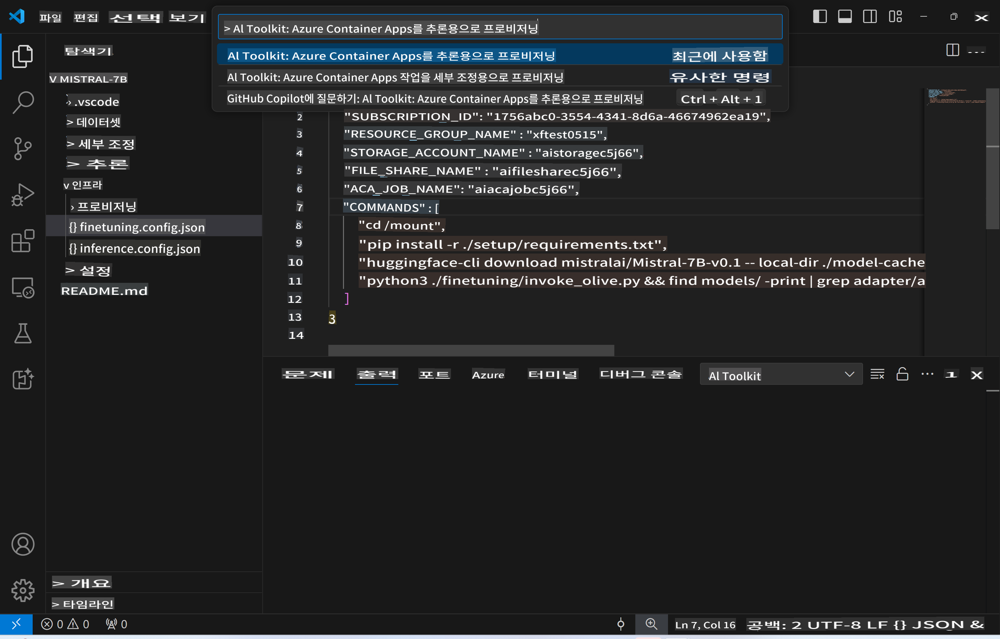
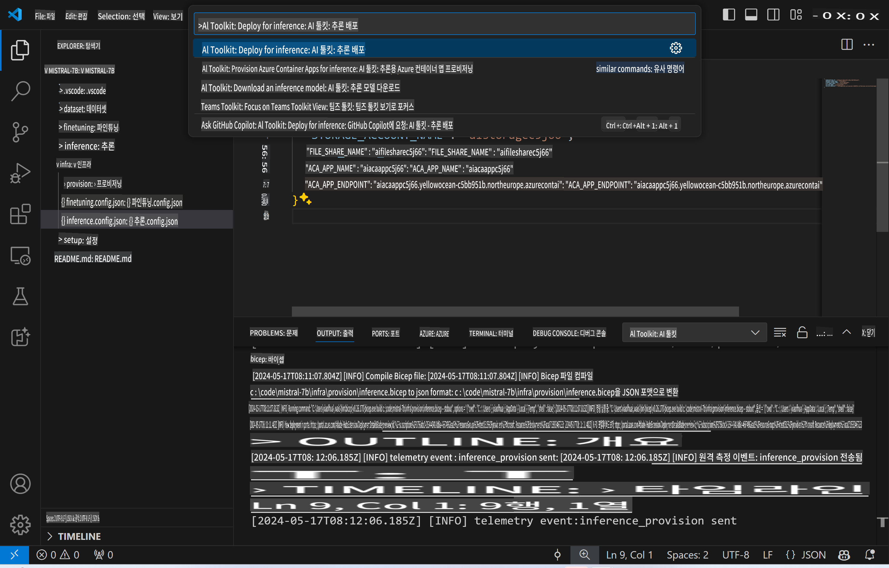
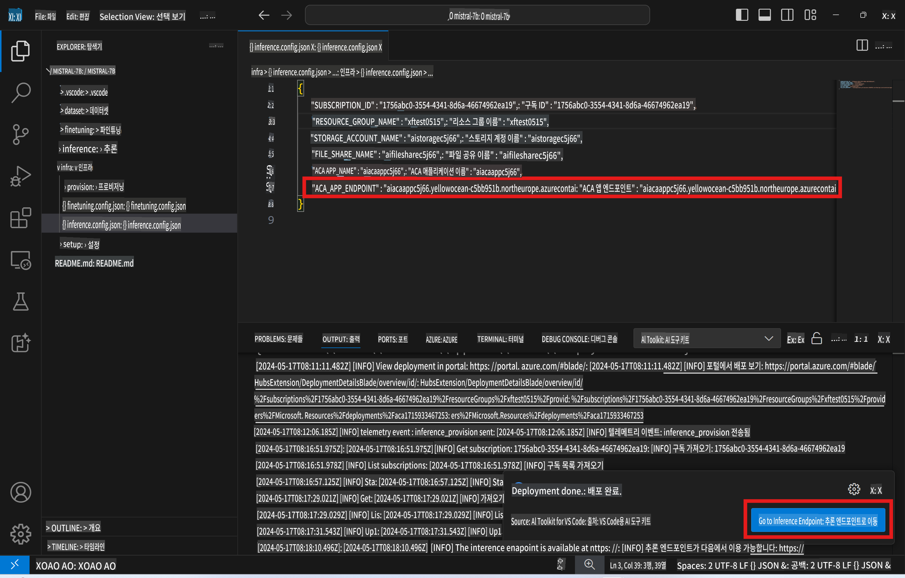

# 미세 조정된 모델을 활용한 원격 추론

원격 환경에서 어댑터 훈련이 완료되면, 간단한 Gradio 애플리케이션을 사용해 모델과 상호작용할 수 있습니다.



### Azure 리소스 프로비저닝
명령 팔레트에서 `AI Toolkit: Provision Azure Container Apps for inference`를 실행하여 원격 추론을 위한 Azure 리소스를 설정해야 합니다. 이 과정에서 Azure 구독 및 리소스 그룹을 선택하라는 요청을 받게 됩니다.  


기본적으로, 추론에 사용되는 구독 및 리소스 그룹은 미세 조정에 사용된 것과 동일해야 합니다. 추론은 동일한 Azure Container App 환경을 사용하며, 미세 조정 단계에서 생성된 Azure Files에 저장된 모델 및 모델 어댑터에 접근합니다.

## AI Toolkit 사용하기

### 추론을 위한 배포  
추론 코드를 수정하거나 추론 모델을 다시 로드하려면 `AI Toolkit: Deploy for inference` 명령을 실행하세요. 이 명령은 최신 코드를 ACA와 동기화하고 복제본을 재시작합니다.



배포가 성공적으로 완료되면, 이제 이 엔드포인트를 사용하여 모델 평가를 진행할 수 있습니다.

### 추론 API 접근

VSCode 알림에 표시된 "*Go to Inference Endpoint*" 버튼을 클릭하여 추론 API에 접근할 수 있습니다. 또는, 웹 API 엔드포인트는 `ACA_APP_ENDPOINT`에서 `./infra/inference.config.json`와 출력 패널에서 확인할 수 있습니다.



> **참고:** 추론 엔드포인트가 완전히 작동 가능해지기까지 몇 분이 걸릴 수 있습니다.

## 템플릿에 포함된 추론 구성 요소

| 폴더 | 내용 |
| ------ |--------- |
| `infra` | 원격 작업에 필요한 모든 설정을 포함합니다. |
| `infra/provision/inference.parameters.json` | 추론을 위한 Azure 리소스 프로비저닝에 사용되는 bicep 템플릿의 매개변수를 포함합니다. |
| `infra/provision/inference.bicep` | 추론을 위한 Azure 리소스 프로비저닝 템플릿을 포함합니다. |
| `infra/inference.config.json` | `AI Toolkit: Provision Azure Container Apps for inference` 명령에 의해 생성된 설정 파일로, 다른 원격 명령 팔레트의 입력으로 사용됩니다. |

### AI Toolkit을 사용하여 Azure 리소스 프로비저닝 설정하기
[AI Toolkit](https://marketplace.visualstudio.com/items?itemName=ms-windows-ai-studio.windows-ai-studio)을 설정하세요.

` command.

You can find configuration parameters in `./infra/provision/inference.parameters.json` file. Here are the details:
| Parameter | Description |
| --------- |------------ |
| `defaultCommands` | This is the commands to initiate a web API. |
| `maximumInstanceCount` | This parameter sets the maximum capacity of GPU instances. |
| `location` | This is the location where Azure resources are provisioned. The default value is the same as the chosen resource group's location. |
| `storageAccountName`, `fileShareName` `acaEnvironmentName`, `acaEnvironmentStorageName`, `acaAppName`,  `acaLogAnalyticsName` | These parameters are used to name the Azure resources for provision. By default, they will be same to the fine-tuning resource name. You can input a new, unused resource name to create your own custom-named resources, or you can input the name of an already existing Azure resource if you'd prefer to use that. For details, refer to the section [Using existing Azure Resources](../../../../../md/01.Introduction/03). |

### Using Existing Azure Resources

By default, the inference provision use the same Azure Container App Environment, Storage Account, Azure File Share, and Azure Log Analytics that were used for fine-tuning. A separate Azure Container App is created solely for the inference API. 

If you have customized the Azure resources during the fine-tuning step or want to use your own existing Azure resources for inference, specify their names in the `./infra/inference.parameters.json` 파일에서 Azure Container Apps를 프로비저닝하세요. 그런 다음, 명령 팔레트에서 `AI Toolkit: Provision Azure Container Apps for inference` 명령을 실행하세요. 이는 지정된 리소스를 업데이트하고 누락된 리소스를 생성합니다.

예를 들어, 기존의 Azure 컨테이너 환경이 있는 경우, `./infra/finetuning.parameters.json` 파일은 다음과 같이 구성되어야 합니다:

```json
{
    "$schema": "https://schema.management.azure.com/schemas/2019-04-01/deploymentParameters.json#",
    "contentVersion": "1.0.0.0",
    "parameters": {
      ...
      "acaEnvironmentName": {
        "value": "<your-aca-env-name>"
      },
      "acaEnvironmentStorageName": {
        "value": null
      },
      ...
    }
  }
```

### 수동 프로비저닝  
Azure 리소스를 수동으로 구성하려는 경우, `./infra/provision` folders. If you have already set up and configured all the Azure resources without using the AI Toolkit command palette, you can simply enter the resource names in the `inference.config.json` 파일에 제공된 bicep 파일을 사용할 수 있습니다.

예시:

```json
{
  "SUBSCRIPTION_ID": "<your-subscription-id>",
  "RESOURCE_GROUP_NAME": "<your-resource-group-name>",
  "STORAGE_ACCOUNT_NAME": "<your-storage-account-name>",
  "FILE_SHARE_NAME": "<your-file-share-name>",
  "ACA_APP_NAME": "<your-aca-name>",
  "ACA_APP_ENDPOINT": "<your-aca-endpoint>"
}
```

**면책 조항**:  
이 문서는 기계 기반 AI 번역 서비스를 사용하여 번역되었습니다. 정확성을 위해 노력하고 있지만, 자동 번역에는 오류나 부정확성이 포함될 수 있습니다. 원문이 작성된 언어의 문서를 권위 있는 자료로 간주해야 합니다. 중요한 정보의 경우, 전문 번역가에 의한 번역을 권장합니다. 이 번역 사용으로 인해 발생하는 오해나 잘못된 해석에 대해 당사는 책임을 지지 않습니다.