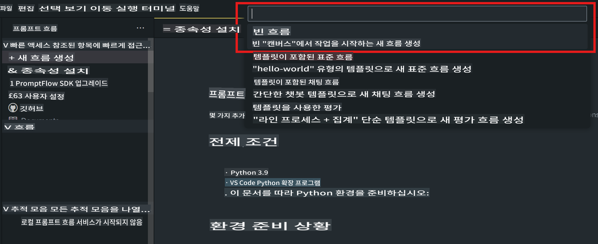
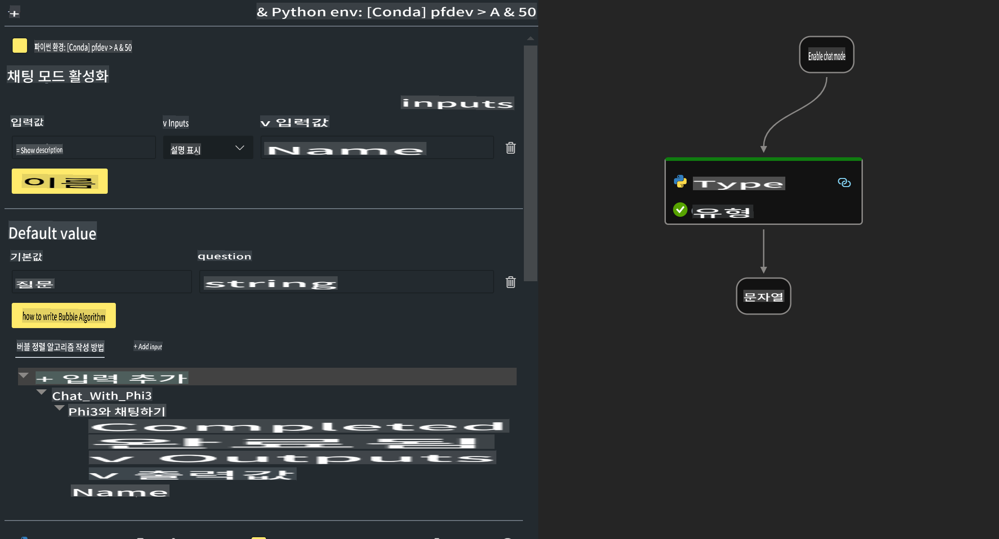

# **Lab 2 - AIPC에서 Phi-3-mini를 사용하여 Prompt flow 실행하기**

## **Prompt flow란 무엇인가**

Prompt flow는 LLM 기반 AI 애플리케이션의 아이디어 구상, 프로토타이핑, 테스트, 평가부터 프로덕션 배포 및 모니터링까지의 전체 개발 주기를 간소화하기 위해 설계된 개발 도구 모음입니다. 이를 통해 프롬프트 엔지니어링이 훨씬 쉬워지고, 프로덕션 품질의 LLM 애플리케이션을 구축할 수 있습니다.

Prompt flow를 사용하면 다음을 수행할 수 있습니다:

- LLM, 프롬프트, Python 코드 및 기타 도구를 실행 가능한 워크플로우로 연결하는 플로우를 생성할 수 있습니다.

- 특히 LLM과의 상호작용을 쉽게 디버그하고 반복적으로 개선할 수 있습니다.

- 플로우를 평가하고, 더 큰 데이터 세트를 사용해 품질 및 성능 지표를 계산할 수 있습니다.

- 테스트 및 평가를 CI/CD 시스템에 통합하여 플로우의 품질을 보장할 수 있습니다.

- 선택한 서빙 플랫폼에 플로우를 배포하거나 애플리케이션 코드 베이스에 쉽게 통합할 수 있습니다.

- (선택 사항이지만 강력히 권장) Azure AI의 클라우드 버전을 활용하여 팀과 협업할 수 있습니다.

## **AIPC란 무엇인가**

AI PC는 각각 고유한 AI 가속 기능을 가진 CPU, GPU 및 NPU를 포함하고 있습니다. NPU(Neural Processing Unit)는 클라우드로 데이터를 전송하여 처리하지 않고, PC 자체에서 AI 및 머신러닝 작업을 처리하는 특수 가속기입니다. GPU와 CPU도 이러한 작업을 처리할 수 있지만, NPU는 저전력 AI 계산에 특히 뛰어납니다. AI PC는 컴퓨터 운영 방식에 있어 근본적인 변화를 나타냅니다. 이는 이전에는 존재하지 않았던 문제를 해결하기 위한 솔루션이 아니라, 일상적인 PC 사용 경험을 크게 개선하기 위한 것입니다.

그렇다면 어떻게 작동할까요? 대규모 공개 데이터를 기반으로 학습된 생성 AI 및 대형 언어 모델(LLM)과 비교하여, PC에서 실행되는 AI는 거의 모든 측면에서 더 접근 가능합니다. 개념이 더 이해하기 쉽고, 클라우드에 접근할 필요 없이 사용자의 데이터를 기반으로 학습되기 때문에 더 넓은 사용자층에게 즉각적인 매력을 제공합니다.

단기적으로 AI PC는 개인 비서와 더 작은 AI 모델이 사용자의 PC에서 직접 실행되며, 사용자의 데이터를 활용해 더 개인적이고, 프라이버시를 보호하며, 더 안전한 AI 기능을 제공합니다. 예를 들어, 회의록 작성, 판타지 풋볼 리그 구성, 사진 및 비디오 편집 자동화, 또는 가족 모임 일정을 모두의 도착 및 출발 시간에 맞게 완벽히 계획하는 것과 같은 일상적인 작업을 지원합니다.

## **AIPC에서 생성 코드 플로우 구축하기**

***참고***: 환경 설치를 완료하지 않았다면, [Lab 0 - 설치](./01.Installations.md)를 참조하세요.

1. Visual Studio Code에서 Prompt flow 확장을 열고 빈 플로우 프로젝트를 생성합니다.



2. 입력 및 출력 매개변수를 추가하고 Python 코드를 새 플로우로 추가합니다.



flow.dag.yaml 파일을 참조하여 플로우를 구성할 수 있습니다.

```yaml

inputs:
  question:
    type: string
    default: how to write Bubble Algorithm
outputs:
  answer:
    type: string
    reference: ${Chat_With_Phi3.output}
nodes:
- name: Chat_With_Phi3
  type: python
  source:
    type: code
    path: Chat_With_Phi3.py
  inputs:
    question: ${inputs.question}


```

3. ***Chat_With_Phi3.py***에 코드를 추가합니다.

```python


from promptflow.core import tool

# import torch
from transformers import AutoTokenizer, pipeline,TextStreamer
import intel_npu_acceleration_library as npu_lib

import warnings

import asyncio
import platform

class Phi3CodeAgent:
    
    model = None
    tokenizer = None
    text_streamer = None
    
    model_id = "microsoft/Phi-3-mini-4k-instruct"

    @staticmethod
    def init_phi3():
        
        if Phi3CodeAgent.model is None or Phi3CodeAgent.tokenizer is None or Phi3CodeAgent.text_streamer is None:
            Phi3CodeAgent.model = npu_lib.NPUModelForCausalLM.from_pretrained(
                                    Phi3CodeAgent.model_id,
                                    torch_dtype="auto",
                                    dtype=npu_lib.int4,
                                    trust_remote_code=True
                                )
            Phi3CodeAgent.tokenizer = AutoTokenizer.from_pretrained(Phi3CodeAgent.model_id)
            Phi3CodeAgent.text_streamer = TextStreamer(Phi3CodeAgent.tokenizer, skip_prompt=True)

    

    @staticmethod
    def chat_with_phi3(prompt):
        
        Phi3CodeAgent.init_phi3()

        messages = "<|system|>You are a AI Python coding assistant. Please help me to generate code in Python.The answer only genertated Python code, but any comments and instructions do not need to be generated<|end|><|user|>" + prompt +"<|end|><|assistant|>"


        generation_args = {
            "max_new_tokens": 1024,
            "return_full_text": False,
            "temperature": 0.3,
            "do_sample": False,
            "streamer": Phi3CodeAgent.text_streamer,
        }

        pipe = pipeline(
            "text-generation",
            model=Phi3CodeAgent.model,
            tokenizer=Phi3CodeAgent.tokenizer,
            # **generation_args
        )

        result = ''

        with warnings.catch_warnings():
            warnings.simplefilter("ignore")
            response = pipe(messages, **generation_args)
            result =response[0]['generated_text']
            return result


@tool
def my_python_tool(question: str) -> str:
    if platform.system() == 'Windows':
        asyncio.set_event_loop_policy(asyncio.WindowsSelectorEventLoopPolicy())
    return Phi3CodeAgent.chat_with_phi3(question)


```

4. 디버그 또는 실행 기능을 통해 플로우를 테스트하여 생성 코드가 제대로 작동하는지 확인합니다.


5. 터미널에서 개발 API로 플로우를 실행합니다.

```

pf flow serve --source ./ --port 8080 --host localhost   

```

Postman 또는 Thunder Client에서 테스트할 수 있습니다.

### **참고 사항**

1. 첫 실행은 시간이 오래 걸립니다. Hugging Face CLI에서 phi-3 모델을 다운로드하는 것을 권장합니다.

2. Intel NPU의 제한된 계산 성능을 고려하여 Phi-3-mini-4k-instruct를 사용하는 것이 좋습니다.

3. INT4 변환을 양자화하기 위해 Intel NPU 가속을 사용하지만, 서비스를 다시 실행하려면 캐시와 nc_workshop 폴더를 삭제해야 합니다.

## **리소스**

1. Promptflow 학습하기 [https://microsoft.github.io/promptflow/](https://microsoft.github.io/promptflow/)

2. Intel NPU 가속 학습하기 [https://github.com/intel/intel-npu-acceleration-library](https://github.com/intel/intel-npu-acceleration-library)

3. 샘플 코드 다운로드 [로컬 NPU 에이전트 샘플 코드](../../../../../../../../../code/07.Lab/01/AIPC)

**면책 조항**:  
이 문서는 AI 기반 기계 번역 서비스를 사용하여 번역되었습니다. 정확성을 위해 노력하고 있지만, 자동 번역에는 오류나 부정확성이 포함될 수 있습니다. 원본 문서의 모국어 버전이 권위 있는 자료로 간주되어야 합니다. 중요한 정보에 대해서는 전문적인 인간 번역을 권장합니다. 이 번역 사용으로 인해 발생하는 오해나 잘못된 해석에 대해 당사는 책임을 지지 않습니다.