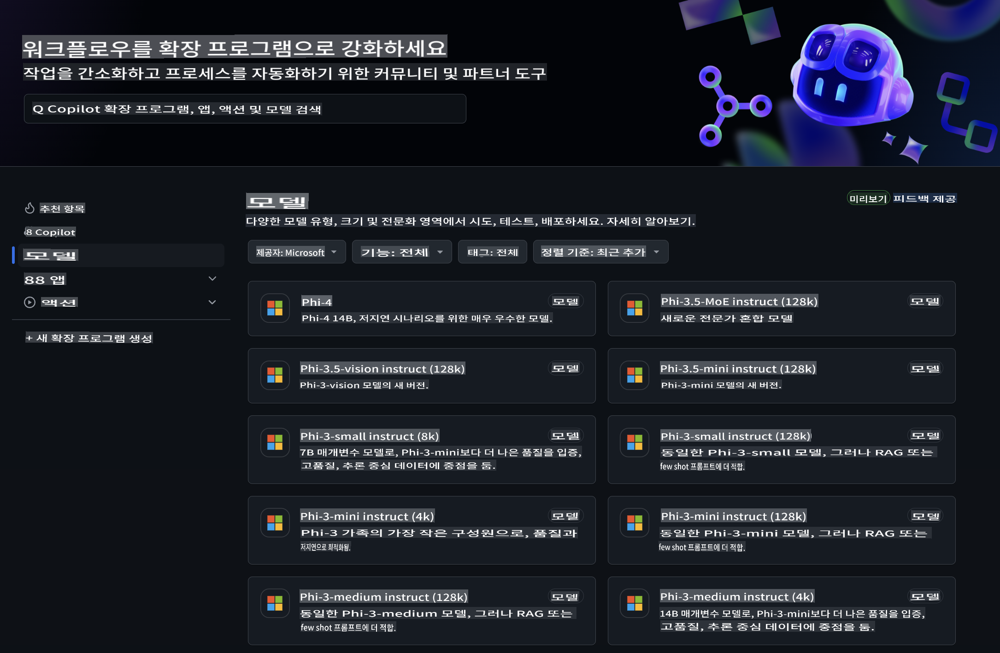
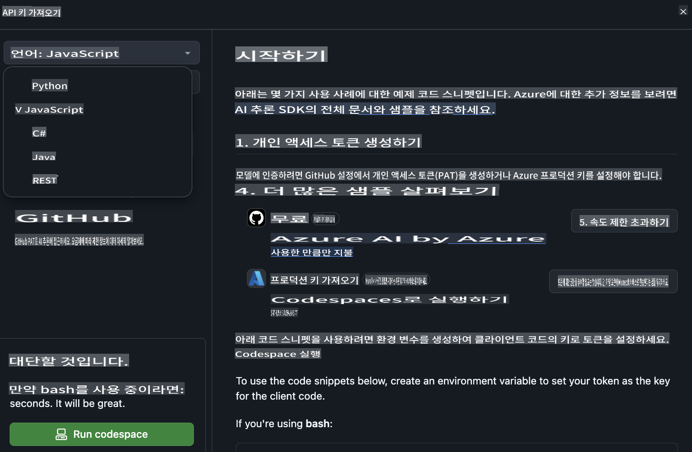

## GitHub Models - 제한된 공개 베타

[GitHub Models](https://github.com/marketplace/models)에 오신 것을 환영합니다! Azure AI에 호스팅된 AI 모델을 탐색할 준비가 모두 완료되었습니다.



GitHub Models에서 제공되는 모델에 대한 자세한 정보는 [GitHub Model Marketplace](https://github.com/marketplace/models)를 확인하세요.

## 사용 가능한 모델

각 모델은 전용 플레이그라운드와 샘플 코드를 제공합니다.


### GitHub Model Catalog의 Phi-3 모델

[Phi-3-Medium-128k-Instruct](https://github.com/marketplace/models/azureml/Phi-3-medium-128k-instruct)

[Phi-3-medium-4k-instruct](https://github.com/marketplace/models/azureml/Phi-3-medium-4k-instruct)

[Phi-3-mini-128k-instruct](https://github.com/marketplace/models/azureml/Phi-3-mini-128k-instruct)

[Phi-3-mini-4k-instruct](https://github.com/marketplace/models/azureml/Phi-3-mini-4k-instruct)

[Phi-3-small-128k-instruct](https://github.com/marketplace/models/azureml/Phi-3-small-128k-instruct)

[Phi-3-small-8k-instruct](https://github.com/marketplace/models/azureml/Phi-3-small-8k-instruct)

## 시작하기

실행할 준비가 된 몇 가지 기본 예제가 준비되어 있습니다. 샘플 디렉토리에서 확인할 수 있습니다. 선호하는 언어로 바로 시작하고 싶다면, 아래 언어들로 된 예제를 확인하세요:

- Python
- JavaScript
- cURL

샘플과 모델을 실행할 수 있는 전용 Codespaces 환경도 준비되어 있습니다.



## 샘플 코드

아래는 몇 가지 사용 사례에 대한 예제 코드 스니펫입니다. Azure AI Inference SDK에 대한 추가 정보는 전체 문서와 샘플을 참조하세요.

## 설정

1. 개인 액세스 토큰 생성  
토큰에 대한 권한을 부여할 필요는 없습니다. 생성된 토큰은 Microsoft 서비스로 전송됩니다.

아래 코드 스니펫을 사용하려면 환경 변수를 생성하여 클라이언트 코드의 키로 토큰을 설정하세요.

bash를 사용하는 경우:  
```
export GITHUB_TOKEN="<your-github-token-goes-here>"
```  
powershell을 사용하는 경우:  
```
$Env:GITHUB_TOKEN="<your-github-token-goes-here>"
```  

Windows 명령 프롬프트를 사용하는 경우:  
```
set GITHUB_TOKEN=<your-github-token-goes-here>
```  

## Python 샘플

### 의존성 설치  
pip을 사용해 Azure AI Inference SDK 설치 (요구사항: Python >=3.8):  
```
pip install azure-ai-inference
```  

### 기본 코드 샘플 실행  

이 샘플은 chat completion API에 대한 기본 호출을 보여줍니다. GitHub AI 모델 추론 엔드포인트와 GitHub 토큰을 사용합니다. 호출은 동기적으로 이루어집니다.  

```
import os
from azure.ai.inference import ChatCompletionsClient
from azure.ai.inference.models import SystemMessage, UserMessage
from azure.core.credentials import AzureKeyCredential

endpoint = "https://models.inference.ai.azure.com"
# Replace Model_Name 
model_name = "Phi-3-small-8k-instruct"
token = os.environ["GITHUB_TOKEN"]

client = ChatCompletionsClient(
    endpoint=endpoint,
    credential=AzureKeyCredential(token),
)

response = client.complete(
    messages=[
        SystemMessage(content="You are a helpful assistant."),
        UserMessage(content="What is the capital of France?"),
    ],
    model=model_name,
    temperature=1.,
    max_tokens=1000,
    top_p=1.
)

print(response.choices[0].message.content)
```  

### 다중 턴 대화 실행  

이 샘플은 chat completion API를 사용한 다중 턴 대화를 보여줍니다. 채팅 애플리케이션에서 모델을 사용할 때, 대화 기록을 관리하고 최신 메시지를 모델에 보내야 합니다.  

```
import os
from azure.ai.inference import ChatCompletionsClient
from azure.ai.inference.models import AssistantMessage, SystemMessage, UserMessage
from azure.core.credentials import AzureKeyCredential

token = os.environ["GITHUB_TOKEN"]
endpoint = "https://models.inference.ai.azure.com"
# Replace Model_Name
model_name = "Phi-3-small-8k-instruct"

client = ChatCompletionsClient(
    endpoint=endpoint,
    credential=AzureKeyCredential(token),
)

messages = [
    SystemMessage(content="You are a helpful assistant."),
    UserMessage(content="What is the capital of France?"),
    AssistantMessage(content="The capital of France is Paris."),
    UserMessage(content="What about Spain?"),
]

response = client.complete(messages=messages, model=model_name)

print(response.choices[0].message.content)
```  

### 출력 스트리밍  

더 나은 사용자 경험을 위해 모델의 응답을 스트리밍하여 첫 번째 토큰이 빨리 표시되도록 하고 긴 응답을 기다리는 것을 피할 수 있습니다.  

```
import os
from azure.ai.inference import ChatCompletionsClient
from azure.ai.inference.models import SystemMessage, UserMessage
from azure.core.credentials import AzureKeyCredential

token = os.environ["GITHUB_TOKEN"]
endpoint = "https://models.inference.ai.azure.com"
# Replace Model_Name
model_name = "Phi-3-small-8k-instruct"

client = ChatCompletionsClient(
    endpoint=endpoint,
    credential=AzureKeyCredential(token),
)

response = client.complete(
    stream=True,
    messages=[
        SystemMessage(content="You are a helpful assistant."),
        UserMessage(content="Give me 5 good reasons why I should exercise every day."),
    ],
    model=model_name,
)

for update in response:
    if update.choices:
        print(update.choices[0].delta.content or "", end="")

client.close()
```  

## JavaScript

### 의존성 설치  

Node.js를 설치하세요.  

아래 텍스트를 복사하여 폴더 안에 package.json 파일로 저장하세요.  

```
{
  "type": "module",
  "dependencies": {
    "@azure-rest/ai-inference": "latest",
    "@azure/core-auth": "latest",
    "@azure/core-sse": "latest"
  }
}
```  

참고: @azure/core-sse는 chat completion 응답을 스트리밍할 때만 필요합니다.  

이 폴더에서 터미널 창을 열고 npm install을 실행하세요.  

아래 코드 스니펫마다 내용을 sample.js 파일에 복사하고 node sample.js로 실행하세요.  

### 기본 코드 샘플 실행  

이 샘플은 chat completion API에 대한 기본 호출을 보여줍니다. GitHub AI 모델 추론 엔드포인트와 GitHub 토큰을 사용합니다. 호출은 동기적으로 이루어집니다.  

```
import ModelClient from "@azure-rest/ai-inference";
import { AzureKeyCredential } from "@azure/core-auth";

const token = process.env["GITHUB_TOKEN"];
const endpoint = "https://models.inference.ai.azure.com";
// Update your modelname
const modelName = "Phi-3-small-8k-instruct";

export async function main() {

  const client = new ModelClient(endpoint, new AzureKeyCredential(token));

  const response = await client.path("/chat/completions").post({
    body: {
      messages: [
        { role:"system", content: "You are a helpful assistant." },
        { role:"user", content: "What is the capital of France?" }
      ],
      model: modelName,
      temperature: 1.,
      max_tokens: 1000,
      top_p: 1.
    }
  });

  if (response.status !== "200") {
    throw response.body.error;
  }
  console.log(response.body.choices[0].message.content);
}

main().catch((err) => {
  console.error("The sample encountered an error:", err);
});
```  

### 다중 턴 대화 실행  

이 샘플은 chat completion API를 사용한 다중 턴 대화를 보여줍니다. 채팅 애플리케이션에서 모델을 사용할 때, 대화 기록을 관리하고 최신 메시지를 모델에 보내야 합니다.  

```
import ModelClient from "@azure-rest/ai-inference";
import { AzureKeyCredential } from "@azure/core-auth";

const token = process.env["GITHUB_TOKEN"];
const endpoint = "https://models.inference.ai.azure.com";
// Update your modelname
const modelName = "Phi-3-small-8k-instruct";

export async function main() {

  const client = new ModelClient(endpoint, new AzureKeyCredential(token));

  const response = await client.path("/chat/completions").post({
    body: {
      messages: [
        { role: "system", content: "You are a helpful assistant." },
        { role: "user", content: "What is the capital of France?" },
        { role: "assistant", content: "The capital of France is Paris." },
        { role: "user", content: "What about Spain?" },
      ],
      model: modelName,
    }
  });

  if (response.status !== "200") {
    throw response.body.error;
  }

  for (const choice of response.body.choices) {
    console.log(choice.message.content);
  }
}

main().catch((err) => {
  console.error("The sample encountered an error:", err);
});
```  

### 출력 스트리밍  

더 나은 사용자 경험을 위해 모델의 응답을 스트리밍하여 첫 번째 토큰이 빨리 표시되도록 하고 긴 응답을 기다리는 것을 피할 수 있습니다.  

```
import ModelClient from "@azure-rest/ai-inference";
import { AzureKeyCredential } from "@azure/core-auth";
import { createSseStream } from "@azure/core-sse";

const token = process.env["GITHUB_TOKEN"];
const endpoint = "https://models.inference.ai.azure.com";
// Update your modelname
const modelName = "Phi-3-small-8k-instruct";

export async function main() {

  const client = new ModelClient(endpoint, new AzureKeyCredential(token));

  const response = await client.path("/chat/completions").post({
    body: {
      messages: [
        { role: "system", content: "You are a helpful assistant." },
        { role: "user", content: "Give me 5 good reasons why I should exercise every day." },
      ],
      model: modelName,
      stream: true
    }
  }).asNodeStream();

  const stream = response.body;
  if (!stream) {
    throw new Error("The response stream is undefined");
  }

  if (response.status !== "200") {
    stream.destroy();
    throw new Error(`Failed to get chat completions, http operation failed with ${response.status} code`);
  }

  const sseStream = createSseStream(stream);

  for await (const event of sseStream) {
    if (event.data === "[DONE]") {
      return;
    }
    for (const choice of (JSON.parse(event.data)).choices) {
        process.stdout.write(choice.delta?.content ?? ``);
    }
  }
}

main().catch((err) => {
  console.error("The sample encountered an error:", err);
});
```  

## REST

### 기본 코드 샘플 실행  

다음 내용을 쉘에 붙여넣으세요:  

```
curl -X POST "https://models.inference.ai.azure.com/chat/completions" \
    -H "Content-Type: application/json" \
    -H "Authorization: Bearer $GITHUB_TOKEN" \
    -d '{
        "messages": [
            {
                "role": "system",
                "content": "You are a helpful assistant."
            },
            {
                "role": "user",
                "content": "What is the capital of France?"
            }
        ],
        "model": "Phi-3-small-8k-instruct"
    }'
```  

### 다중 턴 대화 실행  

chat completion API를 호출하고 대화 기록을 전달하세요:  

```
curl -X POST "https://models.inference.ai.azure.com/chat/completions" \
    -H "Content-Type: application/json" \
    -H "Authorization: Bearer $GITHUB_TOKEN" \
    -d '{
        "messages": [
            {
                "role": "system",
                "content": "You are a helpful assistant."
            },
            {
                "role": "user",
                "content": "What is the capital of France?"
            },
            {
                "role": "assistant",
                "content": "The capital of France is Paris."
            },
            {
                "role": "user",
                "content": "What about Spain?"
            }
        ],
        "model": "Phi-3-small-8k-instruct"
    }'
```  

### 출력 스트리밍  

엔드포인트를 호출하고 응답을 스트리밍하는 예제입니다.  

```
curl -X POST "https://models.inference.ai.azure.com/chat/completions" \
    -H "Content-Type: application/json" \
    -H "Authorization: Bearer $GITHUB_TOKEN" \
    -d '{
        "messages": [
            {
                "role": "system",
                "content": "You are a helpful assistant."
            },
            {
                "role": "user",
                "content": "Give me 5 good reasons why I should exercise every day."
            }
        ],
        "stream": true,
        "model": "Phi-3-small-8k-instruct"
    }'
```  

## GitHub Models의 무료 사용 및 속도 제한  


[플레이그라운드와 무료 API 사용의 속도 제한](https://docs.github.com/en/github-models/prototyping-with-ai-models#rate-limits)은 모델을 실험하고 AI 애플리케이션을 프로토타이핑하는 데 도움을 주기 위해 설정되었습니다. 이 제한을 초과하여 사용하거나 애플리케이션을 확장하려면 Azure 계정에서 리소스를 프로비저닝하고 GitHub 개인 액세스 토큰 대신 Azure 인증을 사용해야 합니다. 코드는 변경할 필요가 없습니다. Azure AI에서 무료 계층 한도를 초과하는 방법에 대한 자세한 정보는 이 링크를 참조하세요.

### 공지사항  

모델과 상호작용할 때 AI를 실험 중이라는 점을 기억하세요. 따라서 콘텐츠에 실수가 있을 수 있습니다.  

이 기능은 다양한 제한(분당 요청 수, 하루 요청 수, 요청당 토큰 수, 동시 요청 수 등)이 적용되며, 프로덕션 사용 사례에 적합하지 않습니다.  

GitHub Models는 Azure AI Content Safety를 사용합니다. 이러한 필터는 GitHub Models 환경에서 비활성화할 수 없습니다. 유료 서비스를 통해 모델을 사용할 경우, 콘텐츠 필터를 필요에 맞게 구성하세요.  

이 서비스는 GitHub의 사전 출시 조건에 따라 제공됩니다.  

**면책 조항**:  
이 문서는 AI 기반 기계 번역 서비스를 사용하여 번역되었습니다. 정확성을 위해 노력하고 있지만, 자동 번역에는 오류나 부정확성이 포함될 수 있습니다. 원본 문서를 해당 언어로 작성된 상태에서 권위 있는 자료로 간주해야 합니다. 중요한 정보의 경우, 전문적인 인간 번역을 권장합니다. 이 번역 사용으로 인해 발생하는 오해나 잘못된 해석에 대해 당사는 책임을 지지 않습니다.