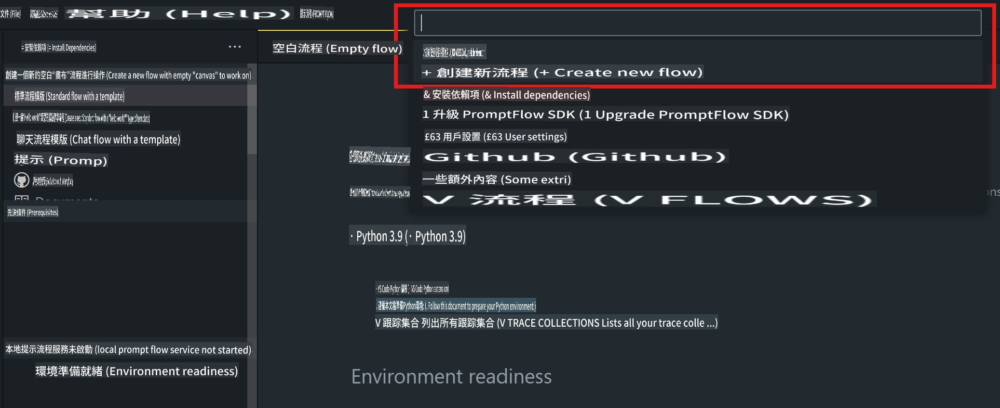

# **Lab 2 - Phi-3-mini-ны AIPC-де Prompt flow арқылы іске қосу**

## **Prompt flow дегеніміз не**

Prompt flow – бұл LLM негізіндегі AI қосымшаларын әзірлеудің толық циклін оңтайландыруға арналған құралдар жиынтығы. Бұл процесс идеядан бастап, прототиптеу, тестілеу, бағалау, өндірістік енгізу және мониторингке дейінгі кезеңдерді қамтиды. Prompt flow арқылы prompt engineering әлдеқайда жеңілдейді және өндірістік сападағы LLM қосымшаларын құруға мүмкіндік береді.

Prompt flow арқылы сіз:

- LLM-дерді, prompt-тарды, Python кодын және басқа құралдарды біртұтас жұмыс процесіне біріктіретін ағымдарды жасай аласыз.

- Ағымдарыңызды, әсіресе LLM-дермен өзара әрекеттесуді оңай түзетіп, қайталап өңдей аласыз.

- Ағымдарыңызды бағалап, үлкен деректер жиынтығымен сапа мен өнімділік көрсеткіштерін есептей аласыз.

- Тестілеу мен бағалауды CI/CD жүйеңізге біріктіріп, ағымның сапасын қамтамасыз ете аласыз.

- Ағымдарыңызды таңдаған платформаға енгізіп немесе қосымшаңыздың код базасына оңай біріктіре аласыз.

- (Қосымша, бірақ қатты ұсынылады) Azure AI-дағы Prompt flow бұлттық нұсқасын пайдаланып, командаңызбен бірге жұмыс істей аласыз.

## **AIPC дегеніміз не**

AI PC-де CPU, GPU және NPU бар, олардың әрқайсысы AI-ды жеделдетуге арналған ерекше мүмкіндіктерге ие. NPU, яғни нейрондық процессор бірлігі, жасанды интеллект (AI) және машиналық оқыту (ML) тапсырмаларын бұлтқа жібермей-ақ тікелей компьютеріңізде орындайтын арнайы жеделдеткіш болып табылады. GPU мен CPU да осы есептеулерді орындай алады, бірақ NPU аз қуатты AI есептеулерінде ерекше тиімді. AI PC біздің компьютерлердің жұмыс істеу әдісінде түбегейлі өзгеріс әкеледі. Бұл бұрын болмаған мәселенің шешімі емес. Оның орнына, бұл күнделікті компьютер қолдануларында үлкен жетістік болуға уәде береді.

Ол қалай жұмыс істейді? Генеративті AI мен көптеген жалпы деректерге негізделіп оқытылған үлкен тілдік модельдермен (LLM) салыстырғанда, компьютеріңізде болатын AI әлдеқайда қолжетімді. Бұл концепцияны түсіну оңайырақ, және ол сіздің деректеріңізге негізделіп, бұлтқа қол жеткізуді қажет етпейтіндіктен, оның артықшылықтары кең аудитория үшін бірден тартымды болады.

Жақын болашақта AI PC әлемі жеке көмекшілер мен шағын AI модельдерін сіздің компьютеріңізде тікелей іске қосып, сіздің деректеріңізді пайдалана отырып, күнделікті әрекеттеріңізге жеке, жеке өміріңізге қауіпсіз AI жетілдірулерін ұсынады – мысалы, жиналыс хаттамаларын жазу, фантастикалық футбол лигасын ұйымдастыру, фото мен бейне өңдеуді автоматтандыру, немесе отбасы жиналысы үшін барлық қатысушылардың келу және кету уақыттарына негізделген керемет жоспар құру.

## **AIPC-де генерациялау ағымдарын құру**

***Ескерту***: Егер сіз қоршаған ортаны орнатуды аяқтамаған болсаңыз, [Lab 0 - Орнатулар](./01.Installations.md) бөліміне өтіңіз.

1. Visual Studio Code ішіндегі Prompt flow кеңейтімін ашып, бос ағым жобасын жасаңыз.



2. Кіріс және шығыс параметрлерін қосып, жаңа ағым ретінде Python кодын қосыңыз.


Ағымыңызды құру үшін осы құрылымды (flow.dag.yaml) пайдалануға болады:

```yaml

inputs:
  question:
    type: string
    default: how to write Bubble Algorithm
outputs:
  answer:
    type: string
    reference: ${Chat_With_Phi3.output}
nodes:
- name: Chat_With_Phi3
  type: python
  source:
    type: code
    path: Chat_With_Phi3.py
  inputs:
    question: ${inputs.question}


```

3. ***Chat_With_Phi3.py*** файлына код қосыңыз.

```python


from promptflow.core import tool

# import torch
from transformers import AutoTokenizer, pipeline,TextStreamer
import intel_npu_acceleration_library as npu_lib

import warnings

import asyncio
import platform

class Phi3CodeAgent:
    
    model = None
    tokenizer = None
    text_streamer = None
    
    model_id = "microsoft/Phi-3-mini-4k-instruct"

    @staticmethod
    def init_phi3():
        
        if Phi3CodeAgent.model is None or Phi3CodeAgent.tokenizer is None or Phi3CodeAgent.text_streamer is None:
            Phi3CodeAgent.model = npu_lib.NPUModelForCausalLM.from_pretrained(
                                    Phi3CodeAgent.model_id,
                                    torch_dtype="auto",
                                    dtype=npu_lib.int4,
                                    trust_remote_code=True
                                )
            Phi3CodeAgent.tokenizer = AutoTokenizer.from_pretrained(Phi3CodeAgent.model_id)
            Phi3CodeAgent.text_streamer = TextStreamer(Phi3CodeAgent.tokenizer, skip_prompt=True)

    

    @staticmethod
    def chat_with_phi3(prompt):
        
        Phi3CodeAgent.init_phi3()

        messages = "<|system|>You are a AI Python coding assistant. Please help me to generate code in Python.The answer only genertated Python code, but any comments and instructions do not need to be generated<|end|><|user|>" + prompt +"<|end|><|assistant|>"


        generation_args = {
            "max_new_tokens": 1024,
            "return_full_text": False,
            "temperature": 0.3,
            "do_sample": False,
            "streamer": Phi3CodeAgent.text_streamer,
        }

        pipe = pipeline(
            "text-generation",
            model=Phi3CodeAgent.model,
            tokenizer=Phi3CodeAgent.tokenizer,
            # **generation_args
        )

        result = ''

        with warnings.catch_warnings():
            warnings.simplefilter("ignore")
            response = pipe(messages, **generation_args)
            result =response[0]['generated_text']
            return result


@tool
def my_python_tool(question: str) -> str:
    if platform.system() == 'Windows':
        asyncio.set_event_loop_policy(asyncio.WindowsSelectorEventLoopPolicy())
    return Phi3CodeAgent.chat_with_phi3(question)


```

4. Код генерациясының дұрыстығын тексеру үшін Debug немесе Run арқылы ағымды сынап көріңіз.


5. Ағымды терминалда даму API ретінде іске қосыңыз.

```

pf flow serve --source ./ --port 8080 --host localhost   

```

Оны Postman / Thunder Client арқылы тексеруге болады.

### **Ескерту**

1. Алғашқы іске қосу көп уақытты алады. Phi-3 моделін Hugging Face CLI арқылы жүктеп алуды ұсынамыз.

2. Intel NPU есептеу қуатының шектеулі екенін ескере отырып, Phi-3-mini-4k-instruct моделін пайдалану ұсынылады.

3. Біз Intel NPU жеделдетуін INT4 түрлендіруін кванттау үшін пайдаланамыз, бірақ егер қызметті қайта іске қоссаңыз, кэш пен nc_workshop қалталарын жою қажет.

## **Ресурстар**

1. Promptflow-ды үйрену: [https://microsoft.github.io/promptflow/](https://microsoft.github.io/promptflow/)

2. Intel NPU жеделдетуді үйрену: [https://github.com/intel/intel-npu-acceleration-library](https://github.com/intel/intel-npu-acceleration-library)

3. Үлгі кодын жүктеп алу: [Жергілікті NPU агентінің үлгі коды](../../../../../../../../../code/07.Lab/01/AIPC)

It seems like "mo" could refer to a specific language or abbreviation, but it’s not clear which one you mean. Could you clarify which language or context "mo" refers to? For example, is it Māori, Montenegrin, Mongolian, or something else? Let me know, and I’d be happy to assist!