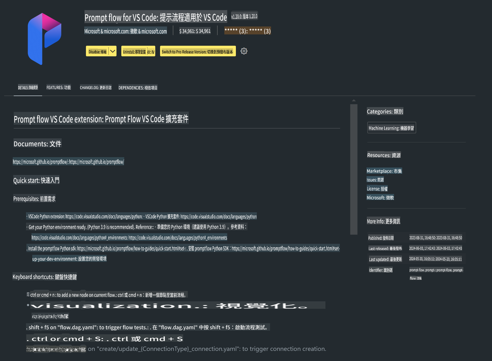

# **Lab 0 - Суурилуулалт**

Лабораторид ормогц бид тохирох орчныг тохируулах хэрэгтэй:


### **1. Python 3.11+**

Python орчныг тохируулахад miniforge ашиглахыг зөвлөж байна.

Miniforge-ийг тохируулах зааврыг эндээс үзнэ үү: [https://github.com/conda-forge/miniforge](https://github.com/conda-forge/miniforge)

Miniforge тохируулаад Power Shell дээр дараах командыг ажиллуулна уу:

```bash

conda create -n pyenv python==3.11.8 -y

conda activate pyenv

```


### **2. Prompt flow SDK суулгах**

Лаборатори 1-д бид Prompt flow ашиглах тул Prompt flow SDK-г тохируулах шаардлагатай.

```bash

pip install promptflow --upgrade

```

Prompt flow SDK-г дараах командаар шалгаж болно:


```bash

pf --version

```

### **3. Visual Studio Code-д Prompt flow өргөтгөл суулгах**



### **4. Apple's MLX Framework**

MLX нь Apple silicon дээр машин сургалтын судалгаанд зориулагдсан матрицын фреймворк бөгөөд Apple-ийн машин сургалтын судалгааны багийн бүтээл юм. Та **Apple MLX framework** ашиглан Apple Silicon дээр LLM / SLM-г хурдасгаж болно. Дэлгэрэнгүй мэдээллийг эндээс уншина уу: [https://github.com/microsoft/PhiCookBook/blob/main/md/01.Introduction/03/MLX_Inference.md](https://github.com/microsoft/PhiCookBook/blob/main/md/01.Introduction/03/MLX_Inference.md).

MLX framework номын санг bash дээр суулгаарай:


```bash

pip install mlx-lm

```


### **5. Бусад Python номын сангууд**

requirements.txt файлыг үүсгэж дараах агуулгыг нэмнэ үү:

```txt

notebook
numpy 
scipy 
scikit-learn 
matplotlib 
pandas 
pillow 
graphviz

```


### **6. NVM суулгах**

Powershell дээр nvm суулгана уу:


```bash

brew install nvm

```

Node.js 18.20 хувилбарыг суулгана:


```bash

nvm install 18.20.0

nvm use 18.20.0

```

### **7. Visual Studio Code хөгжүүлэлтийн дэмжлэг суулгах**

```bash

npm install --global yo generator-code

```

Баяр хүргэе! Та SDK-г амжилттай тохирууллаа. Одоо практик алхмууд руу шилжинэ үү.

It seems like you are asking for a translation into "mo," but it's unclear what language "mo" refers to. Could you clarify or provide more context? For example, are you referring to Māori, Mongolian, or another language? Let me know, and I'd be happy to assist!