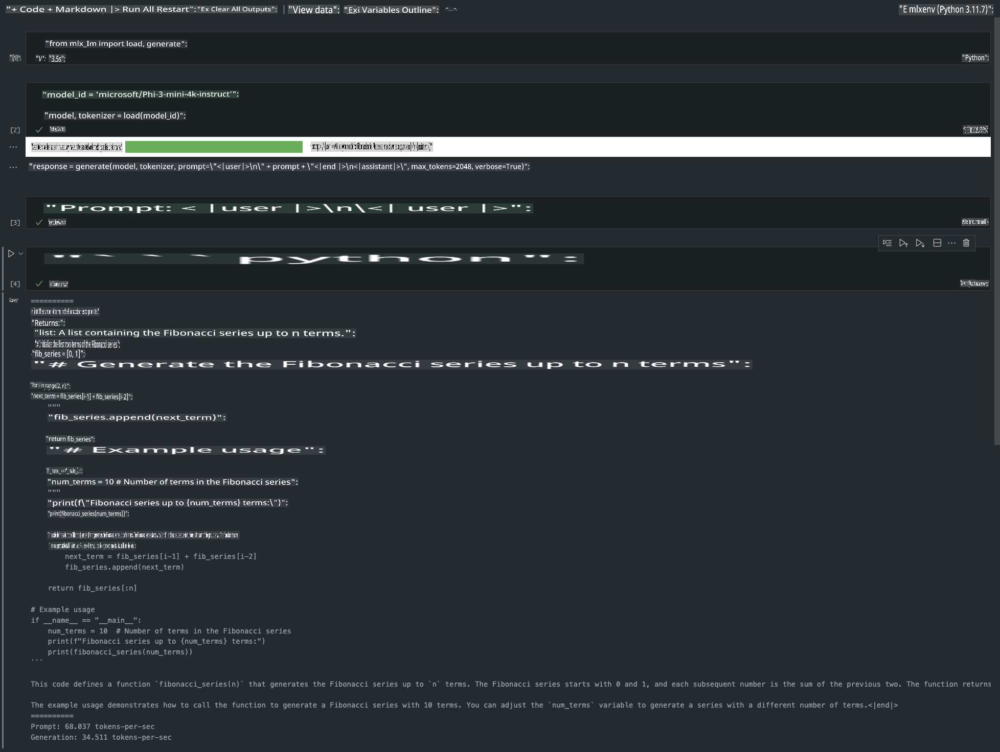

# **Apple MLX फ्रेमवर्कसह Phi-3 चा इनफरन्स**

## **MLX फ्रेमवर्क म्हणजे काय**

MLX हा Apple सिलिकॉनसाठी मशीन लर्निंग संशोधनासाठी तयार केलेला एक फ्रेमवर्क आहे, जो Apple मशीन लर्निंग संशोधन विभागाने आणला आहे.

MLX मशीन लर्निंग संशोधकांसाठीच डिझाइन केला आहे. हा फ्रेमवर्क वापरण्यास सुलभ असूनही मॉडेल्स प्रशिक्षण आणि तैनात करण्यासाठी कार्यक्षम आहे. फ्रेमवर्कचे डिझाइनही संकल्पनेच्या दृष्टीने सोपे आहे. संशोधकांना MLX विस्तारित आणि सुधारित करणे सोपे व्हावे, तसेच नवीन कल्पना लवकर एक्सप्लोर करता याव्यात, हा आमचा उद्देश आहे.

Apple Silicon डिव्हाइसवर MLX च्या साहाय्याने LLMs जलद चालवता येतात, आणि मॉडेल्स सहजपणे स्थानिक पातळीवर चालवता येतात.

## **MLX वापरून Phi-3-mini चा इनफरन्स**

### **1. तुमचे MLX वातावरण सेट करा**

1. Python 3.11.x
2. MLX लायब्ररी इन्स्टॉल करा

```bash

pip install mlx-lm

```

### **2. MLX सह टर्मिनलमध्ये Phi-3-mini चालवणे**

```bash

python -m mlx_lm.generate --model microsoft/Phi-3-mini-4k-instruct --max-token 2048 --prompt  "<|user|>\nCan you introduce yourself<|end|>\n<|assistant|>"

```

याचा परिणाम (माझे वातावरण Apple M1 Max,64GB आहे) खालीलप्रमाणे आहे:


### **3. MLX सह टर्मिनलमध्ये Phi-3-mini चे क्वांटायझेशन करणे**

```bash

python -m mlx_lm.convert --hf-path microsoft/Phi-3-mini-4k-instruct

```

***टीप:*** मॉडेल mlx_lm.convert च्या मदतीने क्वांटाइज करता येते, आणि डीफॉल्ट क्वांटायझेशन INT4 आहे. या उदाहरणात Phi-3-mini ला INT4 मध्ये क्वांटाइज केले आहे.

mlx_lm.convert च्या मदतीने मॉडेल क्वांटाइज करता येते, आणि डीफॉल्ट क्वांटायझेशन INT4 आहे. या उदाहरणात Phi-3-mini ला INT4 मध्ये क्वांटाइज केले आहे. क्वांटायझेशन झाल्यानंतर, ते डीफॉल्ट डिरेक्टरी ./mlx_model मध्ये सेव्ह होईल.

आम्ही टर्मिनलमधून MLX सह क्वांटाइज केलेले मॉडेल चाचणी करू शकतो.

```bash

python -m mlx_lm.generate --model ./mlx_model/ --max-token 2048 --prompt  "<|user|>\nCan you introduce yourself<|end|>\n<|assistant|>"

```

याचा परिणाम खालीलप्रमाणे आहे:


### **4. Jupyter Notebook मध्ये MLX सह Phi-3-mini चालवणे**



***टीप:*** कृपया हा नमुना वाचा [येथे क्लिक करा](../../../../../code/03.Inference/MLX/MLX_DEMO.ipynb)

## **स्रोत**

1. Apple MLX फ्रेमवर्कबद्दल जाणून घ्या [https://ml-explore.github.io](https://ml-explore.github.io/mlx/build/html/index.html)

2. Apple MLX GitHub रेपो [https://github.com/ml-explore](https://github.com/ml-explore)

**अस्वीकृती**:  
हे दस्तऐवज मशीन-आधारित एआय अनुवाद सेवांचा वापर करून अनुवादित केले गेले आहे. आम्ही अचूकतेसाठी प्रयत्नशील असलो तरी, कृपया लक्षात घ्या की स्वयंचलित अनुवादांमध्ये त्रुटी किंवा अचूकतेचा अभाव असू शकतो. मूळ भाषेतील मूळ दस्तऐवज हा अधिकृत स्रोत मानला पाहिजे. महत्त्वाच्या माहितीसाठी, व्यावसायिक मानवी अनुवादाची शिफारस केली जाते. या अनुवादाचा वापर करून निर्माण झालेल्या कोणत्याही गैरसमजुतींसाठी किंवा चुकीच्या अर्थासाठी आम्ही जबाबदार नाही.