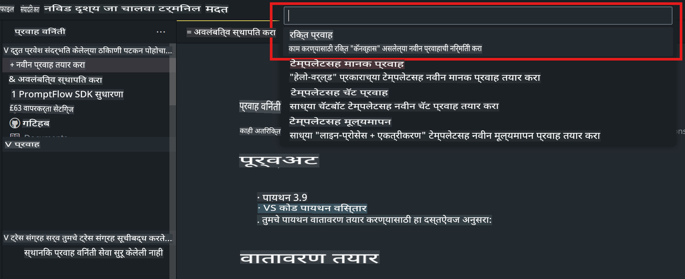
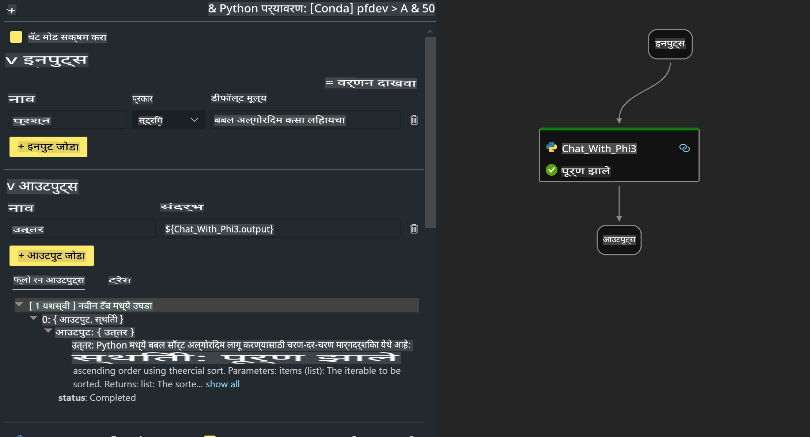

# **लॅब 2 - AIPC मध्ये Phi-3-mini सह Prompt flow चालवा**

## **Prompt flow म्हणजे काय**

Prompt flow ही विकास साधनांची एक मालिका आहे, जी LLM-आधारित AI अनुप्रयोगांच्या संपूर्ण विकास चक्राला सुलभ बनवते, ज्यामध्ये कल्पनाशक्ती, प्रोटोटायपिंग, चाचणी, मूल्यमापन ते उत्पादन तैनाती आणि निरीक्षण यांचा समावेश होतो. हे प्रॉम्प्ट इंजिनिअरिंग अधिक सोपे करते आणि तुम्हाला उत्पादन दर्जाच्या LLM अॅप्स तयार करण्यास सक्षम करते.

Prompt flow च्या मदतीने तुम्ही हे करू शकता:

- LLMs, प्रॉम्प्ट्स, Python कोड आणि इतर साधने एकत्र जोडून एक कार्यक्षम वर्कफ्लो तयार करा.

- LLMs सोबतच्या संवादासह तुमच्या फ्लोजचे डिबग आणि पुनरावृत्ती सुलभतेने करा.

- तुमच्या फ्लोजचे मूल्यांकन करा, मोठ्या डेटासेटसह गुणवत्ता आणि कार्यक्षमता मेट्रिक्स मोजा.

- चाचणी आणि मूल्यमापन तुमच्या CI/CD प्रणालीमध्ये समाकलित करा, जेणेकरून तुमच्या फ्लोची गुणवत्ता सुनिश्चित करता येईल.

- तुमच्या निवडलेल्या सर्व्हिंग प्लॅटफॉर्मवर फ्लोज तैनात करा किंवा तुमच्या अॅपच्या कोड बेसमध्ये सहज समाकलित करा.

- (पर्यायी पण अत्यंत शिफारस केलेले) Azure AI मधील Prompt flow च्या क्लाउड आवृत्तीचा लाभ घेऊन तुमच्या टीमसोबत सहकार्य करा.


## **Apple Silicon वर जनरेशन कोड फ्लोज तयार करणे**

***टीप*** ：जर तुम्ही अद्याप पर्यावरण सेटअप पूर्ण केले नसेल, तर कृपया [लॅब 0 - इंस्टॉलेशन्स](./01.Installations.md) ला भेट द्या.

1. Visual Studio Code मध्ये Prompt flow एक्स्टेंशन उघडा आणि एक रिक्त फ्लो प्रकल्प तयार करा.



2. इनपुट्स आणि आउटपुट्स पॅरामीटर्स जोडा आणि नवीन फ्लो म्हणून Python कोड जोडा.



तुम्ही तुमचा फ्लो तयार करण्यासाठी या रचनेचा संदर्भ घेऊ शकता (flow.dag.yaml)

```yaml

inputs:
  prompt:
    type: string
    default: Write python code for Fibonacci serie. Please use markdown as output
outputs:
  result:
    type: string
    reference: ${gen_code_by_phi3.output}
nodes:
- name: gen_code_by_phi3
  type: python
  source:
    type: code
    path: gen_code_by_phi3.py
  inputs:
    prompt: ${inputs.prompt}


```

3. phi-3-mini चे क्वांटिफिकेशन करा.

आम्हाला SLM स्थानिक डिव्हाइसवर अधिक चांगल्या प्रकारे चालवायचे आहे. सामान्यतः, आम्ही मॉडेलचे क्वांटिफिकेशन करतो (INT4, FP16, FP32).

```bash

python -m mlx_lm.convert --hf-path microsoft/Phi-3-mini-4k-instruct

```

**टीप:** डीफॉल्ट फोल्डर mlx_model आहे.

4. ***Chat_With_Phi3.py*** मध्ये कोड जोडा.

```python


from promptflow import tool

from mlx_lm import load, generate


# The inputs section will change based on the arguments of the tool function, after you save the code
# Adding type to arguments and return value will help the system show the types properly
# Please update the function name/signature per need
@tool
def my_python_tool(prompt: str) -> str:

    model_id = './mlx_model_phi3_mini'

    model, tokenizer = load(model_id)

    # <|user|>\nWrite python code for Fibonacci serie. Please use markdown as output<|end|>\n<|assistant|>

    response = generate(model, tokenizer, prompt="<|user|>\n" + prompt  + "<|end|>\n<|assistant|>", max_tokens=2048, verbose=True)

    return response


```

4. Debug किंवा Run वरून फ्लो चाचणी करू शकता, जेणेकरून जनरेशन कोड व्यवस्थित आहे की नाही ते तपासा.


5. टर्मिनलमध्ये विकास API म्हणून फ्लो चालवा.

```

pf flow serve --source ./ --port 8080 --host localhost   

```

तुम्ही Postman / Thunder Client मध्ये याची चाचणी करू शकता.


### **टीप**

1. पहिल्यांदा चालवताना जास्त वेळ लागतो. Hugging Face CLI वरून phi-3 मॉडेल डाउनलोड करण्याची शिफारस केली जाते.

2. Intel NPU ची मर्यादित संगणन क्षमता विचारात घेऊन, Phi-3-mini-4k-instruct वापरण्याची शिफारस केली जाते.

3. आम्ही INT4 रूपांतरणासाठी Intel NPU Acceleration वापरतो, परंतु जर तुम्ही सेवा पुन्हा चालवली, तर कॅशे आणि nc_workshop फोल्डर्स हटवणे आवश्यक आहे.


## **स्रोत**

1. Promptflow शिकणे [https://microsoft.github.io/promptflow/](https://microsoft.github.io/promptflow/)

2. Intel NPU Acceleration शिकणे [https://github.com/intel/intel-npu-acceleration-library](https://github.com/intel/intel-npu-acceleration-library)

3. नमुना कोड डाउनलोड करा [स्थानिक NPU एजंट नमुना कोड](../../../../../../../../../code/07.Lab/01/AIPC/local-npu-agent)

**अस्वीकृती**:  
हे दस्तऐवज मशीन-आधारित एआय अनुवाद सेवा वापरून अनुवादित करण्यात आले आहे. आम्ही अचूकतेसाठी प्रयत्नशील असलो तरी कृपया लक्षात घ्या की स्वयंचलित अनुवादांमध्ये त्रुटी किंवा अचूकतेचा अभाव असू शकतो. मूळ भाषेतील मूळ दस्तऐवज हा अधिकृत स्रोत मानावा. महत्त्वपूर्ण माहितीसाठी, व्यावसायिक मानवी अनुवादाची शिफारस केली जाते. या अनुवादाचा वापर केल्याने उद्भवणाऱ्या कोणत्याही गैरसमज किंवा चुकीच्या अर्थासाठी आम्ही जबाबदार राहणार नाही.