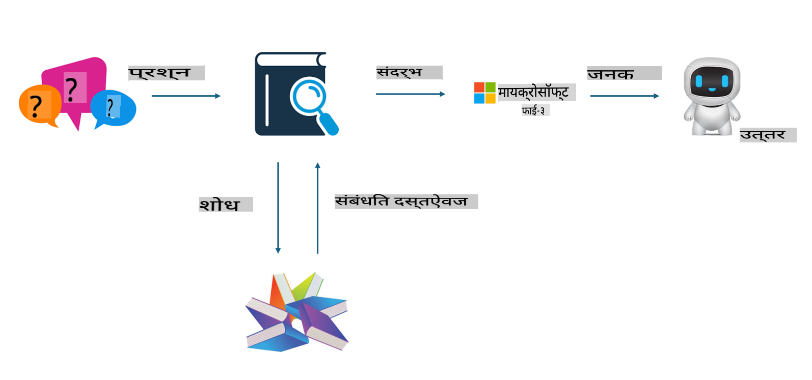

## फायनट्यूनिंग विरुद्ध RAG

## रिट्रीव्हल ऑगमेंटेड जनरेशन

RAG म्हणजे डेटा रिट्रीव्हल + मजकूर निर्मिती. एंटरप्राइझचा संरचित आणि असंरचित डेटा व्हेक्टर डेटाबेसमध्ये साठवला जातो. जेव्हा संबंधित सामग्री शोधली जाते, तेव्हा संबंधित सारांश आणि सामग्री मिळवली जाते, जी एक संदर्भ तयार करते, आणि LLM/SLM च्या मजकूर पूर्ण करण्याच्या क्षमतेसह एकत्रित करून सामग्री तयार केली जाते.

## RAG प्रक्रिया

## फायनट्यूनिंग
फायनट्यूनिंग हा विशिष्ट मॉडेल सुधारण्यावर आधारित असतो. यामध्ये मॉडेल अल्गोरिदमपासून सुरुवात करण्याची गरज नसते, पण डेटा सतत साठवणे गरजेचे असते. जर तुम्हाला उद्योग अनुप्रयोगांमध्ये अधिक अचूक टर्मिनॉलॉजी आणि भाषिक अभिव्यक्ती हवी असेल, तर फायनट्यूनिंग हा चांगला पर्याय ठरतो. पण जर तुमचा डेटा वारंवार बदलत असेल, तर फायनट्यूनिंग गुंतागुंतीचे होऊ शकते.

## कसे निवडावे
जर आपल्या उत्तरासाठी बाह्य डेटाची आवश्यकता असेल, तर RAG हा सर्वोत्तम पर्याय आहे.

जर तुम्हाला स्थिर आणि अचूक औद्योगिक ज्ञान आउटपुट करायचे असेल, तर फायनट्यूनिंग हा चांगला पर्याय असेल. RAG प्रामुख्याने संबंधित सामग्री खेचण्यावर भर देते, पण नेहमीच विशिष्ट बारकावे पकडेल असे नाही.

फायनट्यूनिंगसाठी उच्च-गुणवत्तेचा डेटा सेट आवश्यक आहे, आणि जर डेटा फक्त एका लहान श्रेणीचा असेल, तर त्याचा फारसा फरक पडणार नाही. RAG अधिक लवचिक आहे.  
फायनट्यूनिंग हा एक ब्लॅक बॉक्स आहे, एक प्रकारची गूढ प्रक्रिया, आणि त्याचा अंतर्गत यंत्रणा समजणे कठीण असते. पण RAG डेटाचा स्रोत शोधणे सोपे करते, त्यामुळे भ्रम किंवा सामग्रीतील चुका प्रभावीपणे सुधारता येतात आणि अधिक पारदर्शकता मिळते.

**अस्वीकरण**:  
हा दस्तऐवज मशीन-आधारित एआय अनुवाद सेवांचा वापर करून अनुवादित करण्यात आला आहे. आम्ही अचूकतेसाठी प्रयत्नशील असलो तरी, कृपया लक्षात घ्या की स्वयंचलित अनुवादांमध्ये चुका किंवा अचूकतेचा अभाव असू शकतो. मूळ भाषेतील मूळ दस्तऐवज अधिकृत स्रोत मानावा. महत्त्वाच्या माहितीसाठी व्यावसायिक मानवी अनुवादाची शिफारस केली जाते. या अनुवादाच्या वापरामुळे उद्भवणाऱ्या कोणत्याही गैरसमजुती किंवा चुकीच्या अर्थासाठी आम्ही जबाबदार राहणार नाही.