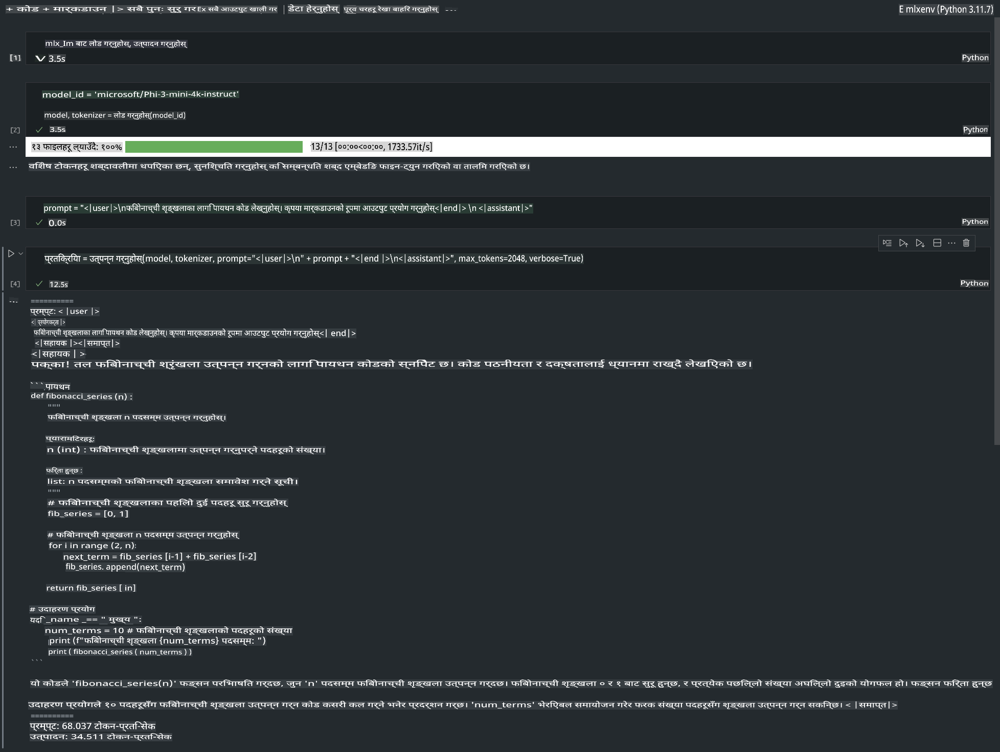

# **Apple MLX फ्रेमवर्कसँग Phi-3 को इनफरेन्स**

## **MLX फ्रेमवर्क भनेको के हो**

MLX एउटा मेशिन लर्निङ अनुसन्धानको लागि Apple सिलिकनमा आधारित फ्रेमवर्क हो, जुन Apple मेशिन लर्निङ अनुसन्धानद्वारा विकसित गरिएको हो।

MLX मेशिन लर्निङ अनुसन्धानकर्ताहरूको लागि डिजाइन गरिएको हो। यो फ्रेमवर्क प्रयोग गर्न सजिलो छ, तर अझै पनि मोडेलहरूलाई प्रभावकारी रूपमा ट्रेन र डिप्लोय गर्न सक्षम छ। फ्रेमवर्कको डिजाइन पनि अवधारणात्मक रूपमा सरल छ। अनुसन्धानकर्ताहरूले MLX लाई सजिलै विस्तार र सुधार गर्न सकून् भनेर डिजाइन गरिएको हो, जसले नयाँ विचारहरूलाई छिटो अन्वेषण गर्न मद्दत पुर्‍याउँछ।

Apple सिलिकन डिभाइसहरूमा LLMs लाई MLX मार्फत द्रुत बनाइन्छ, र मोडेलहरूलाई स्थानीय रूपमा सजिलै चलाउन सकिन्छ।

## **MLX प्रयोग गरेर Phi-3-mini इनफरेन्स गर्ने**

### **1. आफ्नो MLX वातावरण सेट अप गर्नुहोस्**

1. Python 3.11.x
2. MLX लाइब्रेरी इन्स्टल गर्नुहोस्

```bash

pip install mlx-lm

```

### **2. टर्मिनलमा MLX प्रयोग गरेर Phi-3-mini चलाउनुहोस्**

```bash

python -m mlx_lm.generate --model microsoft/Phi-3-mini-4k-instruct --max-token 2048 --prompt  "<|user|>\nCan you introduce yourself<|end|>\n<|assistant|>"

```

नतिजा (मेरो वातावरण Apple M1 Max, 64GB) यस्तो देखिन्छ:


### **3. टर्मिनलमा MLX प्रयोग गरेर Phi-3-mini लाई क्वान्टाइज गर्नुहोस्**

```bash

python -m mlx_lm.convert --hf-path microsoft/Phi-3-mini-4k-instruct

```

***नोट:*** मोडेललाई `mlx_lm.convert` मार्फत क्वान्टाइज गर्न सकिन्छ, र डिफल्ट क्वान्टाइजेसन INT4 हो। यो उदाहरणले Phi-3-mini लाई INT4 मा क्वान्टाइज गर्छ।

मोडेललाई `mlx_lm.convert` मार्फत क्वान्टाइज गर्न सकिन्छ, र डिफल्ट क्वान्टाइजेसन INT4 हो। यो उदाहरणमा Phi-3-mini लाई INT4 मा क्वान्टाइज गरिएको छ। क्वान्टाइज गरेपछि, यो डिफल्ट डाइरेक्टरी `./mlx_model` मा सुरक्षित हुनेछ।

हामी MLX मार्फत क्वान्टाइज गरिएको मोडेललाई टर्मिनलबाट परीक्षण गर्न सक्छौं।

```bash

python -m mlx_lm.generate --model ./mlx_model/ --max-token 2048 --prompt  "<|user|>\nCan you introduce yourself<|end|>\n<|assistant|>"

```

नतिजा यस्तो देखिन्छ:


### **4. Jupyter Notebook मा MLX प्रयोग गरेर Phi-3-mini चलाउनुहोस्**



***नोट:*** कृपया यो नमूना पढ्नुहोस् [यो लिंकमा क्लिक गर्नुहोस्](../../../../../code/03.Inference/MLX/MLX_DEMO.ipynb)

## **स्रोतहरू**

1. Apple MLX फ्रेमवर्कको बारेमा जान्न [https://ml-explore.github.io](https://ml-explore.github.io/mlx/build/html/index.html)

2. Apple MLX GitHub Repo [https://github.com/ml-explore](https://github.com/ml-explore)

**अस्वीकरण**:  
यो दस्तावेज मेसिन-आधारित एआई अनुवाद सेवाहरू प्रयोग गरेर अनुवाद गरिएको हो। यद्यपि हामी शुद्धताका लागि प्रयास गर्दछौं, कृपया ध्यान दिनुहोस् कि स्वचालित अनुवादहरूमा त्रुटिहरू वा अशुद्धताहरू हुन सक्छन्। यसको मूल भाषामा रहेको मूल दस्तावेजलाई आधिकारिक स्रोतको रूपमा मानिनुपर्छ। महत्त्वपूर्ण जानकारीको लागि, व्यावसायिक मानव अनुवाद सिफारिस गरिन्छ। यस अनुवादको प्रयोगबाट उत्पन्न हुने कुनै पनि गलतफहमी वा गलत व्याख्याका लागि हामी जिम्मेवार हुनेछैनौं।