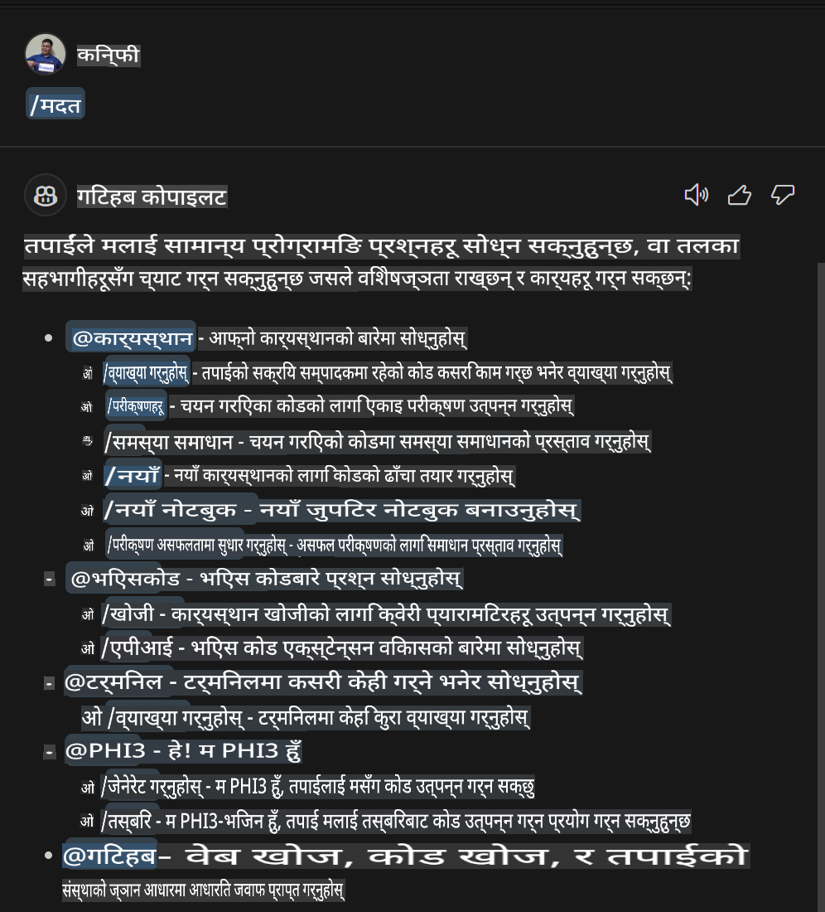
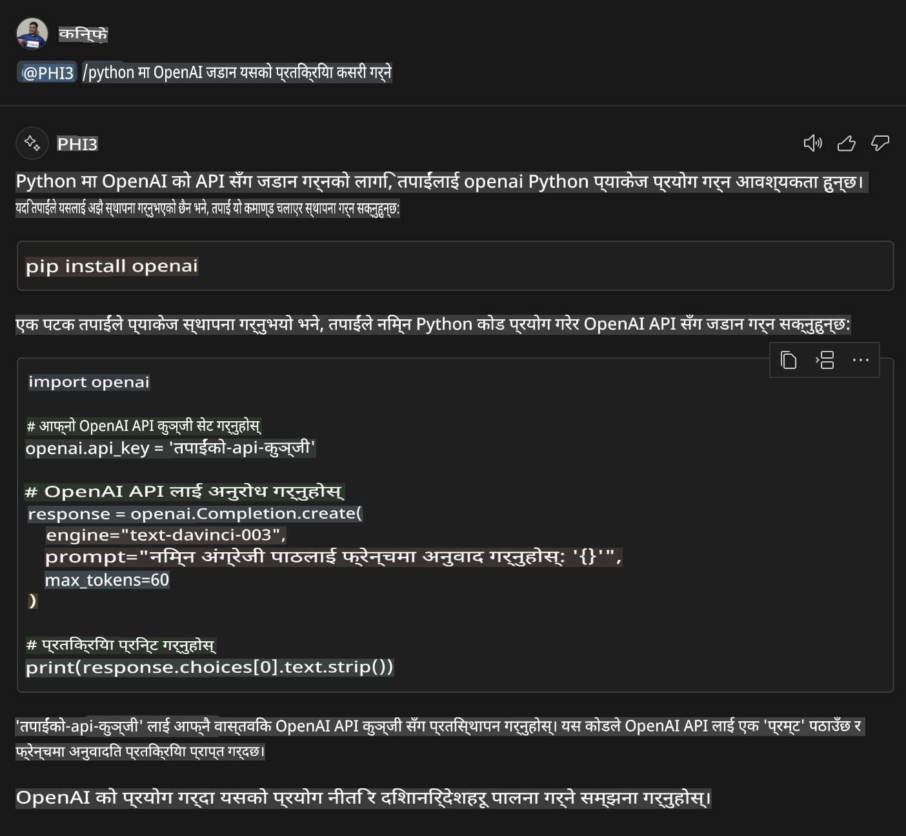
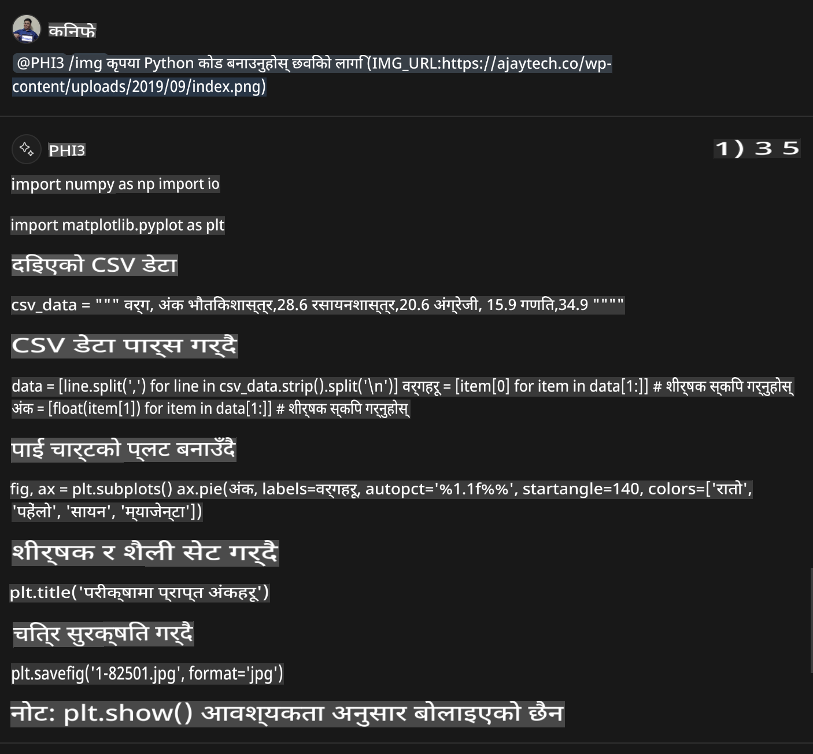

# **लैब ३ - GitHub Copilot Chat मा @PHI3 एजेन्ट बनाउनुहोस्**

Visual Studio Code Copilot Chat मा, तपाईं @workspace प्रयोग गरेर सम्पूर्ण प्रोजेक्ट व्यवस्थापन गर्न सक्नुहुन्छ। उद्यम परिदृश्यहरूको लागि, हामी Copilot Chat को Agent लाई अझ लचिलो रूपमा अनुकूलन गर्न सक्छौं।

पछिल्लो लैबमा, हामीले NPU र क्लाउडलाई संयोजन गरी Phi3 Agent को लागि Visual Studio Code Extension पूरा गरेका थियौं।



### **१. VSCode विकास एक्सटेन्सन बनाउनुहोस्**

कृपया यो लिंक [https://code.visualstudio.com/api/get-started/your-first-extension](https://code.visualstudio.com/api/get-started/your-first-extension) हेरेर एक्सटेन्सन प्रोजेक्ट बनाउनुहोस्।

***NOTE:*** कृपया यस प्रोजेक्टको लागि Typescript र WebPack प्राविधिक समाधानको रूपमा प्रयोग गर्नुहोस्।

### **२. vscode.d.ts थप्नुहोस्**

Visual Studio Code Chat API अहिलेसम्म कोड API मा मर्ज गरिएको छैन, तर यो अहिले एक्सटेन्सनमार्फत थपिएको छ।

vscode.d.ts डाउनलोड गर्नुहोस् [https://github.com/microsoft/vscode/blob/main/src/vscode-dts/vscode.d.ts](https://github.com/microsoft/vscode/blob/main/src/vscode-dts/vscode.d.ts)

***NOTE:*** कृपया यसलाई Visual Studio Code Insiders 1.90+ मा चलाउनुहोस्।

### **३. package.json अपडेट गर्नुहोस्**

```json

{
  "name": "phi3ext",
  "displayName": "phi3ext",
  "description": "",
  "version": "0.0.1",
  "engines": {
    "vscode": "^1.90.0"
  },
  "categories": [
      "AI",
      "Chat"
  ],
  "activationEvents": [],
  "enabledApiProposals": [
      "chatVariableResolver"
  ],
  "main": "./dist/extension.js",
  "contributes": {
      "chatParticipants": [
          {
              "id": "chat.PHI3",
              "name": "PHI3",
              "description": "Hey! I am PHI3",
              "isSticky": true,
              "commands": [
                  {
                      "name": "gen",
                      "description": "I am PHI3, you can gen code with me"
                  },
                  {
                      "name": "img",
                      "description": "I am PHI3-vision, you can gen code from img with me"
                  }
              ]
          }
      ],
      "commands": [
          {
              "command": "PHI3.namesInEditor",
              "title": "Use PHI3 in Editor"
          }
      ]
  },  
  "scripts": {
    "vscode:prepublish": "npm run package",
    "compile": "webpack",
    "watch": "webpack --watch",
    "package": "webpack --mode production --devtool hidden-source-map",
    "compile-tests": "tsc -p . --outDir out",
    "watch-tests": "tsc -p . -w --outDir out",
    "pretest": "npm run compile-tests && npm run compile && npm run lint",
    "lint": "eslint src --ext ts",
    "test": "vscode-test"
  },
  "devDependencies": {
    "@types/vscode": "^1.90.0",
    "@types/mocha": "^10.0.6",
    "@types/node": "18.x",
    "@typescript-eslint/eslint-plugin": "^7.11.0",
    "@typescript-eslint/parser": "^7.11.0",
    "eslint": "^8.57.0",
    "typescript": "^5.4.5",
    "ts-loader": "^9.5.1",
    "webpack": "^5.91.0",
    "webpack-cli": "^5.1.4",
    "@vscode/test-cli": "^0.0.9",
    "@vscode/test-electron": "^2.4.0"
  },
  "dependencies": {
    "@types/node-fetch": "^2.6.11",
    "node-fetch": "^3.3.2"
  }
}

```

तपाईं टर्मिनलमा **npm install** चलाएर आफ्नो एक्सटेन्सन डिबग गर्न र परीक्षण गर्न सक्नुहुन्छ।

***नमूना कोड डाउनलोड गर्नुहोस्*** [यहाँ क्लिक गर्नुहोस्](../../../../../../../../../code/07.Lab/01/AIPC)

### **४. src/extension.ts परिवर्तन गर्नुहोस्**

```ts

// The module 'vscode' contains the VS Code extensibility API
// Import the module and reference it with the alias vscode in your code below
import * as vscode from 'vscode';


interface IPHI3ChatResult extends vscode.ChatResult {
    metadata: {
        command: string;
    }
}


// This method is called when your extension is activated
// Your extension is activated the very first time the command is executed
export function activate(extcontext: vscode.ExtensionContext) {


	// Define a SHEIN chat handler. 
	const phi3handler: vscode.ChatRequestHandler = async (request: vscode.ChatRequest, context: vscode.ChatContext, stream: vscode.ChatResponseStream, token: vscode.CancellationToken): Promise<IPHI3ChatResult> => {

		if (request.command == 'gen') {

			const content = "Welcome to Phi-3 to gen code";

			

			const result = await gen(request.prompt);

			const code = result;
			
			
			stream.progress("```txt"+"\n"+code+ +"\n"+"```")


            return { metadata: { command: 'gen' } };

		}
		if (request.command == 'img') {

			const content = "Welcome to Phi-3 vision to gen code in image";

			const prompt = request.prompt;

			if(prompt.indexOf("(IMG_URL:")>-1){

				const img_url = prompt.split("(IMG_URL:")[1].split(")")[0];
				const question = prompt.split("(IMG_URL:")[0];
				const tmp = question;

				const result = await genImage(question,img_url);
	
				const code = result;
				
				
				stream.progress(code)
	
	
				return { metadata: { command: 'img' } };
			}
			else
			{
				var result = "```txt"+"\n\n"+"कृपया यस्तो प्रश्न सोध्नुहोस्: तपाईंको प्रश्न (IMG_URL:https://example.com/image.jpg)"+"\n\n"++"```";
				stream.progress(result);

			}


            return { metadata: { command: 'img' } };

		}


		return { metadata: { command: '' } };

	}


	const xp = vscode.chat.createChatParticipant("chat.PHI3", phi3handler);

	xp.iconPath = new vscode.ThemeIcon('sparkle');


    xp.followupProvider = {
        provideFollowups(result: IPHI3ChatResult, context: vscode.ChatContext, token: vscode.CancellationToken) {
            return [{
                prompt: 'let us code with Phi-3 Family',
                label: vscode.l10n.t('Dev with Phi-3 Family'),
                command: 'help'
            } satisfies vscode.ChatFollowup];
        }
    };

	extcontext.subscriptions.push(xp);
}


interface GenCode {
	question: string;
}

interface ImgGenCodeResponse {
	output: string;
}


interface GenCodeResponse {
	answer: string;
}

async function gen(prompt: string) {

	const postData: GenCode = {
		question: prompt
	};
	const response = await fetch('http://localhost:8080/score', {
		method: 'POST',
		body: JSON.stringify(postData),
		headers: { 'Content-Type': 'application/json' }
	});
	const post = await response.json();
	const resultResponse = post as GenCodeResponse;
	return resultResponse.answer;
}

async function genImage(prompt: string, img_url: string) {

	const response = await fetch('Your Phi-3-Vision Endpoint', {
		method: 'POST',
		body: JSON.stringify({
			"input_data":{
			  "input_string":[
				{
				  "role":"user",
				  "content":[ 
					{
					  "type": "text",
					  "text": prompt
					},
					{
						"type": "image_url",
						"image_url": {
						  "url": img_url
						}
					}
				  ]
				}
			  ],
			  "parameters":{
					"temperature": 0.6,
					"top_p": 0.9,
					"do_sample": false,
					"max_new_tokens": 2048
			  }
			}
		}),
		headers: { 'Content-Type': 'application/json', 'Authorization' : 'Bearer Your Phi-3-Vision Endpoint Key', 'azureml-model-deployment': 'Your Phi-3-Vision Deployment name' }
	});
	const post = await response.json();
	const resultResponse = post as ImgGenCodeResponse;
	return resultResponse.output;
}

// This method is called when your extension is deactivated
export function deactivate() {}


```

बधाई छ! तपाईंले सबै लैबहरू पूरा गर्नुभयो। आशा छ, यसले तपाईंलाई Phi-3 परिवार र GitHub Copilot Chat कसरी प्रयोग गर्ने भन्ने राम्रोसँग बुझ्न मद्दत गर्यो।

तपाईं ***@PHI3 /gen*** प्रयास गर्न सक्नुहुन्छ।



तपाईं ***@PHI3 /img*** प्रयास गर्न सक्नुहुन्छ।



**अस्वीकरण**:  
यो दस्तावेज मेसिन-आधारित एआई अनुवाद सेवाहरू प्रयोग गरी अनुवाद गरिएको हो। हामी शुद्धताको लागि प्रयास गर्दछौं, तर कृपया जानकार हुनुहोस् कि स्वचालित अनुवादहरूमा त्रुटिहरू वा अशुद्धताहरू हुन सक्छ। यसको मूल भाषामा रहेको मूल दस्तावेजलाई आधिकारिक स्रोतको रूपमा मानिनुपर्छ। महत्वपूर्ण जानकारीको लागि, व्यावसायिक मानव अनुवाद सिफारिस गरिन्छ। यस अनुवादको प्रयोगबाट उत्पन्न हुने कुनै पनि गलतफहमी वा गलत व्याख्याको लागि हामी जिम्मेवार हुनेछैनौं।  