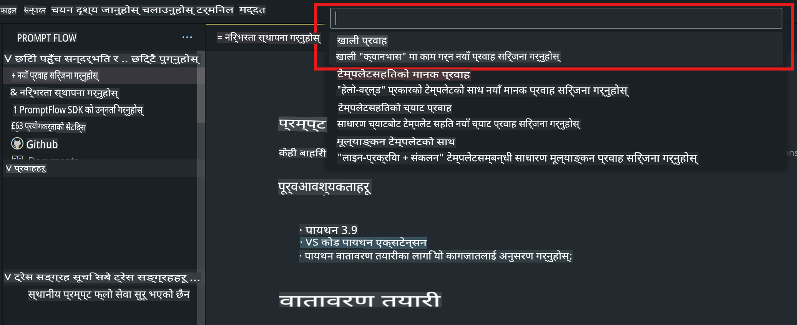
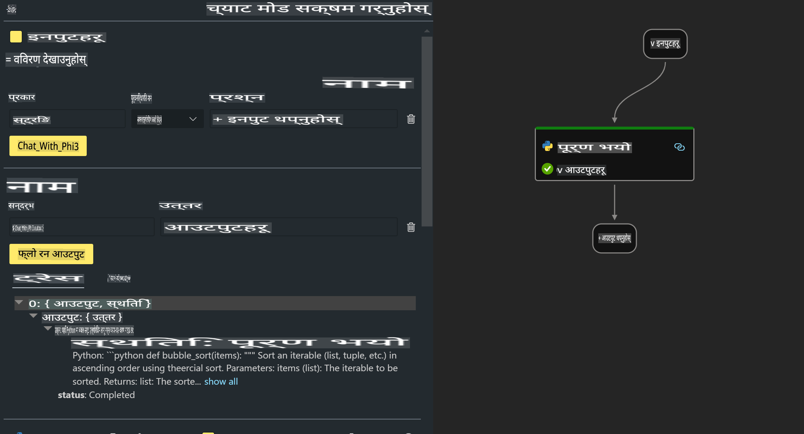

# **लैब २ - AIPC मा Phi-3-mini सँग Prompt flow चलाउनुहोस्**

## **Prompt flow के हो**

Prompt flow एक विकास उपकरणहरूको सेट हो, जसले LLM-आधारित AI एप्लिकेसनहरूको विकास चक्रलाई सुरु देखि अन्त्यसम्म सजिलो बनाउँछ। यसमा आइडिया बनाउने, प्रोटोटाइप तयार गर्ने, परीक्षण गर्ने, मूल्याङ्कन गर्ने, उत्पादनमा प्रयोग गर्ने र निगरानी गर्ने सम्मका सबै चरण समावेश छन्। यसले प्रम्प्ट इन्जिनियरिङलाई धेरै सरल बनाउँछ र तपाईंलाई उत्पादन गुणस्तरका LLM एप्स बनाउन सक्षम बनाउँछ।

Prompt flow प्रयोग गरेर तपाईं गर्न सक्नुहुन्छ:

- LLMs, प्रम्प्ट, Python कोड र अन्य उपकरणहरूलाई एक कार्यप्रवाहमा लिंक गर्ने फ्लोहरू निर्माण गर्नुहोस्।

- तपाईंको फ्लोहरू, विशेष गरी LLM सँगको अन्तरक्रियालाई सजिलै डिबग र दोहोर्याउनुहोस्।

- तपाईंको फ्लोहरूको मूल्याङ्कन गर्नुहोस्, ठूलो डेटासेटहरू प्रयोग गरेर गुणस्तर र प्रदर्शन मेट्रिक्स गणना गर्नुहोस्।

- परीक्षण र मूल्याङ्कनलाई तपाईंको CI/CD प्रणालीमा एकीकृत गर्नुहोस् ताकि तपाईंको फ्लोको गुणस्तर सुनिश्चित होस्।

- तपाईंले रोजेको सेवा प्लेटफर्ममा तपाईंको फ्लोहरू तैनाथ गर्नुहोस् वा तपाईंको एपको कोड बेसमा सजिलै एकीकृत गर्नुहोस्।

- (वैकल्पिक तर अत्यधिक सिफारिस गरिएको) Azure AI मा Prompt flow को क्लाउड संस्करण प्रयोग गरेर तपाईंको टोलीसँग सहकार्य गर्नुहोस्।


## **Apple Silicon मा जेनरेशन कोड फ्लोहरू निर्माण गर्ने**

***नोट***: यदि तपाईंले वातावरण स्थापना पूरा गर्नुभएको छैन भने, कृपया [लैब ० - स्थापनाहरू](./01.Installations.md) हेर्नुहोस्।

1. Visual Studio Code मा Prompt flow Extension खोल्नुहोस् र एउटा खाली फ्लो प्रोजेक्ट बनाउनुहोस्।



2. Inputs र Outputs का पैरामीटरहरू थप्नुहोस् र नयाँ फ्लोको रूपमा Python कोड थप्नुहोस्।



तपाईंले यो संरचना (flow.dag.yaml) लाई आफ्नो फ्लो बनाउन सन्दर्भको रूपमा प्रयोग गर्न सक्नुहुन्छ।

```yaml

inputs:
  prompt:
    type: string
    default: Write python code for Fibonacci serie. Please use markdown as output
outputs:
  result:
    type: string
    reference: ${gen_code_by_phi3.output}
nodes:
- name: gen_code_by_phi3
  type: python
  source:
    type: code
    path: gen_code_by_phi3.py
  inputs:
    prompt: ${inputs.prompt}


```

3. phi-3-mini लाई क्वान्टिफाई गर्नुहोस्।

हामी चाहन्छौं कि SLM लाई स्थानीय उपकरणहरूमा राम्रोसँग चलाउन सकियोस्। सामान्यतया, हामी मोडेललाई (INT4, FP16, FP32) मा क्वान्टिफाई गर्छौं।

```bash

python -m mlx_lm.convert --hf-path microsoft/Phi-3-mini-4k-instruct

```

**नोट:** डिफल्ट फोल्डर mlx_model हो।

4. ***Chat_With_Phi3.py*** मा कोड थप्नुहोस्।

```python


from promptflow import tool

from mlx_lm import load, generate


# The inputs section will change based on the arguments of the tool function, after you save the code
# Adding type to arguments and return value will help the system show the types properly
# Please update the function name/signature per need
@tool
def my_python_tool(prompt: str) -> str:

    model_id = './mlx_model_phi3_mini'

    model, tokenizer = load(model_id)

    # <|user|>\nWrite python code for Fibonacci serie. Please use markdown as output<|end|>\n<|assistant|>

    response = generate(model, tokenizer, prompt="<|user|>\n" + prompt  + "<|end|>\n<|assistant|>", max_tokens=2048, verbose=True)

    return response


```

4. तपाईं Debug वा Run बाट फ्लो परीक्षण गरेर जेनरेशन कोड ठिक छ कि छैन भनेर जाँच गर्न सक्नुहुन्छ।


5. टर्मिनलमा विकास API को रूपमा फ्लो चलाउनुहोस्।

```

pf flow serve --source ./ --port 8080 --host localhost   

```

तपाईं यसलाई Postman / Thunder Client मा परीक्षण गर्न सक्नुहुन्छ।


### **नोटहरू**

1. पहिलो पटक चलाउँदा धेरै समय लाग्छ। Hugging Face CLI बाट phi-3 मोडेल डाउनलोड गर्न सिफारिस गरिन्छ।

2. Intel NPU को सीमित कम्प्युटिङ क्षमतालाई ध्यानमा राख्दै, Phi-3-mini-4k-instruct प्रयोग गर्न सिफारिस गरिन्छ।

3. हामी Intel NPU Acceleration प्रयोग गरेर INT4 रूपान्तरण क्वान्टाइज गर्छौं, तर यदि तपाईंले सेवा पुन: चलाउनु भयो भने, cache र nc_workshop फोल्डरहरू मेटाउनुपर्ने हुन्छ।


## **स्रोतहरू**

1. Promptflow सिक्नुहोस् [https://microsoft.github.io/promptflow/](https://microsoft.github.io/promptflow/)

2. Intel NPU Acceleration सिक्नुहोस् [https://github.com/intel/intel-npu-acceleration-library](https://github.com/intel/intel-npu-acceleration-library)

3. नमूना कोड डाउनलोड गर्नुहोस् [स्थानीय NPU एजेन्ट नमूना कोड](../../../../../../../../../code/07.Lab/01/AIPC/local-npu-agent)

**अस्वीकरण**:  
यो दस्तावेज मेसिन-आधारित एआई अनुवाद सेवाहरू प्रयोग गरी अनुवाद गरिएको हो। हामी यथासम्भव सही अनुवाद प्रदान गर्न प्रयास गर्छौं, तर कृपया ध्यान दिनुहोस् कि स्वचालित अनुवादहरूमा त्रुटिहरू वा अशुद्धताहरू हुन सक्छ। मूल भाषामा रहेको मूल दस्तावेजलाई आधिकारिक स्रोत मानिनुपर्छ। महत्वपूर्ण जानकारीका लागि, व्यावसायिक मानव अनुवाद सिफारिस गरिन्छ। यस अनुवादको प्रयोगबाट उत्पन्न हुने कुनै पनि गलतफहमी वा गलत व्याख्याको लागि हामी जिम्मेवार हुने छैनौं।