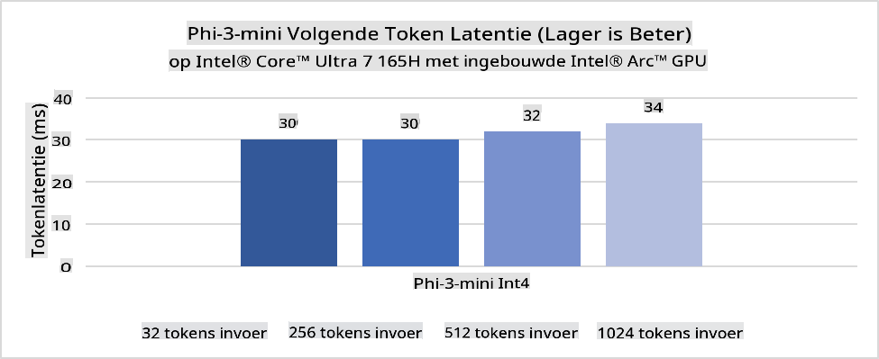
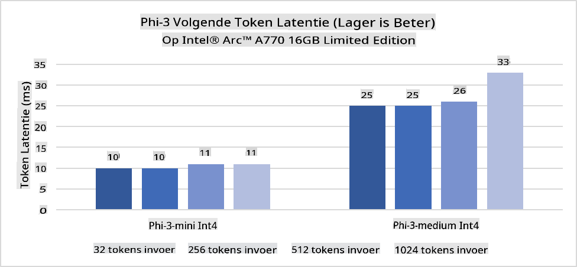
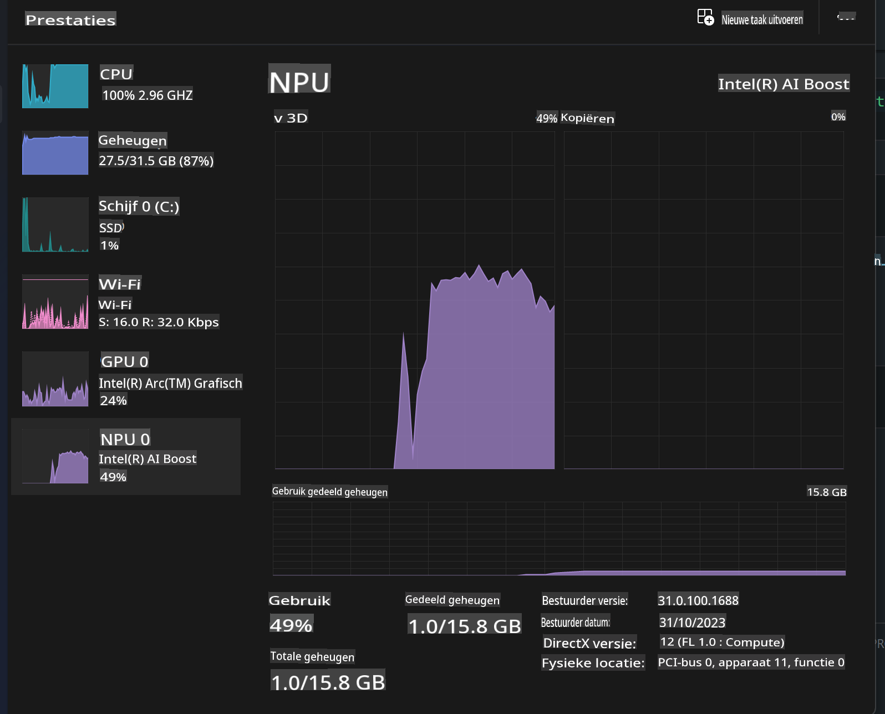
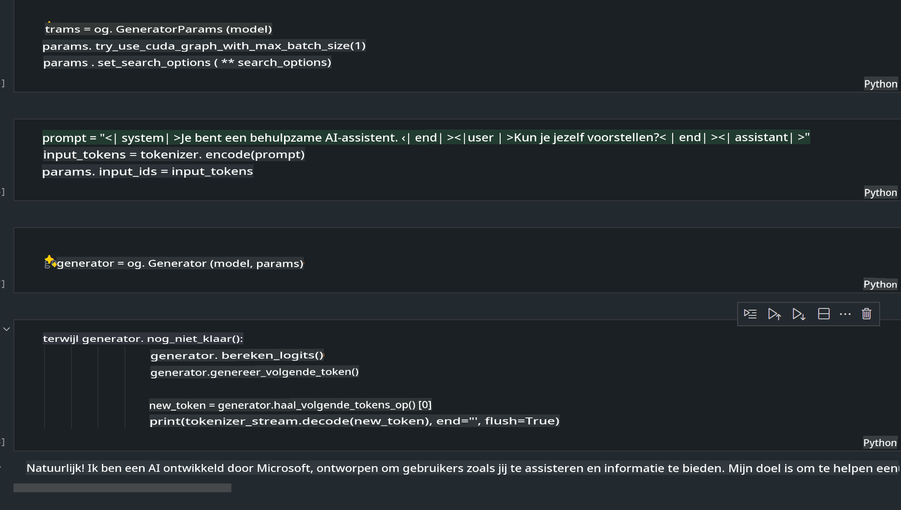
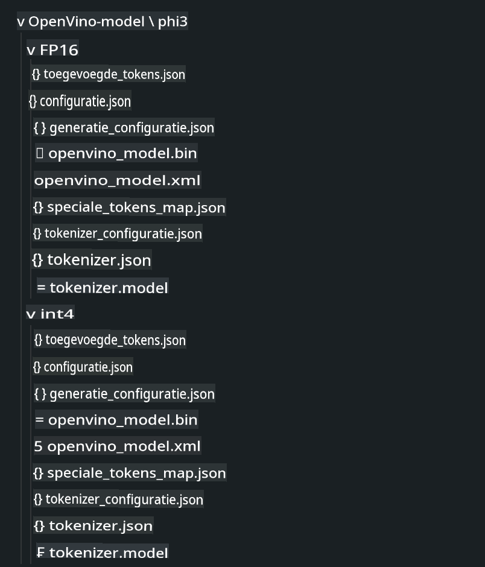
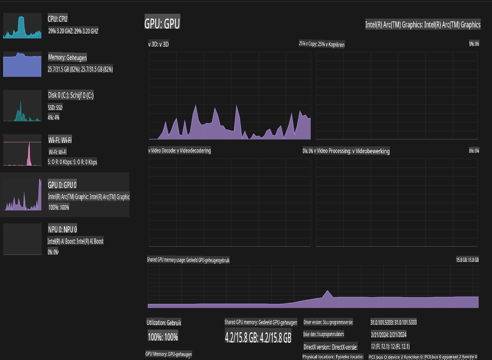

# **Inference Phi-3 in AI PC**

Met de vooruitgang van generatieve AI en de verbetering van hardwaremogelijkheden van randapparaten, kunnen steeds meer generatieve AI-modellen nu worden geïntegreerd in de Bring Your Own Device (BYOD)-apparaten van gebruikers. AI-PC's behoren tot deze modellen. Vanaf 2024 werken Intel, AMD en Qualcomm samen met PC-fabrikanten om AI-PC's te introduceren die de implementatie van lokale generatieve AI-modellen mogelijk maken via hardwareaanpassingen. In deze bespreking richten we ons op Intel AI-PC's en onderzoeken we hoe Phi-3 op een Intel AI-PC kan worden ingezet.

### Wat is een NPU

Een NPU (Neural Processing Unit) is een speciale processor of verwerkingsunit op een grotere SoC die specifiek is ontworpen om neurale netwerkbewerkingen en AI-taken te versnellen. In tegenstelling tot algemene CPU's en GPU's zijn NPU's geoptimaliseerd voor data-gedreven parallelle berekeningen, waardoor ze zeer efficiënt zijn in het verwerken van enorme hoeveelheden multimediadata zoals video's en afbeeldingen, en in het verwerken van gegevens voor neurale netwerken. Ze zijn met name goed in AI-gerelateerde taken, zoals spraakherkenning, achtergrondvervaging in videogesprekken en foto- of videobewerkingsprocessen zoals objectdetectie.

## NPU versus GPU

Hoewel veel AI- en machine learning-workloads op GPU's draaien, is er een belangrijk onderscheid tussen GPU's en NPU's.  
GPU's staan bekend om hun parallelle rekenmogelijkheden, maar niet alle GPU's zijn even efficiënt buiten grafische verwerking. NPU's daarentegen zijn speciaal gebouwd voor complexe berekeningen die nodig zijn voor neurale netwerkbewerkingen, waardoor ze zeer effectief zijn voor AI-taken.

Kortom, NPU's zijn de rekenwonders die AI-berekeningen versnellen, en ze spelen een sleutelrol in het opkomende tijdperk van AI-PC's!

***Dit voorbeeld is gebaseerd op Intel's nieuwste Intel Core Ultra-processor.***

## **1. Gebruik NPU om Phi-3-model uit te voeren**

Het Intel® NPU-apparaat is een AI-inferentieversneller geïntegreerd met Intel-client-CPU's, beginnend vanaf de Intel® Core™ Ultra-generatie van CPU's (voorheen bekend als Meteor Lake). Het maakt energie-efficiënte uitvoering van kunstmatige neurale netwerk-taken mogelijk.





**Intel NPU Acceleration Library**

De Intel NPU Acceleration Library [https://github.com/intel/intel-npu-acceleration-library](https://github.com/intel/intel-npu-acceleration-library) is een Python-bibliotheek ontworpen om de efficiëntie van je applicaties te verhogen door gebruik te maken van de kracht van de Intel Neural Processing Unit (NPU) voor snelle berekeningen op compatibele hardware.

Voorbeeld van Phi-3-mini op een AI-PC aangedreven door Intel® Core™ Ultra-processors.


Installeer de Python-bibliotheek met pip

```bash

   pip install intel-npu-acceleration-library

```

***Opmerking*** Het project is nog in ontwikkeling, maar het referentiemodel is al zeer compleet.

### **Phi-3 uitvoeren met Intel NPU Acceleration Library**

Door gebruik te maken van Intel NPU-versnelling, beïnvloedt deze bibliotheek het traditionele coderingsproces niet. Je hoeft alleen deze bibliotheek te gebruiken om het originele Phi-3-model te kwantificeren, zoals FP16, INT8, INT4, bijvoorbeeld:

```python
from transformers import AutoTokenizer, pipeline,TextStreamer
from intel_npu_acceleration_library import NPUModelForCausalLM, int4
from intel_npu_acceleration_library.compiler import CompilerConfig
import warnings

model_id = "microsoft/Phi-3-mini-4k-instruct"

compiler_conf = CompilerConfig(dtype=int4)
model = NPUModelForCausalLM.from_pretrained(
    model_id, use_cache=True, config=compiler_conf, attn_implementation="sdpa"
).eval()

tokenizer = AutoTokenizer.from_pretrained(model_id)

text_streamer = TextStreamer(tokenizer, skip_prompt=True)
```

Na succesvolle kwantificatie, voer je verder uit om de NPU aan te roepen om het Phi-3-model uit te voeren.

```python
generation_args = {
   "max_new_tokens": 1024,
   "return_full_text": False,
   "temperature": 0.3,
   "do_sample": False,
   "streamer": text_streamer,
}

pipe = pipeline(
   "text-generation",
   model=model,
   tokenizer=tokenizer,
)

query = "<|system|>You are a helpful AI assistant.<|end|><|user|>Can you introduce yourself?<|end|><|assistant|>"

with warnings.catch_warnings():
    warnings.simplefilter("ignore")
    pipe(query, **generation_args)
```

Tijdens het uitvoeren van de code kunnen we de status van de NPU bekijken via Taakbeheer.



***Voorbeelden*** : [AIPC_NPU_DEMO.ipynb](../../../../../code/03.Inference/AIPC/AIPC_NPU_DEMO.ipynb)

## **2. Gebruik DirectML + ONNX Runtime om Phi-3-model uit te voeren**

### **Wat is DirectML**

[DirectML](https://github.com/microsoft/DirectML) is een high-performance, hardwareversnelde DirectX 12-bibliotheek voor machine learning. DirectML biedt GPU-versnelling voor veelvoorkomende machine learning-taken op een breed scala aan ondersteunde hardware en stuurprogramma's, inclusief alle DirectX 12-compatibele GPU's van leveranciers zoals AMD, Intel, NVIDIA en Qualcomm.

Wanneer DirectML zelfstandig wordt gebruikt, is de API een laag-niveau DirectX 12-bibliotheek en geschikt voor high-performance, lage-latentie toepassingen zoals frameworks, games en andere real-time applicaties. De naadloze interoperabiliteit van DirectML met Direct3D 12 evenals de lage overhead en consistentie tussen hardware maken DirectML ideaal voor het versnellen van machine learning wanneer zowel hoge prestaties als betrouwbaarheid en voorspelbaarheid van resultaten belangrijk zijn.

***Opmerking*** : De nieuwste DirectML ondersteunt al NPU (https://devblogs.microsoft.com/directx/introducing-neural-processor-unit-npu-support-in-directml-developer-preview/).

### DirectML en CUDA qua mogelijkheden en prestaties:

**DirectML** is een machine learning-bibliotheek ontwikkeld door Microsoft. Het is ontworpen om machine learning-workloads te versnellen op Windows-apparaten, inclusief desktops, laptops en randapparaten.
- DX12-gebaseerd: DirectML is gebouwd op DirectX 12 (DX12), wat brede hardware-ondersteuning biedt voor GPU's, inclusief zowel NVIDIA als AMD.
- Brede ondersteuning: Omdat het DX12 gebruikt, kan DirectML werken met elke GPU die DX12 ondersteunt, zelfs geïntegreerde GPU's.
- Beeldverwerking: DirectML verwerkt afbeeldingen en andere gegevens met neurale netwerken, waardoor het geschikt is voor taken zoals beeldherkenning, objectdetectie en meer.
- Gemakkelijk in te stellen: Het instellen van DirectML is eenvoudig en vereist geen specifieke SDK's of bibliotheken van GPU-fabrikanten.
- Prestaties: In sommige gevallen presteert DirectML goed en kan het sneller zijn dan CUDA, vooral voor bepaalde workloads.
- Beperkingen: Er zijn echter gevallen waarin DirectML langzamer kan zijn, met name bij float16 en grote batchgroottes.

**CUDA** is NVIDIA's parallelle computerplatform en programmeermodel. Het stelt ontwikkelaars in staat om de kracht van NVIDIA GPU's te benutten voor algemene berekeningen, inclusief machine learning en wetenschappelijke simulaties.
- Specifiek voor NVIDIA: CUDA is nauw geïntegreerd met NVIDIA GPU's en specifiek ontworpen voor hen.
- Hoog geoptimaliseerd: Het biedt uitstekende prestaties voor GPU-versnelde taken, vooral bij gebruik van NVIDIA GPU's.
- Breed gebruikt: Veel machine learning-frameworks en bibliotheken (zoals TensorFlow en PyTorch) hebben CUDA-ondersteuning.
- Aanpasbaarheid: Ontwikkelaars kunnen CUDA-instellingen verfijnen voor specifieke taken, wat kan leiden tot optimale prestaties.
- Beperkingen: De afhankelijkheid van NVIDIA-hardware kan echter beperkend zijn als je bredere compatibiliteit wilt met verschillende GPU's.

### Kiezen tussen DirectML en CUDA

De keuze tussen DirectML en CUDA hangt af van je specifieke gebruiksscenario, beschikbare hardware en voorkeuren.  
Als je op zoek bent naar bredere compatibiliteit en eenvoud in opzet, is DirectML mogelijk een goede keuze. Als je echter NVIDIA GPU's hebt en geoptimaliseerde prestaties nodig hebt, blijft CUDA een sterke optie. Kortom, beide hebben hun sterke en zwakke punten, dus overweeg je vereisten en beschikbare hardware bij het maken van een beslissing.

### **Generatieve AI met ONNX Runtime**

In het tijdperk van AI is de overdraagbaarheid van AI-modellen erg belangrijk. ONNX Runtime maakt het eenvoudig om getrainde modellen op verschillende apparaten te implementeren. Ontwikkelaars hoeven zich geen zorgen te maken over het inferentie-framework en kunnen met een uniforme API model-inferentie voltooien. In het tijdperk van generatieve AI heeft ONNX Runtime ook code-optimalisatie uitgevoerd (https://onnxruntime.ai/docs/genai/). Met de geoptimaliseerde ONNX Runtime kan het gekwantificeerde generatieve AI-model worden geïnferentieerd op verschillende terminals. In Generatieve AI met ONNX Runtime kun je AI-model-API's aanroepen via Python, C#, C/C++. Uiteraard kan je bij implementatie op een iPhone profiteren van C++'s Generatieve AI met ONNX Runtime API.

[Voorbeeldcode](https://github.com/Azure-Samples/Phi-3MiniSamples/tree/main/onnx)

***Genereer generatieve AI met ONNX Runtime-bibliotheek***

```bash

winget install --id=Kitware.CMake  -e

git clone https://github.com/microsoft/onnxruntime.git

cd .\onnxruntime\

./build.bat --build_shared_lib --skip_tests --parallel --use_dml --config Release

cd ../

git clone https://github.com/microsoft/onnxruntime-genai.git

cd .\onnxruntime-genai\

mkdir ort

cd ort

mkdir include

mkdir lib

copy ..\onnxruntime\include\onnxruntime\core\providers\dml\dml_provider_factory.h ort\include

copy ..\onnxruntime\include\onnxruntime\core\session\onnxruntime_c_api.h ort\include

copy ..\onnxruntime\build\Windows\Release\Release\*.dll ort\lib

copy ..\onnxruntime\build\Windows\Release\Release\onnxruntime.lib ort\lib

python build.py --use_dml


```

**Installeer bibliotheek**

```bash

pip install .\onnxruntime_genai_directml-0.3.0.dev0-cp310-cp310-win_amd64.whl

```

Dit is het uitvoeringsresultaat.



***Voorbeelden*** : [AIPC_DirectML_DEMO.ipynb](../../../../../code/03.Inference/AIPC/AIPC_DirectML_DEMO.ipynb)

## **3. Gebruik Intel OpenVino om Phi-3-model uit te voeren**

### **Wat is OpenVINO**

[OpenVINO](https://github.com/openvinotoolkit/openvino) is een open-source toolkit voor het optimaliseren en implementeren van deep learning-modellen. Het biedt verbeterde deep learning-prestaties voor vision-, audio- en taalmodellen van populaire frameworks zoals TensorFlow, PyTorch en meer. Begin met OpenVINO. OpenVINO kan ook worden gebruikt in combinatie met CPU en GPU om het Phi-3-model uit te voeren.

***Opmerking***: Momenteel ondersteunt OpenVINO geen NPU.

### **Installeer OpenVINO-bibliotheek**

```bash

 pip install git+https://github.com/huggingface/optimum-intel.git

 pip install git+https://github.com/openvinotoolkit/nncf.git

 pip install openvino-nightly

```

### **Phi-3 uitvoeren met OpenVINO**

Net als NPU voltooit OpenVINO de aanroep van generatieve AI-modellen door gekwantificeerde modellen uit te voeren. We moeten eerst het Phi-3-model kwantificeren en de modelkwantisatie voltooien via de commandoregel met behulp van optimum-cli.

**INT4**

```bash

optimum-cli export openvino --model "microsoft/Phi-3-mini-4k-instruct" --task text-generation-with-past --weight-format int4 --group-size 128 --ratio 0.6  --sym  --trust-remote-code ./openvinomodel/phi3/int4

```

**FP16**

```bash

optimum-cli export openvino --model "microsoft/Phi-3-mini-4k-instruct" --task text-generation-with-past --weight-format fp16 --trust-remote-code ./openvinomodel/phi3/fp16

```

Het geconverteerde formaat ziet er als volgt uit:



Laad modelpaden (model_dir), gerelateerde configuraties (ov_config = {"PERFORMANCE_HINT": "LATENCY", "NUM_STREAMS": "1", "CACHE_DIR": ""}) en hardwareversnelde apparaten (GPU.0) via OVModelForCausalLM.

```python

ov_model = OVModelForCausalLM.from_pretrained(
     model_dir,
     device='GPU.0',
     ov_config=ov_config,
     config=AutoConfig.from_pretrained(model_dir, trust_remote_code=True),
     trust_remote_code=True,
)

```

Tijdens het uitvoeren van de code kunnen we de status van de GPU bekijken via Taakbeheer.



***Voorbeelden*** : [AIPC_OpenVino_Demo.ipynb](../../../../../code/03.Inference/AIPC/AIPC_OpenVino_Demo.ipynb)

### ***Opmerking*** : De bovenstaande drie methoden hebben elk hun eigen voordelen, maar het wordt aanbevolen om NPU-versnelling te gebruiken voor AI-PC-inferentie.

**Disclaimer**:  
Dit document is vertaald met behulp van AI-gebaseerde automatische vertaaldiensten. Hoewel we ons best doen voor nauwkeurigheid, dient u zich ervan bewust te zijn dat geautomatiseerde vertalingen fouten of onnauwkeurigheden kunnen bevatten. Het originele document in de oorspronkelijke taal moet worden beschouwd als de gezaghebbende bron. Voor cruciale informatie wordt professionele menselijke vertaling aanbevolen. Wij zijn niet aansprakelijk voor misverstanden of verkeerde interpretaties die voortvloeien uit het gebruik van deze vertaling.