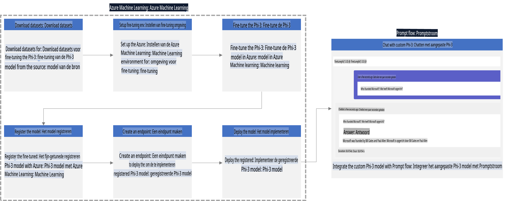
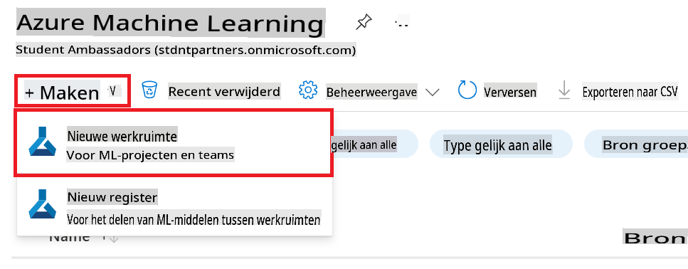
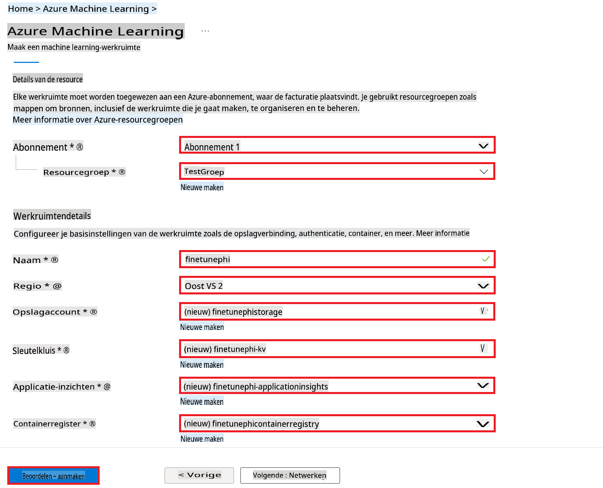
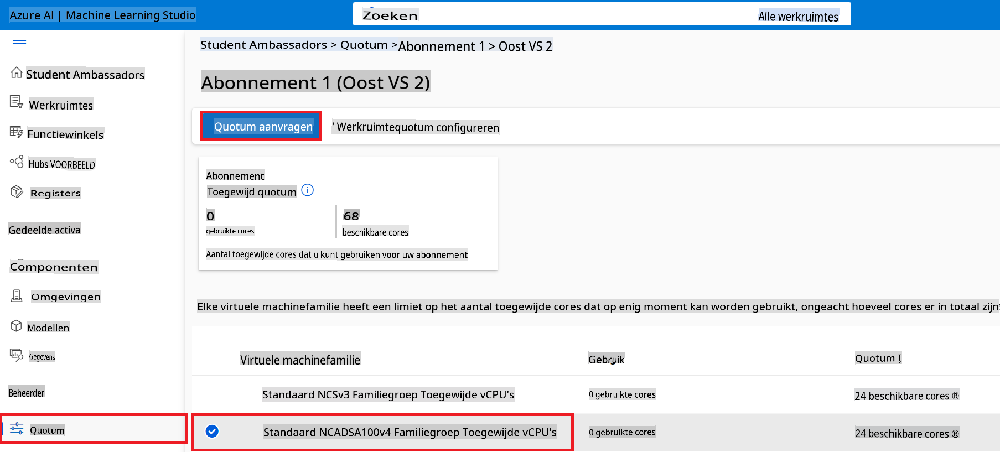
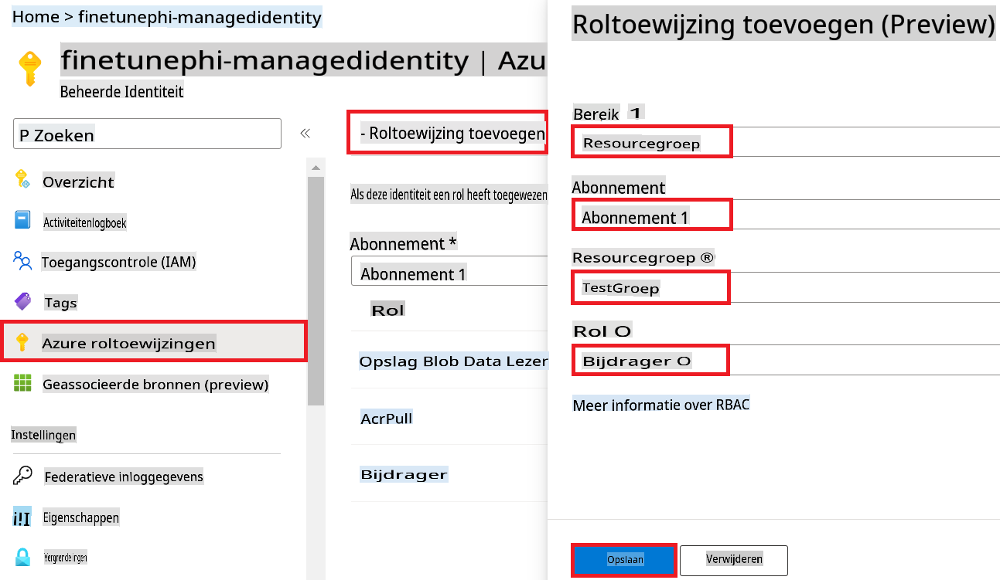
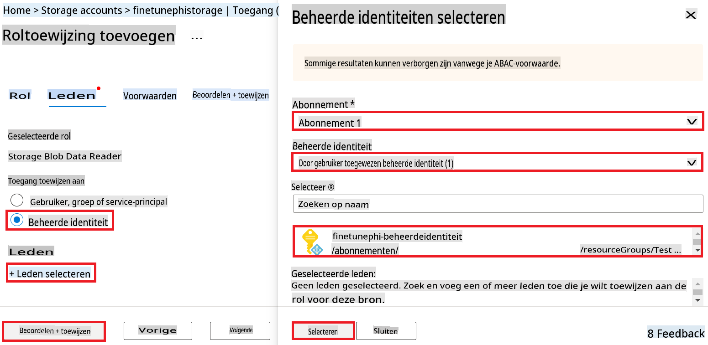
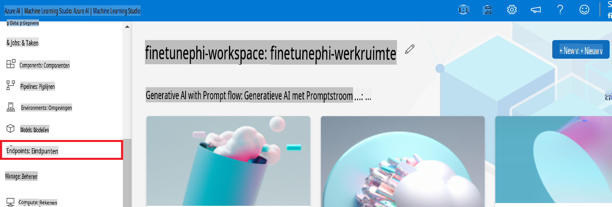
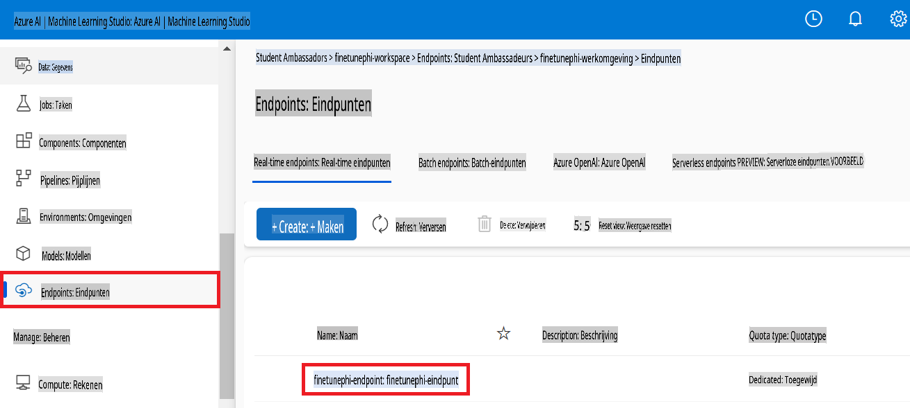
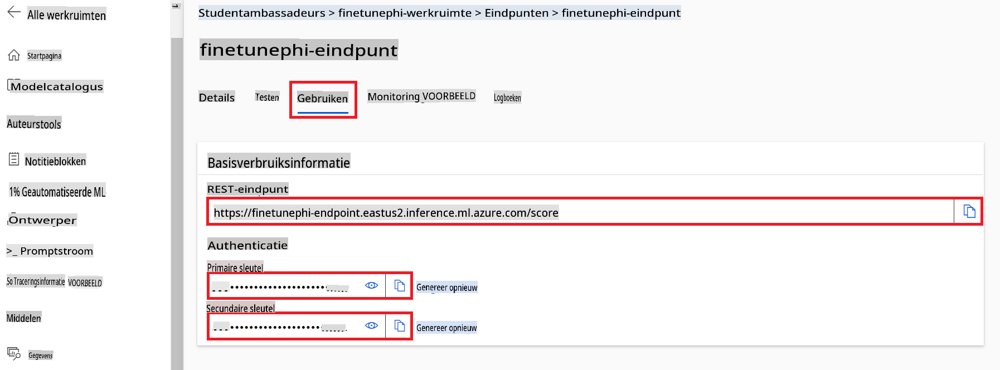
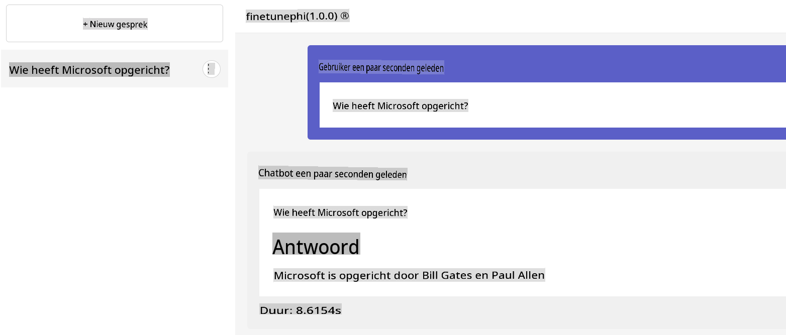

# Fine-tune en Integreer aangepaste Phi-3 modellen met Prompt flow

Deze end-to-end (E2E) voorbeeldoplossing is gebaseerd op de gids "[Fine-Tune and Integrate Custom Phi-3 Models with Prompt Flow: Step-by-Step Guide](https://techcommunity.microsoft.com/t5/educator-developer-blog/fine-tune-and-integrate-custom-phi-3-models-with-prompt-flow/ba-p/4178612?WT.mc_id=aiml-137032-kinfeylo)" van de Microsoft Tech Community. Het behandelt de processen van het fijn-tunen, implementeren en integreren van aangepaste Phi-3 modellen met Prompt flow.

## Overzicht

In deze E2E-oplossing leer je hoe je het Phi-3 model kunt fijn-tunen en integreren met Prompt flow. Door gebruik te maken van Azure Machine Learning en Prompt flow stel je een workflow op voor het implementeren en gebruiken van aangepaste AI-modellen. Deze E2E-oplossing is verdeeld in drie scenario's:

**Scenario 1: Azure-resources instellen en voorbereiden op fijn-tuning**

**Scenario 2: Het Phi-3 model fijn-tunen en implementeren in Azure Machine Learning Studio**

**Scenario 3: Integreren met Prompt flow en chatten met je aangepaste model**

Hier is een overzicht van deze E2E-oplossing.



### Inhoudsopgave

1. **[Scenario 1: Azure-resources instellen en voorbereiden op fijn-tuning](../../../../../../md/02.Application/01.TextAndChat/Phi3)**
    - [Een Azure Machine Learning Workspace maken](../../../../../../md/02.Application/01.TextAndChat/Phi3)
    - [GPU-quota's aanvragen in Azure-abonnement](../../../../../../md/02.Application/01.TextAndChat/Phi3)
    - [Roltoewijzing toevoegen](../../../../../../md/02.Application/01.TextAndChat/Phi3)
    - [Project instellen](../../../../../../md/02.Application/01.TextAndChat/Phi3)
    - [Dataset voorbereiden voor fijn-tuning](../../../../../../md/02.Application/01.TextAndChat/Phi3)

1. **[Scenario 2: Het Phi-3 model fijn-tunen en implementeren in Azure Machine Learning Studio](../../../../../../md/02.Application/01.TextAndChat/Phi3)**
    - [Azure CLI instellen](../../../../../../md/02.Application/01.TextAndChat/Phi3)
    - [Het Phi-3 model fijn-tunen](../../../../../../md/02.Application/01.TextAndChat/Phi3)
    - [Het fijn-getunede model implementeren](../../../../../../md/02.Application/01.TextAndChat/Phi3)

1. **[Scenario 3: Integreren met Prompt flow en chatten met je aangepaste model](../../../../../../md/02.Application/01.TextAndChat/Phi3)**
    - [Het aangepaste Phi-3 model integreren met Prompt flow](../../../../../../md/02.Application/01.TextAndChat/Phi3)
    - [Chatten met je aangepaste model](../../../../../../md/02.Application/01.TextAndChat/Phi3)

## Scenario 1: Azure-resources instellen en voorbereiden op fijn-tuning

### Een Azure Machine Learning Workspace maken

1. Typ *azure machine learning* in de **zoekbalk** bovenaan de portaalpagina en selecteer **Azure Machine Learning** uit de weergegeven opties.

    

1. Selecteer **+ Maken** in het navigatiemenu.

1. Selecteer **Nieuwe workspace** in het navigatiemenu.

    

1. Voer de volgende taken uit:

    - Selecteer je Azure **Abonnement**.
    - Selecteer de **Resourcegroep** die je wilt gebruiken (maak een nieuwe indien nodig).
    - Voer een unieke **Workspacenaam** in.
    - Selecteer de **Regio** die je wilt gebruiken.
    - Selecteer het **Opslagaccount** dat je wilt gebruiken (maak een nieuwe indien nodig).
    - Selecteer de **Key vault** die je wilt gebruiken (maak een nieuwe indien nodig).
    - Selecteer de **Application insights** die je wilt gebruiken (maak een nieuwe indien nodig).
    - Selecteer de **Container registry** die je wilt gebruiken (maak een nieuwe indien nodig).

    

1. Selecteer **Controleren + Maken**.

1. Selecteer **Maken**.

### GPU-quota's aanvragen in Azure-abonnement

In deze E2E-oplossing gebruik je de *Standard_NC24ads_A100_v4 GPU* voor fijn-tuning, waarvoor een quotumaanvraag nodig is, en de *Standard_E4s_v3* CPU voor implementatie, waarvoor geen quotumaanvraag nodig is.

> [!NOTE]
>
> Alleen Pay-As-You-Go-abonnementen (de standaard abonnementsvorm) komen in aanmerking voor GPU-toewijzing; voordeelabonnementen worden momenteel niet ondersteund.
>
> Voor gebruikers van voordeelabonnementen (zoals Visual Studio Enterprise Subscription) of degenen die het fijn-tuning- en implementatieproces snel willen testen, biedt deze tutorial ook richtlijnen voor fijn-tuning met een minimale dataset met behulp van een CPU. Het is echter belangrijk op te merken dat de resultaten van fijn-tuning aanzienlijk beter zijn bij gebruik van een GPU met grotere datasets.

1. Bezoek [Azure ML Studio](https://ml.azure.com/home?wt.mc_id=studentamb_279723).

1. Voer de volgende taken uit om een quotumaanvraag in te dienen voor *Standard NCADSA100v4 Family*:

    - Selecteer **Quota** in het menu aan de linkerkant.
    - Selecteer de **Virtuele machinefamilie** die je wilt gebruiken. Bijvoorbeeld **Standard NCADSA100v4 Family Cluster Dedicated vCPUs**, die de *Standard_NC24ads_A100_v4* GPU bevat.
    - Selecteer **Quota aanvragen** in het navigatiemenu.

        

    - Vul op de pagina Quota aanvragen de **Nieuwe kernlimiet** in die je wilt gebruiken. Bijvoorbeeld 24.
    - Selecteer **Indienen** om de GPU-quota aan te vragen.

> [!NOTE]
> Je kunt de geschikte GPU of CPU selecteren op basis van je behoeften door de documentatie [Maten voor Virtuele Machines in Azure](https://learn.microsoft.com/azure/virtual-machines/sizes/overview?tabs=breakdownseries%2Cgeneralsizelist%2Ccomputesizelist%2Cmemorysizelist%2Cstoragesizelist%2Cgpusizelist%2Cfpgasizelist%2Chpcsizelist) te raadplegen.

### Roltoewijzing toevoegen

Om je modellen te kunnen fijn-tunen en implementeren, moet je eerst een Gebruikerstoewijzing Managed Identity (UAI) maken en de juiste machtigingen toewijzen. Deze UAI wordt gebruikt voor authenticatie tijdens de implementatie.

#### Gebruikerstoewijzing Managed Identity (UAI) maken

1. Typ *managed identities* in de **zoekbalk** bovenaan de portaalpagina en selecteer **Managed Identities** uit de weergegeven opties.

    

1. Selecteer **+ Maken**.

    

1. Voer de volgende taken uit:

    - Selecteer je Azure **Abonnement**.
    - Selecteer de **Resourcegroep** die je wilt gebruiken (maak een nieuwe indien nodig).
    - Selecteer de **Regio** die je wilt gebruiken.
    - Voer een unieke **Naam** in.

1. Selecteer **Controleren + maken**.

1. Selecteer **+ Maken**.

#### Contributor-roltoewijzing toevoegen aan Managed Identity

1. Navigeer naar de Managed Identity-resource die je hebt aangemaakt.

1. Selecteer **Azure roltoewijzingen** in het menu aan de linkerkant.

1. Selecteer **+Roltoewijzing toevoegen** in het navigatiemenu.

1. Voer op de pagina Roltoewijzing toevoegen de volgende taken uit:
    - Selecteer de **Scope** als **Resourcegroep**.
    - Selecteer je Azure **Abonnement**.
    - Selecteer de **Resourcegroep** die je wilt gebruiken.
    - Selecteer de **Rol** als **Contributor**.

    

1. Selecteer **Opslaan**.

#### Storage Blob Data Reader-roltoewijzing toevoegen aan Managed Identity

1. Typ *storage accounts* in de **zoekbalk** bovenaan de portaalpagina en selecteer **Storage accounts** uit de weergegeven opties.

    

1. Selecteer het opslagaccount dat is gekoppeld aan de Azure Machine Learning workspace die je hebt aangemaakt. Bijvoorbeeld *finetunephistorage*.

1. Voer de volgende taken uit om naar de pagina Roltoewijzing toevoegen te navigeren:

    - Navigeer naar het Azure Storage-account dat je hebt aangemaakt.
    - Selecteer **Toegangsbeheer (IAM)** in het menu aan de linkerkant.
    - Selecteer **+ Toevoegen** in het navigatiemenu.
    - Selecteer **Roltoewijzing toevoegen** in het navigatiemenu.

    

1. Voer op de pagina Roltoewijzing toevoegen de volgende taken uit:

    - Typ op de Rolpagina *Storage Blob Data Reader* in de **zoekbalk** en selecteer **Storage Blob Data Reader** uit de weergegeven opties.
    - Selecteer **Volgende**.
    - Selecteer op de pagina Leden **Toegang toewijzen aan** **Managed identity**.
    - Selecteer **+ Leden selecteren**.
    - Selecteer op de pagina Managed identities selecteren je Azure **Abonnement**.
    - Selecteer de **Managed identity** als **Managed Identity**.
    - Selecteer de Managed Identity die je hebt aangemaakt. Bijvoorbeeld *finetunephi-managedidentity*.
    - Selecteer **Selecteren**.

    

1. Selecteer **Controleren + toewijzen**.

#### AcrPull-roltoewijzing toevoegen aan Managed Identity

1. Typ *container registries* in de **zoekbalk** bovenaan de portaalpagina en selecteer **Container registries** uit de weergegeven opties.

    

1. Selecteer de container registry die is gekoppeld aan de Azure Machine Learning workspace. Bijvoorbeeld *finetunephicontainerregistries*.

1. Voer de volgende taken uit om naar de pagina Roltoewijzing toevoegen te navigeren:

    - Selecteer **Toegangsbeheer (IAM)** in het menu aan de linkerkant.
    - Selecteer **+ Toevoegen** in het navigatiemenu.
    - Selecteer **Roltoewijzing toevoegen** in het navigatiemenu.

1. Voer op de pagina Roltoewijzing toevoegen de volgende taken uit:

    - Typ op de Rolpagina *AcrPull* in de **zoekbalk** en selecteer **AcrPull** uit de weergegeven opties.
    - Selecteer **Volgende**.
    - Selecteer op de pagina Leden **Toegang toewijzen aan** **Managed identity**.
    - Selecteer **+ Leden selecteren**.
    - Selecteer op de pagina Managed identities selecteren je Azure **Abonnement**.
    - Selecteer de **Managed identity** als **Managed Identity**.
    - Selecteer de Managed Identity die je hebt aangemaakt. Bijvoorbeeld *finetunephi-managedidentity*.
    - Selecteer **Selecteren**.
    - Selecteer **Controleren + toewijzen**.

### Project instellen

Nu maak je een map om in te werken en stel je een virtuele omgeving in om een programma te ontwikkelen dat interacteert met gebruikers en opgeslagen chathistorie van Azure Cosmos DB gebruikt om zijn antwoorden te verbeteren.

#### Een map maken om in te werken

1. Open een terminalvenster en typ het volgende commando om een map genaamd *finetune-phi* te maken in het standaardpad.

    ```console
    mkdir finetune-phi
    ```

1. Typ het volgende commando in je terminal om naar de map *finetune-phi* te navigeren die je hebt aangemaakt.

    ```console
    cd finetune-phi
    ```

#### Een virtuele omgeving maken

1. Typ het volgende commando in je terminal om een virtuele omgeving genaamd *.venv* te maken.

    ```console
    python -m venv .venv
    ```

1. Typ het volgende commando in je terminal om de virtuele omgeving te activeren.

    ```console
    .venv\Scripts\activate.bat
    ```

> [!NOTE]
>
> Als het gelukt is, zou je *(.venv)* voor de opdrachtprompt moeten zien.

#### De vereiste pakketten installeren

1. Typ de volgende commando's in je terminal om de vereiste pakketten te installeren.

    ```console
    pip install datasets==2.19.1
    pip install transformers==4.41.1
    pip install azure-ai-ml==1.16.0
    pip install torch==2.3.1
    pip install trl==0.9.4
    pip install promptflow==1.12.0
    ```

#### Projectbestanden maken

In deze oefening maak je de essentiële bestanden voor ons project. Deze bestanden omvatten scripts voor het downloaden van de dataset, het instellen van de Azure Machine Learning-omgeving, het fijn-tunen van het Phi-3 model en het implementeren van het fijn-getunede model. Je maakt ook een *conda.yml*-bestand om de fijn-tuning-omgeving in te stellen.

In deze oefening ga je:

- Een bestand genaamd *download_dataset.py* maken om de dataset te downloaden.
- Een bestand genaamd *setup_ml.py* maken om de Azure Machine Learning-omgeving in te stellen.
- Een bestand genaamd *fine_tune.py* maken in de map *finetuning_dir* om het Phi-3 model te fijn-tunen met behulp van de dataset.
- Een bestand genaamd *conda.yml* maken om de fijn-tuning-omgeving in te stellen.
- Een bestand genaamd *deploy_model.py* maken om het fijn-getunede model te implementeren.
- Een bestand genaamd *integrate_with_promptflow.py* maken om het fijn-getunede model te integreren en uit te voeren met Prompt flow.
- Een bestand genaamd *flow.dag.yml* maken om de workflowstructuur voor Prompt flow in te stellen.
- Een bestand genaamd *config.py* maken om Azure-informatie in te voeren.

> [!NOTE]
>
> Volledige mapstructuur:
>
> ```text
> └── YourUserName
> .    └── finetune-phi
> .        ├── finetuning_dir
> .        │      └── fine_tune.py
> .        ├── conda.yml
> .        ├── config.py
> .        ├── deploy_model.py
> .        ├── download_dataset.py
> .        ├── flow.dag.yml
> .        ├── integrate_with_promptflow.py
> .        └── setup_ml.py
> ```

1. Open **Visual Studio Code**.

1. Selecteer **Bestand** in de menubalk.

1. Selecteer **Map openen**.

1. Selecteer de map *finetune-phi* die je hebt aangemaakt, deze bevindt zich in *C:\Users\yourUserName\finetune-phi*.

    

1. Klik in het linker paneel van Visual Studio Code met de rechtermuisknop en selecteer **Nieuw bestand** om een nieuw bestand genaamd *download_dataset.py* te maken.

1. Klik in het linker paneel van Visual Studio Code met de rechtermuisknop en selecteer **Nieuw bestand** om een nieuw bestand genaamd *setup_ml.py* te maken.

1. Klik in het linker paneel van Visual Studio Code met de rechtermuisknop en selecteer **Nieuw bestand** om een nieuw bestand genaamd *deploy_model.py* te maken.

    

1. Klik in het linker paneel van Visual Studio Code met de rechtermuisknop en selecteer **Nieuwe map** om een nieuwe map genaamd *finetuning_dir* te maken.

1. Maak in de map *finetuning_dir* een nieuw bestand genaamd *fine_tune.py*.

#### *conda.yml*-bestand maken en configureren

1. Klik in het linker paneel van Visual Studio Code met de rechtermuisknop en selecteer **Nieuw bestand** om een nieuw bestand genaamd *conda.yml* te maken.

1. Voeg de volgende code toe aan het *conda.yml*-bestand om de fijn-tuning-omgeving voor het Phi-3 model in te stellen.

    ```yml
    name: phi-3-training-env
    channels:
      - defaults
      - conda-forge
    dependencies:
      - python=3.10
      - pip
      - numpy<2.0
      - pip:
          - torch==2.4.0
          - torchvision==0.19.0
          - trl==0.8.6
          - transformers==4.41
          - datasets==2.21.0
          - azureml-core==1.57.0
          - azure-storage-blob==12.19.0
          - azure-ai-ml==1.16
          - azure-identity==1.17.1
          - accelerate==0.33.0
          - mlflow==2.15.1
          - azureml-mlflow==1.57.0
    ```

#### *config.py*-bestand maken en configureren

1. Klik in het linker paneel van Visual Studio Code met de rechtermuisknop en selecteer **Nieuw bestand** om een nieuw bestand genaamd *config.py* te maken.

1. Voeg de volgende code toe aan het *config.py*-bestand om je Azure-informatie op te nemen.

    ```python
    # Azure settings
    AZURE_SUBSCRIPTION_ID = "your_subscription_id"
    AZURE_RESOURCE_GROUP_NAME = "your_resource_group_name" # "TestGroup"

    # Azure Machine Learning settings
    AZURE_ML_WORKSPACE_NAME = "your_workspace_name" # "finetunephi-workspace"

    # Azure Managed Identity settings
    AZURE_MANAGED_IDENTITY_CLIENT_ID = "your_azure_managed_identity_client_id"
    AZURE_MANAGED_IDENTITY_NAME = "your_azure_managed_identity_name" # "finetunephi-mangedidentity"
    AZURE_MANAGED_IDENTITY_RESOURCE_ID = f"/subscriptions/{AZURE_SUBSCRIPTION_ID}/resourceGroups/{AZURE_RESOURCE_GROUP_NAME}/providers/Microsoft.ManagedIdentity/userAssignedIdentities/{AZURE_MANAGED_IDENTITY_NAME}"

    # Dataset file paths
    TRAIN_DATA_PATH = "data/train_data.jsonl"
    TEST_DATA_PATH = "data/test_data.jsonl"

    # Fine-tuned model settings
    AZURE_MODEL_NAME = "your_fine_tuned_model_name" # "finetune-phi-model"
    AZURE_ENDPOINT_NAME = "your_fine_tuned_model_endpoint_name" # "finetune-phi-endpoint"
    AZURE_DEPLOYMENT_NAME = "your_fine_tuned_model_deployment_name" # "finetune-phi-deployment"

    AZURE_ML_API_KEY = "your_fine_tuned_model_api_key"
    AZURE_ML_ENDPOINT = "your_fine_tuned_model_endpoint_uri" # "https://{your-endpoint-name}.{your-region}.inference.ml.azure.com/score"
    ```

#### Azure-omgevingsvariabelen toevoegen

1. Voer de volgende taken uit om de Azure Subscription ID toe te voegen:

    - Typ *subscriptions* in de **zoekbalk** bovenaan de portaalpagina en selecteer **Subscriptions** uit de weergegeven opties.
    - Selecteer het Azure-abonnement dat je momenteel gebruikt.
    - Kopieer en plak je Subscription ID in het *config.py*-bestand.


1. Voer de volgende stappen uit om de Azure Workspace Naam toe te voegen:

    - Navigeer naar de Azure Machine Learning-resource die je hebt aangemaakt.
    - Kopieer en plak je accountnaam in het bestand *config.py*.

    

1. Voer de volgende stappen uit om de Azure Resource Group Naam toe te voegen:

    - Navigeer naar de Azure Machine Learning-resource die je hebt aangemaakt.
    - Kopieer en plak je Azure Resource Group Naam in het bestand *config.py*.

    

2. Voer de volgende stappen uit om de Azure Managed Identity Naam toe te voegen:

    - Navigeer naar de Managed Identities-resource die je hebt aangemaakt.
    - Kopieer en plak je Azure Managed Identity Naam in het bestand *config.py*.

    

### Dataset voorbereiden voor fine-tuning

In deze oefening voer je het bestand *download_dataset.py* uit om de *ULTRACHAT_200k*-datasets naar je lokale omgeving te downloaden. Vervolgens gebruik je deze datasets om het Phi-3 model in Azure Machine Learning te fine-tunen.

#### Download je dataset met behulp van *download_dataset.py*

1. Open het bestand *download_dataset.py* in Visual Studio Code.

1. Voeg de volgende code toe aan *download_dataset.py*.

    ```python
    import json
    import os
    from datasets import load_dataset
    from config import (
        TRAIN_DATA_PATH,
        TEST_DATA_PATH)

    def load_and_split_dataset(dataset_name, config_name, split_ratio):
        """
        Load and split a dataset.
        """
        # Load the dataset with the specified name, configuration, and split ratio
        dataset = load_dataset(dataset_name, config_name, split=split_ratio)
        print(f"Original dataset size: {len(dataset)}")
        
        # Split the dataset into train and test sets (80% train, 20% test)
        split_dataset = dataset.train_test_split(test_size=0.2)
        print(f"Train dataset size: {len(split_dataset['train'])}")
        print(f"Test dataset size: {len(split_dataset['test'])}")
        
        return split_dataset

    def save_dataset_to_jsonl(dataset, filepath):
        """
        Save a dataset to a JSONL file.
        """
        # Create the directory if it does not exist
        os.makedirs(os.path.dirname(filepath), exist_ok=True)
        
        # Open the file in write mode
        with open(filepath, 'w', encoding='utf-8') as f:
            # Iterate over each record in the dataset
            for record in dataset:
                # Dump the record as a JSON object and write it to the file
                json.dump(record, f)
                # Write a newline character to separate records
                f.write('\n')
        
        print(f"Dataset saved to {filepath}")

    def main():
        """
        Main function to load, split, and save the dataset.
        """
        # Load and split the ULTRACHAT_200k dataset with a specific configuration and split ratio
        dataset = load_and_split_dataset("HuggingFaceH4/ultrachat_200k", 'default', 'train_sft[:1%]')
        
        # Extract the train and test datasets from the split
        train_dataset = dataset['train']
        test_dataset = dataset['test']

        # Save the train dataset to a JSONL file
        save_dataset_to_jsonl(train_dataset, TRAIN_DATA_PATH)
        
        # Save the test dataset to a separate JSONL file
        save_dataset_to_jsonl(test_dataset, TEST_DATA_PATH)

    if __name__ == "__main__":
        main()

    ```

> [!TIP]
>
> **Richtlijnen voor fine-tuning met een minimale dataset met behulp van een CPU**
>
> Als je een CPU wilt gebruiken voor fine-tuning, is deze aanpak ideaal voor mensen met voordelen zoals een Visual Studio Enterprise Subscription of om snel het fine-tuning- en implementatieproces te testen.
>
> Vervang `dataset = load_and_split_dataset("HuggingFaceH4/ultrachat_200k", 'default', 'train_sft[:1%]')` with `dataset = load_and_split_dataset("HuggingFaceH4/ultrachat_200k", 'default', 'train_sft[:10]')`
>

1. Voer het volgende commando uit in je terminal om het script te draaien en de dataset naar je lokale omgeving te downloaden.

    ```console
    python download_data.py
    ```

1. Controleer of de datasets succesvol zijn opgeslagen in je lokale *finetune-phi/data*-directory.

> [!NOTE]
>
> **Datasetgrootte en fine-tuningtijd**
>
> In dit E2E-voorbeeld gebruik je slechts 1% van de dataset (`train_sft[:1%]`). Dit verkleint de hoeveelheid data aanzienlijk, waardoor zowel het upload- als fine-tuningproces wordt versneld. Je kunt het percentage aanpassen om de juiste balans te vinden tussen trainingstijd en modelprestaties. Het gebruik van een kleinere subset van de dataset maakt het fine-tuningproces beheersbaarder voor een E2E-voorbeeld.

## Scenario 2: Fine-tunen van het Phi-3 model en implementeren in Azure Machine Learning Studio

### Azure CLI instellen

Je moet Azure CLI instellen om je omgeving te authenticeren. Met Azure CLI kun je Azure-resources rechtstreeks vanaf de opdrachtregel beheren en worden de benodigde referenties geleverd voor Azure Machine Learning om toegang te krijgen tot deze resources. Begin met het installeren van [Azure CLI](https://learn.microsoft.com/cli/azure/install-azure-cli).

1. Open een terminalvenster en typ het volgende commando om in te loggen op je Azure-account.

    ```console
    az login
    ```

1. Selecteer je Azure-account dat je wilt gebruiken.

1. Selecteer je Azure-abonnement dat je wilt gebruiken.

    

> [!TIP]
>
> Als je problemen ondervindt bij het inloggen op Azure, probeer dan een apparaatcode te gebruiken. Open een terminalvenster en typ het volgende commando om in te loggen op je Azure-account:
>
> ```console
> az login --use-device-code
> ```
>

### Fine-tunen van het Phi-3 model

In deze oefening ga je het Phi-3 model fine-tunen met behulp van de meegeleverde dataset. Eerst definieer je het fine-tuningproces in het bestand *fine_tune.py*. Vervolgens configureer je de Azure Machine Learning-omgeving en start je het fine-tuningproces door het script *setup_ml.py* uit te voeren. Dit script zorgt ervoor dat de fine-tuning plaatsvindt binnen de Azure Machine Learning-omgeving.

Door *setup_ml.py* uit te voeren, start je het fine-tuningproces in de Azure Machine Learning-omgeving.

#### Code toevoegen aan het bestand *fine_tune.py*

1. Navigeer naar de map *finetuning_dir* en open het bestand *fine_tune.py* in Visual Studio Code.

1. Voeg de volgende code toe aan *fine_tune.py*.

    ```python
    import argparse
    import sys
    import logging
    import os
    from datasets import load_dataset
    import torch
    import mlflow
    from transformers import AutoModelForCausalLM, AutoTokenizer, TrainingArguments
    from trl import SFTTrainer

    # To avoid the INVALID_PARAMETER_VALUE error in MLflow, disable MLflow integration
    os.environ["DISABLE_MLFLOW_INTEGRATION"] = "True"

    # Logging setup
    logging.basicConfig(
        format="%(asctime)s - %(levelname)s - %(name)s - %(message)s",
        datefmt="%Y-%m-%d %H:%M:%S",
        handlers=[logging.StreamHandler(sys.stdout)],
        level=logging.WARNING
    )
    logger = logging.getLogger(__name__)

    def initialize_model_and_tokenizer(model_name, model_kwargs):
        """
        Initialize the model and tokenizer with the given pretrained model name and arguments.
        """
        model = AutoModelForCausalLM.from_pretrained(model_name, **model_kwargs)
        tokenizer = AutoTokenizer.from_pretrained(model_name)
        tokenizer.model_max_length = 2048
        tokenizer.pad_token = tokenizer.unk_token
        tokenizer.pad_token_id = tokenizer.convert_tokens_to_ids(tokenizer.pad_token)
        tokenizer.padding_side = 'right'
        return model, tokenizer

    def apply_chat_template(example, tokenizer):
        """
        Apply a chat template to tokenize messages in the example.
        """
        messages = example["messages"]
        if messages[0]["role"] != "system":
            messages.insert(0, {"role": "system", "content": ""})
        example["text"] = tokenizer.apply_chat_template(
            messages, tokenize=False, add_generation_prompt=False
        )
        return example

    def load_and_preprocess_data(train_filepath, test_filepath, tokenizer):
        """
        Load and preprocess the dataset.
        """
        train_dataset = load_dataset('json', data_files=train_filepath, split='train')
        test_dataset = load_dataset('json', data_files=test_filepath, split='train')
        column_names = list(train_dataset.features)

        train_dataset = train_dataset.map(
            apply_chat_template,
            fn_kwargs={"tokenizer": tokenizer},
            num_proc=10,
            remove_columns=column_names,
            desc="Applying chat template to train dataset",
        )

        test_dataset = test_dataset.map(
            apply_chat_template,
            fn_kwargs={"tokenizer": tokenizer},
            num_proc=10,
            remove_columns=column_names,
            desc="Applying chat template to test dataset",
        )

        return train_dataset, test_dataset

    def train_and_evaluate_model(train_dataset, test_dataset, model, tokenizer, output_dir):
        """
        Train and evaluate the model.
        """
        training_args = TrainingArguments(
            bf16=True,
            do_eval=True,
            output_dir=output_dir,
            eval_strategy="epoch",
            learning_rate=5.0e-06,
            logging_steps=20,
            lr_scheduler_type="cosine",
            num_train_epochs=3,
            overwrite_output_dir=True,
            per_device_eval_batch_size=4,
            per_device_train_batch_size=4,
            remove_unused_columns=True,
            save_steps=500,
            seed=0,
            gradient_checkpointing=True,
            gradient_accumulation_steps=1,
            warmup_ratio=0.2,
        )

        trainer = SFTTrainer(
            model=model,
            args=training_args,
            train_dataset=train_dataset,
            eval_dataset=test_dataset,
            max_seq_length=2048,
            dataset_text_field="text",
            tokenizer=tokenizer,
            packing=True
        )

        train_result = trainer.train()
        trainer.log_metrics("train", train_result.metrics)

        mlflow.transformers.log_model(
            transformers_model={"model": trainer.model, "tokenizer": tokenizer},
            artifact_path=output_dir,
        )

        tokenizer.padding_side = 'left'
        eval_metrics = trainer.evaluate()
        eval_metrics["eval_samples"] = len(test_dataset)
        trainer.log_metrics("eval", eval_metrics)

    def main(train_file, eval_file, model_output_dir):
        """
        Main function to fine-tune the model.
        """
        model_kwargs = {
            "use_cache": False,
            "trust_remote_code": True,
            "torch_dtype": torch.bfloat16,
            "device_map": None,
            "attn_implementation": "eager"
        }

        # pretrained_model_name = "microsoft/Phi-3-mini-4k-instruct"
        pretrained_model_name = "microsoft/Phi-3.5-mini-instruct"

        with mlflow.start_run():
            model, tokenizer = initialize_model_and_tokenizer(pretrained_model_name, model_kwargs)
            train_dataset, test_dataset = load_and_preprocess_data(train_file, eval_file, tokenizer)
            train_and_evaluate_model(train_dataset, test_dataset, model, tokenizer, model_output_dir)

    if __name__ == "__main__":
        parser = argparse.ArgumentParser()
        parser.add_argument("--train-file", type=str, required=True, help="Path to the training data")
        parser.add_argument("--eval-file", type=str, required=True, help="Path to the evaluation data")
        parser.add_argument("--model_output_dir", type=str, required=True, help="Directory to save the fine-tuned model")
        args = parser.parse_args()
        main(args.train_file, args.eval_file, args.model_output_dir)

    ```

1. Sla het bestand *fine_tune.py* op en sluit het.

> [!TIP]
> **Je kunt het Phi-3.5 model fine-tunen**
>
> In het bestand *fine_tune.py* kun je het veld `pretrained_model_name` from `"microsoft/Phi-3-mini-4k-instruct"` to any model you want to fine-tune. For example, if you change it to `"microsoft/Phi-3.5-mini-instruct"`, you'll be using the Phi-3.5-mini-instruct model for fine-tuning. To find and use the model name you prefer, visit [Hugging Face](https://huggingface.co/), search for the model you're interested in, and then copy and paste its name into the `pretrained_model_name` aanpassen in je script.
>
> :::image type="content" source="../../imgs/03/FineTuning-PromptFlow/finetunephi3.5.png" alt-text="Fine-tune Phi-3.5.":::
>

#### Code toevoegen aan het bestand *setup_ml.py*

1. Open het bestand *setup_ml.py* in Visual Studio Code.

1. Voeg de volgende code toe aan *setup_ml.py*.

    ```python
    import logging
    from azure.ai.ml import MLClient, command, Input
    from azure.ai.ml.entities import Environment, AmlCompute
    from azure.identity import AzureCliCredential
    from config import (
        AZURE_SUBSCRIPTION_ID,
        AZURE_RESOURCE_GROUP_NAME,
        AZURE_ML_WORKSPACE_NAME,
        TRAIN_DATA_PATH,
        TEST_DATA_PATH
    )

    # Constants

    # Uncomment the following lines to use a CPU instance for training
    # COMPUTE_INSTANCE_TYPE = "Standard_E16s_v3" # cpu
    # COMPUTE_NAME = "cpu-e16s-v3"
    # DOCKER_IMAGE_NAME = "mcr.microsoft.com/azureml/openmpi4.1.0-ubuntu20.04:latest"

    # Uncomment the following lines to use a GPU instance for training
    COMPUTE_INSTANCE_TYPE = "Standard_NC24ads_A100_v4"
    COMPUTE_NAME = "gpu-nc24s-a100-v4"
    DOCKER_IMAGE_NAME = "mcr.microsoft.com/azureml/curated/acft-hf-nlp-gpu:59"

    CONDA_FILE = "conda.yml"
    LOCATION = "eastus2" # Replace with the location of your compute cluster
    FINETUNING_DIR = "./finetuning_dir" # Path to the fine-tuning script
    TRAINING_ENV_NAME = "phi-3-training-environment" # Name of the training environment
    MODEL_OUTPUT_DIR = "./model_output" # Path to the model output directory in azure ml

    # Logging setup to track the process
    logger = logging.getLogger(__name__)
    logging.basicConfig(
        format="%(asctime)s - %(levelname)s - %(name)s - %(message)s",
        datefmt="%Y-%m-%d %H:%M:%S",
        level=logging.WARNING
    )

    def get_ml_client():
        """
        Initialize the ML Client using Azure CLI credentials.
        """
        credential = AzureCliCredential()
        return MLClient(credential, AZURE_SUBSCRIPTION_ID, AZURE_RESOURCE_GROUP_NAME, AZURE_ML_WORKSPACE_NAME)

    def create_or_get_environment(ml_client):
        """
        Create or update the training environment in Azure ML.
        """
        env = Environment(
            image=DOCKER_IMAGE_NAME,  # Docker image for the environment
            conda_file=CONDA_FILE,  # Conda environment file
            name=TRAINING_ENV_NAME,  # Name of the environment
        )
        return ml_client.environments.create_or_update(env)

    def create_or_get_compute_cluster(ml_client, compute_name, COMPUTE_INSTANCE_TYPE, location):
        """
        Create or update the compute cluster in Azure ML.
        """
        try:
            compute_cluster = ml_client.compute.get(compute_name)
            logger.info(f"Compute cluster '{compute_name}' already exists. Reusing it for the current run.")
        except Exception:
            logger.info(f"Compute cluster '{compute_name}' does not exist. Creating a new one with size {COMPUTE_INSTANCE_TYPE}.")
            compute_cluster = AmlCompute(
                name=compute_name,
                size=COMPUTE_INSTANCE_TYPE,
                location=location,
                tier="Dedicated",  # Tier of the compute cluster
                min_instances=0,  # Minimum number of instances
                max_instances=1  # Maximum number of instances
            )
            ml_client.compute.begin_create_or_update(compute_cluster).wait()  # Wait for the cluster to be created
        return compute_cluster

    def create_fine_tuning_job(env, compute_name):
        """
        Set up the fine-tuning job in Azure ML.
        """
        return command(
            code=FINETUNING_DIR,  # Path to fine_tune.py
            command=(
                "python fine_tune.py "
                "--train-file ${{inputs.train_file}} "
                "--eval-file ${{inputs.eval_file}} "
                "--model_output_dir ${{inputs.model_output}}"
            ),
            environment=env,  # Training environment
            compute=compute_name,  # Compute cluster to use
            inputs={
                "train_file": Input(type="uri_file", path=TRAIN_DATA_PATH),  # Path to the training data file
                "eval_file": Input(type="uri_file", path=TEST_DATA_PATH),  # Path to the evaluation data file
                "model_output": MODEL_OUTPUT_DIR
            }
        )

    def main():
        """
        Main function to set up and run the fine-tuning job in Azure ML.
        """
        # Initialize ML Client
        ml_client = get_ml_client()

        # Create Environment
        env = create_or_get_environment(ml_client)
        
        # Create or get existing compute cluster
        create_or_get_compute_cluster(ml_client, COMPUTE_NAME, COMPUTE_INSTANCE_TYPE, LOCATION)

        # Create and Submit Fine-Tuning Job
        job = create_fine_tuning_job(env, COMPUTE_NAME)
        returned_job = ml_client.jobs.create_or_update(job)  # Submit the job
        ml_client.jobs.stream(returned_job.name)  # Stream the job logs
        
        # Capture the job name
        job_name = returned_job.name
        print(f"Job name: {job_name}")

    if __name__ == "__main__":
        main()

    ```

1. Vervang `COMPUTE_INSTANCE_TYPE`, `COMPUTE_NAME`, and `LOCATION` door jouw specifieke details.

    ```python
   # Uncomment the following lines to use a GPU instance for training
    COMPUTE_INSTANCE_TYPE = "Standard_NC24ads_A100_v4"
    COMPUTE_NAME = "gpu-nc24s-a100-v4"
    ...
    LOCATION = "eastus2" # Replace with the location of your compute cluster
    ```

> [!TIP]
>
> **Richtlijnen voor fine-tuning met een minimale dataset met behulp van een CPU**
>
> Als je een CPU wilt gebruiken voor fine-tuning, is deze aanpak ideaal voor mensen met voordelen zoals een Visual Studio Enterprise Subscription of om snel het fine-tuning- en implementatieproces te testen.
>
> 1. Open het bestand *setup_ml*.
> 1. Vervang `COMPUTE_INSTANCE_TYPE`, `COMPUTE_NAME`, and `DOCKER_IMAGE_NAME` with the following. If you do not have access to *Standard_E16s_v3*, you can use an equivalent CPU instance or request a new quota.
> 1. Replace `LOCATION` door jouw specifieke details.
>
>    ```python
>    # Uncomment the following lines to use a CPU instance for training
>    COMPUTE_INSTANCE_TYPE = "Standard_E16s_v3" # cpu
>    COMPUTE_NAME = "cpu-e16s-v3"
>    DOCKER_IMAGE_NAME = "mcr.microsoft.com/azureml/openmpi4.1.0-ubuntu20.04:latest"
>    LOCATION = "eastus2" # Replace with the location of your compute cluster
>    ```
>

1. Typ het volgende commando om het script *setup_ml.py* uit te voeren en het fine-tuningproces in Azure Machine Learning te starten.

    ```python
    python setup_ml.py
    ```

1. In deze oefening heb je het Phi-3 model succesvol fine-getuned met behulp van Azure Machine Learning. Door het script *setup_ml.py* uit te voeren, heb je de Azure Machine Learning-omgeving ingesteld en het fine-tuningproces gestart zoals gedefinieerd in het bestand *fine_tune.py*. Houd er rekening mee dat het fine-tuningproces aanzienlijk wat tijd kan kosten. Nadat je `python setup_ml.py` command, you need to wait for the process to complete. You can monitor the status of the fine-tuning job by following the link provided in the terminal to the Azure Machine Learning portal.

    

### Deploy the fine-tuned model

To integrate the fine-tuned Phi-3 model with Prompt Flow, you need to deploy the model to make it accessible for real-time inference. This process involves registering the model, creating an online endpoint, and deploying the model.

#### Set the model name, endpoint name, and deployment name for deployment

1. Open *config.py* file.

1. Replace `AZURE_MODEL_NAME = "your_fine_tuned_model_name"` with the desired name for your model.

1. Replace `AZURE_ENDPOINT_NAME = "your_fine_tuned_model_endpoint_name"` with the desired name for your endpoint.

1. Replace `AZURE_DEPLOYMENT_NAME = "your_fine_tuned_model_deployment_name"` hebt uitgevoerd met de gewenste naam voor je implementatie.

#### Code toevoegen aan het bestand *deploy_model.py*

Het uitvoeren van het bestand *deploy_model.py* automatiseert het hele implementatieproces. Het registreert het model, maakt een endpoint en voert de implementatie uit op basis van de instellingen die zijn opgegeven in het bestand config.py, waaronder de modelnaam, endpointnaam en implementatienaam.

1. Open het bestand *deploy_model.py* in Visual Studio Code.

1. Voeg de volgende code toe aan *deploy_model.py*.

    ```python
    import logging
    from azure.identity import AzureCliCredential
    from azure.ai.ml import MLClient
    from azure.ai.ml.entities import Model, ProbeSettings, ManagedOnlineEndpoint, ManagedOnlineDeployment, IdentityConfiguration, ManagedIdentityConfiguration, OnlineRequestSettings
    from azure.ai.ml.constants import AssetTypes

    # Configuration imports
    from config import (
        AZURE_SUBSCRIPTION_ID,
        AZURE_RESOURCE_GROUP_NAME,
        AZURE_ML_WORKSPACE_NAME,
        AZURE_MANAGED_IDENTITY_RESOURCE_ID,
        AZURE_MANAGED_IDENTITY_CLIENT_ID,
        AZURE_MODEL_NAME,
        AZURE_ENDPOINT_NAME,
        AZURE_DEPLOYMENT_NAME
    )

    # Constants
    JOB_NAME = "your-job-name"
    COMPUTE_INSTANCE_TYPE = "Standard_E4s_v3"

    deployment_env_vars = {
        "SUBSCRIPTION_ID": AZURE_SUBSCRIPTION_ID,
        "RESOURCE_GROUP_NAME": AZURE_RESOURCE_GROUP_NAME,
        "UAI_CLIENT_ID": AZURE_MANAGED_IDENTITY_CLIENT_ID,
    }

    # Logging setup
    logging.basicConfig(
        format="%(asctime)s - %(levelname)s - %(name)s - %(message)s",
        datefmt="%Y-%m-%d %H:%M:%S",
        level=logging.DEBUG
    )
    logger = logging.getLogger(__name__)

    def get_ml_client():
        """Initialize and return the ML Client."""
        credential = AzureCliCredential()
        return MLClient(credential, AZURE_SUBSCRIPTION_ID, AZURE_RESOURCE_GROUP_NAME, AZURE_ML_WORKSPACE_NAME)

    def register_model(ml_client, model_name, job_name):
        """Register a new model."""
        model_path = f"azureml://jobs/{job_name}/outputs/artifacts/paths/model_output"
        logger.info(f"Registering model {model_name} from job {job_name} at path {model_path}.")
        run_model = Model(
            path=model_path,
            name=model_name,
            description="Model created from run.",
            type=AssetTypes.MLFLOW_MODEL,
        )
        model = ml_client.models.create_or_update(run_model)
        logger.info(f"Registered model ID: {model.id}")
        return model

    def delete_existing_endpoint(ml_client, endpoint_name):
        """Delete existing endpoint if it exists."""
        try:
            endpoint_result = ml_client.online_endpoints.get(name=endpoint_name)
            logger.info(f"Deleting existing endpoint {endpoint_name}.")
            ml_client.online_endpoints.begin_delete(name=endpoint_name).result()
            logger.info(f"Deleted existing endpoint {endpoint_name}.")
        except Exception as e:
            logger.info(f"No existing endpoint {endpoint_name} found to delete: {e}")

    def create_or_update_endpoint(ml_client, endpoint_name, description=""):
        """Create or update an endpoint."""
        delete_existing_endpoint(ml_client, endpoint_name)
        logger.info(f"Creating new endpoint {endpoint_name}.")
        endpoint = ManagedOnlineEndpoint(
            name=endpoint_name,
            description=description,
            identity=IdentityConfiguration(
                type="user_assigned",
                user_assigned_identities=[ManagedIdentityConfiguration(resource_id=AZURE_MANAGED_IDENTITY_RESOURCE_ID)]
            )
        )
        endpoint_result = ml_client.online_endpoints.begin_create_or_update(endpoint).result()
        logger.info(f"Created new endpoint {endpoint_name}.")
        return endpoint_result

    def create_or_update_deployment(ml_client, endpoint_name, deployment_name, model):
        """Create or update a deployment."""

        logger.info(f"Creating deployment {deployment_name} for endpoint {endpoint_name}.")
        deployment = ManagedOnlineDeployment(
            name=deployment_name,
            endpoint_name=endpoint_name,
            model=model.id,
            instance_type=COMPUTE_INSTANCE_TYPE,
            instance_count=1,
            environment_variables=deployment_env_vars,
            request_settings=OnlineRequestSettings(
                max_concurrent_requests_per_instance=3,
                request_timeout_ms=180000,
                max_queue_wait_ms=120000
            ),
            liveness_probe=ProbeSettings(
                failure_threshold=30,
                success_threshold=1,
                period=100,
                initial_delay=500,
            ),
            readiness_probe=ProbeSettings(
                failure_threshold=30,
                success_threshold=1,
                period=100,
                initial_delay=500,
            ),
        )
        deployment_result = ml_client.online_deployments.begin_create_or_update(deployment).result()
        logger.info(f"Created deployment {deployment.name} for endpoint {endpoint_name}.")
        return deployment_result

    def set_traffic_to_deployment(ml_client, endpoint_name, deployment_name):
        """Set traffic to the specified deployment."""
        try:
            # Fetch the current endpoint details
            endpoint = ml_client.online_endpoints.get(name=endpoint_name)
            
            # Log the current traffic allocation for debugging
            logger.info(f"Current traffic allocation: {endpoint.traffic}")
            
            # Set the traffic allocation for the deployment
            endpoint.traffic = {deployment_name: 100}
            
            # Update the endpoint with the new traffic allocation
            endpoint_poller = ml_client.online_endpoints.begin_create_or_update(endpoint)
            updated_endpoint = endpoint_poller.result()
            
            # Log the updated traffic allocation for debugging
            logger.info(f"Updated traffic allocation: {updated_endpoint.traffic}")
            logger.info(f"Set traffic to deployment {deployment_name} at endpoint {endpoint_name}.")
            return updated_endpoint
        except Exception as e:
            # Log any errors that occur during the process
            logger.error(f"Failed to set traffic to deployment: {e}")
            raise


    def main():
        ml_client = get_ml_client()

        registered_model = register_model(ml_client, AZURE_MODEL_NAME, JOB_NAME)
        logger.info(f"Registered model ID: {registered_model.id}")

        endpoint = create_or_update_endpoint(ml_client, AZURE_ENDPOINT_NAME, "Endpoint for finetuned Phi-3 model")
        logger.info(f"Endpoint {AZURE_ENDPOINT_NAME} is ready.")

        try:
            deployment = create_or_update_deployment(ml_client, AZURE_ENDPOINT_NAME, AZURE_DEPLOYMENT_NAME, registered_model)
            logger.info(f"Deployment {AZURE_DEPLOYMENT_NAME} is created for endpoint {AZURE_ENDPOINT_NAME}.")

            set_traffic_to_deployment(ml_client, AZURE_ENDPOINT_NAME, AZURE_DEPLOYMENT_NAME)
            logger.info(f"Traffic is set to deployment {AZURE_DEPLOYMENT_NAME} at endpoint {AZURE_ENDPOINT_NAME}.")
        except Exception as e:
            logger.error(f"Failed to create or update deployment: {e}")

    if __name__ == "__main__":
        main()

    ```

1. Voer de volgende stappen uit om de `JOB_NAME`:

    - Navigate to Azure Machine Learning resource that you created.
    - Select **Studio web URL** to open the Azure Machine Learning workspace.
    - Select **Jobs** from the left side tab.
    - Select the experiment for fine-tuning. For example, *finetunephi*.
    - Select the job that you created.
    - Copy and paste your job Name into the `JOB_NAME = "your-job-name"` in *deploy_model.py* file.

1. Replace `COMPUTE_INSTANCE_TYPE` te verkrijgen met jouw specifieke details.

1. Typ het volgende commando om het script *deploy_model.py* uit te voeren en het implementatieproces in Azure Machine Learning te starten.

    ```python
    python deploy_model.py
    ```

> [!WARNING]
> Om extra kosten op je account te voorkomen, zorg ervoor dat je het aangemaakte endpoint verwijdert in de Azure Machine Learning-werkruimte.
>

#### Controleer de implementatiestatus in Azure Machine Learning Workspace

1. Bezoek [Azure ML Studio](https://ml.azure.com/home?wt.mc_id=studentamb_279723).

1. Navigeer naar de Azure Machine Learning-werkruimte die je hebt aangemaakt.

1. Selecteer **Studio web URL** om de Azure Machine Learning-werkruimte te openen.

1. Selecteer **Endpoints** in de linkerzijbalk.

    

2. Selecteer het endpoint dat je hebt aangemaakt.

    

3. Op deze pagina kun je de endpoints beheren die tijdens het implementatieproces zijn aangemaakt.

## Scenario 3: Integreren met Prompt flow en chatten met je aangepaste model

### Integreer het aangepaste Phi-3 model met Prompt flow

Na het succesvol implementeren van je fine-getunede model, kun je het nu integreren met Prompt flow om je model in realtime toepassingen te gebruiken, waardoor een verscheidenheid aan interactieve taken mogelijk wordt met je aangepaste Phi-3 model.

#### Stel API-sleutel en endpoint-URI van het fine-getunede Phi-3 model in

1. Navigeer naar de Azure Machine Learning-werkruimte die je hebt aangemaakt.
1. Selecteer **Endpoints** in de linkerzijbalk.
1. Selecteer het endpoint dat je hebt aangemaakt.
1. Selecteer **Consume** in het navigatiemenu.
1. Kopieer en plak je **REST endpoint** in het bestand *config.py*, en vervang `AZURE_ML_ENDPOINT = "your_fine_tuned_model_endpoint_uri"` with your **REST endpoint**.
1. Copy and paste your **Primary key** into the *config.py* file, replacing `AZURE_ML_API_KEY = "your_fine_tuned_model_api_key"` door je **Primaire sleutel**.

    

#### Code toevoegen aan het bestand *flow.dag.yml*

1. Open het bestand *flow.dag.yml* in Visual Studio Code.

1. Voeg de volgende code toe aan *flow.dag.yml*.

    ```yml
    inputs:
      input_data:
        type: string
        default: "Who founded Microsoft?"

    outputs:
      answer:
        type: string
        reference: ${integrate_with_promptflow.output}

    nodes:
    - name: integrate_with_promptflow
      type: python
      source:
        type: code
        path: integrate_with_promptflow.py
      inputs:
        input_data: ${inputs.input_data}
    ```

#### Code toevoegen aan het bestand *integrate_with_promptflow.py*

1. Open het bestand *integrate_with_promptflow.py* in Visual Studio Code.

1. Voeg de volgende code toe aan *integrate_with_promptflow.py*.

    ```python
    import logging
    import requests
    from promptflow.core import tool
    import asyncio
    import platform
    from config import (
        AZURE_ML_ENDPOINT,
        AZURE_ML_API_KEY
    )

    # Logging setup
    logging.basicConfig(
        format="%(asctime)s - %(levelname)s - %(name)s - %(message)s",
        datefmt="%Y-%m-%d %H:%M:%S",
        level=logging.DEBUG
    )
    logger = logging.getLogger(__name__)

    def query_azml_endpoint(input_data: list, endpoint_url: str, api_key: str) -> str:
        """
        Send a request to the Azure ML endpoint with the given input data.
        """
        headers = {
            "Content-Type": "application/json",
            "Authorization": f"Bearer {api_key}"
        }
        data = {
            "input_data": [input_data],
            "params": {
                "temperature": 0.7,
                "max_new_tokens": 128,
                "do_sample": True,
                "return_full_text": True
            }
        }
        try:
            response = requests.post(endpoint_url, json=data, headers=headers)
            response.raise_for_status()
            result = response.json()[0]
            logger.info("Successfully received response from Azure ML Endpoint.")
            return result
        except requests.exceptions.RequestException as e:
            logger.error(f"Error querying Azure ML Endpoint: {e}")
            raise

    def setup_asyncio_policy():
        """
        Setup asyncio event loop policy for Windows.
        """
        if platform.system() == 'Windows':
            asyncio.set_event_loop_policy(asyncio.WindowsSelectorEventLoopPolicy())
            logger.info("Set Windows asyncio event loop policy.")

    @tool
    def my_python_tool(input_data: str) -> str:
        """
        Tool function to process input data and query the Azure ML endpoint.
        """
        setup_asyncio_policy()
        return query_azml_endpoint(input_data, AZURE_ML_ENDPOINT, AZURE_ML_API_KEY)

    ```

### Chatten met je aangepaste model

1. Typ het volgende commando om het script *deploy_model.py* uit te voeren en het implementatieproces in Azure Machine Learning te starten.

    ```python
    pf flow serve --source ./ --port 8080 --host localhost
    ```

1. Hier is een voorbeeld van de resultaten: Nu kun je chatten met je aangepaste Phi-3 model. Het wordt aanbevolen om vragen te stellen op basis van de gegevens die zijn gebruikt voor fine-tuning.

    

**Disclaimer (Vrijwaring):**  
Dit document is vertaald met behulp van AI-gestuurde machinale vertaaldiensten. Hoewel we ons inspannen voor nauwkeurigheid, dient u zich ervan bewust te zijn dat geautomatiseerde vertalingen fouten of onnauwkeurigheden kunnen bevatten. Het originele document in de oorspronkelijke taal moet worden beschouwd als de gezaghebbende bron. Voor cruciale informatie wordt professionele menselijke vertaling aanbevolen. Wij zijn niet aansprakelijk voor misverstanden of onjuiste interpretaties die voortvloeien uit het gebruik van deze vertaling.