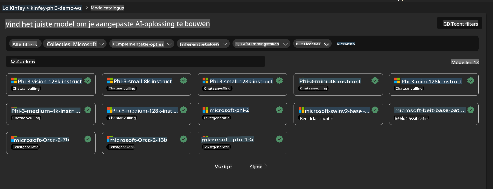
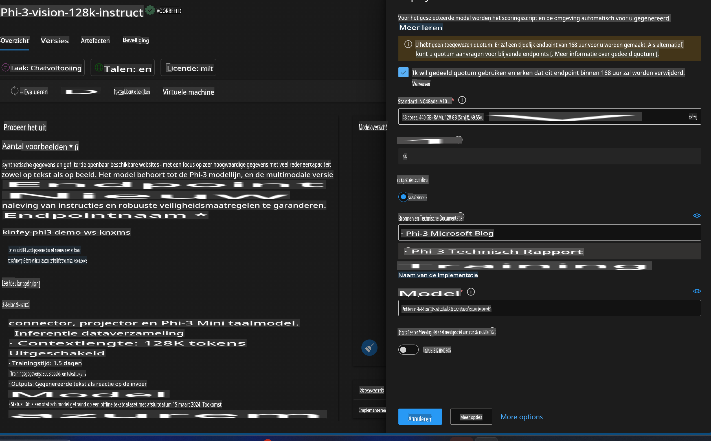
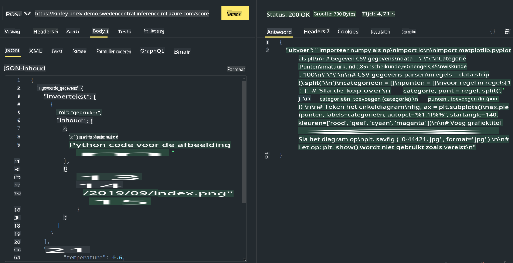

# **Lab 3 - Phi-3-Vision implementeren op Azure Machine Learning Service**

We gebruiken NPU om de productie-implementatie van lokale code te voltooien. Vervolgens willen we de mogelijkheid introduceren om via PHI-3-VISION afbeeldingen om te zetten naar gegenereerde code.

In deze introductie kunnen we snel een Model As Service Phi-3 Vision-dienst opzetten in Azure Machine Learning Service.

***Opmerking***: Phi-3 Vision heeft rekenkracht nodig om sneller inhoud te genereren. We hebben cloudrekenkracht nodig om dit mogelijk te maken.

### **1. Maak Azure Machine Learning Service aan**

We moeten een Azure Machine Learning Service aanmaken in de Azure Portal. Als je wilt weten hoe dit moet, bezoek dan deze link: [https://learn.microsoft.com/azure/machine-learning/quickstart-create-resources?view=azureml-api-2](https://learn.microsoft.com/azure/machine-learning/quickstart-create-resources?view=azureml-api-2)

### **2. Selecteer Phi-3 Vision in Azure Machine Learning Service**



### **3. Implementeer Phi-3-Vision in Azure**



### **4. Test de Endpoint in Postman**



***Opmerking***

1. De parameters die moeten worden verzonden, moeten Authorization, azureml-model-deployment en Content-Type bevatten. Je moet de implementatie-informatie controleren om deze te verkrijgen.

2. Voor het verzenden van parameters moet Phi-3-Vision een afbeeldingslink doorgeven. Raadpleeg de GPT-4-Vision methode om parameters te verzenden, zoals:

```json

{
  "input_data":{
    "input_string":[
      {
        "role":"user",
        "content":[ 
          {
            "type": "text",
            "text": "You are a Python coding assistant.Please create Python code for image "
          },
          {
              "type": "image_url",
              "image_url": {
                "url": "https://ajaytech.co/wp-content/uploads/2019/09/index.png"
              }
          }
        ]
      }
    ],
    "parameters":{
          "temperature": 0.6,
          "top_p": 0.9,
          "do_sample": false,
          "max_new_tokens": 2048
    }
  }
}

```

3. Gebruik de Post-methode om **/score** aan te roepen.

**Gefeliciteerd**! Je hebt de snelle implementatie van PHI-3-VISION voltooid en geleerd hoe je afbeeldingen kunt gebruiken om code te genereren. Hierna kunnen we toepassingen bouwen door NPUs en de cloud te combineren.

**Disclaimer**:  
Dit document is vertaald met behulp van machine-gebaseerde AI-vertalingsdiensten. Hoewel we streven naar nauwkeurigheid, dient u zich ervan bewust te zijn dat geautomatiseerde vertalingen fouten of onnauwkeurigheden kunnen bevatten. Het originele document in zijn oorspronkelijke taal moet worden beschouwd als de gezaghebbende bron. Voor cruciale informatie wordt professionele menselijke vertaling aanbevolen. Wij zijn niet aansprakelijk voor misverstanden of verkeerde interpretaties die voortvloeien uit het gebruik van deze vertaling.