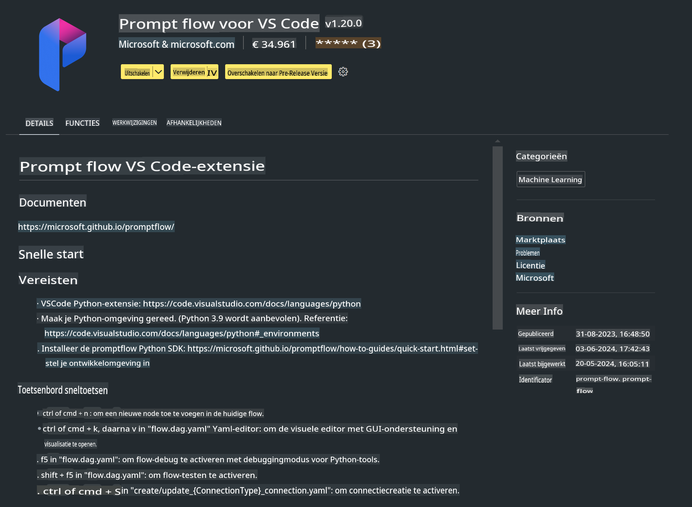

# **Lab 0 - Installatie**

Wanneer we de Lab binnengaan, moeten we de relevante omgeving configureren:

### **1. Python 3.11+**

Het wordt aanbevolen om miniforge te gebruiken om je Python-omgeving te configureren.

Om miniforge te configureren, raadpleeg [https://github.com/conda-forge/miniforge](https://github.com/conda-forge/miniforge).

Na het configureren van miniforge, voer je het volgende commando uit in Power Shell:

```bash

conda create -n pyenv python==3.11.8 -y

conda activate pyenv

```

### **2. Installeer Prompt flow SDK**

In Lab 1 maken we gebruik van Prompt flow, dus je moet de Prompt flow SDK configureren.

```bash

pip install promptflow --upgrade

```

Je kunt de promptflow SDK controleren met dit commando:

```bash

pf --version

```

### **3. Installeer Visual Studio Code Prompt flow-extensie**



### **4. Apple's MLX Framework**

MLX is een array-framework voor machine learning-onderzoek op Apple Silicon, ontwikkeld door Apple machine learning research. Je kunt het **Apple MLX-framework** gebruiken om LLM/SLM te versnellen met Apple Silicon. Wil je meer weten, lees dan [https://github.com/microsoft/PhiCookBook/blob/main/md/01.Introduction/03/MLX_Inference.md](https://github.com/microsoft/PhiCookBook/blob/main/md/01.Introduction/03/MLX_Inference.md).

Installeer de MLX-frameworkbibliotheek in bash:

```bash

pip install mlx-lm

```

### **5. Andere Python-bibliotheken**

Maak een requirements.txt-bestand en voeg deze inhoud toe:

```txt

notebook
numpy 
scipy 
scikit-learn 
matplotlib 
pandas 
pillow 
graphviz

```

### **6. Installeer NVM**

Installeer nvm in Powershell:

```bash

brew install nvm

```

Installeer Node.js 18.20:

```bash

nvm install 18.20.0

nvm use 18.20.0

```

### **7. Installeer Visual Studio Code-ondersteuning voor ontwikkeling**

```bash

npm install --global yo generator-code

```

Gefeliciteerd! Je hebt de SDK succesvol geconfigureerd. Ga nu verder met de praktische stappen.

**Disclaimer**:  
Dit document is vertaald met behulp van machinegebaseerde AI-vertalingsdiensten. Hoewel we streven naar nauwkeurigheid, dient u zich ervan bewust te zijn dat geautomatiseerde vertalingen fouten of onnauwkeurigheden kunnen bevatten. Het originele document in de oorspronkelijke taal moet worden beschouwd als de gezaghebbende bron. Voor cruciale informatie wordt professionele menselijke vertaling aanbevolen. Wij zijn niet aansprakelijk voor misverstanden of verkeerde interpretaties die voortvloeien uit het gebruik van deze vertaling.