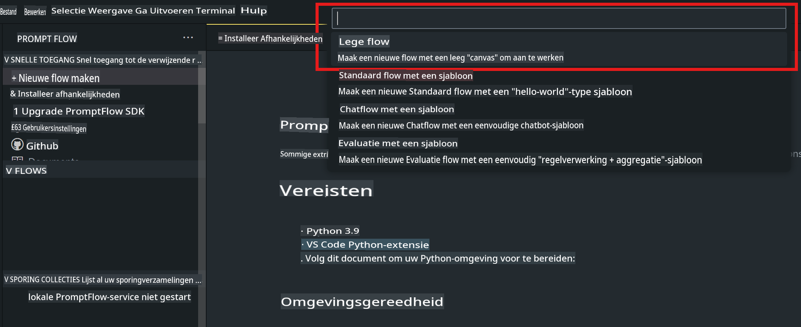
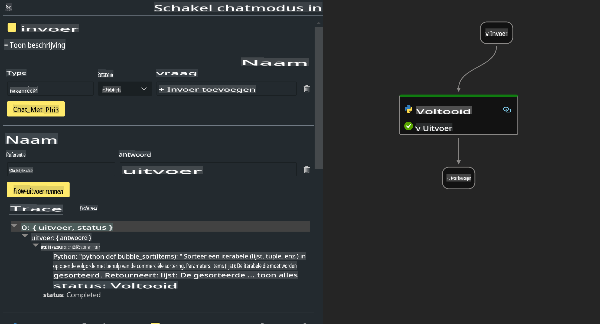

# **Lab 2 - Voer Prompt flow uit met Phi-3-mini in AIPC**

## **Wat is Prompt flow**

Prompt flow is een reeks ontwikkeltools ontworpen om de volledige ontwikkelcyclus van AI-toepassingen op basis van LLM's te stroomlijnen, van idee, prototyping, testen, evaluatie tot productie-implementatie en monitoring. Het maakt prompt engineering veel eenvoudiger en stelt je in staat om LLM-apps van productiekwaliteit te bouwen.

Met prompt flow kun je:

- Flows maken die LLM's, prompts, Python-code en andere tools samenvoegen in een uitvoerbare workflow.

- Je flows debuggen en itereren, met name de interactie met LLM's, met gemak.

- Je flows evalueren en kwaliteits- en prestatie-indicatoren berekenen met grotere datasets.

- Testen en evaluatie integreren in je CI/CD-systeem om de kwaliteit van je flow te waarborgen.

- Je flows implementeren op het door jou gekozen platform of eenvoudig integreren in de codebasis van je app.

- (Optioneel, maar sterk aanbevolen) Samenwerken met je team door gebruik te maken van de cloudversie van Prompt flow in Azure AI.


## **Generatiecode-flows bouwen op Apple Silicon**

***Opmerking***: Als je de installatie van de omgeving nog niet hebt voltooid, bezoek dan [Lab 0 -Installaties](./01.Installations.md)

1. Open de Prompt flow-extensie in Visual Studio Code en maak een leeg flow-project aan.



2. Voeg invoer- en uitvoerparameters toe en voeg Python-code toe als nieuwe flow.



Je kunt deze structuur (flow.dag.yaml) gebruiken als referentie om je flow te bouwen.

```yaml

inputs:
  prompt:
    type: string
    default: Write python code for Fibonacci serie. Please use markdown as output
outputs:
  result:
    type: string
    reference: ${gen_code_by_phi3.output}
nodes:
- name: gen_code_by_phi3
  type: python
  source:
    type: code
    path: gen_code_by_phi3.py
  inputs:
    prompt: ${inputs.prompt}


```

3. Kwantificeer phi-3-mini

We willen SLM beter lokaal kunnen uitvoeren. Over het algemeen kwantificeren we het model (INT4, FP16, FP32).

```bash

python -m mlx_lm.convert --hf-path microsoft/Phi-3-mini-4k-instruct

```

**Opmerking:** de standaardmap is mlx_model.

4. Voeg code toe in ***Chat_With_Phi3.py***.

```python


from promptflow import tool

from mlx_lm import load, generate


# The inputs section will change based on the arguments of the tool function, after you save the code
# Adding type to arguments and return value will help the system show the types properly
# Please update the function name/signature per need
@tool
def my_python_tool(prompt: str) -> str:

    model_id = './mlx_model_phi3_mini'

    model, tokenizer = load(model_id)

    # <|user|>\nWrite python code for Fibonacci serie. Please use markdown as output<|end|>\n<|assistant|>

    response = generate(model, tokenizer, prompt="<|user|>\n" + prompt  + "<|end|>\n<|assistant|>", max_tokens=2048, verbose=True)

    return response


```

4. Je kunt de flow testen via Debug of Run om te controleren of de generatiecode goed werkt.


5. Voer de flow uit als ontwikkelings-API in de terminal.

```

pf flow serve --source ./ --port 8080 --host localhost   

```

Je kunt het testen in Postman / Thunder Client.


### **Opmerkingen**

1. De eerste uitvoering duurt lang. Het wordt aanbevolen om het phi-3-model te downloaden via de Hugging Face CLI.

2. Gezien de beperkte rekenkracht van de Intel NPU wordt aanbevolen om Phi-3-mini-4k-instruct te gebruiken.

3. We gebruiken Intel NPU-versnelling om INT4-conversie te kwantificeren, maar als je de service opnieuw uitvoert, moet je de cache en de nc_workshop-mappen verwijderen.


## **Resources**

1. Leer Promptflow [https://microsoft.github.io/promptflow/](https://microsoft.github.io/promptflow/)

2. Leer Intel NPU Acceleration [https://github.com/intel/intel-npu-acceleration-library](https://github.com/intel/intel-npu-acceleration-library)

3. Voorbeeldcode, download [Local NPU Agent Sample Code](../../../../../../../../../code/07.Lab/01/AIPC/local-npu-agent)

**Disclaimer**:  
Dit document is vertaald met behulp van machine-gebaseerde AI-vertalingsdiensten. Hoewel we ons best doen om nauwkeurigheid te waarborgen, dient u zich ervan bewust te zijn dat geautomatiseerde vertalingen fouten of onnauwkeurigheden kunnen bevatten. Het originele document in zijn oorspronkelijke taal moet worden beschouwd als de gezaghebbende bron. Voor kritieke informatie wordt professionele menselijke vertaling aanbevolen. Wij zijn niet aansprakelijk voor misverstanden of verkeerde interpretaties die voortvloeien uit het gebruik van deze vertaling.