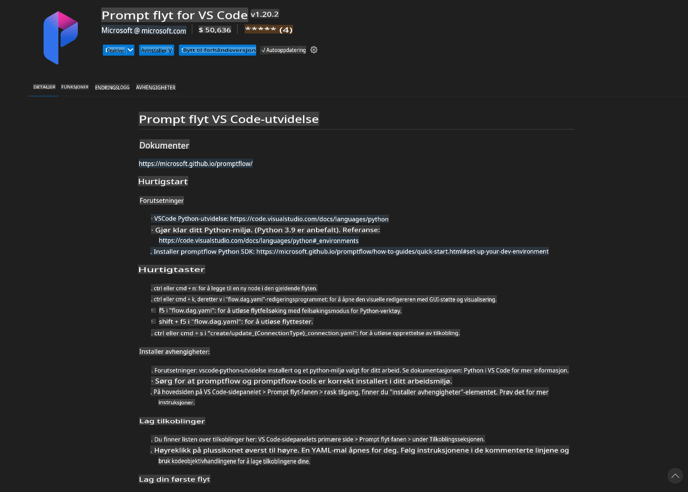
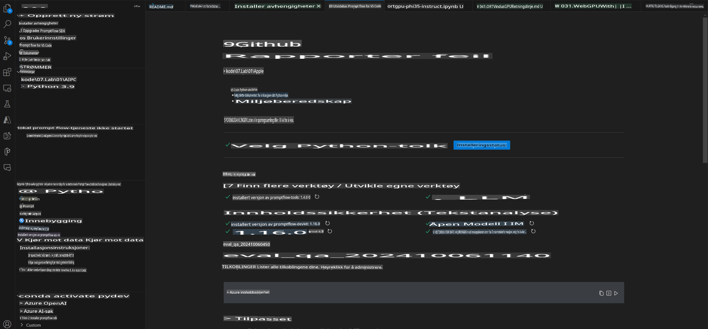
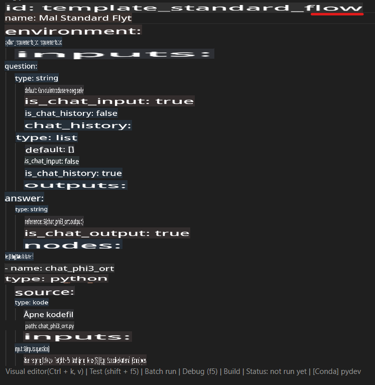

# Bruke Windows GPU til å lage en Prompt Flow-løsning med Phi-3.5-Instruct ONNX

Dette dokumentet er et eksempel på hvordan man kan bruke PromptFlow med ONNX (Open Neural Network Exchange) for å utvikle AI-applikasjoner basert på Phi-3-modeller.

PromptFlow er en samling av utviklingsverktøy designet for å effektivisere hele utviklingssyklusen for AI-applikasjoner basert på LLM (Large Language Model), fra idé og prototyping til testing og evaluering.

Ved å integrere PromptFlow med ONNX kan utviklere:

- **Optimalisere modellens ytelse:** Dra nytte av ONNX for effektiv modellinference og distribusjon.
- **Forenkle utviklingen:** Bruke PromptFlow til å håndtere arbeidsflyten og automatisere repeterende oppgaver.
- **Forbedre samarbeid:** Legge til rette for bedre samarbeid blant teammedlemmer ved å tilby et enhetlig utviklingsmiljø.

**Prompt flow** er en samling av utviklingsverktøy som er laget for å forenkle hele utviklingssyklusen for AI-applikasjoner basert på LLM, fra idéutvikling, prototyping, testing og evaluering til produksjonsdistribusjon og overvåking. Det gjør prompt engineering mye enklere og lar deg bygge LLM-applikasjoner med produksjonskvalitet.

Prompt flow kan kobles til OpenAI, Azure OpenAI Service og tilpassbare modeller (Huggingface, lokale LLM/SLM). Vi ønsker å distribuere Phi-3.5s kvantiserte ONNX-modell til lokale applikasjoner. Prompt flow kan hjelpe oss med å bedre planlegge vår virksomhet og fullføre lokale løsninger basert på Phi-3.5. I dette eksemplet vil vi kombinere ONNX Runtime GenAI Library for å fullføre Prompt flow-løsningen basert på Windows GPU.

## **Installasjon**

### **ONNX Runtime GenAI for Windows GPU**

Les denne veiledningen for å sette opp ONNX Runtime GenAI for Windows GPU [klikk her](./ORTWindowGPUGuideline.md)

### **Sette opp Prompt flow i VSCode**

1. Installer Prompt flow VS Code-utvidelsen



2. Etter å ha installert Prompt flow VS Code-utvidelsen, klikk på utvidelsen og velg **Installation dependencies**. Følg denne veiledningen for å installere Prompt flow SDK i ditt miljø.



3. Last ned [Sample Code](../../../../../../code/09.UpdateSamples/Aug/pf/onnx_inference_pf) og åpne dette eksempelet i VS Code.


4. Åpne **flow.dag.yaml** for å velge ditt Python-miljø.



   Åpne **chat_phi3_ort.py** for å endre plasseringen av din Phi-3.5-instruct ONNX-modell.


5. Kjør din Prompt flow for testing.

Åpne **flow.dag.yaml** og klikk på visuell editor.


Etter å ha klikket på dette, kjør for å teste.


1. Du kan kjøre batch i terminalen for å sjekke flere resultater.

```bash

pf run create --file batch_run.yaml --stream --name 'Your eval qa name'    

```

Du kan sjekke resultater i din standard nettleser.


**Ansvarsfraskrivelse**:  
Dette dokumentet er oversatt ved hjelp av maskinbaserte AI-oversettelsestjenester. Selv om vi tilstreber nøyaktighet, vær oppmerksom på at automatiserte oversettelser kan inneholde feil eller unøyaktigheter. Det originale dokumentet på sitt opprinnelige språk bør betraktes som den autoritative kilden. For kritisk informasjon anbefales profesjonell, menneskelig oversettelse. Vi er ikke ansvarlige for misforståelser eller feiltolkninger som oppstår ved bruk av denne oversettelsen.