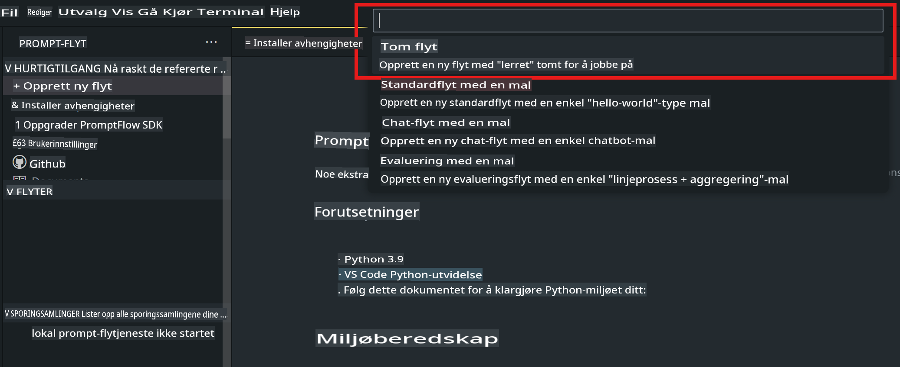
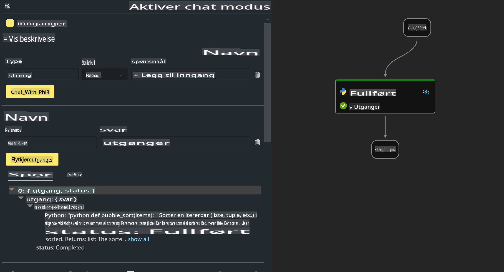

# **Lab 2 - Kjør Prompt flow med Phi-3-mini i AIPC**

## **Hva er Prompt flow**

Prompt flow er en samling utviklingsverktøy som er designet for å forenkle hele utviklingssyklusen for AI-applikasjoner basert på store språkmodeller (LLM), fra idéutvikling, prototyping, testing, evaluering til produksjonsdistribusjon og overvåking. Det gjør prompt engineering mye enklere og lar deg bygge AI-applikasjoner med produksjonskvalitet.

Med Prompt flow kan du:

- Lage flyter som kobler sammen LLM-er, prompts, Python-kode og andre verktøy i en kjørbar arbeidsflyt.

- Feilsøke og iterere flytene dine, spesielt samspillet med LLM-er, på en enkel måte.

- Evaluere flytene dine, beregne kvalitets- og ytelsesmetrikker med større datasett.

- Integrere testing og evaluering i CI/CD-systemet ditt for å sikre kvaliteten på flyten din.

- Distribuere flytene dine til ønsket plattform eller enkelt integrere dem i appens kodebase.

- (Valgfritt, men sterkt anbefalt) Samarbeide med teamet ditt ved å bruke skyversjonen av Prompt flow i Azure AI.

## **Hva er AIPC**

En AI-PC har en CPU, en GPU og en NPU, hver med spesifikke AI-akselerasjonskapabiliteter. En NPU, eller neural processing unit, er en spesialisert akselerator som håndterer kunstig intelligens (AI) og maskinlæring (ML)-oppgaver direkte på PC-en din, i stedet for å sende data til skyen for behandling. GPU-en og CPU-en kan også håndtere disse oppgavene, men NPU-en er spesielt god på AI-beregninger med lavt strømforbruk. AI-PC-en representerer et fundamentalt skifte i hvordan datamaskiner fungerer. Det er ikke en løsning på et problem som ikke eksisterte før, men heller en betydelig forbedring for hverdagsbruk av PC-er.

Så hvordan fungerer det? Sammenlignet med generativ AI og de massive store språkmodellene (LLM) som er trent på enorme mengder offentlig data, er AI som kjører på PC-en din mer tilgjengelig på nesten alle nivåer. Konseptet er lettere å forstå, og siden det er trent på dine data uten behov for å koble til skyen, er fordelene mer umiddelbart tiltalende for en bredere gruppe mennesker.

På kort sikt innebærer AI-PC-verdenen personlige assistenter og mindre AI-modeller som kjører direkte på PC-en din, og bruker dine data til å tilby personlige, private og sikrere AI-forbedringer for ting du allerede gjør hver dag – som å ta møtenotater, organisere en fantasy-fotballiga, automatisere forbedringer for bilde- og videoredigering, eller planlegge den perfekte reiseruten for en familiegjenforening basert på alles ankomst- og avreisetider.

## **Bygge generasjonskodeflyter på AIPC**

***Note*** ：Hvis du ikke har fullført miljøinstallasjonen, vennligst besøk [Lab 0 -Installations](./01.Installations.md)

1. Åpne Prompt flow-utvidelsen i Visual Studio Code og opprett et tomt flytprosjekt.



2. Legg til Input- og Output-parametere og legg til Python-kode som en ny flyt.



Du kan bruke denne strukturen (flow.dag.yaml) som referanse for å konstruere flyten din:

```yaml

inputs:
  question:
    type: string
    default: how to write Bubble Algorithm
outputs:
  answer:
    type: string
    reference: ${Chat_With_Phi3.output}
nodes:
- name: Chat_With_Phi3
  type: python
  source:
    type: code
    path: Chat_With_Phi3.py
  inputs:
    question: ${inputs.question}


```

3. Legg til kode i ***Chat_With_Phi3.py***.

```python


from promptflow.core import tool

# import torch
from transformers import AutoTokenizer, pipeline,TextStreamer
import intel_npu_acceleration_library as npu_lib

import warnings

import asyncio
import platform

class Phi3CodeAgent:
    
    model = None
    tokenizer = None
    text_streamer = None
    
    model_id = "microsoft/Phi-3-mini-4k-instruct"

    @staticmethod
    def init_phi3():
        
        if Phi3CodeAgent.model is None or Phi3CodeAgent.tokenizer is None or Phi3CodeAgent.text_streamer is None:
            Phi3CodeAgent.model = npu_lib.NPUModelForCausalLM.from_pretrained(
                                    Phi3CodeAgent.model_id,
                                    torch_dtype="auto",
                                    dtype=npu_lib.int4,
                                    trust_remote_code=True
                                )
            Phi3CodeAgent.tokenizer = AutoTokenizer.from_pretrained(Phi3CodeAgent.model_id)
            Phi3CodeAgent.text_streamer = TextStreamer(Phi3CodeAgent.tokenizer, skip_prompt=True)

    

    @staticmethod
    def chat_with_phi3(prompt):
        
        Phi3CodeAgent.init_phi3()

        messages = "<|system|>You are a AI Python coding assistant. Please help me to generate code in Python.The answer only genertated Python code, but any comments and instructions do not need to be generated<|end|><|user|>" + prompt +"<|end|><|assistant|>"


        generation_args = {
            "max_new_tokens": 1024,
            "return_full_text": False,
            "temperature": 0.3,
            "do_sample": False,
            "streamer": Phi3CodeAgent.text_streamer,
        }

        pipe = pipeline(
            "text-generation",
            model=Phi3CodeAgent.model,
            tokenizer=Phi3CodeAgent.tokenizer,
            # **generation_args
        )

        result = ''

        with warnings.catch_warnings():
            warnings.simplefilter("ignore")
            response = pipe(messages, **generation_args)
            result =response[0]['generated_text']
            return result


@tool
def my_python_tool(question: str) -> str:
    if platform.system() == 'Windows':
        asyncio.set_event_loop_policy(asyncio.WindowsSelectorEventLoopPolicy())
    return Phi3CodeAgent.chat_with_phi3(question)


```

4. Du kan teste flyten ved å bruke Debug eller Run for å sjekke om generasjonskoden fungerer som den skal.


5. Kjør flyten som en utviklings-API i terminalen.

```

pf flow serve --source ./ --port 8080 --host localhost   

```

Du kan teste den i Postman / Thunder Client.

### **Merk**

1. Første kjøring tar lang tid. Det anbefales å laste ned Phi-3-modellen fra Hugging Face CLI.

2. Gitt den begrensede regnekraften til Intel NPU, anbefales det å bruke Phi-3-mini-4k-instruct.

3. Vi bruker Intel NPU-akselerasjon for å kvantisere INT4-konvertering, men hvis du kjører tjenesten på nytt, må du slette cache- og nc_workshop-mappene.

## **Ressurser**

1. Lær Promptflow [https://microsoft.github.io/promptflow/](https://microsoft.github.io/promptflow/)

2. Lær Intel NPU-akselerasjon [https://github.com/intel/intel-npu-acceleration-library](https://github.com/intel/intel-npu-acceleration-library)

3. Eksempelkode, last ned [Local NPU Agent Sample Code](../../../../../../../../../code/07.Lab/01/AIPC)

**Ansvarsfraskrivelse**:  
Dette dokumentet er oversatt ved hjelp av maskinbaserte AI-oversettelsestjenester. Selv om vi tilstreber nøyaktighet, vær oppmerksom på at automatiserte oversettelser kan inneholde feil eller unøyaktigheter. Det originale dokumentet på dets opprinnelige språk bør betraktes som den autoritative kilden. For kritisk informasjon anbefales profesjonell menneskelig oversettelse. Vi er ikke ansvarlige for misforståelser eller feiltolkninger som oppstår ved bruk av denne oversettelsen.