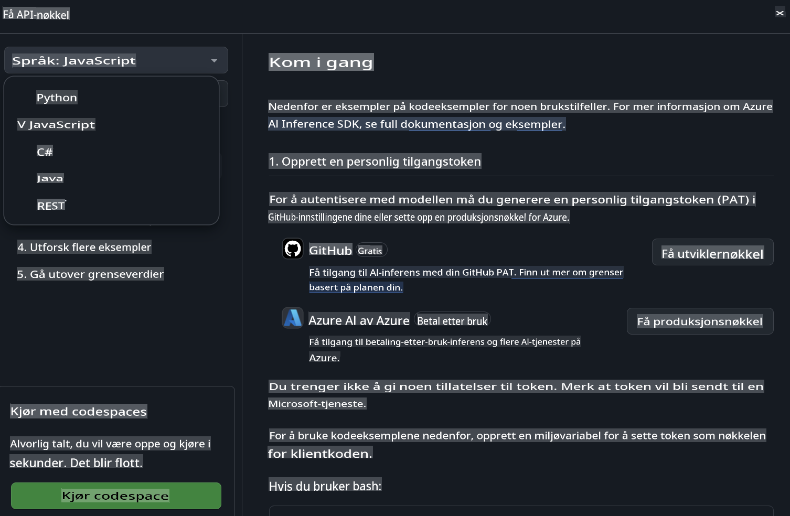
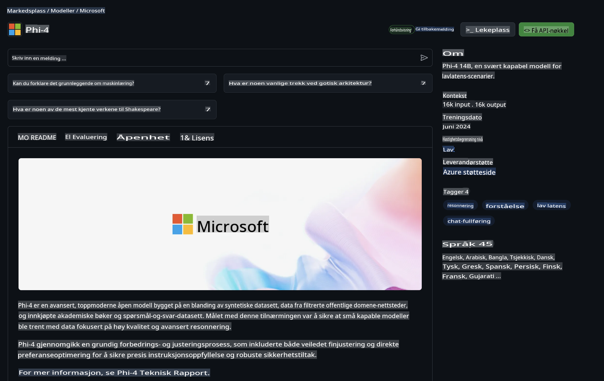

## GitHub-modeller - Begrenset offentlig beta

Velkommen til [GitHub-modeller](https://github.com/marketplace/models)! Vi har alt klart for deg til å utforske AI-modeller som er hostet på Azure AI.


For mer informasjon om modellene som er tilgjengelige på GitHub-modeller, sjekk ut [GitHub Model Marketplace](https://github.com/marketplace/models)

## Tilgjengelige modeller

Hver modell har en dedikert testplattform og eksempelkode 


### Phi-3-modeller i GitHub Model Catalog

[Phi-3-Medium-128k-Instruct](https://github.com/marketplace/models/azureml/Phi-3-medium-128k-instruct)

[Phi-3-medium-4k-instruct](https://github.com/marketplace/models/azureml/Phi-3-medium-4k-instruct)

[Phi-3-mini-128k-instruct](https://github.com/marketplace/models/azureml/Phi-3-mini-128k-instruct)

[Phi-3-mini-4k-instruct](https://github.com/marketplace/models/azureml/Phi-3-mini-4k-instruct)

[Phi-3-small-128k-instruct](https://github.com/marketplace/models/azureml/Phi-3-small-128k-instruct)

[Phi-3-small-8k-instruct](https://github.com/marketplace/models/azureml/Phi-3-small-8k-instruct)

## Kom i gang

Vi har noen grunnleggende eksempler som er klare til å kjøres. Du finner dem i eksempelkatalogen. Hvis du vil hoppe rett til ditt favorittspråk, finner du eksemplene på følgende språk:

- Python
- JavaScript
- cURL

Det finnes også et dedikert Codespaces-miljø for å kjøre eksempler og modeller. 



## Eksempelkode 

Nedenfor finner du eksempelkode for noen brukstilfeller. For mer informasjon om Azure AI Inference SDK, se full dokumentasjon og eksempler.

## Oppsett 

1. Opprett en personlig tilgangsnøkkel
Du trenger ikke gi noen spesifikke tillatelser til nøkkelen. Merk at nøkkelen vil bli sendt til en Microsoft-tjeneste.

For å bruke kodene nedenfor, opprett en miljøvariabel for å angi nøkkelen din som nøkkel for klientkoden.

Hvis du bruker bash:
```
export GITHUB_TOKEN="<your-github-token-goes-here>"
```
Hvis du bruker powershell:

```
$Env:GITHUB_TOKEN="<your-github-token-goes-here>"
```

Hvis du bruker Windows kommandolinje:

```
set GITHUB_TOKEN=<your-github-token-goes-here>
```

## Python-eksempel

### Installer avhengigheter
Installer Azure AI Inference SDK ved hjelp av pip (Krever: Python >=3.8):

```
pip install azure-ai-inference
```
### Kjør et grunnleggende kodeeksempel

Dette eksempelet viser et grunnleggende kall til chat fullførings-API. Det bruker GitHub AI-modellens inferens-endepunkt og din GitHub-nøkkel. Kallet er synkront.

```
import os
from azure.ai.inference import ChatCompletionsClient
from azure.ai.inference.models import SystemMessage, UserMessage
from azure.core.credentials import AzureKeyCredential

endpoint = "https://models.inference.ai.azure.com"
# Replace Model_Name 
model_name = "Phi-3-small-8k-instruct"
token = os.environ["GITHUB_TOKEN"]

client = ChatCompletionsClient(
    endpoint=endpoint,
    credential=AzureKeyCredential(token),
)

response = client.complete(
    messages=[
        SystemMessage(content="You are a helpful assistant."),
        UserMessage(content="What is the capital of France?"),
    ],
    model=model_name,
    temperature=1.,
    max_tokens=1000,
    top_p=1.
)

print(response.choices[0].message.content)
```

### Kjør en samtale med flere runder

Dette eksempelet viser en samtale med flere runder ved bruk av chat fullførings-API. Når du bruker modellen til en chat-applikasjon, må du administrere historikken til samtalen og sende de nyeste meldingene til modellen.

```
import os
from azure.ai.inference import ChatCompletionsClient
from azure.ai.inference.models import AssistantMessage, SystemMessage, UserMessage
from azure.core.credentials import AzureKeyCredential

token = os.environ["GITHUB_TOKEN"]
endpoint = "https://models.inference.ai.azure.com"
# Replace Model_Name
model_name = "Phi-3-small-8k-instruct"

client = ChatCompletionsClient(
    endpoint=endpoint,
    credential=AzureKeyCredential(token),
)

messages = [
    SystemMessage(content="You are a helpful assistant."),
    UserMessage(content="What is the capital of France?"),
    AssistantMessage(content="The capital of France is Paris."),
    UserMessage(content="What about Spain?"),
]

response = client.complete(messages=messages, model=model_name)

print(response.choices[0].message.content)
```

### Strøm utdataene

For en bedre brukeropplevelse kan du strømme responsen fra modellen slik at den første teksten vises tidlig, og du unngår å vente på lange svar.

```
import os
from azure.ai.inference import ChatCompletionsClient
from azure.ai.inference.models import SystemMessage, UserMessage
from azure.core.credentials import AzureKeyCredential

token = os.environ["GITHUB_TOKEN"]
endpoint = "https://models.inference.ai.azure.com"
# Replace Model_Name
model_name = "Phi-3-small-8k-instruct"

client = ChatCompletionsClient(
    endpoint=endpoint,
    credential=AzureKeyCredential(token),
)

response = client.complete(
    stream=True,
    messages=[
        SystemMessage(content="You are a helpful assistant."),
        UserMessage(content="Give me 5 good reasons why I should exercise every day."),
    ],
    model=model_name,
)

for update in response:
    if update.choices:
        print(update.choices[0].delta.content or "", end="")

client.close()
```
## JavaScript 

### Installer avhengigheter

Installer Node.js.

Kopier følgende tekst og lagre den som en fil med navn package.json i mappen din.

```
{
  "type": "module",
  "dependencies": {
    "@azure-rest/ai-inference": "latest",
    "@azure/core-auth": "latest",
    "@azure/core-sse": "latest"
  }
}
```

Merk: @azure/core-sse er bare nødvendig når du strømmer responsen fra chat fullføringer.

Åpne et terminalvindu i denne mappen og kjør npm install.

For hver av kodebitene nedenfor, kopier innholdet til en fil sample.js og kjør med node sample.js.

### Kjør et grunnleggende kodeeksempel

Dette eksempelet viser et grunnleggende kall til chat fullførings-API. Det bruker GitHub AI-modellens inferens-endepunkt og din GitHub-nøkkel. Kallet er synkront.

```
import ModelClient from "@azure-rest/ai-inference";
import { AzureKeyCredential } from "@azure/core-auth";

const token = process.env["GITHUB_TOKEN"];
const endpoint = "https://models.inference.ai.azure.com";
// Update your modelname
const modelName = "Phi-3-small-8k-instruct";

export async function main() {

  const client = new ModelClient(endpoint, new AzureKeyCredential(token));

  const response = await client.path("/chat/completions").post({
    body: {
      messages: [
        { role:"system", content: "You are a helpful assistant." },
        { role:"user", content: "What is the capital of France?" }
      ],
      model: modelName,
      temperature: 1.,
      max_tokens: 1000,
      top_p: 1.
    }
  });

  if (response.status !== "200") {
    throw response.body.error;
  }
  console.log(response.body.choices[0].message.content);
}

main().catch((err) => {
  console.error("The sample encountered an error:", err);
});
```

### Kjør en samtale med flere runder

Dette eksempelet viser en samtale med flere runder ved bruk av chat fullførings-API. Når du bruker modellen til en chat-applikasjon, må du administrere historikken til samtalen og sende de nyeste meldingene til modellen.

```
import ModelClient from "@azure-rest/ai-inference";
import { AzureKeyCredential } from "@azure/core-auth";

const token = process.env["GITHUB_TOKEN"];
const endpoint = "https://models.inference.ai.azure.com";
// Update your modelname
const modelName = "Phi-3-small-8k-instruct";

export async function main() {

  const client = new ModelClient(endpoint, new AzureKeyCredential(token));

  const response = await client.path("/chat/completions").post({
    body: {
      messages: [
        { role: "system", content: "You are a helpful assistant." },
        { role: "user", content: "What is the capital of France?" },
        { role: "assistant", content: "The capital of France is Paris." },
        { role: "user", content: "What about Spain?" },
      ],
      model: modelName,
    }
  });

  if (response.status !== "200") {
    throw response.body.error;
  }

  for (const choice of response.body.choices) {
    console.log(choice.message.content);
  }
}

main().catch((err) => {
  console.error("The sample encountered an error:", err);
});
```

### Strøm utdataene
For en bedre brukeropplevelse kan du strømme responsen fra modellen slik at den første teksten vises tidlig, og du unngår å vente på lange svar.

```
import ModelClient from "@azure-rest/ai-inference";
import { AzureKeyCredential } from "@azure/core-auth";
import { createSseStream } from "@azure/core-sse";

const token = process.env["GITHUB_TOKEN"];
const endpoint = "https://models.inference.ai.azure.com";
// Update your modelname
const modelName = "Phi-3-small-8k-instruct";

export async function main() {

  const client = new ModelClient(endpoint, new AzureKeyCredential(token));

  const response = await client.path("/chat/completions").post({
    body: {
      messages: [
        { role: "system", content: "You are a helpful assistant." },
        { role: "user", content: "Give me 5 good reasons why I should exercise every day." },
      ],
      model: modelName,
      stream: true
    }
  }).asNodeStream();

  const stream = response.body;
  if (!stream) {
    throw new Error("The response stream is undefined");
  }

  if (response.status !== "200") {
    stream.destroy();
    throw new Error(`Failed to get chat completions, http operation failed with ${response.status} code`);
  }

  const sseStream = createSseStream(stream);

  for await (const event of sseStream) {
    if (event.data === "[DONE]") {
      return;
    }
    for (const choice of (JSON.parse(event.data)).choices) {
        process.stdout.write(choice.delta?.content ?? ``);
    }
  }
}

main().catch((err) => {
  console.error("The sample encountered an error:", err);
});
```

## REST 

### Kjør et grunnleggende kodeeksempel

Lim inn følgende i en shell:

```
curl -X POST "https://models.inference.ai.azure.com/chat/completions" \
    -H "Content-Type: application/json" \
    -H "Authorization: Bearer $GITHUB_TOKEN" \
    -d '{
        "messages": [
            {
                "role": "system",
                "content": "You are a helpful assistant."
            },
            {
                "role": "user",
                "content": "What is the capital of France?"
            }
        ],
        "model": "Phi-3-small-8k-instruct"
    }'
```
### Kjør en samtale med flere runder

Kall chat fullførings-API og send inn samtalehistorikken:

```
curl -X POST "https://models.inference.ai.azure.com/chat/completions" \
    -H "Content-Type: application/json" \
    -H "Authorization: Bearer $GITHUB_TOKEN" \
    -d '{
        "messages": [
            {
                "role": "system",
                "content": "You are a helpful assistant."
            },
            {
                "role": "user",
                "content": "What is the capital of France?"
            },
            {
                "role": "assistant",
                "content": "The capital of France is Paris."
            },
            {
                "role": "user",
                "content": "What about Spain?"
            }
        ],
        "model": "Phi-3-small-8k-instruct"
    }'
```
### Strøm utdataene

Dette er et eksempel på å kalle endepunktet og strømme responsen.

```
curl -X POST "https://models.inference.ai.azure.com/chat/completions" \
    -H "Content-Type: application/json" \
    -H "Authorization: Bearer $GITHUB_TOKEN" \
    -d '{
        "messages": [
            {
                "role": "system",
                "content": "You are a helpful assistant."
            },
            {
                "role": "user",
                "content": "Give me 5 good reasons why I should exercise every day."
            }
        ],
        "stream": true,
        "model": "Phi-3-small-8k-instruct"
    }'
```

## GRATIS bruk og grenseverdier for GitHub-modeller



[Grenseverdiene for testplattformen og gratis API-bruk](https://docs.github.com/en/github-models/prototyping-with-ai-models#rate-limits) er ment for å hjelpe deg med å eksperimentere med modeller og prototype AI-applikasjonen din. For bruk utover disse grensene, og for å skalere applikasjonen din, må du klargjøre ressurser fra en Azure-konto og autentisere derfra i stedet for med din GitHub personlige tilgangsnøkkel. Du trenger ikke å endre noe annet i koden din. Bruk denne lenken for å finne ut hvordan du går utover gratisnivågrensene i Azure AI.

### Avsløringer

Husk at når du interagerer med en modell, eksperimenterer du med AI, så innholdet kan inneholde feil.

Funksjonen er underlagt ulike begrensninger (inkludert forespørsler per minutt, forespørsler per dag, tokens per forespørsel og samtidige forespørsler) og er ikke designet for produksjonsbruk.

GitHub-modeller bruker Azure AI Content Safety. Disse filtrene kan ikke deaktiveres som en del av GitHub-modeller-opplevelsen. Hvis du velger å bruke modeller gjennom en betalt tjeneste, vennligst konfigurer innholdsfiltrene dine for å møte dine krav.

Denne tjenesten er underlagt GitHubs forhåndsutgivelsesvilkår.

**Ansvarsfraskrivelse**:  
Dette dokumentet er oversatt ved hjelp av maskinbaserte AI-oversettelsestjenester. Selv om vi bestreber oss på nøyaktighet, vær oppmerksom på at automatiserte oversettelser kan inneholde feil eller unøyaktigheter. Det originale dokumentet på sitt opprinnelige språk bør betraktes som den autoritative kilden. For kritisk informasjon anbefales profesjonell menneskelig oversettelse. Vi er ikke ansvarlige for eventuelle misforståelser eller feiltolkninger som oppstår ved bruk av denne oversettelsen.