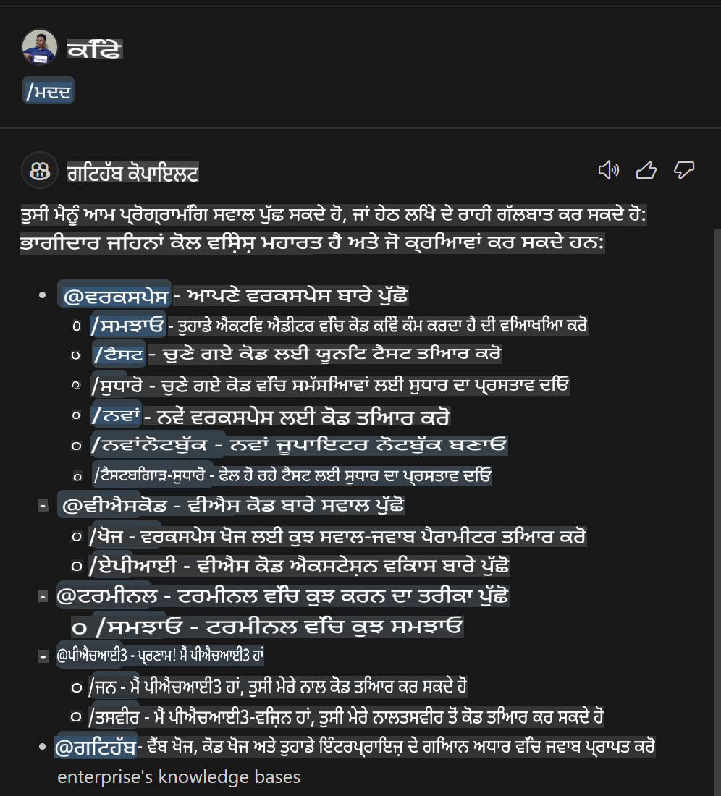
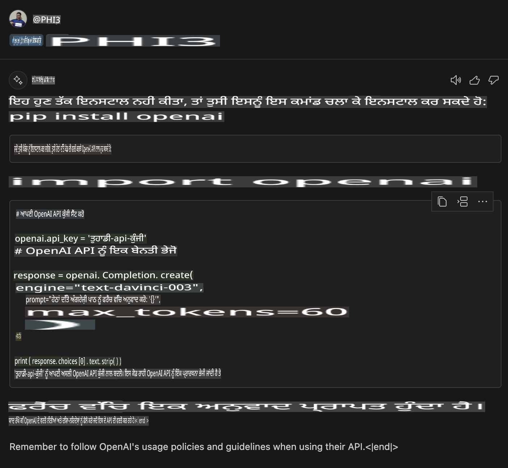
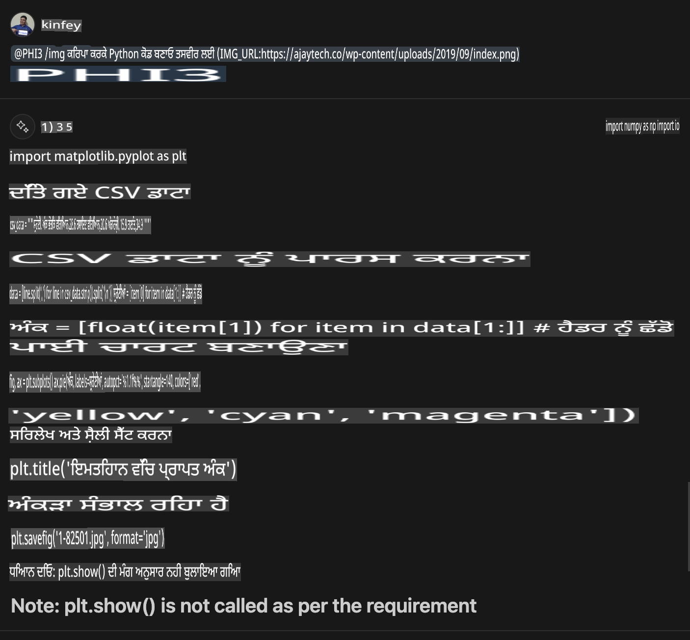

# **ਲੈਬ 3 - GitHub Copilot Chat ਵਿੱਚ ਇੱਕ @PHI3 ਏਜੰਟ ਬਣਾਓ**

Visual Studio Code Copilot Chat ਵਿੱਚ, ਤੁਸੀਂ @workspace ਰਾਹੀਂ ਪੂਰੇ ਪ੍ਰੋਜੈਕਟ ਨੂੰ ਪ੍ਰਬੰਧਿਤ ਕਰ ਸਕਦੇ ਹੋ। ਕਾਰੋਬਾਰੀ ਦ੍ਰਿਸ਼ਟੀਕੋਣਾਂ ਲਈ, ਅਸੀਂ Copilot Chat ਦੇ Agent ਨੂੰ ਹੋਰ ਲਚਕੀਲੇ ਢੰਗ ਨਾਲ ਕਸਟਮਾਈਜ਼ ਕਰ ਸਕਦੇ ਹਾਂ।

ਪਿਛਲੇ ਲੈਬ ਵਿੱਚ, ਅਸੀਂ MX ਫਰੇਮਵਰਕ ਅਤੇ ਕਲਾਉਡ ਨੂੰ ਜੋੜ ਕੇ Phi3 Agent ਲਈ ਇੱਕ Visual Studio Code Extension ਤਿਆਰ ਕੀਤਾ ਸੀ।



### **1. ਇੱਕ VSCode ਡਿਵੈਲਪਮੈਂਟ ਐਕਸਟੈਂਸ਼ਨ ਬਣਾਓ**

ਕਿਰਪਾ ਕਰਕੇ ਇਸ ਲਿੰਕ ਨੂੰ ਵੇਖੋ [https://code.visualstudio.com/api/get-started/your-first-extension](https://code.visualstudio.com/api/get-started/your-first-extension) ਇੱਕ ਐਕਸਟੈਂਸ਼ਨ ਪ੍ਰੋਜੈਕਟ ਬਣਾਉਣ ਲਈ।

***NOTE:*** ਕਿਰਪਾ ਕਰਕੇ ਇਸ ਪ੍ਰੋਜੈਕਟ ਲਈ ਤਕਨੀਕੀ ਹੱਲ ਵਜੋਂ Typescript ਅਤੇ WebPack ਦੀ ਵਰਤੋਂ ਕਰੋ।

### **2. vscode.d.ts ਸ਼ਾਮਲ ਕਰੋ**

Visual Studio Code Chat API ਹਾਲੇ ਤੱਕ ਕੋਡ API ਵਿੱਚ ਮਰਜ ਨਹੀਂ ਕੀਤੀ ਗਈ ਹੈ, ਪਰ ਹੁਣ ਇਸਨੂੰ ਐਕਸਟੈਂਸ਼ਨਜ਼ ਰਾਹੀਂ ਜੋੜਿਆ ਗਿਆ ਹੈ।

vscode.d.ts ਡਾਊਨਲੋਡ ਕਰੋ [https://github.com/microsoft/vscode/blob/main/src/vscode-dts/vscode.d.ts](https://github.com/microsoft/vscode/blob/main/src/vscode-dts/vscode.d.ts)

***NOTE:*** ਕਿਰਪਾ ਕਰਕੇ ਇਸਨੂੰ Visual Studio Code Insiders 1.90+ ਵਿੱਚ ਰਨ ਕਰੋ।

### **3. package.json ਅੱਪਡੇਟ ਕਰੋ**

```json

{
  "name": "phi3ext",
  "displayName": "phi3ext",
  "description": "",
  "version": "0.0.1",
  "engines": {
    "vscode": "^1.90.0"
  },
  "categories": [
      "AI",
      "Chat"
  ],
  "activationEvents": [],
  "enabledApiProposals": [
      "chatVariableResolver"
  ],
  "main": "./dist/extension.js",
  "contributes": {
      "chatParticipants": [
          {
              "id": "chat.PHI3",
              "name": "PHI3",
              "description": "Hey! I am PHI3",
              "isSticky": true,
              "commands": [
                  {
                      "name": "gen",
                      "description": "I am PHI3, you can gen code with me"
                  },
                  {
                      "name": "img",
                      "description": "I am PHI3-vision, you can gen code from img with me"
                  }
              ]
          }
      ],
      "commands": [
          {
              "command": "PHI3.namesInEditor",
              "title": "Use PHI3 in Editor"
          }
      ]
  },  
  "scripts": {
    "vscode:prepublish": "npm run package",
    "compile": "webpack",
    "watch": "webpack --watch",
    "package": "webpack --mode production --devtool hidden-source-map",
    "compile-tests": "tsc -p . --outDir out",
    "watch-tests": "tsc -p . -w --outDir out",
    "pretest": "npm run compile-tests && npm run compile && npm run lint",
    "lint": "eslint src --ext ts",
    "test": "vscode-test"
  },
  "devDependencies": {
    "@types/vscode": "^1.90.0",
    "@types/mocha": "^10.0.6",
    "@types/node": "18.x",
    "@typescript-eslint/eslint-plugin": "^7.11.0",
    "@typescript-eslint/parser": "^7.11.0",
    "eslint": "^8.57.0",
    "typescript": "^5.4.5",
    "ts-loader": "^9.5.1",
    "webpack": "^5.91.0",
    "webpack-cli": "^5.1.4",
    "@vscode/test-cli": "^0.0.9",
    "@vscode/test-electron": "^2.4.0"
  },
  "dependencies": {
    "@types/node-fetch": "^2.6.11",
    "node-fetch": "^3.3.2"
  }
}

```

ਤੁਸੀਂ ਟਰਮੀਨਲ ਵਿੱਚ **npm install** ਰਨ ਕਰਕੇ ਆਪਣੇ ਐਕਸਟੈਂਸ਼ਨ ਨੂੰ ਡਿਬੱਗ ਕਰਕੇ ਟੈਸਟ ਕਰ ਸਕਦੇ ਹੋ।

***ਨਮੂਨਾ ਕੋਡ ਡਾਊਨਲੋਡ ਕਰੋ*** [ਇੱਥੇ ਕਲਿੱਕ ਕਰੋ](../../../../../../../../../code/07.Lab/01/Apple)

### **4. src/extension.ts ਨੂੰ ਬਦਲੋ**

```ts

// The module 'vscode' contains the VS Code extensibility API
// Import the module and reference it with the alias vscode in your code below
import * as vscode from 'vscode';


interface IPHI3ChatResult extends vscode.ChatResult {
    metadata: {
        command: string;
    }
}


// This method is called when your extension is activated
// Your extension is activated the very first time the command is executed
export function activate(extcontext: vscode.ExtensionContext) {


	// Define a SHEIN chat handler. 
	const phi3handler: vscode.ChatRequestHandler = async (request: vscode.ChatRequest, context: vscode.ChatContext, stream: vscode.ChatResponseStream, token: vscode.CancellationToken): Promise<IPHI3ChatResult> => {

		if (request.command == 'gen') {

			const content = "Welcome to Phi-3 to gen code";

			const result = await gen(request.prompt);

			const code = result;
			
			
			stream.markdown(code)


            return { metadata: { command: 'gen' } };

		}
		if (request.command == 'img') {

			const content = "Welcome to Phi-3 vision to gen code in image";

			const prompt = request.prompt;

			if(prompt.indexOf("(IMG_URL:")>-1){

				const img_url = prompt.split("(IMG_URL:")[1].split(")")[0];
				const question = prompt.split("(IMG_URL:")[0];
				const tmp = question;

				const result = await genImage(question,img_url);
	
				const code = result;
				
				
				stream.markdown(code)
	
	
				return { metadata: { command: 'img' } };
			}
			else
			{
				var result = "Please ask question like this Your question (IMG_URL:https://example.com/image.jpg)";
				stream.markdown(result);
			}


            return { metadata: { command: 'img' } };

		}


		return { metadata: { command: '' } };

	}


	const phi3 = vscode.chat.createChatParticipant("chat.PHI3", phi3handler);

	phi3.iconPath = new vscode.ThemeIcon('sparkle');


    phi3.followupProvider = {
        provideFollowups(result: IPHI3ChatResult, context: vscode.ChatContext, token: vscode.CancellationToken) {
            return [{
                prompt: 'let us code with Phi-3 Family',
                label: vscode.l10n.t('Dev with Phi-3 Family'),
                command: 'help'
            } satisfies vscode.ChatFollowup];
        }
    };

	extcontext.subscriptions.push(phi3);
}


interface GenCode {
	prompt: string;
}

interface ImgGenCodeResponse {
	output: string;
}


interface GenCodeResponse {
	result: string;
}

async function gen(prompt: string) {

	const postData: GenCode = {
		prompt: prompt
	};
	const response = await fetch('http://localhost:8080/score', {
		method: 'POST',
		body: JSON.stringify(postData),
		headers: { 'Content-Type': 'application/json' }
	});
	const post = await response.json();
	const resultResponse = post as GenCodeResponse;
	return resultResponse.result;
}

async function genImage(prompt: string, img_url: string) {

	// const postData: GenCode = {
	// 	question: prompt
	// };
	const response = await fetch('Your Phi-3 Endpoint', {
		method: 'POST',
		body: JSON.stringify({
			"input_data":{
			  "input_string":[
				{
				  "role":"user",
				  "content":[ 
					{
					  "type": "text",
					  "text": prompt
					},
					{
						"type": "image_url",
						"image_url": {
						  "url": img_url
						}
					}
				  ]
				}
			  ],
			  "parameters":{
					"temperature": 0.6,
					"top_p": 0.9,
					"do_sample": false,
					"max_new_tokens": 2048
			  }
			}
		}),
		headers: { 'Content-Type': 'application/json', 'Authorization' : 'Bearer Your Phi-3-Vision Endpoint Key', 'azureml-model-deployment': 'Your Phi-3-Vision Deployment Name' }
	});
	const post = await response.json();
	const resultResponse = post as ImgGenCodeResponse;
	return resultResponse.output;
}

// This method is called when your extension is deactivated
export function deactivate() {}


```

ਮੁਬਾਰਕਾਂ! ਤੁਸੀਂ ਸਾਰੇ ਲੈਬ ਪੂਰੇ ਕਰ ਲਏ ਹਨ। ਮੈਨੂੰ ਉਮੀਦ ਹੈ ਕਿ ਇਸ ਨਾਲ ਤੁਹਾਨੂੰ Phi-3 Family ਅਤੇ GitHub Copilot Chat ਦੀ ਵਰਤੋਂ ਕਰਨ ਦੀ ਸਮਝ ਆਏਗੀ।

ਤੁਸੀਂ ***@PHI3 /gen*** ਦੀ ਕੋਸ਼ਿਸ਼ ਕਰ ਸਕਦੇ ਹੋ।



ਤੁਸੀਂ ***@PHI3 /img*** ਦੀ ਕੋਸ਼ਿਸ਼ ਕਰ ਸਕਦੇ ਹੋ।



**ਅਸਵੀਕਰਨ**:  
ਇਹ ਦਸਤਾਵੇਜ਼ ਮਸ਼ੀਨ-ਅਧਾਰਿਤ AI ਅਨੁਵਾਦ ਸੇਵਾਵਾਂ ਦੀ ਵਰਤੋਂ ਕਰਕੇ ਅਨੁਵਾਦਿਤ ਕੀਤਾ ਗਿਆ ਹੈ। ਜਦੋਂ ਕਿ ਅਸੀਂ ਸਹੀਪਨ ਦੇ ਲਈ ਯਤਨਸ਼ੀਲ ਹਾਂ, ਕਿਰਪਾ ਕਰਕੇ ਧਿਆਨ ਵਿੱਚ ਰੱਖੋ ਕਿ ਸਵੈਚਾਲਿਤ ਅਨੁਵਾਦਾਂ ਵਿੱਚ ਗਲਤੀਆਂ ਜਾਂ ਅਸੁਣਚੀਤਤਾਵਾਂ ਹੋ ਸਕਦੀਆਂ ਹਨ। ਮੂਲ ਦਸਤਾਵੇਜ਼ ਨੂੰ ਇਸ ਦੀ ਮੂਲ ਭਾਸ਼ਾ ਵਿੱਚ ਪ੍ਰਮਾਣਿਕ ਸਰੋਤ ਮੰਨਿਆ ਜਾਣਾ ਚਾਹੀਦਾ ਹੈ। ਮਹੱਤਵਪੂਰਨ ਜਾਣਕਾਰੀ ਲਈ, ਪੇਸ਼ੇਵਰ ਮਨੁੱਖੀ ਅਨੁਵਾਦ ਦੀ ਸਿਫਾਰਸ਼ ਕੀਤੀ ਜਾਂਦੀ ਹੈ। ਅਸੀਂ ਇਸ ਅਨੁਵਾਦ ਦੇ ਪ੍ਰਯੋਗ ਤੋਂ ਉਤਪੰਨ ਹੋਣ ਵਾਲੇ ਕਿਸੇ ਵੀ ਗਲਤਫਹਿਮੀ ਜਾਂ ਗਲਤ ਵਿਆਖਿਆ ਲਈ ਜ਼ਿੰਮੇਵਾਰ ਨਹੀਂ ਹਾਂ।