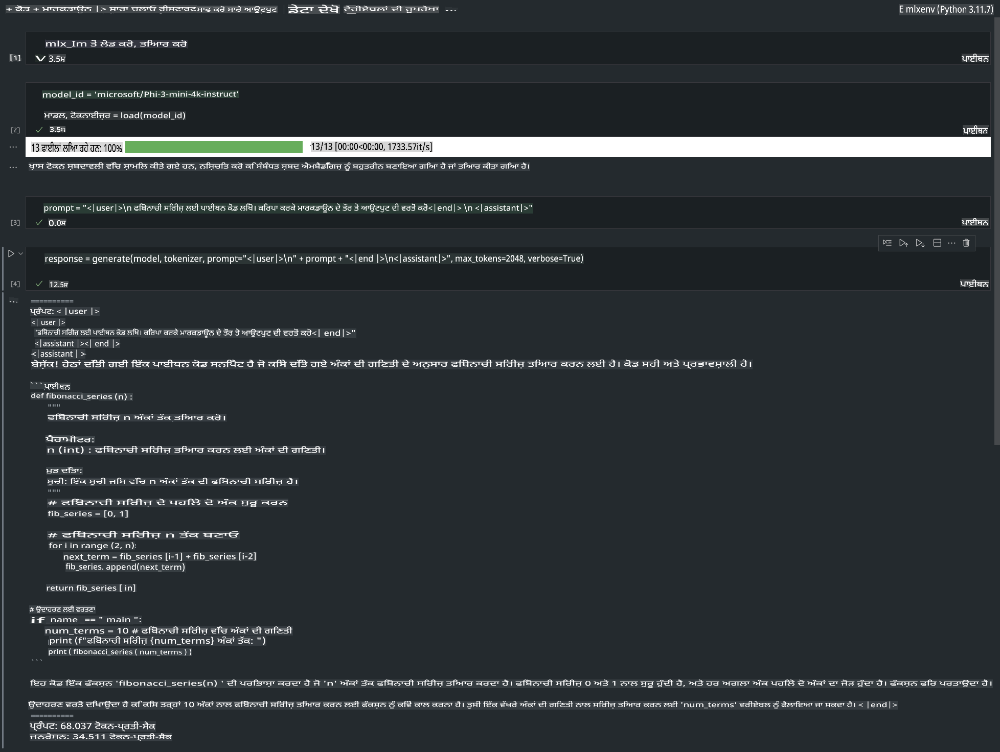

# **ਐਪਲ MLX ਫਰੇਮਵਰਕ ਨਾਲ ਫਾਈ-3 ਦੀ ਇਨਫਰੈਂਸ**

## **MLX ਫਰੇਮਵਰਕ ਕੀ ਹੈ**

MLX ਇੱਕ ਅਰੇ ਫਰੇਮਵਰਕ ਹੈ ਜੋ ਐਪਲ ਸਿਲਿਕਾਨ ਉੱਤੇ ਮਸ਼ੀਨ ਲਰਨਿੰਗ ਖੋਜ ਲਈ ਬਣਾਇਆ ਗਿਆ ਹੈ, ਅਤੇ ਇਹ ਐਪਲ ਮਸ਼ੀਨ ਲਰਨਿੰਗ ਖੋਜ ਟੀਮ ਵੱਲੋਂ ਪੇਸ਼ ਕੀਤਾ ਗਿਆ ਹੈ।

MLX ਨੂੰ ਮਸ਼ੀਨ ਲਰਨਿੰਗ ਖੋਜਕਰਤਿਆਂ ਲਈ ਖਾਸ ਤੌਰ 'ਤੇ ਡਿਜ਼ਾਈਨ ਕੀਤਾ ਗਿਆ ਹੈ। ਇਹ ਫਰੇਮਵਰਕ ਵਰਤੋਂ ਵਿੱਚ ਆਸਾਨ ਹੈ, ਪਰ ਇਹ ਮਾਡਲਾਂ ਨੂੰ ਟ੍ਰੇਨ ਅਤੇ ਡਿਪਲੌਇ ਕਰਨ ਲਈ ਬਹੁਤ ਪ੍ਰਭਾਵਸ਼ਾਲੀ ਹੈ। ਇਸ ਫਰੇਮਵਰਕ ਦੀ ਡਿਜ਼ਾਈਨ ਵੀ ਸਮਝਣ ਲਈ ਸਧਾਰਣ ਹੈ। ਸਾਡਾ ਮਕਸਦ ਹੈ ਕਿ ਖੋਜਕਰਤਿਆਂ ਲਈ MLX ਨੂੰ ਵਧਾਉਣਾ ਅਤੇ ਸੁਧਾਰਨਾ ਆਸਾਨ ਬਣਾਇਆ ਜਾਵੇ, ਤਾਂ ਜੋ ਨਵੀਆਂ ਵਿਚਾਰਧਾਰਾਵਾਂ ਨੂੰ ਤੇਜ਼ੀ ਨਾਲ ਅੰਜ਼ਾਮ ਤੱਕ ਲਿਆ ਜਾ ਸਕੇ।

ਐਪਲ ਸਿਲਿਕਾਨ ਡਿਵਾਈਸਾਂ ਉੱਤੇ MLX ਰਾਹੀਂ LLMs ਨੂੰ ਤੇਜ਼ ਕੀਤਾ ਜਾ ਸਕਦਾ ਹੈ, ਅਤੇ ਮਾਡਲਾਂ ਨੂੰ ਬਹੁਤ ਹੀ ਆਸਾਨੀ ਨਾਲ ਲੋਕਲ ਰੂਪ ਵਿੱਚ ਚਲਾਇਆ ਜਾ ਸਕਦਾ ਹੈ।

## **MLX ਦੀ ਵਰਤੋਂ ਨਾਲ Phi-3-mini ਦੀ ਇਨਫਰੈਂਸ**

### **1. ਆਪਣਾ MLX ਮਾਹੌਲ ਸੈੱਟ ਕਰੋ**

1. Python 3.11.x
2. MLX ਲਾਇਬ੍ਰੇਰੀ ਇੰਸਟਾਲ ਕਰੋ

```bash

pip install mlx-lm

```

### **2. ਟਰਮੀਨਲ ਵਿੱਚ MLX ਨਾਲ Phi-3-mini ਚਲਾਉਣਾ**

```bash

python -m mlx_lm.generate --model microsoft/Phi-3-mini-4k-instruct --max-token 2048 --prompt  "<|user|>\nCan you introduce yourself<|end|>\n<|assistant|>"

```

ਨਤੀਜਾ (ਮੇਰਾ ਮਾਹੌਲ Apple M1 Max, 64GB ਹੈ) ਇਹ ਹੈ


### **3. ਟਰਮੀਨਲ ਵਿੱਚ MLX ਨਾਲ Phi-3-mini ਨੂੰ ਕਵਾਂਟਾਈਜ਼ ਕਰਨਾ**

```bash

python -m mlx_lm.convert --hf-path microsoft/Phi-3-mini-4k-instruct

```

***ਨੋਟ:*** ਮਾਡਲ ਨੂੰ mlx_lm.convert ਰਾਹੀਂ ਕਵਾਂਟਾਈਜ਼ ਕੀਤਾ ਜਾ ਸਕਦਾ ਹੈ, ਅਤੇ ਡਿਫੌਲਟ ਕਵਾਂਟਾਈਜ਼ੇਸ਼ਨ INT4 ਹੈ। ਇਸ ਉਦਾਹਰਨ ਵਿੱਚ Phi-3-mini ਨੂੰ INT4 ਵਿੱਚ ਕਵਾਂਟਾਈਜ਼ ਕੀਤਾ ਗਿਆ ਹੈ।

ਮਾਡਲ ਨੂੰ mlx_lm.convert ਰਾਹੀਂ ਕਵਾਂਟਾਈਜ਼ ਕੀਤਾ ਜਾ ਸਕਦਾ ਹੈ, ਅਤੇ ਡਿਫੌਲਟ ਕਵਾਂਟਾਈਜ਼ੇਸ਼ਨ INT4 ਹੈ। ਇਸ ਉਦਾਹਰਨ ਵਿੱਚ Phi-3-mini ਨੂੰ INT4 ਵਿੱਚ ਕਵਾਂਟਾਈਜ਼ ਕੀਤਾ ਗਿਆ ਹੈ। ਕਵਾਂਟਾਈਜ਼ੇਸ਼ਨ ਤੋਂ ਬਾਅਦ, ਇਹ ਡਿਫੌਲਟ ਡਾਇਰੈਕਟਰੀ ./mlx_model ਵਿੱਚ ਸਟੋਰ ਕੀਤਾ ਜਾਵੇਗਾ।

ਅਸੀਂ ਟਰਮੀਨਲ ਵਿੱਚ MLX ਨਾਲ ਕਵਾਂਟਾਈਜ਼ ਮਾਡਲ ਦੀ ਜਾਂਚ ਕਰ ਸਕਦੇ ਹਾਂ।

```bash

python -m mlx_lm.generate --model ./mlx_model/ --max-token 2048 --prompt  "<|user|>\nCan you introduce yourself<|end|>\n<|assistant|>"

```

ਨਤੀਜਾ ਇਹ ਹੈ


### **4. Jupyter Notebook ਵਿੱਚ MLX ਨਾਲ Phi-3-mini ਚਲਾਉਣਾ**



***ਨੋਟ:*** ਕਿਰਪਾ ਕਰਕੇ ਇਹ ਸੈਂਪਲ ਪੜ੍ਹੋ [ਇਸ ਲਿੰਕ 'ਤੇ ਕਲਿੱਕ ਕਰੋ](../../../../../code/03.Inference/MLX/MLX_DEMO.ipynb)

## **ਸਰੋਤ**

1. ਐਪਲ MLX ਫਰੇਮਵਰਕ ਬਾਰੇ ਜਾਣੋ [https://ml-explore.github.io](https://ml-explore.github.io/mlx/build/html/index.html)

2. ਐਪਲ MLX GitHub ਰਿਪੋ [https://github.com/ml-explore](https://github.com/ml-explore)

**ਅਸਵੀਕਾਰਤਾ**:  
ਇਹ ਦਸਤਾਵੇਜ਼ ਮਸ਼ੀਨ-ਆਧਾਰਿਤ AI ਅਨੁਵਾਦ ਸੇਵਾਵਾਂ ਦੀ ਵਰਤੋਂ ਕਰਕੇ ਅਨੁਵਾਦ ਕੀਤਾ ਗਿਆ ਹੈ। ਅਸੀਂ ਸਹੀ ਹੋਣ ਦਾ ਯਤਨ ਕਰਦੇ ਹਾਂ, ਪਰ ਕਿਰਪਾ ਕਰਕੇ ਧਿਆਨ ਦਿਓ ਕਿ ਸਵੈਚਾਲਿਤ ਅਨੁਵਾਦਾਂ ਵਿੱਚ ਗਲਤੀਆਂ ਜਾਂ ਅਸੁਣਗਤੀਆਂ ਹੋ ਸਕਦੀਆਂ ਹਨ। ਮੂਲ ਦਸਤਾਵੇਜ਼ ਨੂੰ ਇਸਦੀ ਮੂਲ ਭਾਸ਼ਾ ਵਿੱਚ ਅਧਿਕਾਰਕ ਸਰੋਤ ਮੰਨਿਆ ਜਾਣਾ ਚਾਹੀਦਾ ਹੈ। ਮਹੱਤਵਪੂਰਨ ਜਾਣਕਾਰੀ ਲਈ, ਪੇਸ਼ੇਵਰ ਮਨੁੱਖੀ ਅਨੁਵਾਦ ਦੀ ਸਿਫਾਰਸ਼ ਕੀਤੀ ਜਾਂਦੀ ਹੈ। ਅਸੀਂ ਇਸ ਅਨੁਵਾਦ ਦੇ ਉਪਯੋਗ ਨਾਲ ਪੈਦਾ ਹੋਈ ਕਿਸੇ ਵੀ ਗਲਤਫਹਮੀ ਜਾਂ ਗਲਤ ਵਿਆਖਿਆ ਲਈ ਜ਼ਿੰਮੇਵਾਰ ਨਹੀਂ ਹਾਂ।