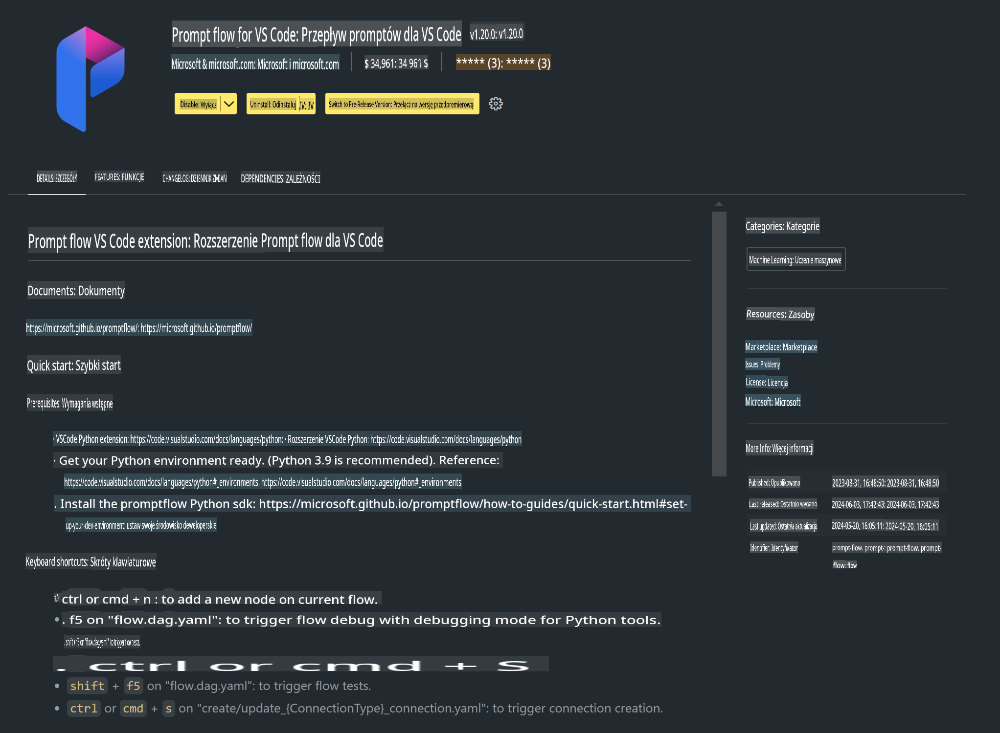

# **Lab 0 - Instalacja**

Kiedy wchodzimy do laboratorium, musimy skonfigurować odpowiednie środowisko:


### **1. Python 3.11+**

Zaleca się użycie miniforge do skonfigurowania środowiska Python. 

Aby skonfigurować miniforge, zapoznaj się z [https://github.com/conda-forge/miniforge](https://github.com/conda-forge/miniforge)

Po skonfigurowaniu miniforge, uruchom następujące polecenie w PowerShell:

```bash

conda create -n pyenv python==3.11.8 -y

conda activate pyenv

```


### **2. Instalacja Prompt flow SDK**

W Lab 1 używamy Prompt flow, dlatego musisz skonfigurować Prompt flow SDK.

```bash

pip install promptflow --upgrade

```

Możesz sprawdzić SDK Prompt flow za pomocą tego polecenia:

```bash

pf --version

```

### **3. Instalacja rozszerzenia Prompt flow dla Visual Studio Code**



### **4. Framework MLX firmy Apple**

MLX to framework macierzowy przeznaczony do badań nad uczeniem maszynowym na układach Apple Silicon, opracowany przez dział badań nad uczeniem maszynowym firmy Apple. Możesz użyć **frameworka Apple MLX**, aby przyspieszyć działanie LLM/SLM na układach Apple Silicon. Jeśli chcesz dowiedzieć się więcej, zapoznaj się z [https://github.com/microsoft/PhiCookBook/blob/main/md/01.Introduction/03/MLX_Inference.md](https://github.com/microsoft/PhiCookBook/blob/main/md/01.Introduction/03/MLX_Inference.md).

Zainstaluj bibliotekę frameworka MLX w bash:

```bash

pip install mlx-lm

```


### **5. Inne biblioteki Pythona**


Utwórz plik requirements.txt i dodaj do niego następującą zawartość:

```txt

notebook
numpy 
scipy 
scikit-learn 
matplotlib 
pandas 
pillow 
graphviz

```


### **6. Instalacja NVM**

Zainstaluj nvm w PowerShell:

```bash

brew install nvm

```

Zainstaluj nodejs w wersji 18.20:

```bash

nvm install 18.20.0

nvm use 18.20.0

```

### **7. Instalacja wsparcia dla rozwoju w Visual Studio Code**


```bash

npm install --global yo generator-code

```

Gratulacje! Pomyślnie skonfigurowałeś SDK. Teraz przejdź do kroków praktycznych.

**Zastrzeżenie**:  
Ten dokument został przetłumaczony za pomocą usług tłumaczenia maszynowego opartego na sztucznej inteligencji. Chociaż staramy się zapewnić dokładność, prosimy pamiętać, że automatyczne tłumaczenia mogą zawierać błędy lub nieścisłości. Oryginalny dokument w jego rodzimym języku powinien być uznawany za wiarygodne źródło. W przypadku informacji o kluczowym znaczeniu zaleca się skorzystanie z profesjonalnego tłumaczenia wykonanego przez człowieka. Nie ponosimy odpowiedzialności za jakiekolwiek nieporozumienia lub błędne interpretacje wynikające z korzystania z tego tłumaczenia.