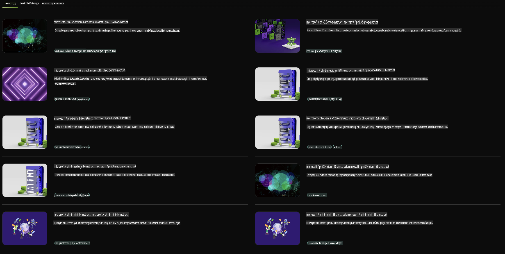

## Família Phi no NVIDIA NIM

NVIDIA NIM é um conjunto de microsserviços fáceis de usar, projetados para acelerar a implementação de modelos de IA generativa na nuvem, em data centers e estações de trabalho. Os NIMs são organizados por família de modelos e por modelo específico. Por exemplo, o NVIDIA NIM para modelos de linguagem de grande escala (LLMs) traz o poder dos LLMs mais avançados para aplicações empresariais, oferecendo capacidades incomparáveis de processamento e compreensão de linguagem natural.

O NIM facilita para equipes de TI e DevOps a hospedagem própria de modelos de linguagem de grande escala (LLMs) em seus próprios ambientes gerenciados, ao mesmo tempo em que fornece aos desenvolvedores APIs padrão do setor que permitem criar copilotos, chatbots e assistentes de IA poderosos que podem transformar seus negócios. Aproveitando a aceleração de GPU de ponta da NVIDIA e a implantação escalável, o NIM oferece o caminho mais rápido para inferência com desempenho incomparável.

Você pode usar o NVIDIA NIM para realizar inferências com os modelos da Família Phi.



### **Exemplos - Phi-3-Vision no NVIDIA NIM**

Imagine que você tem uma imagem (`demo.png`) e deseja gerar um código Python que processe essa imagem e salve uma nova versão dela (`phi-3-vision.jpg`).

O código abaixo automatiza esse processo ao:

1. Configurar o ambiente e as configurações necessárias.
2. Criar um prompt que instrua o modelo a gerar o código Python requerido.
3. Enviar o prompt ao modelo e coletar o código gerado.
4. Extrair e executar o código gerado.
5. Exibir as imagens original e processada.

Essa abordagem aproveita o poder da IA para automatizar tarefas de processamento de imagens, tornando mais fácil e rápido alcançar seus objetivos.

[Solução de Código de Exemplo](../../../../../code/06.E2E/E2E_Nvidia_NIM_Phi3_Vision.ipynb)

Vamos detalhar o que todo o código faz, passo a passo:

1. **Instalar o Pacote Necessário**:
    ```python
    !pip install langchain_nvidia_ai_endpoints -U
    ```
    Este comando instala o pacote `langchain_nvidia_ai_endpoints`, garantindo que seja a versão mais recente.

2. **Importar os Módulos Necessários**:
    ```python
    from langchain_nvidia_ai_endpoints import ChatNVIDIA
    import getpass
    import os
    import base64
    ```
    Essas importações trazem os módulos necessários para interagir com os endpoints de IA da NVIDIA, lidar com senhas de forma segura, interagir com o sistema operacional e codificar/decodificar dados no formato base64.

3. **Configurar a Chave da API**:
    ```python
    if not os.getenv("NVIDIA_API_KEY"):
        os.environ["NVIDIA_API_KEY"] = getpass.getpass("Enter your NVIDIA API key: ")
    ```
    Este código verifica se a variável de ambiente `NVIDIA_API_KEY` está configurada. Caso contrário, solicita ao usuário que insira sua chave da API de forma segura.

4. **Definir Modelo e Caminho da Imagem**:
    ```python
    model = 'microsoft/phi-3-vision-128k-instruct'
    chat = ChatNVIDIA(model=model)
    img_path = './imgs/demo.png'
    ```
    Isso define o modelo a ser usado, cria uma instância do `ChatNVIDIA` com o modelo especificado e define o caminho para o arquivo de imagem.

5. **Criar o Prompt de Texto**:
    ```python
    text = "Please create Python code for image, and use plt to save the new picture under imgs/ and name it phi-3-vision.jpg."
    ```
    Este trecho define um prompt de texto que instrui o modelo a gerar um código Python para processar uma imagem.

6. **Codificar a Imagem em Base64**:
    ```python
    with open(img_path, "rb") as f:
        image_b64 = base64.b64encode(f.read()).decode()
    image = f''
    ```
    Este código lê o arquivo de imagem, codifica-o em base64 e cria uma tag HTML de imagem com os dados codificados.

7. **Combinar Texto e Imagem no Prompt**:
    ```python
    prompt = f"{text} {image}"
    ```
    Isso combina o prompt de texto e a tag HTML da imagem em uma única string.

8. **Gerar Código Usando ChatNVIDIA**:
    ```python
    code = ""
    for chunk in chat.stream(prompt):
        print(chunk.content, end="")
        code += chunk.content
    ```
    Este código envia o prompt para o `ChatNVIDIA` e armazena o código gerado na string `` model and collects the generated code in chunks, printing and appending each chunk to the `code`.

9. **Extrair o Código Python do Conteúdo Gerado**:
    ```python
    begin = code.index('```python') + 9
    code = code[begin:]
    end = code.index('```')
    code = code[:end]
    ```
    Este trecho extrai o código Python gerado, removendo a formatação markdown.

10. **Executar o Código Gerado**:
    ```python
    import subprocess
    result = subprocess.run(["python", "-c", code], capture_output=True)
    ```
    Este trecho executa o código Python extraído como um subprocesso e captura sua saída.

11. **Exibir Imagens**:
    ```python
    from IPython.display import Image, display
    display(Image(filename='./imgs/phi-3-vision.jpg'))
    display(Image(filename='./imgs/demo.png'))
    ```
    Estas linhas exibem as imagens usando o módulo `IPython.display`.

**Aviso Legal**:  
Este documento foi traduzido utilizando serviços de tradução automática baseados em IA. Embora nos esforcemos para garantir a precisão, esteja ciente de que traduções automáticas podem conter erros ou imprecisões. O documento original em seu idioma nativo deve ser considerado a fonte oficial. Para informações críticas, recomenda-se a tradução profissional humana. Não nos responsabilizamos por quaisquer mal-entendidos ou interpretações incorretas decorrentes do uso desta tradução.