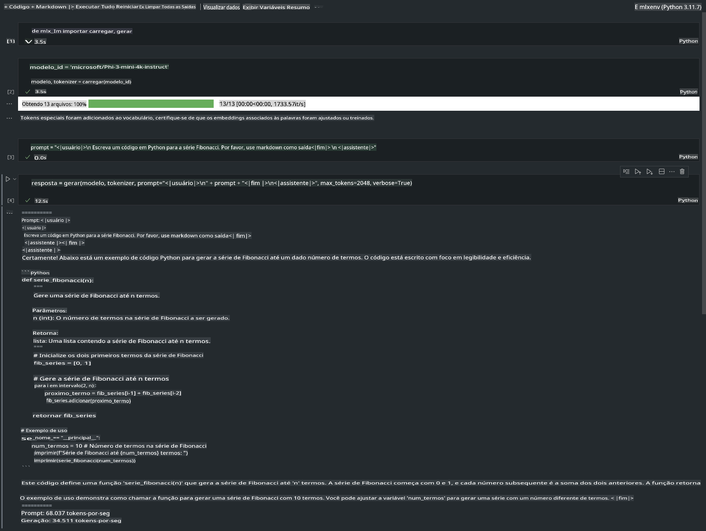

# **Inferência do Phi-3 com o Framework Apple MLX**

## **O que é o Framework MLX**

MLX é um framework de arrays para pesquisa em aprendizado de máquina no silício da Apple, desenvolvido pela equipe de pesquisa em aprendizado de máquina da Apple.

O MLX foi projetado por pesquisadores de aprendizado de máquina para pesquisadores de aprendizado de máquina. O framework foi criado para ser amigável ao usuário, mas ainda assim eficiente para treinar e implementar modelos. O design do framework também é conceitualmente simples. Nosso objetivo é facilitar para os pesquisadores a extensão e melhoria do MLX, permitindo explorar novas ideias rapidamente.

LLMs podem ser acelerados em dispositivos com silício da Apple por meio do MLX, e os modelos podem ser executados localmente de forma muito conveniente.

## **Usando o MLX para inferir Phi-3-mini**

### **1. Configure seu ambiente MLX**

1. Python 3.11.x  
2. Instale a Biblioteca MLX  

```bash

pip install mlx-lm

```

### **2. Executando o Phi-3-mini no Terminal com o MLX**

```bash

python -m mlx_lm.generate --model microsoft/Phi-3-mini-4k-instruct --max-token 2048 --prompt  "<|user|>\nCan you introduce yourself<|end|>\n<|assistant|>"

```

O resultado (meu ambiente é Apple M1 Max, 64GB) é


### **3. Quantizando o Phi-3-mini com o MLX no Terminal**

```bash

python -m mlx_lm.convert --hf-path microsoft/Phi-3-mini-4k-instruct

```

***Nota:*** O modelo pode ser quantizado através do mlx_lm.convert, e a quantização padrão é INT4. Este exemplo quantiza o Phi-3-mini para INT4.

O modelo pode ser quantizado através do mlx_lm.convert, e a quantização padrão é INT4. Este exemplo mostra como quantizar o Phi-3-mini para INT4. Após a quantização, ele será armazenado no diretório padrão ./mlx_model.

Podemos testar o modelo quantizado com o MLX diretamente no terminal.

```bash

python -m mlx_lm.generate --model ./mlx_model/ --max-token 2048 --prompt  "<|user|>\nCan you introduce yourself<|end|>\n<|assistant|>"

```

O resultado é


### **4. Executando o Phi-3-mini com o MLX no Jupyter Notebook**



***Nota:*** Por favor, leia este exemplo [clique neste link](../../../../../code/03.Inference/MLX/MLX_DEMO.ipynb)

## **Recursos**

1. Saiba mais sobre o Framework Apple MLX [https://ml-explore.github.io](https://ml-explore.github.io/mlx/build/html/index.html)

2. Repositório Apple MLX no GitHub [https://github.com/ml-explore](https://github.com/ml-explore)

**Aviso Legal**:  
Este documento foi traduzido utilizando serviços de tradução automática baseados em IA. Embora nos esforcemos para garantir a precisão, esteja ciente de que traduções automatizadas podem conter erros ou imprecisões. O documento original em seu idioma nativo deve ser considerado a fonte oficial. Para informações críticas, recomenda-se a tradução profissional realizada por humanos. Não nos responsabilizamos por quaisquer mal-entendidos ou interpretações equivocadas decorrentes do uso desta tradução.