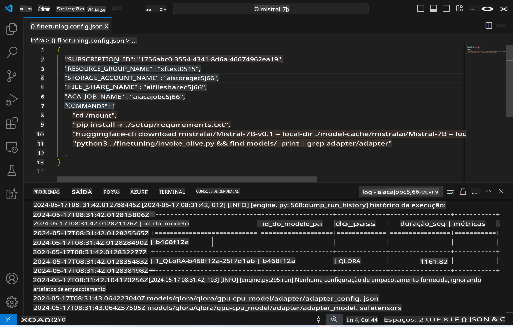
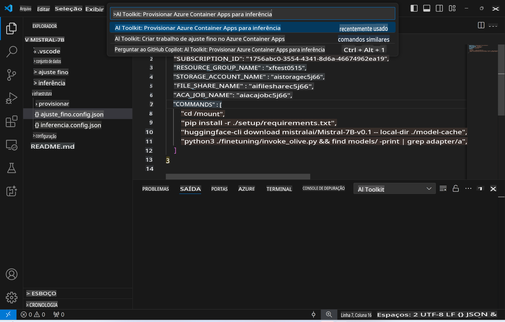
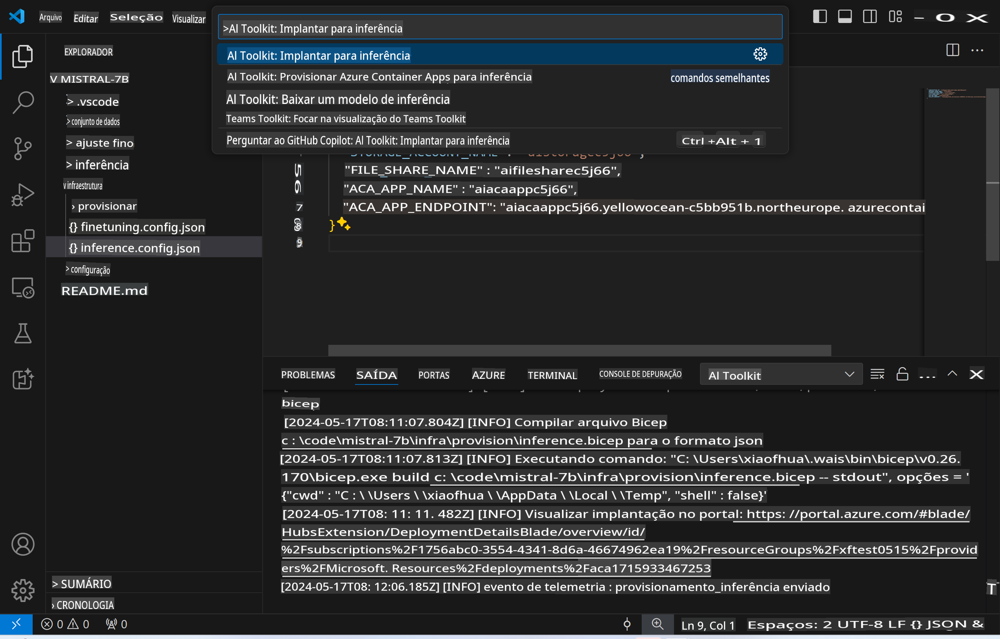
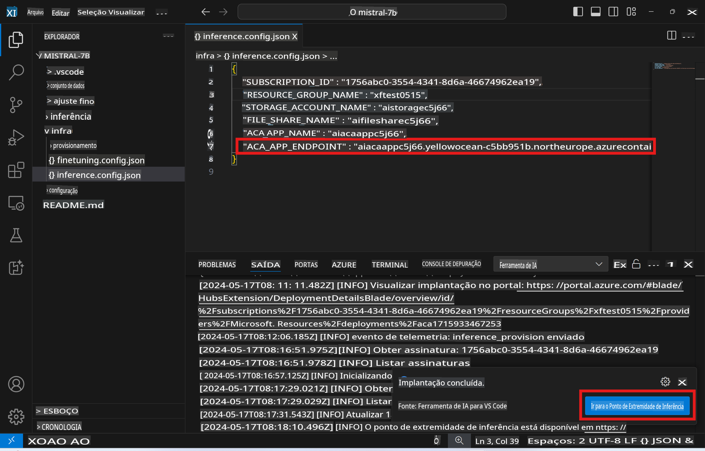

# Inferência Remota com o Modelo Ajustado

Após os adaptadores serem treinados no ambiente remoto, utilize uma aplicação simples do Gradio para interagir com o modelo.



### Provisionar Recursos do Azure
Você precisa configurar os Recursos do Azure para a inferência remota executando o `AI Toolkit: Provision Azure Container Apps for inference` a partir do painel de comandos. Durante essa configuração, será solicitado que você selecione sua Assinatura do Azure e o grupo de recursos.  

   
Por padrão, a assinatura e o grupo de recursos para a inferência devem ser os mesmos utilizados no ajuste fino. A inferência usará o mesmo Ambiente de Aplicativo do Azure Container e acessará o modelo e o adaptador de modelo armazenados no Azure Files, que foram gerados durante a etapa de ajuste fino.

## Usando o AI Toolkit 

### Implantação para Inferência  
Se você deseja revisar o código de inferência ou recarregar o modelo de inferência, execute o comando `AI Toolkit: Deploy for inference`. Isso sincronizará seu código mais recente com o ACA e reiniciará a réplica.  



Após a conclusão bem-sucedida da implantação, o modelo estará pronto para ser avaliado usando este endpoint.

### Acessando a API de Inferência

Você pode acessar a API de inferência clicando no botão "*Go to Inference Endpoint*" exibido na notificação do VSCode. Alternativamente, o endpoint da API web pode ser encontrado em `ACA_APP_ENDPOINT` no `./infra/inference.config.json` e no painel de saída.



> **Nota:** O endpoint de inferência pode levar alguns minutos para se tornar totalmente operacional.

## Componentes de Inferência Incluídos no Template
 
| Pasta | Conteúdo |
| ------ |--------- |
| `infra` | Contém todas as configurações necessárias para operações remotas. |
| `infra/provision/inference.parameters.json` | Armazena os parâmetros para os templates Bicep, usados para provisionar os recursos do Azure para inferência. |
| `infra/provision/inference.bicep` | Contém templates para provisionar os recursos do Azure para inferência. |
| `infra/inference.config.json` | O arquivo de configuração, gerado pelo comando `AI Toolkit: Provision Azure Container Apps for inference`. Ele é usado como entrada para outros comandos remotos no painel. |

### Usando o AI Toolkit para configurar o Provisionamento de Recursos do Azure
Configure o [AI Toolkit](https://marketplace.visualstudio.com/items?itemName=ms-windows-ai-studio.windows-ai-studio)

Provisione os Azure Container Apps para inferência` command.

You can find configuration parameters in `./infra/provision/inference.parameters.json` file. Here are the details:
| Parameter | Description |
| --------- |------------ |
| `defaultCommands` | This is the commands to initiate a web API. |
| `maximumInstanceCount` | This parameter sets the maximum capacity of GPU instances. |
| `location` | This is the location where Azure resources are provisioned. The default value is the same as the chosen resource group's location. |
| `storageAccountName`, `fileShareName` `acaEnvironmentName`, `acaEnvironmentStorageName`, `acaAppName`,  `acaLogAnalyticsName` | These parameters are used to name the Azure resources for provision. By default, they will be same to the fine-tuning resource name. You can input a new, unused resource name to create your own custom-named resources, or you can input the name of an already existing Azure resource if you'd prefer to use that. For details, refer to the section [Using existing Azure Resources](../../../../../md/01.Introduction/03). |

### Using Existing Azure Resources

By default, the inference provision use the same Azure Container App Environment, Storage Account, Azure File Share, and Azure Log Analytics that were used for fine-tuning. A separate Azure Container App is created solely for the inference API. 

If you have customized the Azure resources during the fine-tuning step or want to use your own existing Azure resources for inference, specify their names in the `./infra/inference.parameters.json`. Em seguida, execute o comando `AI Toolkit: Provision Azure Container Apps for inference` a partir do painel de comandos. Isso atualizará quaisquer recursos especificados e criará os que estiverem faltando.

Por exemplo, se você tiver um ambiente de contêiner do Azure existente, seu `./infra/finetuning.parameters.json` deve ter a seguinte aparência:

```json
{
    "$schema": "https://schema.management.azure.com/schemas/2019-04-01/deploymentParameters.json#",
    "contentVersion": "1.0.0.0",
    "parameters": {
      ...
      "acaEnvironmentName": {
        "value": "<your-aca-env-name>"
      },
      "acaEnvironmentStorageName": {
        "value": null
      },
      ...
    }
  }
```

### Provisionamento Manual  
Se você preferir configurar manualmente os recursos do Azure, pode usar os arquivos Bicep fornecidos no arquivo `./infra/provision` folders. If you have already set up and configured all the Azure resources without using the AI Toolkit command palette, you can simply enter the resource names in the `inference.config.json`.

Por exemplo:

```json
{
  "SUBSCRIPTION_ID": "<your-subscription-id>",
  "RESOURCE_GROUP_NAME": "<your-resource-group-name>",
  "STORAGE_ACCOUNT_NAME": "<your-storage-account-name>",
  "FILE_SHARE_NAME": "<your-file-share-name>",
  "ACA_APP_NAME": "<your-aca-name>",
  "ACA_APP_ENDPOINT": "<your-aca-endpoint>"
}
```

**Aviso Legal**:  
Este documento foi traduzido utilizando serviços de tradução baseados em IA. Embora nos esforcemos para garantir a precisão, esteja ciente de que traduções automáticas podem conter erros ou imprecisões. O documento original em seu idioma nativo deve ser considerado a fonte oficial. Para informações críticas, recomenda-se uma tradução profissional feita por humanos. Não nos responsabilizamos por quaisquer mal-entendidos ou interpretações equivocadas decorrentes do uso desta tradução.