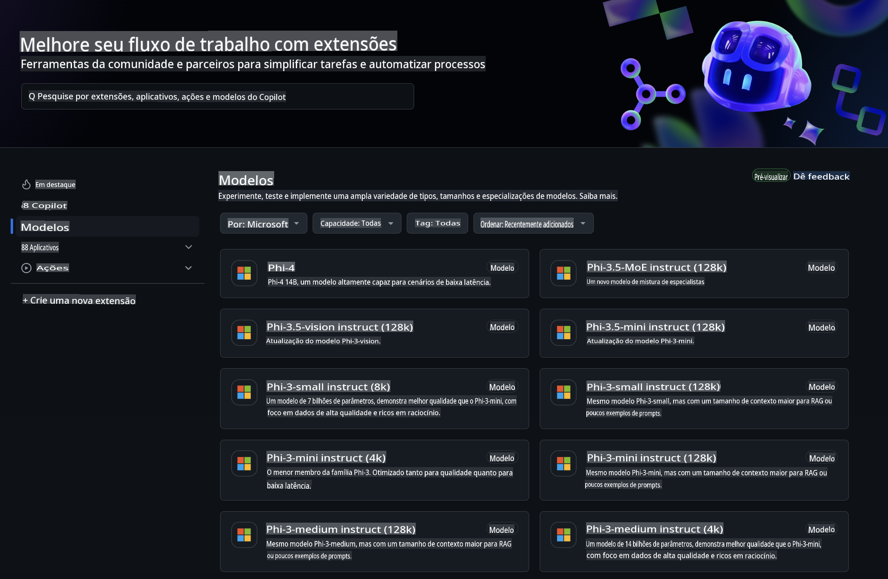
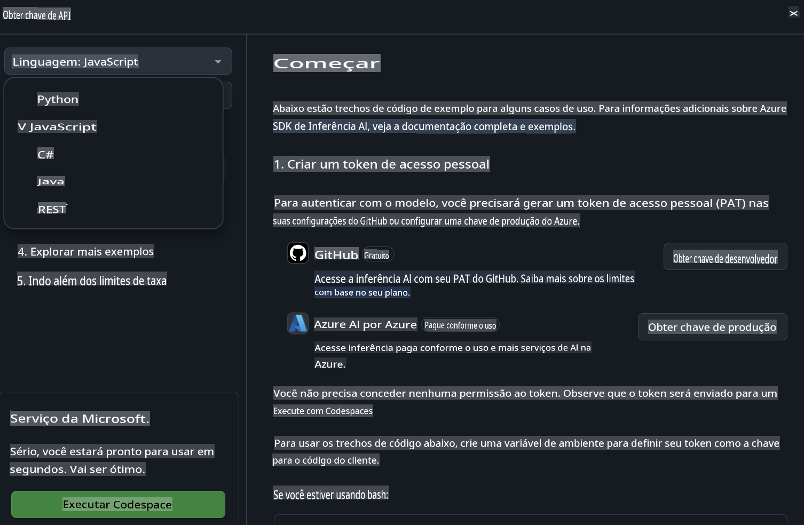

## Modelos do GitHub - Beta Público Limitado

Bem-vindo ao [Modelos do GitHub](https://github.com/marketplace/models)! Tudo está pronto para você explorar os Modelos de IA hospedados no Azure AI.



Para mais informações sobre os Modelos disponíveis no Modelos do GitHub, confira o [Marketplace de Modelos do GitHub](https://github.com/marketplace/models).

## Modelos Disponíveis

Cada modelo possui um playground dedicado e códigos de exemplo.


### Modelos Phi-3 no Catálogo de Modelos do GitHub

[Phi-3-Medium-128k-Instruct](https://github.com/marketplace/models/azureml/Phi-3-medium-128k-instruct)

[Phi-3-medium-4k-instruct](https://github.com/marketplace/models/azureml/Phi-3-medium-4k-instruct)

[Phi-3-mini-128k-instruct](https://github.com/marketplace/models/azureml/Phi-3-mini-128k-instruct)

[Phi-3-mini-4k-instruct](https://github.com/marketplace/models/azureml/Phi-3-mini-4k-instruct)

[Phi-3-small-128k-instruct](https://github.com/marketplace/models/azureml/Phi-3-small-128k-instruct)

[Phi-3-small-8k-instruct](https://github.com/marketplace/models/azureml/Phi-3-small-8k-instruct)

## Primeiros Passos

Há alguns exemplos básicos prontos para você executar. Você pode encontrá-los no diretório de exemplos. Se quiser ir direto ao seu idioma favorito, você pode encontrar os exemplos nos seguintes idiomas:

- Python
- JavaScript
- cURL

Também há um Ambiente Codespaces dedicado para executar os exemplos e modelos.



## Código de Exemplo

Abaixo estão trechos de código de exemplo para alguns casos de uso. Para mais informações sobre o Azure AI Inference SDK, veja a documentação completa e os exemplos.

## Configuração

1. Crie um token de acesso pessoal  
   Você não precisa conceder permissões ao token. Observe que o token será enviado a um serviço da Microsoft.

Para usar os trechos de código abaixo, crie uma variável de ambiente para definir seu token como a chave para o código do cliente.

Se estiver usando bash:  
```
export GITHUB_TOKEN="<your-github-token-goes-here>"
```  
Se estiver no PowerShell:  

```
$Env:GITHUB_TOKEN="<your-github-token-goes-here>"
```  

Se estiver usando o prompt de comando do Windows:  

```
set GITHUB_TOKEN=<your-github-token-goes-here>
```  

## Exemplo em Python

### Instale as dependências  
Instale o Azure AI Inference SDK usando pip (Requisitos: Python >=3.8):  

```
pip install azure-ai-inference
```  

### Execute um exemplo básico de código  

Este exemplo demonstra uma chamada básica à API de conclusão de chat. Ele utiliza o endpoint de inferência de modelo de IA do GitHub e seu token do GitHub. A chamada é síncrona.  

```
import os
from azure.ai.inference import ChatCompletionsClient
from azure.ai.inference.models import SystemMessage, UserMessage
from azure.core.credentials import AzureKeyCredential

endpoint = "https://models.inference.ai.azure.com"
# Replace Model_Name 
model_name = "Phi-3-small-8k-instruct"
token = os.environ["GITHUB_TOKEN"]

client = ChatCompletionsClient(
    endpoint=endpoint,
    credential=AzureKeyCredential(token),
)

response = client.complete(
    messages=[
        SystemMessage(content="You are a helpful assistant."),
        UserMessage(content="What is the capital of France?"),
    ],
    model=model_name,
    temperature=1.,
    max_tokens=1000,
    top_p=1.
)

print(response.choices[0].message.content)
```  

### Execute uma conversa com múltiplas interações  

Este exemplo demonstra uma conversa com múltiplas interações usando a API de conclusão de chat. Ao usar o modelo para um aplicativo de chat, você precisará gerenciar o histórico dessa conversa e enviar as mensagens mais recentes ao modelo.  

```
import os
from azure.ai.inference import ChatCompletionsClient
from azure.ai.inference.models import AssistantMessage, SystemMessage, UserMessage
from azure.core.credentials import AzureKeyCredential

token = os.environ["GITHUB_TOKEN"]
endpoint = "https://models.inference.ai.azure.com"
# Replace Model_Name
model_name = "Phi-3-small-8k-instruct"

client = ChatCompletionsClient(
    endpoint=endpoint,
    credential=AzureKeyCredential(token),
)

messages = [
    SystemMessage(content="You are a helpful assistant."),
    UserMessage(content="What is the capital of France?"),
    AssistantMessage(content="The capital of France is Paris."),
    UserMessage(content="What about Spain?"),
]

response = client.complete(messages=messages, model=model_name)

print(response.choices[0].message.content)
```  

### Transmita a saída  

Para uma melhor experiência do usuário, você desejará transmitir a resposta do modelo para que o primeiro token apareça rapidamente, evitando esperar por respostas longas.  

```
import os
from azure.ai.inference import ChatCompletionsClient
from azure.ai.inference.models import SystemMessage, UserMessage
from azure.core.credentials import AzureKeyCredential

token = os.environ["GITHUB_TOKEN"]
endpoint = "https://models.inference.ai.azure.com"
# Replace Model_Name
model_name = "Phi-3-small-8k-instruct"

client = ChatCompletionsClient(
    endpoint=endpoint,
    credential=AzureKeyCredential(token),
)

response = client.complete(
    stream=True,
    messages=[
        SystemMessage(content="You are a helpful assistant."),
        UserMessage(content="Give me 5 good reasons why I should exercise every day."),
    ],
    model=model_name,
)

for update in response:
    if update.choices:
        print(update.choices[0].delta.content or "", end="")

client.close()
```  

## JavaScript  

### Instale as dependências  

Instale o Node.js.  

Copie as linhas de texto abaixo e salve-as como um arquivo package.json dentro da sua pasta.  

```
{
  "type": "module",
  "dependencies": {
    "@azure-rest/ai-inference": "latest",
    "@azure/core-auth": "latest",
    "@azure/core-sse": "latest"
  }
}
```  

Nota: @azure/core-sse é necessário apenas quando você transmite a resposta de conclusões de chat.  

Abra uma janela de terminal nesta pasta e execute npm install.  

Para cada trecho de código abaixo, copie o conteúdo em um arquivo sample.js e execute com node sample.js.  

### Execute um exemplo básico de código  

Este exemplo demonstra uma chamada básica à API de conclusão de chat. Ele utiliza o endpoint de inferência de modelo de IA do GitHub e seu token do GitHub. A chamada é síncrona.  

```
import ModelClient from "@azure-rest/ai-inference";
import { AzureKeyCredential } from "@azure/core-auth";

const token = process.env["GITHUB_TOKEN"];
const endpoint = "https://models.inference.ai.azure.com";
// Update your modelname
const modelName = "Phi-3-small-8k-instruct";

export async function main() {

  const client = new ModelClient(endpoint, new AzureKeyCredential(token));

  const response = await client.path("/chat/completions").post({
    body: {
      messages: [
        { role:"system", content: "You are a helpful assistant." },
        { role:"user", content: "What is the capital of France?" }
      ],
      model: modelName,
      temperature: 1.,
      max_tokens: 1000,
      top_p: 1.
    }
  });

  if (response.status !== "200") {
    throw response.body.error;
  }
  console.log(response.body.choices[0].message.content);
}

main().catch((err) => {
  console.error("The sample encountered an error:", err);
});
```  

### Execute uma conversa com múltiplas interações  

Este exemplo demonstra uma conversa com múltiplas interações usando a API de conclusão de chat. Ao usar o modelo para um aplicativo de chat, você precisará gerenciar o histórico dessa conversa e enviar as mensagens mais recentes ao modelo.  

```
import ModelClient from "@azure-rest/ai-inference";
import { AzureKeyCredential } from "@azure/core-auth";

const token = process.env["GITHUB_TOKEN"];
const endpoint = "https://models.inference.ai.azure.com";
// Update your modelname
const modelName = "Phi-3-small-8k-instruct";

export async function main() {

  const client = new ModelClient(endpoint, new AzureKeyCredential(token));

  const response = await client.path("/chat/completions").post({
    body: {
      messages: [
        { role: "system", content: "You are a helpful assistant." },
        { role: "user", content: "What is the capital of France?" },
        { role: "assistant", content: "The capital of France is Paris." },
        { role: "user", content: "What about Spain?" },
      ],
      model: modelName,
    }
  });

  if (response.status !== "200") {
    throw response.body.error;
  }

  for (const choice of response.body.choices) {
    console.log(choice.message.content);
  }
}

main().catch((err) => {
  console.error("The sample encountered an error:", err);
});
```  

### Transmita a saída  
Para uma melhor experiência do usuário, você desejará transmitir a resposta do modelo para que o primeiro token apareça rapidamente, evitando esperar por respostas longas.  

```
import ModelClient from "@azure-rest/ai-inference";
import { AzureKeyCredential } from "@azure/core-auth";
import { createSseStream } from "@azure/core-sse";

const token = process.env["GITHUB_TOKEN"];
const endpoint = "https://models.inference.ai.azure.com";
// Update your modelname
const modelName = "Phi-3-small-8k-instruct";

export async function main() {

  const client = new ModelClient(endpoint, new AzureKeyCredential(token));

  const response = await client.path("/chat/completions").post({
    body: {
      messages: [
        { role: "system", content: "You are a helpful assistant." },
        { role: "user", content: "Give me 5 good reasons why I should exercise every day." },
      ],
      model: modelName,
      stream: true
    }
  }).asNodeStream();

  const stream = response.body;
  if (!stream) {
    throw new Error("The response stream is undefined");
  }

  if (response.status !== "200") {
    stream.destroy();
    throw new Error(`Failed to get chat completions, http operation failed with ${response.status} code`);
  }

  const sseStream = createSseStream(stream);

  for await (const event of sseStream) {
    if (event.data === "[DONE]") {
      return;
    }
    for (const choice of (JSON.parse(event.data)).choices) {
        process.stdout.write(choice.delta?.content ?? ``);
    }
  }
}

main().catch((err) => {
  console.error("The sample encountered an error:", err);
});
```  

## REST  

### Execute um exemplo básico de código  

Cole o seguinte em um shell:  

```
curl -X POST "https://models.inference.ai.azure.com/chat/completions" \
    -H "Content-Type: application/json" \
    -H "Authorization: Bearer $GITHUB_TOKEN" \
    -d '{
        "messages": [
            {
                "role": "system",
                "content": "You are a helpful assistant."
            },
            {
                "role": "user",
                "content": "What is the capital of France?"
            }
        ],
        "model": "Phi-3-small-8k-instruct"
    }'
```  

### Execute uma conversa com múltiplas interações  

Chame a API de conclusão de chat e passe o histórico do chat:  

```
curl -X POST "https://models.inference.ai.azure.com/chat/completions" \
    -H "Content-Type: application/json" \
    -H "Authorization: Bearer $GITHUB_TOKEN" \
    -d '{
        "messages": [
            {
                "role": "system",
                "content": "You are a helpful assistant."
            },
            {
                "role": "user",
                "content": "What is the capital of France?"
            },
            {
                "role": "assistant",
                "content": "The capital of France is Paris."
            },
            {
                "role": "user",
                "content": "What about Spain?"
            }
        ],
        "model": "Phi-3-small-8k-instruct"
    }'
```  

### Transmita a saída  

Este é um exemplo de chamada ao endpoint e transmissão da resposta.  

```
curl -X POST "https://models.inference.ai.azure.com/chat/completions" \
    -H "Content-Type: application/json" \
    -H "Authorization: Bearer $GITHUB_TOKEN" \
    -d '{
        "messages": [
            {
                "role": "system",
                "content": "You are a helpful assistant."
            },
            {
                "role": "user",
                "content": "Give me 5 good reasons why I should exercise every day."
            }
        ],
        "stream": true,
        "model": "Phi-3-small-8k-instruct"
    }'
```  

## Uso GRATUITO e Limites de Taxa para Modelos do GitHub  

  

Os [limites de taxa para o playground e uso gratuito da API](https://docs.github.com/en/github-models/prototyping-with-ai-models#rate-limits) têm como objetivo ajudá-lo a experimentar modelos e prototipar seu aplicativo de IA. Para uso além desses limites, e para escalar seu aplicativo, você deve provisionar recursos de uma conta Azure e autenticar a partir dela em vez do seu token de acesso pessoal do GitHub. Você não precisa alterar mais nada no seu código. Use este link para descobrir como ir além dos limites do nível gratuito no Azure AI.  

### Avisos  

Lembre-se de que, ao interagir com um modelo, você está experimentando com IA, portanto, erros de conteúdo são possíveis.  

O recurso está sujeito a vários limites (incluindo solicitações por minuto, solicitações por dia, tokens por solicitação e solicitações simultâneas) e não foi projetado para casos de uso em produção.  

Modelos do GitHub utilizam Azure AI Content Safety. Esses filtros não podem ser desativados como parte da experiência de Modelos do GitHub. Caso decida usar modelos por meio de um serviço pago, configure seus filtros de conteúdo para atender às suas necessidades.  

Este serviço está sujeito aos Termos de Pré-lançamento do GitHub.  

**Aviso Legal**:  
Este documento foi traduzido usando serviços de tradução baseados em IA. Embora nos esforcemos para garantir a precisão, esteja ciente de que traduções automáticas podem conter erros ou imprecisões. O documento original em seu idioma nativo deve ser considerado a fonte oficial. Para informações críticas, recomenda-se a tradução profissional realizada por humanos. Não nos responsabilizamos por quaisquer mal-entendidos ou interpretações equivocadas decorrentes do uso desta tradução.