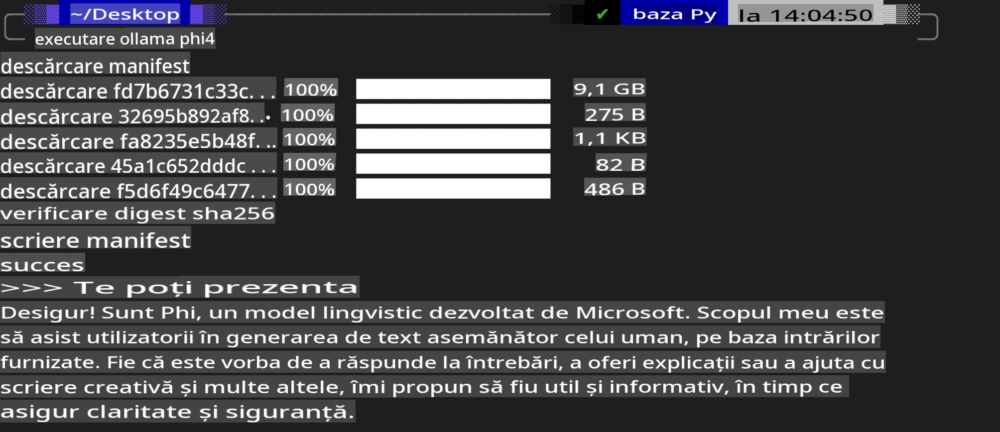

## Familia Phi în Ollama

[Ollama](https://ollama.com) permite mai multor persoane să implementeze direct LLM sau SLM open source prin scripturi simple și, de asemenea, să creeze API-uri pentru a sprijini scenarii locale de aplicații Copilot.

## **1. Instalare**

Ollama este compatibil cu Windows, macOS și Linux. Poți instala Ollama prin acest link ([https://ollama.com/download](https://ollama.com/download)). După instalarea cu succes, poți folosi direct scriptul Ollama pentru a apela Phi-3 dintr-o fereastră de terminal. Poți vedea toate [bibliotecile disponibile în Ollama](https://ollama.com/library). Dacă deschizi acest depozit într-un Codespace, Ollama va fi deja instalat.

```bash

ollama run phi4

```

> [!NOTE]
> Modelul va fi descărcat prima dată când îl rulezi. Desigur, poți specifica direct modelul Phi-4 descărcat. Luăm ca exemplu WSL pentru a rula comanda. După ce modelul este descărcat cu succes, poți interacționa direct în terminal.



## **2. Apelarea API-ului phi-4 din Ollama**

Dacă dorești să apelezi API-ul Phi-4 generat de Ollama, poți folosi această comandă în terminal pentru a porni serverul Ollama.

```bash

ollama serve

```

> [!NOTE]
> Dacă rulezi pe macOS sau Linux, este posibil să întâlnești următoarea eroare **"Error: listen tcp 127.0.0.1:11434: bind: address already in use"**. Această eroare poate apărea la rularea comenzii. Poți ignora această eroare, deoarece indică de obicei că serverul este deja pornit, sau poți opri și reporni Ollama:

**macOS**

```bash

brew services restart ollama

```

**Linux**

```bash

sudo systemctl stop ollama

```

Ollama suportă două API-uri: generate și chat. Poți apela API-ul modelului oferit de Ollama în funcție de nevoile tale, trimițând cereri către serviciul local care rulează pe portul 11434.

**Chat**

```bash

curl http://127.0.0.1:11434/api/chat -d '{
  "model": "phi3",
  "messages": [
    {
      "role": "system",
      "content": "Your are a python developer."
    },
    {
      "role": "user",
      "content": "Help me generate a bubble algorithm"
    }
  ],
  "stream": false
  
}'

This is the result in Postman


## Additional Resources

Check the list of available models in Ollama in [their library](https://ollama.com/library).

Pull your model from the Ollama server using this command

```bash
ollama pull phi4
```

Run the model using this command

```bash
ollama run phi4
```

***Note:*** Visit this link [https://github.com/ollama/ollama/blob/main/docs/api.md](https://github.com/ollama/ollama/blob/main/docs/api.md) to learn more

## Calling Ollama from Python

You can use `requests` or `urllib3` to make requests to the local server endpoints used above. However, a popular way to use Ollama in Python is via the [openai](https://pypi.org/project/openai/) SDK, since Ollama provides OpenAI-compatible server endpoints as well.

Here is an example for phi3-mini:

```python
import openai

client = openai.OpenAI(
    base_url="http://localhost:11434/v1",
    api_key="nokeyneeded",
)

response = client.chat.completions.create(
    model="phi4",
    temperature=0.7,
    n=1,
    messages=[
        {"role": "system", "content": "Ești un asistent de ajutor."},
        {"role": "user", "content": "Scrie un haiku despre o pisică flămândă"},
    ],
)

print("Răspuns:")
print(response.choices[0].message.content)
```

## Calling Ollama from JavaScript 

```javascript
// Exemplu de rezumare a unui fișier cu Phi-4
script({
    model: "ollama:phi4",
    title: "Rezumat cu Phi-4",
    system: ["system"],
})

// Exemplu de rezumat
const file = def("FILE", env.files)
$`Rezuma ${file} într-un singur paragraf.`
```

## Calling Ollama from C#

Create a new C# Console application and add the following NuGet package:

```bash
dotnet add package Microsoft.SemanticKernel --version 1.34.0
```

Then replace this code in the `Program.cs` file

```csharp
using Microsoft.SemanticKernel;
using Microsoft.SemanticKernel.ChatCompletion;

// adaugă serviciul de completare chat folosind endpoint-ul local al serverului Ollama
#pragma warning disable SKEXP0001, SKEXP0003, SKEXP0010, SKEXP0011, SKEXP0050, SKEXP0052
builder.AddOpenAIChatCompletion(
    modelId: "phi4",
    endpoint: new Uri("http://localhost:11434/"),
    apiKey: "non required");

// invocă un prompt simplu pentru serviciul de chat
string prompt = "Scrie o glumă despre pisoi";
var response = await kernel.InvokePromptAsync(prompt);
Console.WriteLine(response.GetValue<string>());
```

Run the app with the command:

```bash
dotnet run

**Declinarea responsabilității**:  
Acest document a fost tradus folosind servicii de traducere automată bazate pe inteligență artificială. Deși ne străduim să asigurăm acuratețea, vă rugăm să rețineți că traducerile automate pot conține erori sau inexactități. Documentul original, în limba sa de bază, trebuie considerat sursa autoritară. Pentru informații critice, se recomandă traducerea profesională realizată de un specialist. Nu ne asumăm răspunderea pentru eventualele neînțelegeri sau interpretări greșite care pot apărea în urma utilizării acestei traduceri.